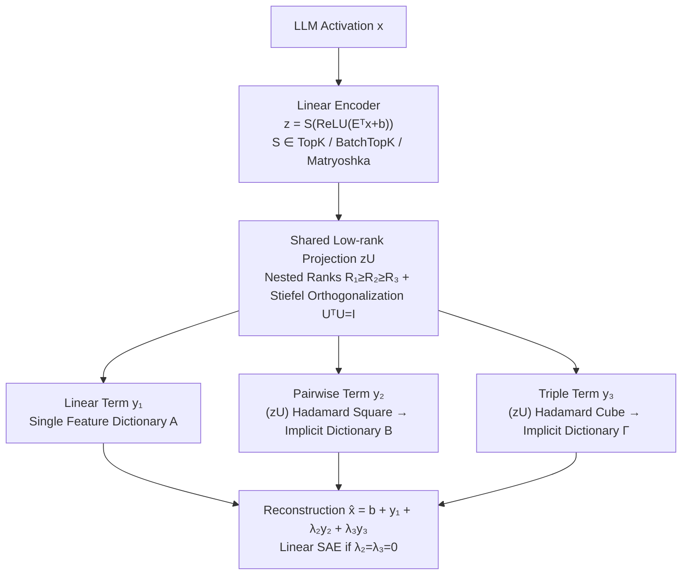

# PolySAE: Modeling Feature Interactions in Sparse Autoencoders via Polynomial Decoding

**Conference**: ICML 2026  
**arXiv**: [2602.01322](https://arxiv.org/abs/2602.01322)  
**Code**: https://github.com/pakoromilas/PolySAE (Available)  
**Area**: Interpretability / Mechanistic Interpretability / Sparse Dictionary Learning  
**Keywords**: Sparse Autoencoders, Feature Interactions, Polynomial Decoding, Low-rank Tensor Decomposition, Compositionality

## TL;DR
PolySAE introduces secondndnd and third-order polynomial terms based on shared low-rank projections alongside the standard linear decoder of Sparse Autoencoders (SAEs). With a minimal parameter overhead (~3% on GPT-2 small), it explicitly models multiplicative interactions between sparse features. Across 4 LLMs and 3 SAE variants, it improves probe F1 by approximately 8%, increases the 1-Wasserstein distance of class-conditional distributions by 2–10x, and enables causal steering of compositional semantics using learned interaction directions.

## Background & Motivation

**Background**: Sparse Autoencoders (SAEs) are primary tools for mechanistic interpretability. They decode neural network intermediate activations $x$ into a sparse linear combination of dictionary atoms: $\hat{x} = b + Dz$. Variants like TopK, BatchTopK, and Matryoshka have scaled dictionary sizes to millions of features, successfully uncovering safety-related concepts like deception and bias and enabling intervention via activation patching.

**Limitations of Prior Work**: Existing SAEs rely on the "strong linear representation hypothesis," where features contribute only through additive superposition. This structure cannot distinguish between "composition" and "co-occurrence." When a model outputs activations related to "Starbucks," a linear SAE must either allocate a monolithic "Starbucks" feature (sacrificing atomicity) or use two features ("star" and "coffee"), failing to differentiate the specific composition from the independent presence of the two concepts.

**Key Challenge**: Atomic features (morphemes, conceptual primitives) and compositional features ("administrators" = stem ⊕ suffix, "kick the bucket") naturally exist in a hierarchical relationship. Linear reconstruction mechanisms force both into the same dictionary. This violates core requirements for compositionality in linguistics and cognitive science (e.g., Smolensky's 1990 Tensor Product Variable Binding), which require multiplicative/bilinear binding to maintain atomicity while expressing complexity.

**Goal**: Explicitly model high-order interactions between features within the SAE framework while: (i) retaining a linear encoder to maintain interpretability, (ii) avoiding the $O(d_\text{sae}^2)$ or $O(d_\text{sae}^3)$ parameter explosion of naive tensor products, and (iii) maintaining compatibility with existing SAE variants like TopK, BatchTopK, and Matryoshka.

**Key Insight**: Formulate the decoder as a third-order Volterra expansion (or $\Pi$-net polynomial parameterization) and constrain all high-order interactions to a shared low-rank subspace $U$. Interactions across different orders are composed of different powers of the same set of directions, ensuring semantic consistency and parameter efficiency.

**Core Idea**: Replace the purely linear decoder with a "linear encoder + shared low-rank projection + orthogonalized polynomial decoder," allowing the SAE to express multiplicative composition without compromising reconstruction quality.

## Method

### Overall Architecture
PolySAE addresses the inability of linear decoders to represent multiplicative compositions. It keeps the SAE encoder linear but upgrades the decoder to a third-order polynomial. Specifically, given an intermediate activation $x \in \mathbb{R}^d$, the encoder computes sparse codes $z = S(\text{ReLU}(E^\top x + b_\text{enc}))$, where $S$ is a sparsifier (TopK, BatchTopK, or Matryoshka). The reconstruction is redefined as $\hat{x} = b_\text{dec} + y_1 + \lambda_2 y_2 + \lambda_3 y_3$, representing linear, pairwise, and triple terms respectively. $\lambda_2$ and $\lambda_3$ are learnable scalars. Setting $\lambda_2 = \lambda_3 = 0$ strictly reverts to a linear SAE, making PolySAE a generalization. To handle the parameter complexity of $B$ and $\Gamma$, all high-order terms are constrained to a shared low-rank, orthogonal subspace.

### Key Designs

**1. Polynomial Decoder + Shared Low-rank Projection: Modeling Interactions via Powers of Shared Directions**

To incorporate high-order interactions without parameter explosion or modifying the linear encoder, PolySAE projects sparse codes into a shared $d_\text{sae} \times R_1$ subspace $U$. High-order terms are constructed via element-wise Hadamard products of the projected $zU$: $y_1 = (zU) C^{(1)\top}$, $y_2 = \big((zU_{:,1:R_2}) \odot (zU_{:,1:R_2})\big) C^{(2)\top}$, and $y_3 = \big((zU_{:,1:R_3})^{\odot 3}\big) C^{(3)\top}$, where $C^{(k)} \in \mathbb{R}^{d \times R_k}$ are output projections. This implicitly defines pairwise/triple dictionaries as $B = C^{(2)} (U_{:,1:R_2} \odot U_{:,1:R_2})^\top$ and $\Gamma = C^{(3)} (U_{:,1:R_3} \odot U_{:,1:R_3} \odot U_{:,1:R_3})^\top$ (where $\odot$ denotes the Khatri–Rao product). Using a single $U$ ensures that interactions are compositions of the same feature directions, maintaining semantic consistency. Empirical results show that $R_2 = R_3 \approx 0.06\text{–}0.11\, R_1$ is sufficient, indicating that high-order interactions are naturally low-dimensional.

**2. Nested Ranks + Stiefel Orthogonalization: Compressing Structure for Identifiability**

Beyond low-rank constraints, PolySAE imposes a nested structure $R_1 \ge R_2 \ge R_3$ and $U^\top U = I$ for parsimony. For GPT-2 small, $R_2 = R_3 = 64$ while $R_1 = d = 768$. Subsets of $U$ columns are used for high-order terms, creating a hierarchy: $\text{span}(U_{:,1:R_3}) \subset \text{span}(U_{:,1:R_2}) \subset \text{span}(U)$, which aligns with polynomial approximation theory where lower-order terms receive higher expressive capacity. After each gradient update, $U$ is projected back to the Stiefel manifold using QR retraction (positive QR to ensure column consistency). This removes rotational ambiguity and prevents redundancy in interaction directions. Ablations show that including orthogonalization recovers approximately 3 percentage points in F1 score that would otherwise be lost to low-rank constraints.

**3. Context-Dependent Implicit Dictionaries: Adaptive Feature Contributions**

The combined effect of these designs is that a feature's effective contribution to the reconstruction becomes context-dependent, changing based on which other features are co-active. This separates compositionality from atomicity. The linear term $A$ acts as a dictionary of atomic features, while the pairwise dictionary $B$ describes how the co-activation of $z_i z_j$ refines the reconstruction. This allows $d_\text{sae}$ atomic features to represent a combinatorial range of $\binom{d_\text{sae}}{2} R_2 + \binom{d_\text{sae}}{3} R_3$ compositions. Unlike standard SAEs that require new atoms for every compound concept, PolySAE allows "multiplicative binding" (e.g., star × coffee → Starbucks) without increasing dictionary size. The linear encoder remains intact, keeping each $z_i$ as a clear projection direction for visualization and patching.

### Loss & Training
The reconstruction loss uses standard MSE. Sparsity is enforced via the $S$ operator (TopK / BatchTopK / Matryoshka) with $K = 64$ and $d_\text{sae} = 16,384$. Training involves 500M tokens (300M for GPT-2 Small) with a context length of 128. OpenWebText is used for GPT-2/Gemma, and Pile (uncopyrighted) for Pythia. $U$ is updated via QR retraction, and $\lambda_2, \lambda_3$ are jointly optimized.

## Key Experimental Results

### Main Results
Evaluated across 4 LLMs and 3 sparsifiers (12 configurations). Metrics include MSE, CE recovery, F1 on 6 probe tasks (Bias in Bios, AG News, EuroParl, GitHub, Amazon Sentiment, Amazon-15), and the 1-Wasserstein distance of class-conditional distributions.

| Model | Sparsifier | MSE (SAE→Poly) | CE Rec. | Mean F1 (SAE→Poly) | Wasserstein Gain |
|------|------------|----------------|---------|--------------------|------------------|
| GPT-2 Small | TopK | 0.52 → 0.55 | 0.993 | 67.1 → 77.9 (+10.8) | ~2–4× |
| GPT-2 Small | BatchTopK | 0.53 → 0.54 | 0.993 | 65.7 → 78.0 (+12.3) | ~2–4× |
| GPT-2 Small | Matryoshka | 0.60 → 0.58 | 0.992 | 65.7 → 77.7 (+12.0) | ~2.4× |
| Pythia-410M | TopK | 0.03 → 0.04 | 0.971 | 71.2 → 77.0 (+5.8) | ~3–5× |
| Pythia-1.4B | TopK | 0.23 → 0.23 | 0.973 | 75.9 → 81.9 (+6.0) | ~4–5× |
| Gemma-2-2B | BatchTopK | 1.58 → 1.68 | 0.987 | 64.8 → 69.4 (+4.6) | ~5–10× |

All 12 configurations show minimal CE recovery shifts (< 0.003), indicating no functional degradation. Mean probe F1 improved by ~8% on average; 1-Wasserstein distances increased by 2–10x, suggesting geometrically more separated semantic structures.

### Ablation Study

| GPT-2 Small Config | Params | MSE | F1 |
|------------------|--------|-----|----|
| Polynomial + Shared Projector (no low-rank, no ortho) | 37.7M | 0.58 | 76.0 |
| + Low-rank Decomposition (P3) | 13.3M | 0.53 | 75.0 |
| + Orthogonalization (P4, full PolySAE) | 13.3M | 0.55 | 77.9 |

Low-rank decomposition reduces parameters by 65% with only a 1pp F1 loss. Adding orthogonalization recovers and exceeds the baseline by +2.9pp at zero parameter cost.

### Key Findings
- Learned second-order interaction strength $B_{ij}$ shows almost no correlation with co-occurrence frequency $N_{ij}$ ($r = 0.06$), whereas vanilla SAE activation covariance correlates highly ($r = 0.82$). This confirms that polynomial terms capture compositional structure rather than surface statistics.
- GPT-4o-mini scoring of 70k pairs shows that 12% of high-interaction pairs achieve interpretability scores > 0.9. PolySAE uncovers at least 8,550 new interpretable second-order concepts in GPT-2 small.
- Activation steering for 27 compositional concepts shows that PolySAE outperforms vanilla SAE in 21/27 cases, improving target token rank by +41.5 on average.
- Semantic concentration: When expanding from K=1 to K=5, PolySAE's F1 increase is smaller than vanilla SAE, suggesting semantic signals are compressed into fewer linear features while high-order terms absorb contextual variance.

## Highlights & Insights
- **Strict Generalization**: Setting $\lambda_2 = \lambda_3 = 0$ reverts to a standard SAE, making PolySAE a "plug-and-play" enhancement for any existing variant.
- **Semantic Consistency via Shared $U$**: Deriving all orders from the same $zU$ anchors interaction semantics to the linear features—a technique applicable to any model desiring low-order interpretability with high-order capacity.
- **The $r=0.06$ vs $r=0.82$ Contrast**: This correlation gap provides elegant proof that the high-order terms are not merely capturing bigram statistics but are modeling deeper structures.
- **Closing the Loop with Steering**: Demonstrating that $d_i + d_j$ injections trigger specific compositional outputs (e.g., Starbucks) validates the dictionary's utility beyond static visualization.

## Limitations & Future Work
- **Scale**: Experiments reached only Gemma-2-2B; gains on 7B+ models remain unverified.
- **Sparsity Constraints**: Evaluated mainly on forced-sparsity (TopK) variants; coverage for Gated or JumpReLU SAEs is missing.
- **Global Scalars**: $\lambda_2, \lambda_3$ are global; per-feature or per-layer tuning was not explored.
- **Interaction Coverage**: Manual interpretability evaluation covered only 70k pairs (~24% of candidates); automatic methods to filter "interpretable" subsets are needed.

## Related Work & Insights
- **vs Bilinear Autoencoder (BAE)**: BAE models interactions at the input neuron level; PolySAE models them at the "sparse latent" level, preserving latent interpretability.
- **vs Bilinear MLPs**: While Pearce et al. (2025) use multiplication for weight-based interpretability in MLPs, PolySAE applies it to dictionary learning, fitting naturally into mechanistic interpretability pipelines.
- **vs Tensor Product Variable Binding**: Shares the multilinear binding philosophy but provides an engineering path to scale it to modern LLM dimensions via low-rank constraints.

## Rating
- **Novelty**: ⭐⭐⭐⭐⭐ First work to introduce explicit high-order interactions in SAE dictionary learning with strict generalization.
- **Experimental Thoroughness**: ⭐⭐⭐⭐ Covers various LLMs, sparsifiers, and tasks, including causal evidence. Scale is the only minor limitation.
- **Writing Quality**: ⭐⭐⭐⭐⭐ Clear design principles, intuitive examples, and rigorous derivations.
- **Value**: ⭐⭐⭐⭐⭐ Provides an orthogonal, plug-and-play gain for the SAE ecosystem while addressing the fundamental problem of compositionality.

<!-- RELATED:START -->

## Related Papers

- [\[ICML 2026\] On the Relationship Between Activation Outliers and Feature Death in Sparse Autoencoders](on_the_relationship_between_activation_outliers_and_feature_death_in_sparse_auto.md)
- [\[ICML 2026\] Sparse Autoencoders are Topic Models](sparse_autoencoders_are_topic_models.md)
- [\[AAAI 2026\] SparseRM: A Lightweight Preference Modeling with Sparse Autoencoder](../../AAAI2026/interpretability/sparserm_a_lightweight_preference_modeling_with_sparse_autoencoder.md)
- [\[ICML 2026\] Ensembling Sparse Autoencoders](ensembling_sparse_autoencoders.md)
- [\[ICLR 2026\] Toward Faithful Retrieval-Augmented Generation with Sparse Autoencoders](../../ICLR2026/interpretability/toward_faithful_retrieval-augmented_generation_with_sparse_autoencoders.md)

<!-- RELATED:END -->
