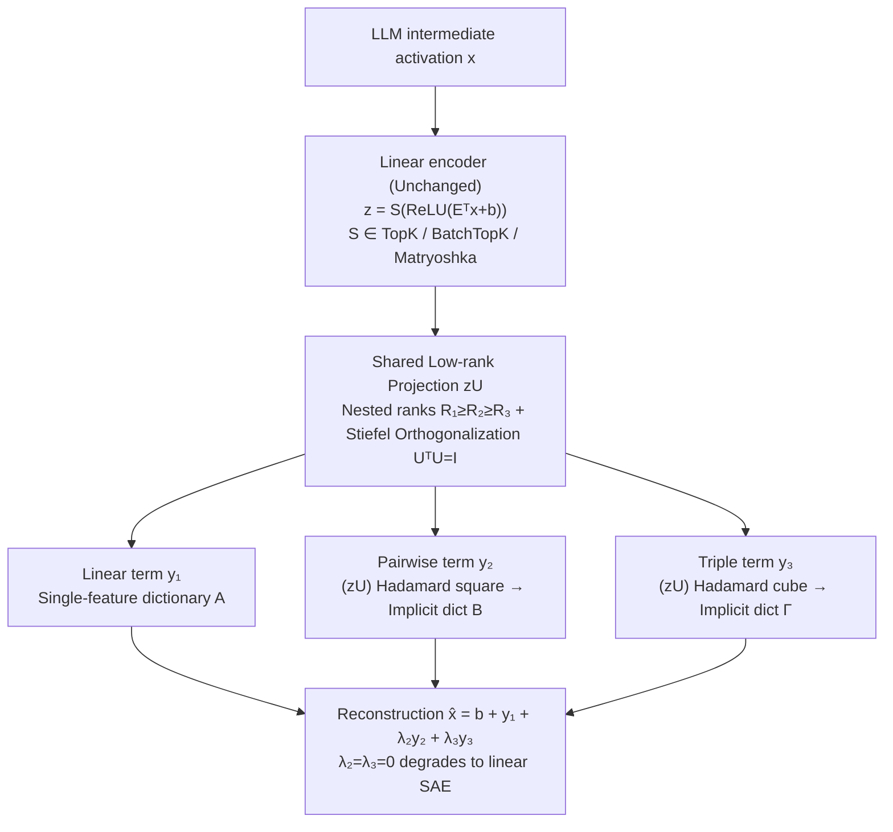

# PolySAE: Modeling Feature Interactions in Sparse Autoencoders via Polynomial Decoding

**Conference**: ICML 2026  
**arXiv**: [2602.01322](https://arxiv.org/abs/2602.01322)  
**Code**: https://github.com/pakoromilas/PolySAE (Available)  
**Area**: Interpretability / Mechanistic Interpretability / Sparse Dictionary Learning  
**Keywords**: Sparse Autoencoders, Feature Interaction, Polynomial Decoding, Low-rank Tensor Decomposition, Compositionality

## TL;DR
PolySAE introduces second and third-order polynomial terms based on shared low-rank projections alongside the standard linear decoder of Sparse Autoencoders (SAEs). With minimal parameter cost (~3% on GPT-2 small), it explicitly models multiplicative interactions between sparse features. Across 4 LLMs and 3 SAE variants, it improves probe F1 by an average of 8%, increases Wasserstein distance of class-conditional distributions by 2–10$\times$, and enables causal steering of model outputs for compositional semantics using learned interaction directions.

## Background & Motivation

**Background**: Sparse Autoencoders are currently the primary tools for mechanistic interpretability. They decode intermediate neural network activations $x$ into a sparse linear combination of dictionary atoms: $\hat{x} = b + Dz$. Variants like TopK, BatchTopK, and Matryoshka have pushed dictionary scales to millions of features, widely used to reveal safety-related concepts like deception or bias and to implement activation patching interventions.

**Limitations of Prior Work**: All existing SAEs are built on the "Strong Linear Representation Hypothesis"—features can only contribute through additive superposition. This structure, in principle, cannot distinguish "composition" from "co-occurrence." When a model outputs activations related to "Starbucks," a linear SAE must either allocate a specialized monolithic Starbucks feature (sacrificing atomicity) or explain it using "star" and "coffee" features without being able to distinguish "the specific combination of Starbucks" from "a star inside a coffee shop."

**Key Challenge**: Atomic features (morphemes, conceptual primitives) and compositional features ("administrators" = stem $\oplus$ suffix, "kick the bucket") naturally exist in a hierarchical relationship, but linear reconstruction mechanisms force both into the same dictionary. This violates core requirements for compositionality in linguistics and cognitive science (e.g., Smolensky's 1990 Tensor Product Variable Binding theory), which require multiplication/bilinear binding to maintain atomicity while expressing composites.

**Goal**: To explicitly model high-order interactions between features within the SAE framework while (i) retaining the linear encoder to maintain interpretability, (ii) avoiding $O(d_\text{sae}^2)$/$O(d_\text{sae}^3)$ brute-force tensor product parameter scales, and (iii) maintaining compatibility with existing variants like TopK / BatchTopK / Matryoshka.

**Key Insight**: Formulation of the decoder as a third-order Volterra expansion of $z$ (or a $\Pi$-net polynomial parameterization), constraining all high-order interactions to a shared low-rank subspace $U$. Interactions across different orders must be compositions of different powers of the "same set of directions," ensuring semantic consistency while controlling parameters.

**Core Idea**: Replace the "purely linear decoder" with a "linear encoder + shared low-rank + orthogonalized polynomial decoder," allowing the SAE to express "multiplicative combinations" without losing reconstruction quality.

## Method

### Overall Architecture
PolySAE addresses the limitation that "linear decoders can only perform additive superposition and cannot express multiplicative combinations" by keeping the SAE encoder linear while upgrading the decoder from first-order linear to a third-order polynomial. Specifically, for input intermediate activations $x \in \mathbb{R}^d$ from a pretrained LLM, the encoder follows standard SAE practice to compute sparse codes $z = S(\text{ReLU}(E^\top x + b_\text{enc}))$ (where $S$ is one of TopK / BatchTopK / Matryoshka). The reconstruction is reformulated as $\hat{x} = b_\text{dec} + y_1 + \lambda_2 y_2 + \lambda_3 y_3$, where the three terms are the linear term $y_1 = A z$, the pairwise term $y_2 = B (z \otimes z)$, and the triple term $y_3 = \Gamma (z \otimes z \otimes z)$, with $\lambda_2, \lambda_3$ being learnable scalars. Setting $\lambda_2 = \lambda_3 = 0$ strictly degrades to a linear SAE, making PolySAE a true-subset generalization of all existing variants. The main challenge is that naive $B$ and $\Gamma$ require $O(d_\text{sae}^2)$ and $O(d_\text{sae}^3)$ parameters, which is unsustainable; thus, all high-order terms are constrained to a shared low-rank, orthogonal subspace, compressing the brute-force tensor product into a compact form.

### Key Designs

**1. Polynomial decoder + Shared low-rank projection: Expressing high-order interactions using powers of the same directions**

To incorporate second and third-order interactions without exploding parameters while keeping the encoder linear, PolySAE first projects the sparse code to a shared subspace $U$ of size $d_\text{sae} \times R_1$. High-order terms are then constructed via element-wise Hadamard multiplication on the projected $zU$: $y_1 = (zU) C^{(1)\top}$, $y_2 = \big((zU_{:,1:R_2}) * (zU_{:,1:R_2})\big) C^{(2)\top}$, and $y_3 = \big((zU_{:,1:R_3})^{*3}\big) C^{(3)\top}$, where $*$ denotes element-wise multiplication and $C^{(k)} \in \mathbb{R}^{d \times R_k}$ are output projections. Algebraically, this implicitly defines pairwise/triple dictionaries as $B = C^{(2)} (U_{:,1:R_2} \odot U_{:,1:R_2})^\top$ and $\Gamma = C^{(3)} (U_{:,1:R_3} \odot U_{:,1:R_3} \odot U_{:,1:R_3})^\top$ (where $\odot$ is the Khatri–Rao product), without ever needing to materialize the massive tensors. Using a single $U$ instead of independent projectors for each order forces all interactions to be different composites of the "same set of feature directions," ensuring semantic consistency across orders. Empirical findings show $R_2 = R_3 \approx 0.06\text{–}0.11\, R_1$ is sufficient, suggesting high-order interactions are naturally low-dimensional.

**2. Nested rank + Stiefel orthogonalization: Compressing into identifiable compact structures**

Beyond low-rank, PolySAE imposes a nested structure $R_1 \ge R_2 \ge R_3$ and $U^\top U = I$ orthogonalization for parsimony and identifiability. Specifically, $R_2 = R_3 = 64$ (for $R_1 = d = 768$ on GPT-2 small). High-order terms use subsets of columns $U_{:,1:R_2}$, making subspaces layer-nested $\text{span}(U_{:,1:R_3}) \subset \text{span}(U_{:,1:R_2}) \subset \text{span}(U)$, mirroring polynomial approximation theories where lower orders deserve higher expressivity. After each gradient update, a QR retraction (positive QR to ensure column consistency) maps $U$ back to the Stiefel manifold, enforcing $U^\top U = I$ to remove rotation ambiguity and prevent redundant overlap in interaction directions. This step significantly improves performance; ablation shows a ~3pp F1 drop without orthogonalization.

**3. Context-dependent implicit dictionary: Making a feature's contribution vary with co-activations**

The combined effect is that "the effective contribution of a single feature to the reconstruction" becomes context-dependent—it changes based on which other features are simultaneously active, separating compositionality from atomicity. Expanding the reconstruction formula shows that the linear term $A$ acts as a single-feature dictionary, while the $(i,j)$ column of pairwise dictionary $B$ describes how to correct the reconstruction when $z_i z_j$ co-activate. Thus, $d_\text{sae}$ atomic features can support $\binom{d_\text{sae}}{2} R_2 + \binom{d_\text{sae}}{3} R_3$ potential combinations, all reused through $R_2, R_3$ shared interaction directions. This aligns with observed low-dimensional interaction structures. While standard SAEs must allocate new atoms for every composite concept, PolySAE allows "multiplicative binding" like star $\times$ coffee $\to$ Starbucks without increasing dictionary size, while the linear encoder remains intact for visualization and patching.

### Loss & Training
The reconstruction loss uses the default MSE from SAELens. Sparsity is hard-constrained by the $S$ operator (TopK/BatchTopK/Matryoshka) with $K = 64$ and $d_\text{sae} = 16{,}384$. Ours is trained on 500M tokens (300M for GPT-2 Small) with a context length of 128. OpenWebText is used for GPT-2/Gemma, and a copyright-free version of Pile for Pythia. $U$ updates utilize QR retraction, while $\lambda_2, \lambda_3$ are optimized jointly.

## Key Experimental Results

### Main Results
Evaluation covers 4 LLMs $\times$ 3 sparsifiers (12 configurations). On SAEBench, MSE, CE recovery, and F1 scores for 6 probe tasks (Bias in Bios, AG News, EuroParl, GitHub, Amazon Sentiment, Amazon-15) are reported, along with 1-Wasserstein distance for class-conditional distributions (K=1).

| Model | Sparsifier | MSE (SAE→Poly) | CE Rec. | Mean F1 (SAE→Poly) | Wasserstein Gain |
|------|------------|----------------|---------|--------------------|------------------|
| GPT-2 Small | TopK | 0.52 → 0.55 | 0.993 | 67.1 → 77.9 (+10.8) | ~2–4× |
| GPT-2 Small | BatchTopK | 0.53 → 0.54 | 0.993 | 65.7 → 78.0 (+12.3) | ~2–4× |
| GPT-2 Small | Matryoshka | 0.60 → 0.58 | 0.992 | 65.7 → 77.7 (+12.0) | ~2.4× |
| Pythia-410M | TopK | 0.03 → 0.04 | 0.971 | 71.2 → 77.0 (+5.8) | ~3–5× |
| Pythia-1.4B | TopK | 0.23 → 0.23 | 0.973 | 75.9 → 81.9 (+6.0) | ~4–5× |
| Gemma-2-2B | BatchTopK | 1.58 → 1.68 | 0.987 | 64.8 → 69.4 (+4.6) | ~5–10× |

All 12 configurations show CE recovery shifts $< 0.003$, proving that slight MSE differences do not cause functional degradation. Probe F1 increased by ~8% on average, and class-conditional Wasserstein distance was expanded by 2–10$\times$, indicating the F1 improvement reflects a more geometrically separated semantic structure rather than a chance decision boundary shift.

### Ablation Study

| GPT-2 Small Config | Params | MSE | F1 |
|--------------------|--------|-----|----|
| Polynomial + Shared projector (No low-rank, no ortho) | 37.7M | 0.58 | 76.0 |
| + Low-rank decomposition (P3) | 13.3M | 0.53 | 75.0 |
| + Orthogonalization (P4, full PolySAE) | 13.3M | 0.55 | 77.9 |

Low-rank decomposition cuts 65% of parameters with only 1pp F1 loss. Adding orthogonalization recovers and exceeds the baseline by +2.9pp at zero parameter cost, showing P3 handles tractability while P4 handles identifiability.

### Key Findings
- The learned second-order interaction strength $B_{ij}$ is nearly uncorrelated with co-occurrence frequency $N_{ij}$ ($r = 0.06$), whereas vanilla SAE activation covariance correlates strongly with co-occurrence ($r = 0.82$). This implies polynomial terms capture compositional structure rather than surface statistics.
- Scoring via GPT-4o-mini on 70,000 sampled pairs shows 12% of high-interaction pairs achieve interpretability scores $> 0.9$. At least 8,550 new interpretable second-order composite concepts were found on GPT-2 small.
- Activation steering (injecting $\alpha(d_i + d_j)$ into layer 8 residual stream) across 27 composite concepts $\times$ 12 neutral prompts (324 pairs) shows PolySAE outperforms no-steering in 27/27 concepts and vanilla SAE in 21/27. Average target token rank increased by +41.5. Cosine similarity with difference-in-means ground-truth was 0.372 vs. 0.311 for vanilla (+19.7%).
- Semantic Density: PolySAE exhibits smaller F1 gains than vanilla when expanding from K=1 to K=5 (a 7–8pp difference on GPT-2), suggesting semantic signals are compressed into fewer linear features as high-order interactions absorb context variation.

## Highlights & Insights
- **Strict Generalization**: Setting $\lambda_2 = \lambda_3 = 0$ reduces to standard SAE, making PolySAE an "easy-to-drop-in" extension for any existing SAE variant—a rare attribute for methods enhancing SAE expressivity.
- **Semantic Consistency via Shared $U$**: All orders derive from Hadamard powers of the same $zU$, anchoring high-order interaction semantics to linear features. This technique could generalize to bilinear MLPs or polynomial networks where low-order interpretability must be preserved.
- **The $r = 0.06$ vs. $r = 0.82$ Comparison**: This simple correlation metric elegantly refutes the null hypothesis that high-order terms merely capture bigram statistics—providing a robust diagnostic for any "compositional" modeling claims.
- **Closing the Loop with Steering**: Triggering "Starbucks" or "Keystone XL" outputs by injecting $d_i + d_j$ demonstrates that dictionary learning can be practical for model steering, rather than just static visualization.

## Limitations & Future Work
- The largest model evaluated was Gemma-2-2B. Scalability to 7B+ open-source LLMs remains to be verified.
- Only hard-sparsity variants (TopK family) were evaluated; soft-sparsity SAEs like Gated or JumpReLU were not covered.
- $\lambda_2, \lambda_3$ are global scalars rather than per-feature or per-layer; differences in interaction structures across layers (e.g., attention vs. residual) were not isolated.
- High-order dictionary evaluation covered ~24% of candidates; whether the 12% interpretability ratio scales with LLM size or can be automatically filtered for human review is an open question.
- Steering experiments were limited to 27 concepts on GPT-2 small; broader coverage and quantification of side effects (perturbing unrelated concepts) are needed.

## Related Work & Insights
- **vs. Bilinear Autoencoder (BAE, Dooms & Gauderis 2025)**: BAE interacts at the input neuron level, whereas PolySAE interacts at the "learned sparse latent" level (2nd + 3rd order), preserving latent interpretability while explicitly allocating capacity for non-additive composition.
- **vs. Bilinear MLPs (Pearce et al. 2025)**: Pearce uses multiplication for weight-based interpretability within MLPs; Ours applies this to dictionary learning, naturally fitting mechanistic interpretability pipelines (SAE $\to$ circuit).
- **vs. Vanilla SAE + variants**: PolySAE is a true subset generalization, providing orthogonal gains over any linear stacking method.
- **vs. Tensor Product Variable Binding (Smolensky 1990)**: Conceptually similar (multilinear binding of atoms), but provides an engineering path for modern LLM scales via low-rank shared $U$ where explicit tensor products are intractable.

## Rating
- Novelty: ⭐⭐⭐⭐⭐ First work to introduce explicit high-order interactions into the SAE dictionary learning side with strict backward compatibility.
- Experimental Thoroughness: ⭐⭐⭐⭐ 4 LLMs $\times$ 3 sparsifiers, spanning geometric, probing, and causal evidence. Shortcomings only in model scale (up to 2B).
- Writing Quality: ⭐⭐⭐⭐⭐ Design principles clearly map to architectural choices. The "implicit dictionary" derivation and Starbucks examples are highly intuitive.
- Value: ⭐⭐⭐⭐⭐ Provides a plug-and-play gain for the SAE ecosystem and brings "compositionality"—an old linguistics problem—back to the LLM interpretability agenda in a quantifiable way.

<!-- RELATED:START -->

## Related Papers

- [\[ICML 2026\] On the Relationship Between Activation Outliers and Feature Death in Sparse Autoencoders](on_the_relationship_between_activation_outliers_and_feature_death_in_sparse_auto.md)
- [\[ICML 2026\] Sparse Autoencoders are Topic Models](sparse_autoencoders_are_topic_models.md)
- [\[AAAI 2026\] SparseRM: A Lightweight Preference Modeling with Sparse Autoencoder](../../AAAI2026/interpretability/sparserm_a_lightweight_preference_modeling_with_sparse_autoencoder.md)
- [\[ICLR 2026\] Toward Faithful Retrieval-Augmented Generation with Sparse Autoencoders](../../ICLR2026/interpretability/toward_faithful_retrieval-augmented_generation_with_sparse_autoencoders.md)
- [\[NeurIPS 2025\] A is for Absorption: Studying Feature Splitting and Absorption in Sparse Autoencoders](../../NeurIPS2025/interpretability/a_is_for_absorption_studying_feature_splitting_and_absorption_in_sparse_autoenco.md)

<!-- RELATED:END -->
