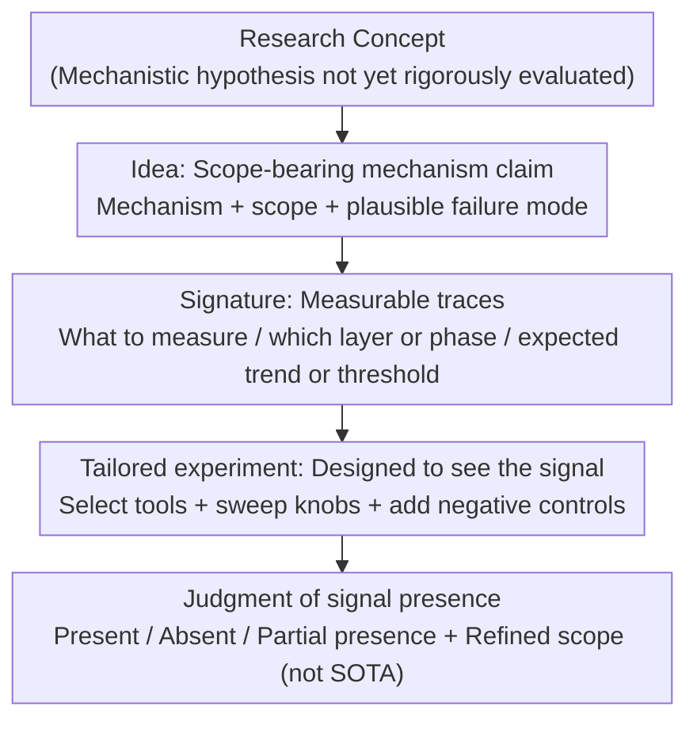

# Position: Ideas Should be the Center of Machine Learning Research

**Conference**: ICML 2026  
**arXiv**: [2605.15253](https://arxiv.org/abs/2605.15253)  
**Code**: None  
**Area**: Position Paper / ML Research Methodology / Philosophy of Science  
**Keywords**: Ideas First, signature, tailored experiments, benchmark myths, computational fairness  

## TL;DR
The authors propose the "Ideas First" stance: treating "idea → observable signature → tailored experiment" as the core evaluation unit of machine learning research. This approach opposes treating leaderboard gains or idealized theorems as ends in themselves, aiming to bridge the theory-practice gap while lowering the participation threshold for researchers with limited compute resources.

## Background & Motivation

**Background**: Current ML research is split into two dominant modes: Mode A (Benchmark-driven Engineering), which defines contributions via single metrics by scaling models/data or tuning architectures; and Mode B (Idealized Theory), which proves theorems under highly idealized settings (infinite width, infinitesimal steps, separable data). While both have produced real progress (AlexNet/ResNet/CLIP/GPT-3 vs. NTK/margin bound/benign overfitting), they increasingly act as "barriers" rather than "tools."

**Limitations of Prior Work**: (1) **Benchmark myopia** — metric improvements often cannot be attributed to specific mechanisms; conclusions become unreadable when multiple changes cancel out. (2) **Transfer gap** — idealized theorems rarely provide observable predictions, turning theory into "post-hoc explanation" rather than "a guide for measurement." (3) **Non-cumulative findings** — exploratory ablations often lack anchored hypotheses, making results difficult to reuse. (4) **Complexity premium** — reviewers equate "complex $\approx$ rigorous," leading simple but sharp ideas to be dismissed as "not deep enough." (5) **Resource asymmetry** — compute thresholds implicit in SOTA exclude researchers without massive clusters ("compute divide" / "Red AI").

**Key Challenge**: The true vehicle of scientific value is the *idea* (hypotheses about how learning systems function). However, the current system treats proxies for value (benchmark scores / abstract theorems) as the value itself, suppressing both mechanistic explanation and marginalized groups.

**Goal**: (i) Define a framework to translate abstract ideas into falsifiable empirical measurements; (ii) argue that idea-centric evaluation is both scientific and fair; (iii) provide a specific "field guide" for authors and reviewers.

**Key Insight**: Borrow the "hypothesis-driven" paradigm from physics and biology. Instead of asking "what works?" or "what must be true under idealization?", address the overlooked middle question: "If this mechanistic hypothesis is correct, what should we observe in a real model?"

**Core Idea**: Shift the research center from "systems/theorems" to a three-link chain: "idea → signature → tailored experiment." Benchmarks and theorems are demoted to testing tools rather than evaluation goals.

## Method

### Overall Architecture

As a position paper, the proposed "method" is an idea-centric research framework (Ideas First) structured as an actionable three-link chain: $\text{idea} \rightarrow \text{signature} \rightarrow \text{tailored experiment}$. Research begins with a "hypothesis," translates it into "measurable traces observable in complex models," and culminates in experiments designed specifically to find or falsify these traces. In this view, benchmarks act as "microscopes" and theorems as "telescopes"—their legitimacy derives from their ability to expose or refute an idea. The input is a research concept yet to be rigorously evaluated; the intermediate products are explicit sets of observable signals and experiments with controls; the output is a clear judgment on whether the signal appeared (present, absent, or partially present with new boundary insights), rather than "SOTA + X%."

### Key Designs

**1. Idea: Scope-bearing mechanism claim**

This step distills "vague intuition" into a scientific statement falsifiable by future work, specifying "under what settings I believe this holds, and where I admit it might fail." A valid idea must satisfy three criteria: a clear mechanism (one or two sentences), an explicit scope (architecture, data scale, training phase, or theoretical assumptions), and at least one plausible failure mode. Ideas often take shape in simplified settings (single-layer attention / infinite width / synthetic data) where controlled analysis is possible. Their value lies in conceptual and predictive power rather than immediate leaderboard rank. The paper demonstrates this with examples like NTK, implicit max-margin bias, and Mixup. Emphasizing scope and failure modes prevents "slogan-based" speculation and keeps high-dimensional theorems grounded in observable consequences.

**2. Signature: Translating abstract mechanisms into measurable traces**

For an idea established in a simplified setting to remain valid in complex modern models, one must agree on its manifestation: geometric features, training dynamics, causal responses, invariances, thresholds, or characteristic error patterns. The signature serves as the interface between the idea and the experiment. A good signature answers three questions: what to measure (margin distribution? cosine similarity? logit curves?), where to measure (which layer? training phase? scale?), and the expected trend or threshold (monotonicity? weakening beyond a certain width?). Since real systems are noisy and heterogeneous, signatures are evaluated "in expectation" or via coarse-grained trends, allowing for bounded exceptions. This interface transforms exploratory ablation into hypothesis-driven testing, addressing the issue of non-cumulative findings.

**3. Tailored experiment: Experimental design for "seeing the signal"**

Success for experiments is explicitly redefined from "point-chasing" to "clearly observing (or confirming the absence of) a predicted pattern under proper control." The paper outlines a five-step process: defining the signature as a discernible statistic or visualization; selecting "instruments" (measurements, patches, counterfactuals); placing measurements where the signal is predicted to be strongest; sweeping the "knobs" that modulate the signal; and adding negative controls where the effect is predicted to be absent. Section 6 provides a hypothetical case study on "Topic Inertia in LLMs." It derives from simplified analysis that "longer prompts increase the semantic similarity trend between generation and prompt," then tests this across LLaMA-2/GPT-NeoX/MPT-7B by sweeping length from 10–200 tokens, using an RNN as a negative control (no attention → no signature). This approach directly counters the *complexity premium* and *resource asymmetry*: small-scale experiments gain legitimacy when they provide mechanistic clarity, preventing the dismissal of work due to "insufficient scale."

## Key Experimental Results

As a position paper, there are no quantitative results; instead, the authors support the framework's feasibility through three types of "cases and counter-cases."

### Main Results: Re-evaluating existing research via Ideas First

| Case | Idea (Simplified Setting) | Signature (In Complex Models) | Tailored Experiment | Source |
|------|---------------------------|-------------------------------|---------------------|--------|
| NTK Linearization | Under infinite width + MSE, GD $\equiv$ kernel regression on frozen NTK. | Prediction/loss trajectories track the linearized NTK-at-init model in early training; alignment improves with width and fails as training progresses. | Comparing "full training vs. linearized prediction" on CNN/ResNet/WRN across widths/epochs on CIFAR. | Jacot+2018 / Lee+2019 |
| Implicit Max-Margin Bias | On separable data + exponential loss, GD weight direction converges to hard-margin SVM. | After training error hits zero, penultimate-layer normalized margin grows monotonically; classifier direction aligns with SVM solution. | Tracking alignment between SVM solutions and normalized margins post-interpolation in MLP/CNN on MNIST/CIFAR. | Soudry+2018 / Lyu+Li 2020 |
| Mixup (Heuristic) | Decision regions are "straightened" along interpolation lines; logits change smoothly with the mixing coefficient. | Along path $x_\lambda = \lambda x_i + (1-\lambda) x_j$, logits are approximately linear w.r.t. $\lambda$; reduced memorization under label noise. | Swiping $\lambda$ on real vision/audio data; stress tests with corrupted labels; reporting interpolation linearity + memorization resistance. | Zhang+2018 |

### Ablation Study: Solving pain points of standard paradigms

| Standard Paradigm Pain Point | Symptom | Ideas First Solution | Case Study Manifestation |
|------------------------------|---------|-----------------------|--------------------------|
| Benchmark myopia (Mode A) | Multiple changes merged; single number lacks attribution. | Replace score delta with "Is the signature visible/falsified?" | Topic Inertia uses similarity trends as the primary result; no leaderboards. |
| Transfer gap (Mode B) | Idealized theorems yield no measurable predictions. | Mandate that ideas must be translated into signatures before experimentation. | Single-layer attention analysis translated into "length vs. similarity trend." |
| Non-cumulative findings | Exploratory ablations lack anchored hypotheses. | Design experiments for signatures + mandatory negative controls. | RNN baseline serves as a negative control lacking the attention mechanism. |
| Complexity premium | Reviewer bias: "Complexity $\approx$ Rigor." | Encourage "minimal experiments capable of showing the signature." | 200 tokens suffice to distinguish signals; GPT-5.1 is unnecessary. |
| Resource asymmetry | Compute barriers exclude smaller groups. | Explicitly permit clear experiments at modest scales. | Exclusively used open-source weights (LLaMA-2 / GPT-NeoX / MPT-7B). |

### Key Findings

- The operational power of the framework stems from **signatures acting as the mandatory interface between idea and experiment**. Without a signature, an idea cannot be grounded; without a signature anchor, an experiment degrades into aimless ablation.
- The "Topic Inertia" case study demonstrates value by **predicting and responding to reviewer counter-arguments** (Section 6.1). It frames demands for "bigger models/more metrics" as manifestations of the *complexity premium* and offers principled rebuttals based on signal differentiability and negative controls.
- By retroactively rewriting established works (NTK, Mixup, etc.) into the three-stage chain, the authors argue that **Ideas First is not a radical new norm, but the formalization and teaching of what "good work" has already been doing.**
- To mitigate the risk of "tuning signatures to match expectations," the framework relies on *negative controls and pre-declared scope/failure modes*.

## Highlights & Insights

- Establishing "signature" as a mandatory interface is the sharpest design choice. It eliminates papers that claim contributions based solely on "vague intuition" or "post-hoc storytelling" by forcing researchers to commit to specific observable quantities during the hypothesis stage.
- Integrating "complexity premium" and "resource asymmetry" into epistemology rather than just ethics is a strategic move. The authors argue that small-scale experiments are justified not as a concession for fairness, but because they possess **higher evidentiary power** for isolating mechanisms.
- The Section 6.1 "Reviewer Rebuttal Template" is highly reusable. Researchers working with limited compute can utilize it to internalize "why not scale up" critiques into scope-based arguments.

## Limitations & Future Work

- The authors acknowledge (Section 8) that: (i) targeted experiments are more prone to "unconscious tuning" than broad benchmarks, a risk only partially mitigated by negative controls; (ii) this stance supplements rather than replaces theory or benchmarks; (iii) in engineering-heavy subfields (e.g., production deployment), "signature visibility" may remain secondary to "system utility."
- Independent Observation: (i) The "Field Guide" lacks quantitative scales for "signature strength," remaining dependent on reviewer judgment. (ii) The Topic Inertia case is *hypothetical*; a lack of real 200-document datasets and numerical tables makes the evidence somewhat rhetorical. (iii) The framework does not explicitly address how to adjudicate when an idea predicts multiple signatures and they partially conflict.
- Potential Improvement: A structured "Signature Card" (similar to Model Cards) could be required for authors to disclose what they measure, where they measure, expected trends, negative controls, and known failure regimes to reduce reviewer inconsistency.

## Related Work & Insights

- **vs. Lipton & Steinhardt (2018) / Dehghani et al. (2021)**: While those works critique issues like the benchmark lottery, this paper provides a *positive alternative* (idea → signature → tailored experiment).
- **vs. Baraniuk et al. (2020) / Science of Deep Learning school**: This paper ground "science" into the specific interface of signatures and explicit scope, avoiding the "toy model" critique often aimed at this school.
- **vs. Strubell et al. (2019) / Green AI**: Beyond ethical/environmental arguments, this paper embeds "small-compute experiments" into epistemology as a superior form of evidence for mechanistic questions.
- **Actionable Insights**: (i) Explicitly add a "Signatures We Look For" section in paper intros to replace generic contribution lists. (ii) Use negative controls to justify why certain ablations are chosen or omitted. (iii) Use the presence of "scope and failure modes" as a primary filter when reviewing papers.

## Rating
- Novelty: ⭐⭐⭐⭐ Each component is known, but the integration of "signature" as an interface language with defensive case studies is a complete and actionable synthesis.
- Experimental Thoroughness: ⭐⭐⭐ As a position paper, it uses historical cases and a hypothetical model well, but lacks real "hard" data from fresh small-scale replications to strengthen the demonstration.
- Writing Quality: ⭐⭐⭐⭐⭐ Extremely clear structure, moving from critique to framework, then to a field guide and case study. The direct address of "Alternative Views" shows high rhetorical discipline.
- Value: ⭐⭐⭐⭐ Provides a direct rebuttal template for researchers facing "insufficient scale" rejections and a roadmap for program chairs to institutionalize "frugal AI."

<!-- RELATED:START -->

## Related Papers

- [\[ICML 2026\] Position: Zeroth-Order Optimization in Deep Learning Is Underexplored, Not Underpowered](position_zeroth-order_optimization_in_deep_learning_is_underexplored_not_underpo.md)
- [\[ICLR 2026\] When Machine Learning Gets Personal: Evaluating Prediction and Explanation](../../ICLR2026/interpretability/when_machine_learning_gets_personal_evaluating_prediction_and_explanation.md)
- [\[ICML 2025\] Rethinking Explainable Machine Learning as Applied Statistics](../../ICML2025/interpretability/rethinking_explainable_machine_learning_as_applied_statistics.md)
- [\[ICML 2026\] Position: Let's Develop Data Probes to Fundamentally Understand How Data Affects LLM Performance](position_lets_develop_data_probes_to_fundamentally_understand_how_data_affects_l.md)
- [\[ICML 2026\] Learning Coherent Representations: A Topological Approach to Interpretability](learning_coherent_representations_a_topological_approach_to_interpretability.md)

<!-- RELATED:END -->
