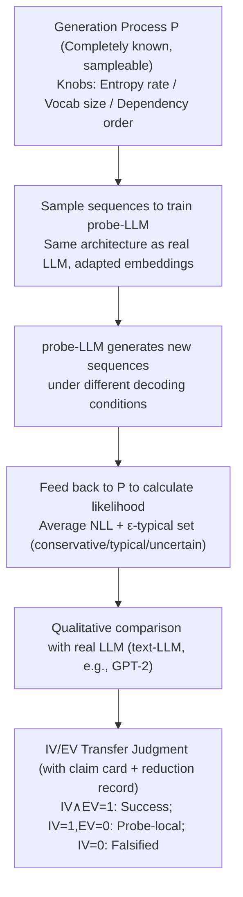

# Position: Let's Develop Data Probes to Fundamentally Understand How Data Affects LLM Performance

**Conference**: ICML 2026  
**arXiv**: [2605.18801](https://arxiv.org/abs/2605.18801)  
**Code**: None (position paper, only provides illustrative experiments with GPT-2 + Markov chains)  
**Area**: Interpretability / LLM Data Science / Information-Theoretic Analysis  
**Keywords**: Data Probes, Typical Sets, Markov Chains, Falsifiable Transfer, Position Paper

## TL;DR
The authors argue that rather than continuing trial-and-error with massive real-world corpora, researchers should design "data probes"—synthetic sequences sampled from **completely known** stochastic processes. By training/fine-tuning LLMs on these and feeding generated results **back into the known distribution** for likelihood analysis, the question of "what data teaches the model what" can be elevated from empirical heuristics to falsifiable scientific propositions.

## Background & Motivation

**Background**: Contemporary LLM training data often involves trillions of tokens. Elements such as data filtering, mixing ratios, and curriculum rely on empirical heuristics (e.g., filtering pipelines from DataComp-LM, FineWeb, DeepSeek) derived from repeated large-scale experiments on real corpora.

**Limitations of Prior Work**: Such studies suffer from three major flaws: (1) high computational costs affordable only by large organizations; (2) the **unknown** true distribution of real corpora, making it impossible to calculate the true likelihood of any sequence or determine if model generation is "over-conservative" or "over-divergent"; (3) benchmark evaluations only indicate performance without explaining **why** specific data types lead to success or failure.

**Key Challenge**: A disconnect exists between the theoretical side (abstract analyses using simplified Markov/Transformer models like those by Makkuva or Rajaraman) and the practical side (parameter tuning on real data). Theoretical conclusions are too abstract for LLMs, while practical findings are too fragmented and case-specific. Both sides lack a **unified, controllable, and likelihood-computable experimental medium**.

**Goal**: To provide a methodological framework that enables researchers to (a) precisely control data distribution properties (entropy rate, vocabulary, dependency structure), (b) calculate the likelihood of generated sequences under known distributions, and (c) transfer falsifiable "claims" from the probe space to the real LLM space.

**Key Insight**: Instead of trying to characterize real data, one should do the **opposite**—since the real distribution is unlearnable, construct a **completely known** distribution to serve as a "frame of reference." This inspiration traces back to Shannon’s 1948 assertion that "a sufficiently complex stochastic process can sufficiently represent a discrete source."

**Core Idea**: Treat **data itself** as a formal object with an explicit probabilistic definition—a data probe $\Pi=(\mathcal{P},\mathcal{M},\mathcal{H},\mathcal{F})$ (generation process, metrics, claims, falsification rules)—and pair it with a dual-layer IV/EV verification protocol. This ensures that the study of "data → LLM behavior" becomes as controllable, reproducible, and falsifiable as physical experiments.

## Method

### Overall Architecture

This position paper advocates for treating "data" as a formal object with an explicit probabilistic definition. The core argument is: instead of repeated trial-and-error on real corpora with unknown distributions, one should actively construct a **completely known** generating process as a reference to drive the "data probe" methodology. The pipeline consists of four steps: first, designing a generation process $\mathcal{P}$ with theoretical interpretability and controllable knobs (entropy rate, vocabulary size, dependency order, etc.). Training/test sequences are sampled to train a **probe-LLM**, which shares the same architecture as real LLMs but adapts its embeddings to the synthetic vocabulary. Then, the probe-LLM generates sequences under various decoding conditions, which are **fed back to $\mathcal{P}$ to calculate likelihoods** against computable diagnostic indicators (average NLL, typical set membership). Finally, qualitative comparisons of directional consistency are performed on real LLMs (text-LLMs, such as GPT-2). The input is the researcher's pre-declared causal hypothesis (claim card), and the output is a transfer judgment table: Internal Validity IV(h) × External Validity EV(h). Only if both are 1 is the "transfer successful"; if IV=1 and EV=0, the conclusion holds only locally in the probe space; if IV=0, the claim is directly falsified.

### Key Designs

**1. Data probes should be formalized as tuples with four admission criteria:**

The paper proposes upgrading "data" from a vague corpus object to a formal tuple $\Pi=(\mathcal{P},\mathcal{M},\mathcal{H},\mathcal{F})$ and requires researchers to satisfy four criteria for a valid probe: $\mathcal{P}$ must be a completely known and sampleable generation process (C1); $\mathcal{P}$ must expose interpretable intervention knobs, such as entropy rate and dependency order (C2); all diagnostic metrics $\mathcal{M}$ must be computable (C3, e.g., average NLL $-\log p(x^n)/n$ is computable because $p$ is known); and every claim $h\in\mathcal{H}$ must be paired with pre-declared falsification conditions $\mathcal{F}$ (C4). The paper scores six existing categories of work against C1–C4 in Table 3, identifying which criteria are most frequently missing. Establishing this contract transforms "synthetic data research" from a research style into an auditable methodology.

**2. Minimal probes can be constructed and interpreted using entropy-constrained Markov chains + typical sets:**

As a minimal example, the paper "reduces" the complexities of open corpora to a stationary Markov chain with a target entropy rate $H$. Since constructing a chain with an exact entropy $H$ is difficult, the authors use rejection sampling—randomly generating transition matrices and selecting the one with an entropy rate closest to $H$ as $\mathcal{P}$. Sampled sequences are fed online to a GPT-2 small (probe-LLM) with its embedding layer reshaped to state space size $M=128$. Standard next-token cross-entropy is used for training, and the test set is sampled independently from the same chain to avoid contamination. This allows data scale to be expanded arbitrarily without manual curation. Theoretically, the $\varepsilon$-typical set $A_\varepsilon^{(n)}=\{x^n: H-\varepsilon\le -\log p(x^n)/n \le H+\varepsilon\}$ from information theory provides a three-regime interpretation: an average NLL below the lower bound is "over-conservative" (repetitive degradation), within the band is "typical," and above the upper bound is "uncertain" (out-of-distribution). Markov chains are chosen because their entropy rates have analytical expressions, $p(x^n)$ is computable per token, and sequence length is easily extrapolated.

**3. Crossing from probe space to real space must follow a falsifiable IV/EV dual-layer transfer protocol:**

The paper insists that the leap from "discovering a phenomenon in probe space" to "holding true in real LLMs" must be structured and falsifiable rather than a narrative analogy. To this end, every experimental table is accompanied by a *Claim Card* documenting the claim, intervention, probe diagnostics, real-world correspondence, pre-declared failure conditions, and current transfer status. Simultaneously, a **reduction record** is mandatory, listing line-by-line what factors were removed from the real scenario to create the probe, what invariants were kept, expected directions, and conditions that would overturn the result. The final judgment is $\mathrm{Accept}(h)=1 \iff \mathrm{IV}(h)=1 \land \mathrm{EV}(h)=1$.

## Key Experimental Results

The experiments provide a "proof of concept" to demonstrate if the methodology can **reproduce** known degradation/uncertainty behaviors of real LLMs.

### Main Results: Probe vs. Real LLM Behavior under Temperature Intervention

| Decoding Method | probe-LLM Avg NLL | Probe Diagnostic | text-LLM (GPT-2) Behavior | Directionally Consistent? |
|-----------------|-------------------|------------------|---------------------------|---------------------------|
| Greedy ($T{=}0$) | 0.694 | Over-conservative | Repetitive loops | Yes |
| Sampling $T{=}1.0$ | 0.866 | Typical | Fluent and prompt-related | Yes |
| Sampling $T{=}1.3$ | 0.979 | Typical | Slightly divergent but readable | Yes |
| Sampling $T{=}1.5$ | 1.406 | Uncertain | Detached from prompt | Yes |

> **Interpretation**: Using only a minimal Markov probe with entropy $H=1$ bit/token and vocabulary $M=128$ paired with GPT-2 small, the authors **replicated** the three-regime (over-conservative → typical → uncertain) degradation of real LLMs. The **computable** NLL aligned strictly with the **qualitative** quality descriptions of the real LLM.

### Ablation Study: Comparison with Existing Work Criteria

| Research Topic (Representative Work) | C1 Known | C2 Knobs | C3 Computable | C4 Falsifiable | Probe Method Contribution |
|-------------------------------------|----------|----------|---------------|----------------|---------------------------|
| Data Diversity (Makkuva 2025) | ✓ | Partial | ✓ | ✗ | Intervention grids + failure rules |
| Data Curation (Wettig 2024) | ✗ | Partial | ✓ | ✗ | Known process generators + transfer protocol |
| ICL (Von Oswald 2023) | Partial | ✓ | ✓ | ✗ | Mapping distribution shifts to source hypotheses |
| Robustness (Sainz 2023) | ✗ | Partial | ✓ | ✗ | Explicit perturbation intensity + thresholds |

### Key Findings
- **Training loss = $T{=}1$ sampling holds only for single steps**: When the probe-LLM autoregressively generates 127 tokens from a single starting token, the average NLL distribution shifts significantly **higher** than the Markov ground-truth (sequences are more predictable than the true distribution). This is the synthetic counterpart to the observation that "LLM long-sequence generation is inferior to humans."
- At $T{=}1.25$, a **bimodal** distribution appears—most sequences are more predictable than ground-truth, while a few have abnormally high NLL, corresponding to the empirical experience of "LLMs are usually conservative but occasionally hallucinate."
- The typical set tri-regime acts as a **falsifiable diagnostic** more actionable than descriptive terms like "repetitive degradation."

## Highlights & Insights
- **Reduction records as first-class citizens**: Requiring every experiment to list what was removed and what was kept addresses the "synthetic simplification" skepticism often found in research.
- **The value of NLL lies in knowing the distribution**: Typical set analysis is impossible on real corpora because $p(x^n)$ **cannot be calculated**. Sacrificing expressivity for a computable distribution is the core of this position.
- **Unified protocol for bottom-up and top-down paths**: This avoids the typical slide in synthetic data research from "we saw X in a toy model" to "therefore X exists in LLMs" via a rigorous transfer process.

## Limitations & Future Work
- Markov chains are entry-level and cannot cover semantics, pragmatics, or world knowledge.
- The EV (External Validity) currently uses **qualitative** alignment rather than formalized statistical tests.
- Vocab size (128) and state space are tiny compared to 50k+ real vocabularies; the scaling assumption remains a hypothesis to be tested.
- Future directions include PCFG probes (hierarchical grammar + depth/branching factors) and "creative" probes (transformations applied to base probes) to expand from 1D entropy to multidimensional data characteristic spectra.

## Related Work & Insights
- **vs Physics of LLMs (Allen-Zhu et al.)**: Both use synthetic data, but Physics of LLMs often uses **hand-designed** data for specific tasks, lacking a unified probabilistic definition for information-theoretic analysis.
- **vs Theory (Makkuva 2025, Rajaraman 2024)**: These provide asymptotic results on simplified architectures but lack transfer protocols to real LLMs.
- **vs Mech-Interp (Singh 2024)**: Mechanical interpretability answers "how the model computes"; this paper answers "what data causes this computation to be learned." Combining them could map "data characteristics → internal mechanism → external behavior."

## Rating
- Novelty: ⭐⭐⭐⭐ Elevating "data probes" to a methodology with criteria and transfer protocols is a genuine conceptual contribution.
- Experimental Thoroughness: ⭐⭐⭐ As a position paper, it only provides a GPT-2 small + Markov chain demo, proving feasibility but leaving empirical burdens to the community.
- Writing Quality: ⭐⭐⭐⭐ Clear structure; the Claim Card and reduction record templates are highly reusable.
- Value: ⭐⭐⭐⭐ If accepted, this contract could significantly improve the cumulativeness of synthetic LLM research.

<!-- RELATED:START -->

## Related Papers

- [\[ICML 2026\] GEM: Geometric Entropy Mixing for Optimal LLM Data Curation](gem_geometric_entropy_mixing_for_optimal_llm_data_curation.md)
- [\[ICML 2026\] MiniMax Learning of Interpretable Factored Stochastic Policies from Conjoint Data, with Uncertainty Quantification](minimax_learning_of_interpretable_factored_stochastic_policies_from_conjoint_dat.md)
- [\[AAAI 2026\] Data Whitening Improves Sparse Autoencoder Learning](../../AAAI2026/interpretability/data_whitening_improves_sparse_autoencoder_learning.md)
- [\[ACL 2026\] The Impact of Off-Policy Training Data on Probe Generalisation](../../ACL2026/interpretability/the_impact_of_off-policy_training_data_on_probe_generalisation.md)
- [\[ACL 2026\] Evian: Towards Explainable Visual Instruction-tuning Data Auditing](../../ACL2026/interpretability/evian_towards_explainable_visual_instruction-tuning_data_auditing.md)

<!-- RELATED:END -->
