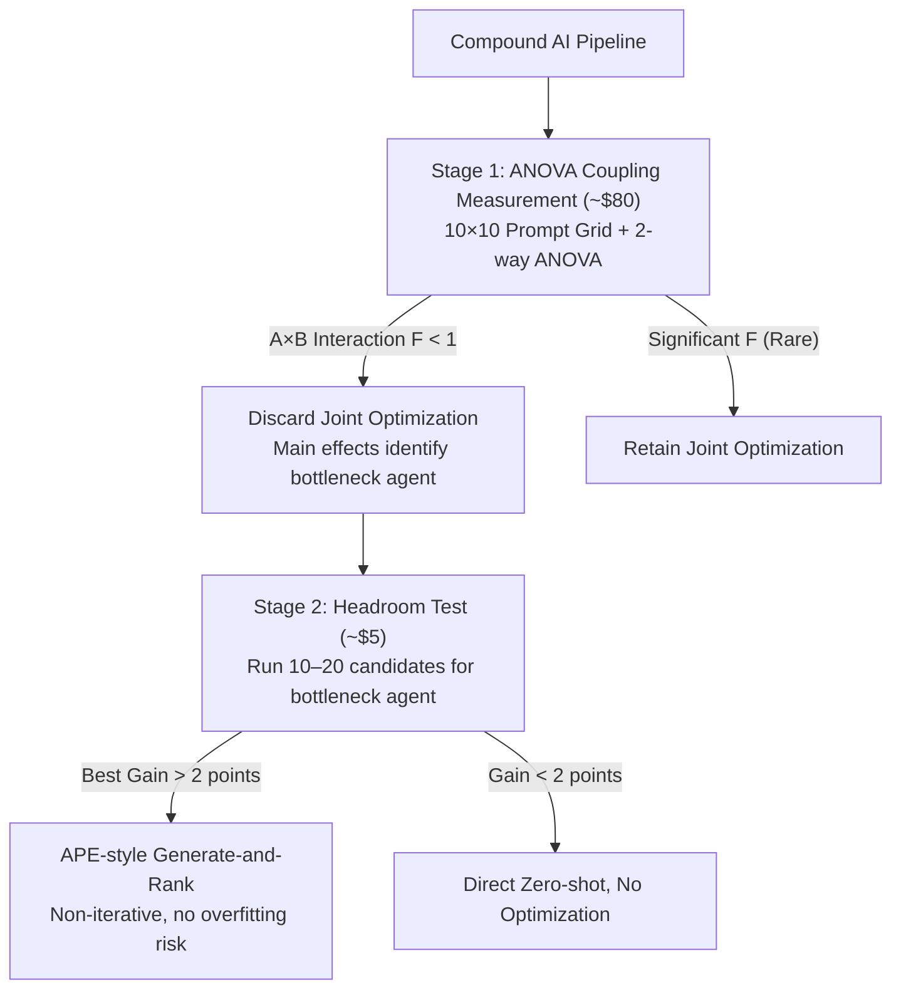

# Prompt Optimization Is a Coin Flip: Diagnosing When It Helps in Compound AI Systems

**Conference**: ICML 2026  
**arXiv**: [2604.14585](https://arxiv.org/abs/2604.14585)  
**Code**: None  
**Area**: Interpretability / Prompt Optimization / Compound AI Systems  
**Keywords**: prompt optimization, compound AI, ANOVA variance decomposition, multi-agent coupling, headroom test

## TL;DR
This paper empirically tests two implicit assumptions of end-to-end prompt optimization in compound AI systems—coupling between agents and whether individual agent prompts are worth optimizing—through 18,000 grid evaluations and 144 optimization runs. The study finds that both assumptions rarely hold for mainstream mid-tier models (49% of optimization runs perform worse than zero-shot, and the A×B interaction term $p > 0.52$). Consequently, the authors propose a two-stage diagnostic framework (an \$80 ANOVA coupling prediction + a \$5 10-minute headroom test) to transform the decision of "whether to optimize" from a coin flip into a quantifiable engineering choice.

## Background & Motivation

**Background**: End-to-end joint prompt optimization methods, represented by TextGrad, DSPy, and GPTSwarm, have become the de facto standard toolchain for compound AI systems (multi-LLM pipelines). Nearly all recent work on agentic workflow optimization follows this paradigm by default.

**Limitations of Prior Work**: These methods rely on two implicit assumptions that have never been empirically verified: (A) **Coupling Hypothesis**: Interaction effects exist between the prompts of multiple agents, requiring joint optimization for global optima; (B) **Optimizability Hypothesis**: Individual agent prompts are genuinely "worth optimizing" within realistic training budgets. If (A) does not hold, independent per-agent optimization suffices; if (B) also fails, even per-agent optimization is wasteful. Existing comparisons in the community often involve uncontrolled variables across different tasks and budgets, lacking a systematic test of these assumptions under strict compute-parity.

**Key Challenge**: While the industry invests thousands to tens of thousands of dollars running DSPy or TextGrad, it remains unclear if this expenditure is justified. Empirically, these tools yield gains on some tasks while causing performance drops on others, making results feel like a coin flip. If coupling and optimization headroom are model-task-dependent empirical properties, then a priori belief in joint optimization is fundamentally flawed.

**Goal**: (1) Directly measure hypotheses A and B using controlled experiments; (2) Explain why joint optimization fails in most mid-tier settings; (3) Provide an affordable pre-diagnostic protocol for practitioners to determine if optimization is warranted before investing in large-scale runs.

**Key Insight**: Treat a $10 \times 10$ prompt grid as a 2-way ANOVA experimental design—using the question as a block, Agent A as one factor, and Agent B as another. By analyzing the $F$-statistic of the A×B interaction term in the residuals, one can obtain a **falsifiable** measure of coupling that is far more rigorous than simply comparing which prompt achieves the highest score.

**Core Idea**: Use ANOVA to measure coupling and a 10–20 candidate prompt "headroom test" to measure optimization potential. This converts prompt optimization into a diagnostic workflow costing ~$85 and taking 1–2 days, rather than an immediate all-in commitment to expensive DSPy/TextGrad runs.

## Method

### Overall Architecture

The paper does not propose a new prompt optimization algorithm but rather uses statistical tools to verify the validity of default industry assumptions. It translates the engineering decision of "whether to optimize" into a falsifiable **measurement framework and decision protocol**: first, two compute-parity controlled studies measure coupling (Hypothesis A) and optimization headroom (Hypothesis B), then these findings are encapsulated into a pre-diagnostic workflow.

Each study addresses one side of the problem. **Study 1 tests agent coupling**: By constructing a two-agent serial pipeline $\text{Agent A} \to \text{Agent B}$, where each agent generates $K=10$ candidate prompts, the authors evaluate all $10 \times 10 = 100$ combinations across $n=30$ questions. This yields a 3D score tensor $Y_{ijk}$, which is decomposed via 2-way ANOVA with question blocking into five components: question difficulty, Agent A main effect, Agent B main effect, A×B interaction, and residuals. Tasks include HotpotQA, MBPP, and XSum (representing high/medium/low expected coupling), using Claude Haiku 4.5 and Amazon Nova Lite as executors and Claude Sonnet 4.6 as the judge. **Study 2 tests individual agent optimizability**: On four single-agent tasks (Feedback-Bench, HelpSteer2, WildBench, XSum), 6 mainstream optimization methods (APE, OPRO, EvoPrompt, PromptBreeder, DSPy-style bootstrap, and the authors' PROSE) are compared against zero-shot under strict compute-parity (~100 candidates, 20 training questions, 100 test questions, 3 seeds, 2 executor models), totaling $6 \times 4 \times 3 \times 2 = 144$ optimization runs.

The findings culminate in a two-stage **pre-diagnostic decision tree**:

### Key Designs

**1. ANOVA-based Agent Coupling Measurement: Translating Optimization Choices into Variance Decomposition**

Existing compound AI evaluations report aggregate scores but fail to explain why a pipeline works or if agent prompts truly interact. The authors treat the $10 \times 10$ prompt grid as a 2-way ANOVA design. If the variance and $F$-statistic of the A×B term are lower than the residual levels, the "jointly optimal prompt pair" is statistically indistinguishable from the "individually optimal A × individually optimal B." In such cases, joint optimization provides no information gain, and per-agent optimization is sufficient. Furthermore, the authors calculate neighbor autocorrelation on the residuals after removing row/column main effects, finding $\rho \in [-0.12, +0.05]$. This suggests the residual surface is indistinguishable from white noise, directly challenging the assumption of "smooth propagatable signals" relied upon by "textual gradient" methods like TextGrad.

**2. "Can but Doesn't" Criterion: Identifying Optimization Potential via Capability Gaps**

To provide an actionable pre-determiner, the authors analyzed HelpSteer2—the only task where all 6 optimization methods showed significant gains. This task requires structured rubric evaluation and JSON output. While the model **can** produce this format when prompted (68.0 → 74.8), it defaults to unstructured prose in a zero-shot setting. The essence of optimization is unlocking this latent capability the model possesses but does not use by default. In contrast, for tasks like XSum, the model's default behavior is already near-optimal, resulting in negligible gains (+0.6) that fall within the noise floor of evaluators. This qualitative insight is formalized into a \$5 headroom test: if the best candidate among 10–20 prompts does not beat zero-shot by $>2$ points, the landscape is deemed flat, and no iterative method is likely to be stable or effective.

**3. Two-Stage Diagnostic Protocol + Instruction-Tuning Mechanism: From Observations to Extrapolatable Predictions**

The authors provide a mechanistic explanation for the lack of coupling: instruction-tuning and RLHF train models to produce consistent outputs across diverse inputs, essentially compressing "input phrasing" into a "narrow output distribution." Consequently, the output variance of Agent B is dominated by the semantic content of Agent A (determined by the task) rather than its phrasing (determined by the prompt). Coupling requires agents to be sensitive to each other's specific phrasing, but instruction-tuning deliberately eliminates this sensitivity. This explanation upgrades the conclusion from a mere observation to a theoretical prediction while defining boundaries where coupling might reappear (shared state, schema dependencies, feedback loops, or very deep pipelines).

## Key Experimental Results

### Main Results

Study 1: ANOVA Variance Decomposition (Values in % of Total Sum of Squares):

| Model | Task | Question | Agent A | Agent B | A×B | Err |
|--------|--------|----------|---------|---------|------|------|
| Haiku | HotpotQA | 91.3 | 0.05\* | 0.37\*\*\* | 0.18 | 8.1 |
| Haiku | XSum | 80.3 | 0.09 | 0.09 | 0.49 | 19.0 |
| Haiku | MBPP | 19.3 | 0.60\*\* | 0.59\*\* | 2.15 | 77.4 |
| Nova | HotpotQA | 75.1 | 0.12 | 0.08 | 0.51 | 24.2 |
| Nova | XSum | 58.4 | 0.77\*\*\* | 0.22 | 0.87 | 39.7 |
| Nova | MBPP | 39.9 | 0.45\*\* | 0.16 | 1.50 | 58.0 |

The A×B interaction term accounts for only 0.18%–2.15% of variance across all 6 conditions, with $F < 1.0$ and $p > 0.52$. The gap between jointly optimal and independently optimal prompts is merely 0.0–3.3 points.

Study 2: Hold-out test scores on Claude Haiku 4.5 (mean of 3 seeds, judge 0–100):

| Method | FB | HS2 | WB | XSum |
|--------|------|------|------|------|
| Zero-Shot | 82.4 | 68.0 | 68.9 | 76.0 |
| APE | 82.3 | 69.3 | 68.0 | 76.6 |
| OPRO | 81.4 | 73.8 | 69.0 | 74.7 |
| EvoPrompt | 82.0 | **74.8** | 68.3 | 75.6 |
| PromptBreeder | **83.5** | 74.6 | 68.5 | 76.0 |
| DSPy-style | 81.9 | 69.8 | 65.1 | 76.2 |
| PROSE | 82.1 | 74.4 | **69.6** | 75.9 |

In 72 optimization runs, 49% performed worse than zero-shot. A binomial test ($p=0.91$) fails to reject the null hypothesis that gains are symmetrically distributed around zero. Results on Nova Lite were worse, with 14 out of 24 method×task averages underperforming zero-shot.

### Ablation Study

| Aspect | Key Finding | Description |
|------|---------|------|
| Task Type | HS2 best $\Delta=+6.8$; Others $\Delta < +1.1$ | Only HelpSteer2 has a "can but doesn't" gap; others are near-optimal. |
| Model Switching | Haiku 6/6 beat ZS on HS2; Nova Lite 1/6 | Optimizability and bottlenecks are entirely determined by the executor. |
| Iterative Overfitting| Train-test gap $+5.6$ vs. $\approx 0$ | Small training sets amplify noise; iterative methods overfit to noise. |
| Residual Landscape | Autocorrelation $\rho \approx 0$ | Residual surfaces are white noise, refuting "textual gradient" premises. |

### Key Findings
- **Agents do not interact**: Across 6 model×task conditions, interaction terms were non-significant ($F<1, p>0.52$). Instruction-tuning suppresses phrasing sensitivity by design.
- **Optimization requires a "can but doesn't" gap**: Gains only materialize when a model is capable of a specific behavior (e.g., JSON output) but does not default to it.
- **Model dominance**: The executor model determines which agent is the bottleneck and which tasks are optimizable. Improvements quickly expire when models are updated.
- **Iterative methods are counterproductive with small sets**: Choosing prompts based on noisy scores from ~20 questions leads to overfitting; non-iterative generate-and-rank (APE-style) is more robust.

## Highlights & Insights
- **Prompt optimization as variance decomposition**: Translating "should we jointly optimize" into a falsifiable ANOVA test is a significant methodological contribution. It moves beyond "which optimizer is better" and addresses the causal existence of coupling.
- **Actionable "can but doesn't" heuristic**: Explains the mystery of why optimization works on some tasks and not others based on observable model behavior patterns.
- **\$85 engineering wisdom**: Before spending \$1k–10k on large-scale optimization tools, a \$85 diagnostic can prevent wasted resources if it reveals a flat optimization landscape.
- **Mechanistic explanation chain**: Follows the logic from instruction-tuning (compressing phrasing) to white-noise residuals and the failure of textual gradients. This suggests that as models become more capable at zero-shot reasoning (internalizing CoT/ReAct), optimization headroom will continue to shrink.

## Limitations & Future Work
- The grid granularity is limited ($K=10$ full prompt replacements); finer-grained edits might reveal hidden coupling. The study lacks validation on frontier-tier models (e.g., GPT-4o-level).
- The task sets between Study 1 and Study 2 only overlap on XSum, creating a slight conceptual leap when combining conclusions.
- Future boundaries for coupling: Potential exists in deep pipelines (3+ agents), shared scratchpads, feedback loops, and shared JSON schemas. These represent the ideal "test beds" for applying the ANOVA protocol.

## Related Work & Insights
- **vs TextGrad / DSPy / GPTSwarm**: These tools assume propagatable textual gradients for joint optimization. This paper is the first to falsify that assumption on mid-tier models via ANOVA and residual analysis.
- **vs APE / OPRO / EvoPrompt**: The paper shows these single-prompt optimizers often overfit on small training sets, making them less robust than zero-shot for "flat" tasks.
- **vs Nie et al. (2026) adoption survey**: While prior work noted that only 9% of agent frameworks use optimizers from a sociological perspective, this paper provides the statistical reason: in most setups, optimization is a coin flip, making non-adoption a rational choice.

## Related Papers

- [\[ICML 2026\] Diagnosing the Reliability of LLM-as-a-Judge via Item Response Theory](diagnosing_the_reliability_of_llm-as-a-judge_via_item_response_theory.md)
- [\[ICML 2026\] Adaptive Querying with AI Persona Priors](adaptive_querying_with_ai_persona_priors.md)
- [\[CVPR 2026\] Make it SING: Analyzing Semantic Invariants in Classifiers](../../CVPR2026/interpretability/make_it_sing_analyzing_semantic_invariants_in_classifiers.md)
- [\[ICML 2026\] OmniSapiens: A Foundation Model for Social Behavior Processing via Heterogeneity-Aware Relative Policy Optimization](omnisapiens_a_foundation_model_for_social_behavior_processing_via_heterogeneity-.md)
- [\[ICLR 2026\] Exploring Interpretability for Visual Prompt Tuning with Cross-layer Concepts](../../ICLR2026/interpretability/exploring_interpretability_for_visual_prompt_tuning_with_cross-layer_concepts.md)

<!-- RELATED:END -->

<!-- RELATED:START -->

## Related Papers

- [\[ICML 2026\] Position: Zeroth-Order Optimization in Deep Learning Is Underexplored, Not Underpowered](position_zeroth-order_optimization_in_deep_learning_is_underexplored_not_underpo.md)
- [\[ICML 2026\] OmniSapiens: A Foundation Model for Social Behavior Processing via Heterogeneity-Aware Relative Policy Optimization](omnisapiens_a_foundation_model_for_social_behavior_processing_via_heterogeneity-.md)
- [\[ICML 2026\] Adaptive Querying with AI Persona Priors](adaptive_querying_with_ai_persona_priors.md)
- [\[ICML 2026\] Diagnosing the Reliability of LLM-as-a-Judge via Item Response Theory](diagnosing_the_reliability_of_llm-as-a-judge_via_item_response_theory.md)
- [\[CVPR 2026\] Make it SING: Analyzing Semantic Invariants in Classifiers](../../CVPR2026/interpretability/make_it_sing_analyzing_semantic_invariants_in_classifiers.md)

<!-- RELATED:END -->
