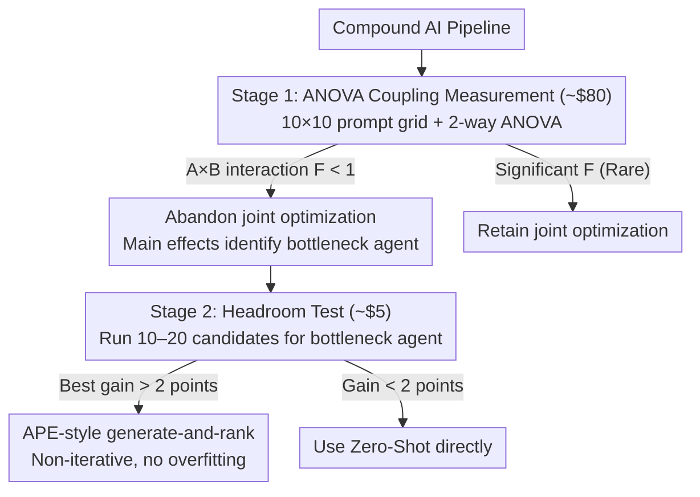

# Prompt Optimization Is a Coin Flip: Diagnosing When It Helps in Compound AI Systems

**Conference**: ICML 2026  
**arXiv**: [2604.14585](https://arxiv.org/abs/2604.14585)  
**Code**: None  
**Area**: Interpretability / Prompt Optimization / Compound AI Systems  
**Keywords**: prompt optimization, compound AI, ANOVA variance decomposition, multi-agent coupling, headroom test

## TL;DR
This paper empirically examines two implicit assumptions of end-to-end prompt optimization in compound AI systems—coupling between agents and the worthiness of single-agent prompt optimization—using 18,000 grid evaluations and 144 optimization runs. It finds that neither assumption holds for most mid-tier models (49% of runs perform worse than zero-shot; A×B interaction term $p>0.52$). Consequently, a two-stage diagnostic framework is proposed (an \$80 ANOVA coupling prediction + a \$5, 10-minute headroom test) to transform the decision of whether to optimize prompts from a coin flip into a quantifiable engineering choice.

## Background & Motivation

**Background**: End-to-end joint prompt optimization methods, represented by TextGrad, DSPy, and GPTSwarm, have become the de facto standard toolchains for compound AI systems (multi-LLM pipelines). Almost all recent agentic workflow optimization works default to this paradigm.

**Limitations of Prior Work**: These methods rely on two empirically untested assumptions—(A) **Coupling Hypothesis**: interaction effects exist between prompts of different agents, necessitating joint optimization; (B) **Optimizability Hypothesis**: individual agent prompts are actually "worth optimizing" within realistic training budgets. If (A) does not hold, independent per-agent optimization suffices; if (B) also fails, even per-agent optimization is wasteful. However, existing community comparisons are "uncontrolled," performed across different tasks and budgets without systematically testing these assumptions under strictly equal compute budgets.

**Key Challenge**: While the industry spends thousands to tens of thousands of dollars running DSPy/TextGrad, it remains unclear if this expenditure is justified. Anecdotally, these tools improve performance on some tasks but degrade it on others, appearing as unpredictable as a coin flip. If coupling and optimization headroom are inherently model-task dependent empirical properties, then "a priori belief in joint optimization" is fundamentally flawed.

**Goal**: (1) Directly measure assumptions A and B via controlled experiments; (2) Explain why joint optimization fails in most mid-tier settings; (3) Provide a cost-effective pre-optimization diagnostic protocol for practitioners.

**Key Insight**: Treat a $10\times10$ prompt grid as a 2-way ANOVA experimental design—using the question as a block, Agent A as one factor, and Agent B as another factor, then analyzing the $F$-statistic of the A×B interaction term in the residuals. This classic statistical variance decomposition provides a **falsifiable** measure of coupling, which is far more rigorous than simply observing which prompt pair yields the highest gain.

**Core Idea**: Use ANOVA to measure coupling and a 10–20 candidate prompt "headroom test" to measure the optimization ceiling. This turns the "to optimize or not" decision into a \$85 diagnostic process that takes a day or two, rather than an immediate all-in commitment of thousands of dollars to DSPy/TextGrad.

## Method

### Overall Architecture

Rather than proposing a new optimization algorithm, this paper uses statistical tools to verify whether the industry's default optimization assumptions hold. It translates the engineering decision of "should we optimize" into a falsifiable **measurement framework + decision protocol**: two controlled studies with strictly equal compute budgets measure coupling (Hypothesis A) and optimization headroom (Hypothesis B), which are then encapsulated into a diagnostic workflow.

Study 1 examines **agent coupling** by constructing a two-agent serial pipeline $\text{Agent A} \to \text{Agent B}$. Each agent generates $K=10$ candidate system prompts, resulting in $10\times10=100$ combinations evaluated across $n=30$ questions. This yields a 3D score tensor $Y_{ijk}$, which is decomposed via 2-way ANOVA with question blocking into five parts: question difficulty, Agent A main effect, Agent B main effect, A×B interaction, and residuals. Tasks include HotpotQA, MBPP, and XSum (representing high/medium/low expected coupling). Executor models are Claude Haiku 4.5 and Amazon Nova Lite; Claude Sonnet 4.6 serves as the judge. Study 2 examines **single-agent optimizability** across Feedback-Bench, HelpSteer2, WildBench, and XSum. Six mainstream methods (APE, OPRO, EvoPrompt, PromptBreeder, DSPy-style bootstrap, and the authors' PROSE) are compared against zero-shot under equal compute (approx. 100 candidates, 20 training questions, 100 test questions, 3 seeds), totaling $6\times 4\times 3\times 2=144$ runs.

The conclusions culminate in a two-stage **pre-diagnostic decision tree**:

### Key Designs

**1. ANOVA-based Agent Coupling Measurement: Translating Optimization Needs into Variance Decomposition**

Current compound AI evaluations only report aggregate scores and rarely explain why a pipeline works, let alone whether multi-agent prompts actually interact. The key insight is treating the $10\times10$ prompt grid as a 2-way ANOVA design. If the variance and $F$-statistic of the A×B interaction are below the residual level, then the "jointly optimal prompt pair" is statistically indistinguishable from the "individually optimal A × individually optimal B." In such cases, joint optimization yields no information gain over per-agent optimization. The authors also calculated neighbor autocorrelation on the residual landscape after removing main effects, finding $\rho \in [-0.12, +0.05]$, indicating the residual surface is indistinguishable from white noise. This directly challenges the assumption behind "textual gradient" methods like TextGrad, which rely on the existence of smooth, propagatable signals.

**2. "Can but doesn't" Criterion: Judging Task Optimizability via Latent Gaps**

Observing that 49% of optimization runs fail is not actionable; the goal is an **a priori** discriminator. Analyzing HelpSteer2—the only task where all 6 methods significantly improved—reveals it requires structured rubric evaluation with JSON output. The model **can** produce this format when prompted (68.0 → 74.8), but zero-shot defaults to unstructured prose. The essence of prompt optimization is unlocking this "can but doesn't" latent capability. If the prompt space lacks such a gap, optimization is futile. In contrast, Feedback-Bench, WildBench, and XSum accept free text where default model behavior is near-optimal; gains were within the noise floor of evaluations. This qualitative criterion is realized as a \$5, 10-minute headroom test: if the best of 10–20 random candidates does not beat zero-shot by $>2$ points, the landscape is deemed flat and optimization is likely to fail.

**3. Two-Stage Diagnostic Protocol + Instruction-Tuning Mechanism Explanation**

The diagnostic protocol encapsulates the findings into a decision tree. Furthermore, the authors provide a mechanistic explanation for the lack of coupling: instruction-tuning and RLHF train models to produce consistent outputs across diverse inputs, effectively compressing "input phrasing" into a "narrow output distribution." Consequently, the output variance of Agent B is dominated by the semantic content of Agent A (determined by the task) rather than the phrasing variations of Agent A (prompt changes). Coupling requires agents to be sensitive to each other's phrasing, but instruction-tuning specifically eliminates this sensitivity. This explanation elevates the finding from an observation to an extrapolatable prediction, while defining boundaries where coupling might reappear (shared state, schema dependencies, feedback loops, etc.).

## Key Experimental Results

### Main Results

Study 1: ANOVA Variance Decomposition (Units: % of Total Sum of Squares):

| Model | Task | Question | Agent A | Agent B | A×B | Err |
|--------|--------|----------|---------|---------|------|------|
| Haiku | HotpotQA | 91.3 | 0.05\* | 0.37\*\*\* | 0.18 | 8.1 |
| Haiku | XSum | 80.3 | 0.09 | 0.09 | 0.49 | 19.0 |
| Haiku | MBPP | 19.3 | 0.60\*\* | 0.59\*\* | 2.15 | 77.4 |
| Nova | HotpotQA | 75.1 | 0.12 | 0.08 | 0.51 | 24.2 |
| Nova | XSum | 58.4 | 0.77\*\*\* | 0.22 | 0.87 | 39.7 |
| Nova | MBPP | 39.9 | 0.45\*\* | 0.16 | 1.50 | 58.0 |

The A×B interaction term accounted for only 0.18%–2.15% of variance across all conditions, with $p>0.52$ ($F<1.0$), and the gap between joint and independent optima was only 0.0–3.3 points.

Study 2: Hold-out test scores on Claude Haiku 4.5 (mean of 3 seeds, judge 0–100):

| Method | FB | HS2 | WB | XSum |
|--------|------|------|------|------|
| Zero-Shot | 82.4 | 68.0 | 68.9 | 76.0 |
| APE | 82.3 | 69.3 | 68.0 | 76.6 |
| OPRO | 81.4 | 73.8 | 69.0 | 74.7 |
| EvoPrompt | 82.0 | **74.8** | 68.3 | 75.6 |
| PromptBreeder | **83.5** | 74.6 | 68.5 | 76.0 |
| DSPy-style | 81.9 | 69.8 | 65.1 | 76.2 |
| PROSE | 82.1 | 74.4 | **69.6** | 75.9 |

Across 72 runs, 49% were inferior to zero-shot; binomial tests ($p=0.91$) could not reject the null hypothesis of gains being symmetrically distributed around zero.

### Ablation Study

| Type | Key Findings | Notes |
|------|---------|------|
| Task Type | HelpSteer2 best $\Delta=+6.8$; FB/WB/XSum best $\Delta < 1.1$ | Only HS2 has a "can but doesn't" gap; others are near-optimal at zero-shot. |
| Model Shift | 6/6 methods beat zero-shot on HS2 with Haiku; only 1/6 on Nova Lite | Bottleneck agents and optimizability are executor-dependent. |
| Overfitting | Iterative methods show train-test gap of +5.6; APE is nearly 0 | Small training sets cause high noise; iterations amplify overfitting. |
| Landscape | Neighbor autocorrelation $\rho \in [-0.12, +0.05]$ | Residual landscape is white noise; contradicts "textual gradient" premises. |

### Key Findings
- **Agents do not interact**: Across 6 model×task sets, A×B interaction was non-significant ($F<1, p>0.52$). Instruction-tuning suppresses phrasing sensitivity by design.
- **Optimization requires a "can but doesn't" gap**: Improvements were consistent only on tasks requiring a specific latent capability (e.g., structured output) not triggered by default.
- **Model dominance**: The executor model determines which agent is the bottleneck and which tasks are optimizable—prompt tuning shelf life is shorter than model versions.
- **Iterative methods fail on small data**: 20 samples are insufficient to distinguish candidate quality from noise, making iterative selection worse than simple generate-and-rank (APE).

## Highlights & Insights
- **ANOVA Framing**: Translating prompt optimization into a variance decomposition problem via ANOVA provides a falsifiable test for coupling—a methodological contribution more rigorous than standard benchmarks.
- **Actionable Diagnostic Protocol**: A \$85 investment in pre-optimization diagnostics can save thousands of dollars by identifying when optimization is likely to yield no return.
- **Mechanistic Explanation of the "Coin Flip"**: The link between instruction-tuning, narrow output distributions, and white-noise residual surfaces explains why joint optimization tools often fail locally for practitioners.
- **Diminishing Headroom**: The paper predicts that as RL internalizes more scaffolding tricks (CoT, ReAct) into base models, the optimization headroom will continue to shrink.

## Limitations & Future Work
- The authors acknowledge that replacing entire prompts ($K=10$) might mask finer-grained coupling at the constraint or schema component level. 
- The Study 2 training set (20 questions) may inherently disadvantage iterative methods.
- **Future Directions**: Testing coupling in deeper 3+ agent pipelines, shared scratchpads, or feedback loops where coupling is more likely to emerge. The ANOVA protocol can be directly applied to these candidate architectures.

## Related Work & Insights
- **vs. TextGrad / DSPy**: These tools assume propagatable textual gradients for joint optimization. This paper is the first to falsify this assumption for mid-tier models via ANOVA.
- **vs. APE / EvoPrompt**: The paper shows that on tasks where zero-shot is near-optimal, iterative methods often underperform non-iterative APE-style ranking due to noise-induced overfitting.
- **vs. Nie et al. (2026)**: While Nie et al. observed low adoption of auto-optimization from a sociological perspective, this paper provides a statistical reason: in many setups, optimization is indeed a coin flip, and non-adoption is a rational engineering choice.

<!-- RELATED:START -->

## Related Papers

- [\[ICML 2026\] Dimensionality Controls When Modularity Helps in Continual Learning](dimensionality_controls_when_modularity_helps_in_continual_learning.md)
- [\[ICML 2026\] Diagnosing the Reliability of LLM-as-a-Judge via Item Response Theory](diagnosing_the_reliability_of_llm-as-a-judge_via_item_response_theory.md)
- [\[ICML 2026\] Adaptive Querying with AI Persona Priors](adaptive_querying_with_ai_persona_priors.md)
- [\[ICML 2026\] OmniSapiens: A Foundation Model for Social Behavior Processing via Heterogeneity-Aware Relative Policy Optimization](omnisapiens_a_foundation_model_for_social_behavior_processing_via_heterogeneity-.md)
- [\[ICLR 2026\] Exploring Interpretability for Visual Prompt Tuning with Cross-layer Concepts](../../ICLR2026/interpretability/exploring_interpretability_for_visual_prompt_tuning_with_cross-layer_concepts.md)

<!-- RELATED:END -->
