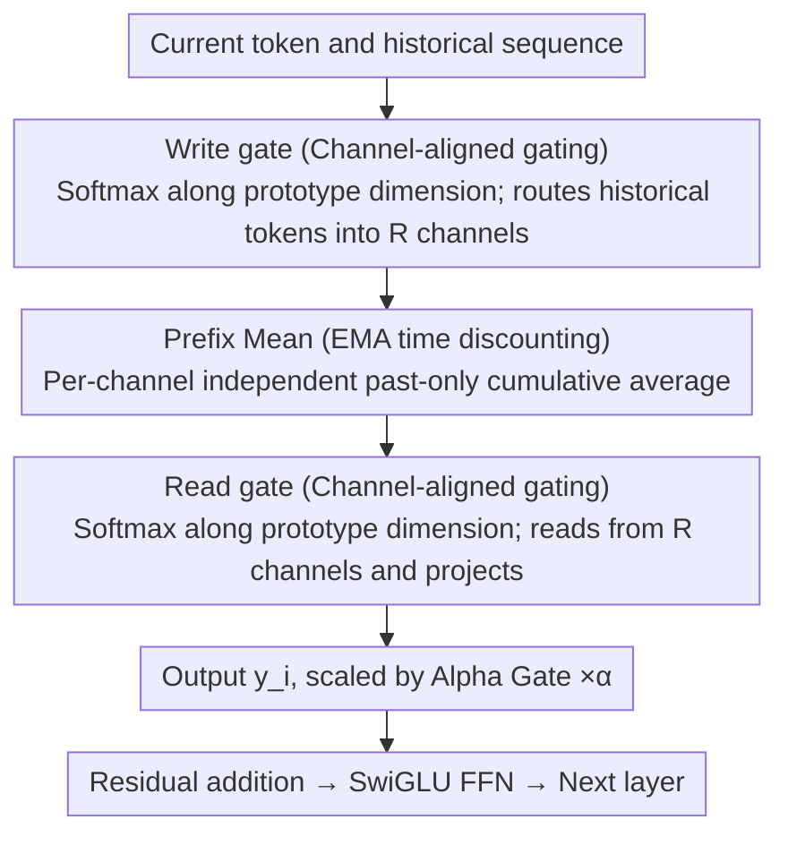

# Prototype Transformer: Towards Language Model Architectures Interpretable by Design

**Conference**: ICML 2026  
**arXiv**: [2602.11852](https://arxiv.org/abs/2602.11852)  
**Code**: https://github.com/YDYordanov/prototype_transformer  
**Area**: Interpretability / Language Model Architecture  
**Keywords**: Prototype Networks, Autoregressive LM, Linear Attention Alternative, Concept Disentanglement, Behavioral Editing

## TL;DR
ProtoT replaces the $O(N^2)$ self-attention in Transformers with linear communication channels driven by $R$ learnable "prototype vectors" (composed of write/read gates + time-discounted prefix mean). This forces each prototype to automatically bind to a namable concept (e.g., "woman," "COVID," "New Zealand") during training, enabling "surgical" concept-level editing of model behavior while achieving text generation Elo scores that surpass LLaMA of the same scale.

## Background & Motivation
**Background**: Mainstream autoregressive LMs (GPT-4, LLaMA series) rely on $O(N^2)$ self-attention to model long-range dependencies. While powerful, their internal reasoning remains highly opaque. Existing interpretability methods (attention visualization, probing, causal intervention, SAE) are almost entirely *post-hoc*: "mining" explanations from architectures that were never designed for interpretability in the first place.

**Limitations of Prior Work**: Attention magnitude does not equate to causal importance (Jain & Wallace 2019). Due to the superposition phenomenon, individual neurons or heads often encode multiple concepts simultaneously. Methods like SAE require training additional auxiliary models to approximate disentanglement. Furthermore, performing precise "surgical" interventions—modifying a specific concept while maintaining other capabilities—is extremely difficult, as side effects usually leak into global perplexity.

**Key Challenge**: High expressivity of dense attention $\leftrightarrow$ Concept disentanglement/intervenability. Compressing all information into the same KV space means any surgical edit affects the entire space.

**Goal**: (1) Design a mixer module that natively supports concept binding; (2) Maintain LLaMA-level generation quality; (3) Reduce inference cost from $O(N^2)$ to $O(N)$.

**Key Insight**: Drawing from the "prototype = interpretable decision unit" idea in computer vision (ProtoPNet/ProtoViT), this work moves prototypes into *every mixer layer* and adapts them into a strictly causal, past-only autoregressive form. Prototypes are no longer classification targets but *filters for communication channels*.

**Core Idea**: Use $R$ non-interacting prototypes to split the sequence into $R$ parallel channels. Each channel uses Exponential Moving Average (EMA) for time-discounted prefix means, forcing semantic specialization under the pressure of channel-aligned softmax. Once each channel encodes only one concept, interpretability and surgical editing become natural properties of the architecture.

## Method
The backbone of ProtoT is identical to LLaMA-3 ($L$ layers of RMS-PreLN blocks, each block = mixer + SwiGLU FFN, skip-connections), with the only modification being the replacement of the self-attention mixer with the **Prototype Mixer**. Other settings (tokenizer, AdamW, cosine annealing, dropout=0.1, weight tying between embeddings and LM head) also follow LLaMA.

### Overall Architecture
A single mixer holds $R$ learnable prototypes $\mathbf{P}_1,\dots,\mathbf{P}_R \in \mathbb{R}^h$ (set to $R=32$ in experiments). At position $i$, the interaction between input $x_i$ and history $x_{<i}$ produces output $y_i$ via two steps:

1.  **Write gate**: Each historical token $x_j$ is written into corresponding channels based on its similarity to each prototype, using a softmax *along the prototype dimension*.
2.  **Prefix mean**: Each channel independently performs an EMA-discounted causal cumulative average to obtain the contextual aggregation $\mathrm{PM}_k$ for channel $k$.
3.  **Read gate**: The current token $x_i$ identifies similarity to each prototype via a softmax *along the prototype dimension*, reading back and summing information from the $R$ channels to project into $y_i$.

The complete formulation ($U, V, W$ are linear mappings; $\tau_w, \tau_r$ are learnable temperatures):

$y_i = U\!\left(\sum_{k=1}^R \mathrm{Softmax}_k\!\left(\tfrac{W(x_i)\cdot \mathbf{P}_k}{\tau_r}\right)\,\mathrm{PM}_k\right)$,
$\mathrm{PM}_k = \dfrac{\sum_{j<i}\beta_k^{i-j}\,\mathrm{Softmax}_k\!\left(\tfrac{x_j\cdot \mathbf{P}_k}{\tau_w}\right) V(x_j)}{\sum_{j<i}\beta_k^{i-j}\,\mathrm{Softmax}_k\!\left(\tfrac{x_j\cdot \mathbf{P}_k}{\tau_w}\right)}$

Where $\beta_k=\sigma(\gamma_k)\in(0,1)$ is the learnable EMA decay coefficient, defining the "temporal preference" of each prototype. This can be converted to a half-life $t_{1/2}^{(k)}=-\ln 2/\ln \beta_k$ for interpretability analysis. Since $\mathrm{PM}_k$ is recursive (time $x_i$ depends only on PM at $x_{i-1}$ and the state of $x_{i-1}$), autoregressive generation is strictly $O(1)$ per step in computation/memory, with a total complexity of $O(N\cdot R\cdot h)$, linear relative to sequence length.

> Three key designs correspond to the diagram: Channel-aligned gating manages both Write/Read gates (B, D), EMA Prefix Mean handles internal channel aggregation (C), and Alpha Gate serves as an observable probe before the residual connection (E).

### Key Designs

**1. Channel-aligned Prototype Gating: "Reverse Attention" via Softmax over Prototypes**

The pivot that differentiates ProtoT from all attention variants is shifting the softmax of the write/read gates from the *sequence dimension* to the *prototype dimension*. Standard attention allows tokens to distribute weights among themselves, whereas here, each token performs "routing selection" among $R$ channels. The write side uses $\mathrm{Softmax}_k(x_j\cdot \mathbf{P}_k/\tau_w)$ to decide which channel a historical token $x_j$ belongs to, and the read side uses $\mathrm{Softmax}_k(W(x_i)\cdot \mathbf{P}_k/\tau_r)$ to decide which channel $x_i$ draws from. This axis swap transforms "information aggregation" into "information routing." If two semantics are forced into the same channel, the prefix mean averages them, causing loss to rise; thus, training automatically pushes different concepts into different channels. Semantic specialization is an inevitable byproduct of loss pressure rather than an external constraint. Decoupling the read/write ends with independent mappings $W$ and temperatures $\tau_r$ allows the "read end to anticipate at $t$ and the write end to consolidate at $t{+}1$." Crucially, the $R$ channels *do not interact* (unlike Perceiver latents), ensuring that surgical edits to one prototype do not leak across channels.

**2. Strictly Causal Prefix Mean with EMA Discounting: Parameterizing Long-range Dependency as Learnable Time Scales**

Each channel independently performs a *past-only* discounted cumulative average: values written at position $j<i$ are multiplied by a decay factor $\beta_k^{i-j}$ and summed, then normalized by the sum of coefficients (mass normalization, which significantly reduces perplexity in practice). Here, $\beta_k=\sigma(\gamma_k)\in(0,1)$ is the learnable EMA decay coefficient for each prototype, effectively giving each prototype an independent time scale. Converted to half-life $t_{1/2}^{(k)}=-\ln 2/\ln\beta_k$, one can interpret which prototypes manage short-range vs. long-range dependencies. Two structural choices are deliberate: first, the sum *only includes $j<i$*—unlike standard self-attention which allows $i$ to attend to itself for a vertical input-output shortcut, ProtoT breaks this loop to force the write gate to prepare for the read gate in advance (the source of the predict-and-consolidate phenomenon). Second, long-range dependency is explicitly modeled as a learnable $\beta_k$ rather than expecting attention to extract it from data. To compensate for fine-grained information loss in lower layers, a low-rank projection of $h/2$ is used for the value stream to save 50% mixer computation, and a local convolution with kernel=5 is added to the first two layers to supplement short-range relations.

**3. Alpha Gate: Zero-cost, Observable Layer Contribution Probe**

The output of each Prototype Mixer is multiplied by a scalar $\alpha$ (similar to ReZero) before merging into the residual. However, unlike ReZero which initializes $\alpha$ at 0, ProtoT initializes it at 1. If a layer's $\alpha$ decays rapidly during training, it provides strong evidence that the mixer in that layer contributes little to the final prediction. While traditional architectures require expensive ablation or probing to determine layer utility, this provides a negligible-cost observable emerging from the training process. The authors used $\alpha$ to diagnose the weakness of Layer 0, subsequently verifying that sharing read/write routing and initializing $\alpha$ with a sharper $\tau_r$ (3.0 instead of 1.0) effectively improved the utility of the initial layer.

### Loss & Training
Standard next-token cross-entropy, AdamW + linear warmup (2% steps) + cosine annealing to 10% of peak LR. All baselines share backbone hyperparameters (h=256, L=6, FFN ratio≈2.7×, dropout=0.1, BPE vocab=16k) with ProtoT, differing only in the mixer to ensure a fair comparison. Number of prototypes $R=32$, attention heads = 4.

## Key Experimental Results

Data: FineWeb-Edu subset, 250M tokens (default 18k documents × 10 epochs; large-scale 339k documents, h=512, L=12, ctx=512).

### Main Results

| Dataset / Metric | LLaMA | Mamba | DeltaNet | ProtoT | Notes |
|---|---|---|---|---|---|
| FineWeb perplexity (ctx=256) | **78.7** | 86.0 | 90.4 | 90.5 | Default setting close to DeltaNet |
| FineWeb perplexity (Large-scale) | **25.8** | 26.5 | 31.5 | 29.5 | Surpasses DeltaNet at scale |
| Text Generation Elo (LLM-judge) | 975.2 | **1041.8** | 961.8 | 1021.2 | ProtoT > LLaMA, DeltaNet |
| GLUE Average (9 tasks) | **71.6** | 68.6 | 64.5 | 67.6 | Between Mamba and DeltaNet |
| Throughput it/s (bsz=128, ctx=256) | **23.6** | 3.2 | 1.8 | 7.6 | Fastest among linear baselines |

### Ablation Study (Interpretability + Intervention)

| Method | Disentanglement ↑ | Coverage ↑ | Num. Themes ↓ |
|---|---|---|---|
| **Ours (ProtoT)** | **6.52 ± 1.93** | **7.88 ± 2.25** | **3.86 ± 1.94** |
| LLaMA SAE (Top Variance) | 5.91 | 7.86 | 4.33 |
| LLaMA SAE (Top Frequency) | 5.52 | 7.47 | 4.68 |
| LLaMA Attention Heads | 5.02 | 6.69 | 5.02 |
| Null Model | 3.20 | 4.03 | 6.97 |

| Concept Intervention (WriteMask) | Max ΔProb | Mean ΔProb | Max ΔPPL | Mean ΔPPL |
|---|---|---|---|---|
| women | −16.60% | −3.13% | +0.29% | −0.08% |
| girls | −10.67% | −2.36% | +0.29% | −0.18% |
| COVID | −21.97% | −4.52% | +5.58% | +0.76% |
| New Zealand | −21.54% | −9.96% | +3.47% | +1.62% |
| mental | −2.20% | −0.73% | −0.04% | −1.20% |

### Key Findings
- **Concept disentanglement is guaranteed by architecture**: Without any auxiliary SAE training, ProtoT prototypes outperform LLaMA heads or LLaMA+SAE in disentanglement, coverage, and thematic purity. This suggests interpretability is a "free gift" of the channel-aligned softmax + independent PM combination.
- **Surgical editing is truly "surgical"**: Disabling L9 P7 (female) reduces the probability of "women" by 16.6%, while global perplexity changes by only ±1%. Disabling L9 P18 (male) actually increases "women" probability by 16.95% (releasing complementary semantics). Neutral prototypes (L9 P2) show almost no effect—a causal triad verification difficult to achieve with post-hoc methods.
- **Predict-and-consolidate**: The read gate always activates one token earlier than the write gate, suggesting the model automatically learns to "predict which channel the next concept should go to, then write it." This emergent behavior stems from the past-only PM breaking the self-loop.
- **Half-life $t_{1/2}$ correlates with semantics**: Protoypes with low half-lives correspond to stop words/punctuation, while high half-lives correspond to narrative or thematic concepts, providing a readable scale for temporal management.
- **Long context is a current weakness**: With fixed $h=256$, perplexity rises as context increases from 256 to 2048. Performance improves with larger $h$, indicating the bottleneck lies in the $h/2$ low-rank value projection and PM channel capacity.

## Highlights & Insights
- **Elevating Interpretability from Post-Hoc to Inductive Bias**: While the standard path is "train a black box, then train a second model to interpret it," ProtoT makes the mixer itself a set of "$R$ named concept slots," eliminating auxiliary training and achieving higher disentanglement.
- **Channel-aligned Softmax as "Reverse Attention"**: By swapping the softmax axis to prototypes, the model shifts from "token interaction" to "semantic routing." This simple change is the key pivot for emergent namable concepts and can be applied to various mixer designs.
- **Breaking Input-Output Direct Links Forces Advanced Logic**: The removal of the self-loop in past-only PM forces the predict-and-consolidate behavior. Using "intentional constraints" to force models to learn higher-level planning is an elegant inductive bias.
- **Alpha Gate as an Engineering Trick**: This provides a zero-cost way to monitor layer contributions during training, which is far more efficient than post-hoc ablation for architecture tuning.

## Limitations & Future Work
- **Weak Long-context Scaling**: Perplexity increases with context size at fixed capacity. Solving the PM channel capacity and low-rank projection bottleneck is essential for replacing SSMs/linear attention in long-document scenarios.
- **Absolute Performance Lags Behind LLaMA**: Large-scale perplexity (29.5 vs 25.8) and GLUE scores still show a gap compared to dense attention.
- **Lower Training Throughput than LLaMA**: Despite fewer FLOPs, LLaMA benefits from deep optimization (FlashAttention). ProtoT's per-channel softmax kernels lack equivalent engineering optimization.
- **Concept Naming Relies on LLM-as-judge**: Disentanglement/coverage scores from GPT-5.1 may harbor subjective bias; future work should integrate human annotation and more robust probe tasks.
- **Empirical Selection of $R$**: $R=32$ was chosen empirically; a theoretical framework for selecting the optimal number of prototypes for different task densities is missing.

## Related Work & Insights
- **Comparison with LLaMA / Standard Attention**: LLaMA excels in expressiveness and engineering optimization but lacks the architectural pressure for concept disentanglement. ProtoT trades some expressiveness for native interpretability.
- **Comparison with SAE**: SAEs find features post-hoc; ProtoT builds disentanglement into the training objective. ProtoT beats LLaMA+SAE in disentanglement metrics without secondary model costs.
- **Comparison with Slot Attention / Perceiver**: Slot Attention uses iterative refinement and isn't strictly causal. Perceiver latents interact via $O(R^2)$ attention. ProtoT prototypes are non-interacting ($O(R)$) and use past-only EMA for recursive state updates, compressing latents into a "semantic routing bottleneck."
- **Comparison with Mamba / DeltaNet**: Performs between the two but offers unique intervenability, an element missing from the SSM/linear transformer roadmap.

## Rating
- Novelty: ⭐⭐⭐⭐⭐ First systematic work to embed interpretability into autoregressive LM mixers via channel-aligned softmax and per-layer prototyping.
- Experimental Thoroughness: ⭐⭐⭐⭐ Extensive metrics (PPL, Elo, GLUE, causal intervention, throughput), though lacking validation at the 1B+ scale.
- Writing Quality: ⭐⭐⭐⭐ Clear formulations and direct links between motivations and ablations; visualizations are highly convincing.
- Value: ⭐⭐⭐⭐⭐ Provides a scalable, editable template for "interpretable by design" architectures, directly benefiting alignment and safety research.

<!-- RELATED:START -->

## Related Papers

- [\[ACL 2026\] Towards Intrinsic Interpretability of Large Language Models: A Survey of Design Principles and Architectures](../../ACL2026/interpretability/towards_intrinsic_interpretability_of_large_language_modelsa_survey_of_design_pr.md)
- [\[ICML 2026\] DLLM-JEPA: Joint Embedding Predictive Architectures for Masked Diffusion Language Models](dllm-jepa_joint_embedding_predictive_architectures_for_masked_diffusion_language.md)
- [\[CVPR 2026\] PRISM: Prototype-based Reasoning with Inter-modal Semantic Mining for Interpretable Image Recognition](../../CVPR2026/interpretability/prism_prototype-based_reasoning_with_inter-modal_semantic_mining_for_interpretab.md)
- [\[ICML 2026\] ShaplEIG: Bayesian Experimental Design for Shapley Value Estimation](shapleig_bayesian_experimental_design_for_shapley_value_estimation.md)
- [\[ICML 2026\] Discovering Implicit Large Language Model Alignment Objectives](discovering_implicit_large_language_model_alignment_objectives.md)

<!-- RELATED:END -->
