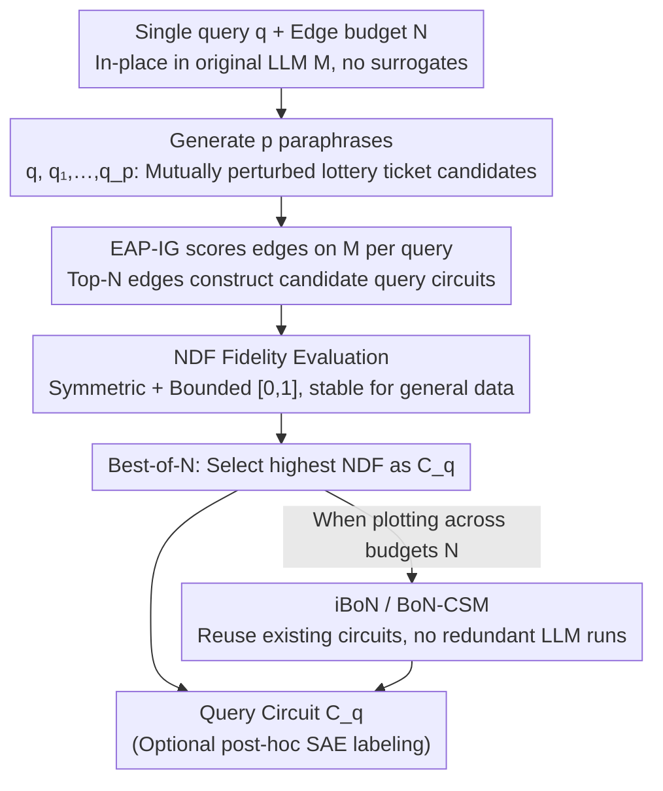

# Query Circuits: Explaining How Language Models Answer User Prompts

**Conference**: ICML 2026  
**arXiv**: [2509.24808](https://arxiv.org/abs/2509.24808)  
**Code**: https://tony10101105.github.io/query-circuit/ (Project Page)  
**Area**: Interpretability / Mechanistic Interpretability / Circuit Discovery  
**Keywords**: Query Circuits, Mechanistic Interpretability, Circuit Discovery, BoN Sampling, Normalized Deviation Faithfulness

## TL;DR
This paper proposes the **query circuit discovery** task—directly tracing sparse subnetworks within the original LLM to explain "why the model produced a specific output for a specific input." It introduces a more robust fidelity metric, NDF, and a Best-of-N (BoN) sampling algorithm, enabling circuits comprising only 1.3% of the model's edges to recover approximately 60% of single-instance behavior on MMLU.

## Background & Motivation

**Background**: The mainstream path of mechanistic interpretability is **circuit discovery**—representing a Transformer as a directed graph of nodes (MLP / attention heads) and edges (residual rewrites) to identify sparse subgraphs implementing specific capabilities. Representative works include ACDC, EAP, and EAP-IG, which primarily study capability circuits ($C_c$) for "toy" tasks like IOI and greater-than.

**Limitations of Prior Work**: Capability circuits provide global explanations ("how a model implements a type of algorithmic skill") but cannot answer "why the model gave this specific answer to this particular user input" (local explanation). Existing instance-oriented solutions, such as Circuit Tracing, rely on **surrogate models** like SAEs or cross-layer transcoders (CLTs). However, surrogates are often unfaithful in reconstructing LLM activations, expensive to train, and the discovered circuits are defined on the CLT rather than the original model, potentially failing to reflect the true computational mechanism.

**Key Challenge**: There is a tension between faithfulness (in-place explanation) and analyzability (sparsity/readability). When searching for single-query circuits directly within the LLM, standard scoring formulas face (1) gradient noise and (2) neglect of combinatorial effects between edges. Furthermore, the commonly used NFS metric exhibits severe drift ($>1$ or $<0$) on general datasets like MMLU, making it impossible to monitor discovery progress.

**Goal**: (i) Formalize the in-place, instance-level query circuit discovery task; (ii) design a stable circuit fidelity metric for general data; (iii) design a discovery algorithm capable of finding *sparse and faithful* circuits for a single query.

**Key Insight**: The authors observed a counter-intuitive phenomenon in IOI: while EAP-IG fails to find a faithful circuit on the original query $q$, the circuit found on its **paraphrase** highly recovers $q$'s behavior. This reinterprets circuit discovery as a **"lottery ticket"** problem: the original query and the edge scoring matrices $\{S, S_1, \dots, S_p\}$ derived from paraphrases act as mutual perturbations, with one of them being the "winning ticket."

**Core Idea**: Use **sampling + best selection (Best-of-N)** to pick the most faithful query circuit from a set of paraphrases, and replace NFS with **NDF**—a symmetric, bounded metric insensitive to $L(M(q')) \neq 0$—for evaluation.

## Method

### Overall Architecture

The goal is to solve "why the model gave this answer to *this* specific user input"—an instance-level circuit discovery problem tracked directly within the original LLM $M$ without training surrogates. Given a query $q$ and an edge budget $N$, the method converts this into a "lottery ticket" sampling problem: the edge importance scores for $q$ and its paraphrases are calculated to construct candidate circuits, which are then evaluated for fidelity on $M$. The best-performing one is selected as the query circuit $C_q$. The infrastructure consists of the stable NDF metric and the BoN family of algorithms.

### Key Designs

**1. Query Circuit Task: Moving instance explanation from surrogates back to the original model**

Mechanistic interpretability was previously bifurcated: capability circuits (ACDC/EAP-IG) provide global explanations after averaging attribution over datasets, while single-input explanations rely on surrogates like SAEs/CLTs. However, surrogates lack reconstruction faithfulness and are defined on external models. This paper formalizes the query circuit task to bridge this gap: for any natural query $q$ and budget $N$, find a sparse subset $E_q \subset E$ in the original LLM such that the model's behavior on the *single query* is maximized when only $E_q$ is retained. The fundamental difference is the **absence of cross-sample averaging**—edge importance $a_e$ is estimated on a single query via the IE formula $a_e = L(M(q \mid \mathrm{do}(e \leftarrow e'))) - L(M(q))$, where $q'$ is a corrupted query. The circuit is defined on the original LLM; SAEs are only used post-hoc for semantic labeling and **do not participate in circuit construction**. This removes dependence on surrogate faithfulness, enabling auditable circuit-level answers for high-stakes scenarios like medicine or autonomous driving.

**2. NDF Fidelity Metric: Making circuit evaluation usable on general datasets**

When finding circuits for a single query, the standard NFS metric drifts severely on general data like MMLU—Table 1 shows three Marketing samples with non-interpretable NFS values of $2.15/1.32/-1.57$. NDF addresses this with two modifications: $\mathrm{NDF}(C_q) = 1 - \min\!\big(\big|\frac{L(M(q)) - L(C_q(q))}{L(M(q)) - L(M(q'))}\big|, 1\big)$, normalizing the circuit deviation by the model's original-to-corrupted performance gap. First, it is **symmetric around $L(M(q))$**, penalizing circuits regardless of whether they over- or under-perform relative to $M$. Second, it is **truncated to $[0,1]$**, preventing explosion when the model's gap is small ($L(M(q)) \approx L(M(q'))$) or $L(M(q')) \neq 0$ (e.g., MCQ position bias). Derived from the MIB benchmark's integrated circuit-model distance (CMD), it brings "method-level aggregate distance" down to "single-circuit fidelity." With NDF, the aforementioned samples become interpretable ($0.00/0.68/0.00$), and curves become monotonic.

**3. Best-of-N Sampling and Zero-Overhead Variants: Converting "rough scoring" into "sampling optimization"**

The authors found that on IOI, EAP-IG fails on query $q$ but succeeds on its **paraphrases**. Thus, discovery is reinterpreted as a "lottery ticket" problem where the set of scoring matrices $\{S, S_1, \dots, S_p\}$ are mutual perturbations. **BoN** constructs candidate circuits for $q$ and $p$ paraphrases (experimentally $p=9$), keeping only the one with the highest NDF. To support Pareto curves across different $N$ without re-running LLM inferences, **iBoN** interpolates current budgets $N$ using already computed BoN circuits. **BoN-CSM** maintains score/level matrices $(S, T)$ to record the first appearance and score of each edge, prioritized by smaller circuit indices. This design works because the bottleneck is not the precision of single-edge IE, but combinatorial effects; BoN reduces the edges needed to reach NDF$=0.6$ from $\sim 200\text{k}$ (51.7%) to $\sim 5\text{k}$ (1.3%).

> All edge scoring uses Integrated Gradients (EAP-IG, $m=20$): $a_e \approx (e - e')^\top \frac{1}{m}\sum_{k=1}^m \nabla_e M(z' + \frac{k}{m}(z-z'))$. Circuits are constructed greedily using the top $N$ scores.

## Key Experimental Results

### Main Results

Target LLMs: GPT-2 Small (32,491 edges) for IOI; Llama-3.2-1B-Instruct (386,713 edges) for other tasks. Baselines: (i) Single-query EAP-IG, (ii) Average $a_e$ across $q$ + paraphrases. Metric: NDF averaged over datasets.

| Dataset | Edge Budget / % | Single Query (EAP-IG) | BoN (Ours) | Remarks |
|--------|--------------|----------------------|-----------|------|
| MMLU (Avg of 9 categories) | 5k / 1.3% | ≪ 0.6 | ≈ 0.6 | Single query needs ~200k (51.7%) edges for 0.6 |
| IOI | 1k / 3.1% | < 0.5 (per query) | Significantly > baseline | Capability circuit ≈ 0.65 at same budget |
| Arithmetic Add/Mul, ARC | Multiple | Consistently < BoN | Order of magnitude better efficiency | iBoN/BoN-CSM perform between BoN and baseline |

### Ablation Study

| Configuration | Key Metrics | Description |
|------|---------|------|
| BoN, $p=9$ | Highest NDF | Default setting |
| BoN, $p$ from 1 to 9 | NDF rises monotonically | Fig 7: More paraphrases are better with diminishing returns |
| Averaging baseline | Worse than Single Query | Averaging dilutes edges critical only to the original query |
| iBoN | Slightly < BoN, ≫ baseline | Interpolates existing circuits with zero extra LLM forwards |
| BoN-CSM | Slightly < BoN, ≫ baseline | Reorders edges by $(S, T)$ matrix logic |
| Increasing IG steps $m$ | No significant gain | Bottleneck is combinatorial effects, not IE precision |
| Gender Bias SAE Ablation (32 samples, Best vs. Worst) | Logit Bias Reduction: Best 0.810 ± 0.581, Worst 0.234 ± 0.278 ($p<0.0001$, $r=0.787$) | Circuits with high NDF more effectively reduce bias when ablating SAE features |

### Key Findings

- **Sparsity + Fidelity can coexist**: Only 1.3% edges on MMLU recover ~60% of behavior, extending "input-dependent activation sparsity" to *circuit sparsity*.
- **Shared sub-circuits exist**: BoN circuits for random IOI queries share 66 edges with the capability circuit at $N=500$ (Fig 8), while single-query discovery misses 23 critical edges.
- **Paraphrases are sources of winning tickets**: When EAP-IG fails on $q$, paraphrases almost always yield faithful circuits.
- **High NDF circuits are more actionable**: Ablating gender-related SAE features in the highest NDF circuits reduces bias significantly more than in worst-performing circuits ($r \in [0.737, 0.836]$).

## Highlights & Insights

- **Circuits as "Lottery Tickets"**: Reframes discovery not as an "attribution precision" problem, but as a "sampling and selection" problem, bypassing the dead-end of tuning IG steps.
- **NDF as Monitorable Infrastructure**: Solves NFS instability on general data with symmetry and bounding, making Pareto curve monitoring feasible.
- **In-place and SAE Decoupling**: Circuits are defined on original edges; SAEs are post-hoc labels. This ensures surrogate failures do not contaminate the primary explanation's validity—critical for auditing.
- **Transferable Paradigm**: BoN + Paraphrase can be applied to any attribution task suffering from noise (e.g., vision models). iBoN provides a "cached" discovery mechanism for online monitoring.

## Limitations & Future Work

- **Small Scale Models**: Tested only up to 1B. Whether BoN costs (p+1 forwards) scale to 7B+ models remains to be seen.
- **Paraphrase Quality**: Reliant on GPT-4o for paraphrasing; semantic drift may occur for short or logic-sensitive queries.
- **Indirect Interpretability**: 60% NDF measures logit fidelity, which may still have a gap with "human-aligned reasoning."
- **Manual $q'$ Construction**: Corrupted query rules remain handcrafted and lacks a unified principle across datasets.
- **Future Directions**: Automating $q'$; combining BoN with Circuit Tracing; exploring circuit evolution in multi-step reasoning (RAG/agents).

## Related Work & Insights

- **vs ACDC / EAP / EAP-IG (Capability Circuits)**: These average IE over datasets for *global* circuits; this work focuses on *single queries* using BoN to overcome attribution noise.
- **vs Circuit Tracing (Ameisen et al., 2025)**: Both are instance-level, but Circuit Tracing relies on CLT surrogates; this work is in-place and surrogate-independent.
- **vs SAE / CLT Input-Dependent Feature Analysis**: Those work on *features*; this work provides *circuit structures*, extending input-dependency to edges.
- **vs MIB benchmark**: MIB evaluates overall methods; NDF evaluates single circuits. They are complementary across scales.

## Rating
- Novelty: ⭐⭐⭐⭐☆ Returns instance circuits from surrogates to LLMs using the "lottery ticket" metaphor.
- Experimental Thoroughness: ⭐⭐⭐⭐☆ Comprehensive datasets/ablations; limited by 1B model scale.
- Writing Quality: ⭐⭐⭐⭐⭐ Extremely clear logic chain and metaphors.
- Value: ⭐⭐⭐⭐☆ NDF and the BoN paradigm are practical, immediately usable tools for the interpretability community.

<!-- RELATED:START -->

## Related Papers

- [\[ICML 2026\] Certified Circuits: Stability Guarantees for Mechanistic Circuits](certified_circuits_stability_guarantees_for_mechanistic_circuits.md)
- [\[ICML 2026\] Circuit Fingerprints: How Answer Tokens Encode Their Geometrical Path](circuit_fingerprints_how_answer_tokens_encode_their_geometrical_path.md)
- [\[ICML 2026\] How Language Models Process Negation](how_language_models_process_negation.md)
- [\[ACL 2025\] Reasoning Circuits in Language Models: A Mechanistic Interpretation of Syllogistic Inference](../../ACL2025/interpretability/reasoning_circuits_in_language_models_a_mechanistic_interpretation_of_syllogisti.md)
- [\[ICML 2026\] All Circuits Lead to Rome: Rethinking Functional Anisotropy in Circuit and Sheaf Discovery for LLMs](all_circuits_lead_to_rome_rethinking_functional_anisotropy_in_circuit_and_sheaf_.md)

<!-- RELATED:END -->
