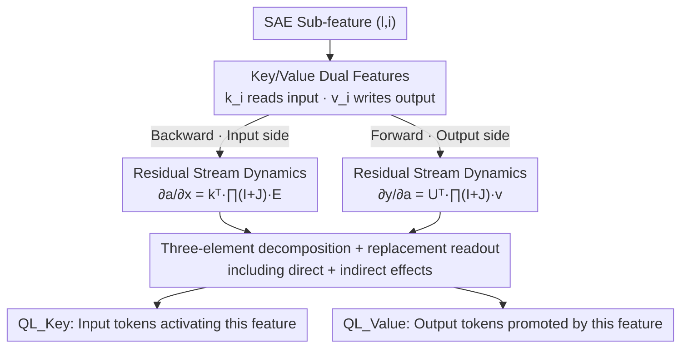

# Query Lens: Interpreting Sparse Key-Value Features with Indirect Effects

**Conference**: ICML 2026  
**arXiv**: [2606.07617](https://arxiv.org/abs/2606.07617)  
**Code**: https://github.com/HYU-NLP/query-lens  
**Area**: Mechanistic Interpretability / Sparse Autoencoders  
**Keywords**: Sparse Autoencoders, Logit Lens, Indirect Effects, key-value memory, residual stream

## TL;DR
Addressing the limitation where Logit Lens only considers "direct effects" and fails to interpret a large number of SAE features, this paper proposes Query Lens: it simultaneously utilizes encoder-side key features and decoder-side value features, incorporating the **indirect effects** (Jacobian products of the residual stream) generated by downstream modules into the projection. This provides coherent input/output token explanations for previously "uninterpretable" features.

## Background & Motivation

**Background**: The core goal of mechanistic interpretability is to assign human-readable semantics to internal representations (features) of LLMs. Sparse Autoencoders (SAEs) decompose residual stream activations into sparse combinations using an overcomplete dictionary, yielding features more "monosemantic" than individual neurons, and are currently a mainstream object of analysis. There are two routes for interpreting SAE features: first, data-driven methods that find strongly activating samples in large corpora; second, directly projecting feature directions into the vocabulary space using **Logit Lens** ($y^l = U^\top h^l_{\text{post}}$) to see which tokens they promote.

**Limitations of Prior Work**: Data-driven methods require exhaustive search over large corpora, are sometimes restricted by privacy, and only characterize "what activates the feature" without clarifying its causal role in generation. Although Logit Lens avoids sampling, it has two major flaws—**Completeness**: it only projects decoder-side value features to explain "what the feature promotes as output," while completely ignoring "what input activates the feature" (encoder-side keys are almost overlooked); **Faithfulness**: a large portion of SAE features (especially in shallow layers) appear diffuse or dominated by meaningless tokens under Logit Lens, failing to converge on coherent concepts.

**Key Challenge**: The authors point out that after a feature direction is added to the residual stream, its impact on the output distribution can be decomposed into **direct effects** (reaching output logits directly along the residual stream) and **indirect effects** (being read by downstream attention/MLP modules, which then rewrite the residual stream). Logit Lens essentially only preserves the direct effect and discards the indirect effect—this is the root cause of many "uninterpretable" features.

**Core Idea**: Ours treats SAEs through a key-value memory lens, decomposing them into key features (input-side causation) and value features (output-side causation), and uses first-order linearization of the residual stream to compute both direct and indirect effects in the projection—explaining features using the tangents of real (rather than identity-approximated) stream transitions.

## Method

### Overall Architecture

Query Lens decomposes the causal role of an SAE sub-feature $(l,i)$ by reading both ends of the residual stream: tracing **backward** to the input side to see "what tokens best activate it" (backward dynamics, using key feature $k_i^l$), and pushing **forward** to the output side to see "what tokens it promotes after activation" (forward dynamics, using value feature $v_i^l$). The common structure of both paths can be factorized into three components: the **feature vector** (local direction written to/read from the residual stream), the **stream transition** (how signals propagate across layers), and the **readout** (how it is expressed in the vocabulary space). The failure of Logit Lens is attributed to its simplification of the stream transition as the identity matrix $I$, retaining only direct effects; Query Lens expands the transition into the Jacobian product of all downstream residual blocks $\prod_k (I+J^k)$, naturally including indirect effects.

### Key Designs

**1. Key Features + Value Features: Completing causal characterization from both input and output sides**

Logit Lens only looks at the decoder, which only answers "what the feature promotes," losing the other half of "what activates the feature." Following the key-value memory perspective of Geva et al., this paper rewrites the SAE reconstruction as a sum of sub-updates: $\hat h_{\text{post}}=\sum_i a_i(h_{\text{post}})\,v_i$, where the activation $a_i(h_{\text{post}})=f(\langle h_{\text{post}},k_i\rangle)$. This naturally yields an "attention-like" analogy—the encoder column vectors $\{k_i\}$ are **key features**, responsible for generating sparse activations from the input; the decoder column vectors $\{v_i\}$ are **value features**, weighted by these activations and written back to the residual stream. Thus, key features correspond to input-side causation ("which inputs activate this feature"), and value features correspond to output-side causation ("which outputs it promotes"), together providing a complete causal footprint of a feature.

**2. Forward/Backward Dynamics: Including indirect effects via Jacobian products**

This is the core of the paper. The authors perform first-order linearization on activations: perturbing weight activation $a_i^l$ to see how output logits change (forward), and perturbing input token $x$ to see how activation changes (backward). The chain rule gives:

$$\frac{\partial y}{\partial a_i^l}=U^\top\Big[\prod_{k=l+1}^{L}(I+J_M^k)(I+J_A^k)\Big]v_i^l,\qquad \frac{\partial a_i^l}{\partial x}=(k_i^l)^\top\Big[\prod_{k=1}^{l}(I+J_M^k)(I+J_A^k)\Big]E,$$

where $J_A^k, J_M^k$ are the Jacobians of the attention and MLP blocks of the $k$-th layer with respect to their input residuals. The key observation is that expanding the product $\prod_k(I+J^k)$ reveals that the identity term $I$ is the direct effect of Logit Lens, while each cross-term containing $J$ (e.g., $J_M^5$) corresponds to an indirect computation path where "the perturbation is consumed by the 5th layer MLP and then rewrites the subsequent residual stream." Query Lens retains all terms, thus more faithfully transmitting local reads/writes to the endpoints.

**3. Three-element decomposition + replacement readout: Correctly landing local effects in the vocabulary space**

Forward/backward dynamics are uniformly factorized into three parts: **Feature Vector** ($\partial h_{\text{post}}^l/\partial a_i^l=v_i^l$ and $\partial a_i^l/\partial h_{\text{post}}^l=(k_i^l)^\top$, i.e., the local read/write directions of the dictionary itself), **Stream Transition** (the Jacobian product above), and **Readout** ($U^\top$ and $E$ at the endpoints). The output-side readout directly uses the unembedding $U^\top$; however, the input side cannot simply use $E$—the goal is not to explain the direction at $h_{\text{pre}}^1$ itself, but "which token replacement best achieves this direction." To this end, the authors construct a **centered-normalized embedding** $\widehat E$: first calculating $\widetilde E=E-e_x\mathbf 1^\top$ (where each column $\tilde e_t=e_t-e_x$ is the embedding change from "replacing input with $t$"), followed by column-wise unit normalization. Reading out with $\widehat E$ yields "which candidate token, when replacing $x$, best matches the transmitted direction $\Delta h_{\text{pre}}^1$."

**4. Two variants of Query Lens: Key interprets input, Value interprets output**

Assembling the three elements results in two scoring functions. The Value variant transmits the value feature through the full transition to the output side and reads it out with $U^\top$: $s_{\textsc{Value}}=U^\top\big[\prod_{k>l}(I+J^k)\big]v_i^l$, taking the top-$k$ tokens as the "output tokens promoted by the feature upon activation." The Key variant transmits the key feature through the full transition to the input side and reads it out with the replacement $\widehat E$: $s_{\textsc{Key}}^\top=(k_i^l)^\top\big[\prod_{k\le l}(I+J^k)\big]\widehat E$, taking the top-$k$ tokens as the "input tokens that most increase the feature activation." Throughout the process $k=25$. Both variants share the same dynamics but in opposite directions and with different readouts, clarifying the input-side and output-side causation of a feature respectively.

### A Complete Example

Take a shallow GPT-2 feature as an example: under Logit Lens, $\text{LL}_{\textsc{Value}}$ multiplies the value feature directly by $U^\top$. Because it ignores the fact that this feature will be secondary-consumed by multiple subsequent layers of MLP/attention, the projected top-25 tokens are diffuse and lack concept. After switching to $\text{QL}_{\textsc{Value}}$, the stream transition changes from $I$ to $\prod_{k>l}(I+J^k)$, indirect paths are added back, and the token signature converges to a coherent theme; meanwhile, $\text{QL}_{\textsc{Key}}$ reads back using $\widehat E$, telling you "which words best light up this feature when replacing the current position," and the input-side explanation also aligns. This is the intuitive reason why $\text{QL}_{\textsc{Key}}$ raises the Input score from 7.84% to 39.32% on GPT-2 in Table 1.

## Key Experimental Results

Experiments were conducted on 4 model/SAE configurations: GPT-2 Small (OpenAI Top-K SAE, 32K), Gemma-3-270M, Gemma-3-1B (Gemma Scope 2 JumpReLU, 65K), and Qwen-3-1.7B (Qwen-Scope Top-K, 32K). 100 features were randomly sampled per layer. Two metrics were used: **Input Score $I(T)$** = ratio of top-25 tokens provided by the method that fall into the set $A$ of tokens that truly strongly activate the feature in natural corpora; **Output Score $O(T)$** = ratio of top-25 tokens that fall into the set $S$ of top-25 tokens most promoted by steering after clamping the feature.

### Main Results

| Model / Metric | $\text{LL}_{\textsc{Key}}$ | $\text{LL}_{\textsc{Value}}$ | TC$_{a=5}$ | $\text{QL}_{\textsc{Key}}$ | $\text{QL}_{\textsc{Value}}$ |
|---|---|---|---|---|---|
| GPT-2 · Input(%) | 7.84 | 11.74 | 31.47 | **39.32** | 26.43 |
| GPT-2 · Output(%) | 4.32 | 12.57 | 13.11 | 1.97 | **15.24** |
| Gemma-3-1B · Input(%) | 1.74 | 1.03 | 9.25 | **14.14** | 8.61 |
| Gemma-3-1B · Output(%) | 3.25 | 7.84 | 8.09 | 1.45 | **9.26** |
| Qwen-3-1.7B · Input(%) | 1.91 | 3.56 | 14.45 | **21.69** | 11.65 |
| Qwen-3-1.7B · Output(%) | 4.43 | 8.31 | 8.77 | 0.55 | **9.36** |

The conclusion is clean: $\text{QL}_{\textsc{Key}}$ is globally optimal for explaining the **input side** (39.32% vs 7.84% for Logit Lens on GPT-2), and $\text{QL}_{\textsc{Value}}$ is globally optimal for explaining the **output side** (consistently outperforming LL and Token Change baselines).

### Ablation Study

| Baseline | stream transition | Scoring Method | Essence |
|---|---|---|---|
| $\text{LL}_{\textsc{Key/Value}}$ | Identity $I$ | Tangent | Direct effect only |
| Tuned Lens (TL) | Learned affine $(A^l,b^l)$ | Tangent | Linearized approximation of transition |
| Zero-Out / Token Change | — | Two-point $y(a^+)-y(a^-)$ secant | Finite difference |
| **Query Lens** | Real $\prod_k(I+J^k)$ | Tangent | Direct + Indirect effects |

### Key Findings
- **Indirect effects are the source of faithfulness**: Changing the transition from $I$ to the full Jacobian product is the direct reason why "failed" Logit Lens features "revive"; TL uses learned affine approximations but remains inferior to directly taking the tangent of the real Jacobian.
- **Directions cannot be mixed**: The Output score of $\text{QL}_{\textsc{Key}}$ is extremely low (only 1.97% on GPT-2), and the Input score of $\text{QL}_{\textsc{Value}}$ is also low—this exactly demonstrates that key/value each serve their own purpose and correspond to different causal sides, rather than being redundant.
- **Subspace Channel Hypothesis**: The same static feature vector has vastly different impacts when read by different Transformer components; the authors fit a low-rank linear map for "feature → module response" and found that readouts are mediated by **layer-specific low-dimensional subspaces (channels)**. That is, downstream modules selectively read information from only a certain low-dimensional subspace of the feature.

## Highlights & Insights
- **Formalizing "indirect effects" as expansion terms of the Jacobian product** translates the limitation of Logit Lens from an "empirical phenomenon" into a precise statement of "discarding all non-identity terms in $\prod(I+J)$"—this is the most elegant step, providing a tool the interpretability community has lacked to cleanly separate direct and indirect effects.
- **The Tangent vs. Secant perspective**: Categorizing LL/TL as tangents, ZO/TC as secants, and QL as the "tangent of the real transition" provides a unified coordinate system for a collection of scattered methods.
- **The replacement readout $\widehat E$** is a reusable trick: when explaining the input side, the goal is not the absolute direction but "which token to replace it with." Centering and normalization turn this into an alignment problem, which is worth migrating to any input-attribution scenario.
- **The Subspace Channel Hypothesis** leaves an opening for future work: if each module only reads features from a layer-specific subspace, then steering/editing features might only require operating on the corresponding channel rather than the entire vector.

## Limitations & Future Work
- **The effective radius of first-order linearization is not fully discussed**: Jacobians are evaluated at a reference input, and the tangent approximation may distort with larger perturbations. The paper relies on empirical validation that features do activate on certain tokens (footnote), but a quantitative error bound is missing.
- **Pre-activation as a proxy for post-activation**: In backward dynamics, pre-activation (the scalar before non-linearity) is used as a proxy because common SAE activation functions are non-differentiable; the justification for this replacement is in the appendix, but its impact is not quantified in the main text.
- **Computational Cost**: The full $\prod_k(I+J^k)$ involves cross-layer multiplication of $d_m\times d_m$ matrices. The paper claims an efficient implementation in the appendix, but scalability under large models or long prefixes remains to be verified.
- **Output scores are low in absolute terms**: Even $\text{QL}_{\textsc{Value}}$ only achieves 9%–15% in most configurations, indicating that causal explanation of "feature → generation" remains difficult overall and is still some distance from practical steering.

## Related Work & Insights
- **vs Logit Lens**: LL only projects value features, takes identity for transition, and only has direct effects; QL uses both key/value, takes the real Jacobian product for transition, and includes indirect effects, thus explaining features uninterpretable under LL.
- **vs Tuned Lens**: TL uses learned affine maps per layer to approximate the transition, which is still a "simplified linearized model"; QL takes the tangent of the real transition directly, requiring no training and being more faithful.
- **vs Zero-Out / Token Change**: These take finite differences between two working points (secant) and depend on the choice of clamp strength; QL is an analytical tangent and does not introduce clamp hyperparameters.
- **vs Data-driven Interpretation (Bills/Bricken/Choi et al.)**: Data-driven methods require exhaustive search for activating samples and are limited by privacy; QL projects directly in parameter space, is sample-free, and has causal grounding on the output side.

## Rating
- Novelty: ⭐⭐⭐⭐⭐ Precisely attributes Logit Lens blind spots to "discarding indirect effects" and provides a unified framework for Key/Value dual-sides + Jacobian expansion.
- Experimental Thoroughness: ⭐⭐⭐⭐ Uses 3 families across 4 models + Input/Output dual metrics + multiple baseline comparisons, though absolute Output scores are low and large-scale scalability is unverified.
- Writing Quality: ⭐⭐⭐⭐⭐ Derivation of residual stream dynamics is clear, and the three-element decomposition explains the method very thoroughly.
- Value: ⭐⭐⭐⭐ Provides a more faithful, directly usable tool for SAE feature interpretation; the Subspace Channel Hypothesis also opens a new direction.

<!-- RELATED:START -->

## Related Papers

- [\[NeurIPS 2025\] Transformer Key-Value Memories Are Nearly as Interpretable as Sparse Autoencoders](../../NeurIPS2025/interpretability/transformer_key-value_memories_are_nearly_as_interpretable_as_sparse_autoencoder.md)
- [\[ICML 2026\] CorrSteer: Generation-Time LLM Steering via Correlated Sparse Autoencoder Features](corrsteer_generation-time_llm_steering_via_correlated_sparse_autoencoder_feature.md)
- [\[ICML 2026\] Sparse Autoencoders are Topic Models](sparse_autoencoders_are_topic_models.md)
- [\[ICLR 2026\] AbsTopK: Rethinking Sparse Autoencoders For Bidirectional Features](../../ICLR2026/interpretability/abstopk_rethinking_sparse_autoencoders_for_bidirectional_features.md)
- [\[ICLR 2026\] Sparse Autoencoders Trained on the Same Data Learn Different Features](../../ICLR2026/interpretability/sparse_autoencoders_trained_on_the_same_data_learn_different_features.md)

<!-- RELATED:END -->
