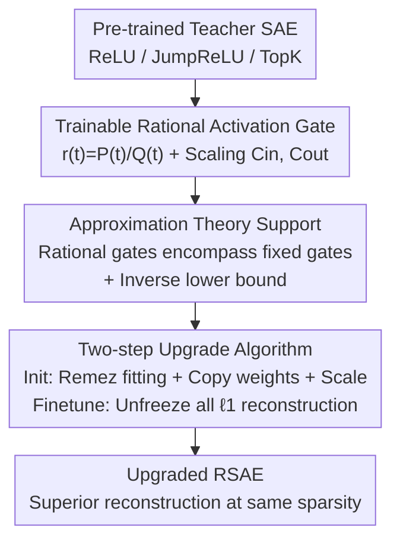

# Rational Sparse Autoencoder

**Conference**: ICML2026  
**arXiv**: [2606.14990](https://arxiv.org/abs/2606.14990)  
**Code**: To be confirmed  
**Area**: Mechanistic Interpretability / Sparse Autoencoders  
**Keywords**: Sparse Autoencoders, Trainable Activations, Rational Functions, Approximation Theory, Mechanistic Interpretability

## TL;DR
The hardcoded ReLU/JumpReLU/TopK encoder gates in Sparse Autoencoders (SAEs) are replaced with an **element-wise trainable rational function** $r(t)=P(t)/Q(t)$. This is combined with a two-step upgrade process—"Copying teacher weights + Remez fitting coefficients → Unfreezing and fine-tuning"—allowing any pre-trained SAE to strictly improve reconstruction fidelity without sacrificing sparsity or interpretability, while adding only a few scalar parameters.

## Background & Motivation
**Background**: SAEs have become the standard tool for mechanistic interpretability—decomposing Transformer residual stream activations $\bm{x}\in\mathbb{R}^{d_{\mathrm{in}}}$ into sparse, monosemantic feature directions on an overcomplete dictionary ($d_{\mathrm{sae}}\gg d_{\mathrm{in}}$). Most mainstream SAEs share a shallow encoder skeleton consisting of an "affine pre-activation layer + sparse activation block," differing only in the encoder activation $\phi$ and the sparsity mechanism $S$: ReLU SAEs use $\ell_1$ soft penalties, TopK SAEs use hard cardinality constraints, and JumpReLU SAEs use per-feature learnable thresholds.

**Limitations of Prior Work**: These three activation primitives have well-known pathologies. $\ell_1$-ReLU causes **magnitude shrinkage** of activated features and leaves many "dead latents"; TopK achieves exact $\ell_0=k$ but **severs the gradient flow** for unactivated features, requiring auxiliary revival losses; JumpReLU introduces learnable thresholds $\theta_j$, but its indicator gate $H(\bm{h}-\bm{\theta})$ is non-differentiable, requiring continuous relaxation proxies for backpropagation.

**Key Challenge**: All three **hardcode a specific sparsity mechanism into the model**—the shape of the activation function is fixed, adjustable only via penalty coefficients, thresholds, or cardinality budgets. They cannot adapt to the actual pre-activation geometry presented by the host model's residual stream. Consequently, fixed gates distort the "reconstruction vs. sparsity" Pareto frontier.

**Goal**: Can the hardcoded scalar gate be replaced with a **more expressive trainable activation that can conversely cover all existing gates**, thereby achieving lower reconstruction error and fewer dead latents at the same sparsity level, without retraining from scratch or changing the linear skeleton?

**Key Insight**: The authors draw from approximation theory—rational functions (ratios of polynomials) have classical advantages in approximating **non-smooth functions**; Zolotarev's sign function can approximate $\mathrm{sign}(x)$ with geometric convergence on intervals with a gap. Since ReLU, JumpReLU, and TopK gates can all essentially be written as $\bm{h}\odot\frac{\mathrm{sign}(\cdot)+1}{2}$, a low-degree rational function is sufficient to encompass all of them within the same family.

**Core Idea**: Replace the fixed SAE gate with a **trainable rational activation**. First, use the Remez algorithm on synthetic data to fit rational coefficients to be "equivalent to the teacher gate." After copying all teacher weights, unfreeze and fine-tune—treating the fixed gate as a special case within the rational family and allowing it to deviate freely to minimize reconstruction loss.

## Method

### Overall Architecture
RSAE retains the standard SAE skeleton (encoder $\bm{z}=\phi(\bm{W}_{\text{enc}}(\bm{x}-\bm{b}_{\text{dec}})+\bm{b}_{\text{enc}})$, linear decoder $\hat{\bm{x}}=\bm{W}_{\text{dec}}\bm{z}+\bm{b}_{\text{dec}}$), **modifying only the encoder activation $\phi$**. Given the pre-activation $\bm{h}=\bm{W}_{\text{enc}}(\bm{x}-\bm{b}_{\text{dec}})+\bm{b}_{\text{enc}}$, the new activation acts element-wise as:

$$\phi(\bm{h})=C_{\mathrm{out}}\cdot r_{(\bm{a},\bm{b})}\!\Big(\frac{\bm{h}}{C_{\mathrm{in}}}\Big),\qquad r_{(\bm{a},\bm{b})}(t)=\frac{P(t)}{Q(t)}=\frac{\sum_{i=0}^{p}a_i t^i}{\sum_{j=0}^{q}b_j t^j},\;t\in[-1,1].$$

Here, $C_{\mathrm{in}},C_{\mathrm{out}}>0$ are learnable input/output scales used to map the pre-activation distribution of each feature into the rational function's design interval $[-1,1]$ and then map the output back to the feature magnitude expected by the decoder. The entire pipeline consists of a process: Teacher SAE (one of ReLU/JumpReLU/TopK) → Initialization (Synthetic data Remez fitting + Copy weights + Calibrate scales) → Fine-tuning (Unfreeze all parameters, standard $\ell_1$ regularized reconstruction objective) → Upgraded RSAE.

### Key Designs

**1. Trainable Rational Activation: Encompassing all fixed SAE gates with a low-degree rational function**

The pain point is that ReLU, JumpReLU, and TopK each hardcode a sparsity mechanism with an unadjustable shape. RSAE replaces the gate with a rational function $r_{(\bm{a},\bm{b})}(t)=P(t)/Q(t)$ with trainable coefficients $(\bm{a},\bm{b})$. Simply learning the denominator $Q$ can result in poles where $Q\to 0$; the authors use safe-Padé parameterization by writing the denominator as $Q(t)=1+|\sum_j b_j t^j|$, ensuring no poles and Lipschitz continuity. The key observation is that all three gates can be unified as $\bm{h}\odot\frac{\mathrm{sign}(\cdot)+1}{2}$: ReLU uses $\mathrm{sign}(\bm{h})$, JumpReLU uses $\mathrm{sign}(\bm{h}-\bm{\theta})$, and TopK (given a separation threshold $\tau_k$) uses $\mathrm{sign}(\bm{h}-\tau_k)$. Thus, if a rational function can approximate $\mathrm{sign}$, it can reproduce all three gates within the same family—making fixed gates special cases while providing the rational family with extra degrees of freedom to fit the real pre-activation geometry.

**2. Approximation Theory: Asymmetry in expressivity—"Rational gates are cheap, piecewise affine gates are expensive"**

The authors prove that this replacement is supported by an asymmetry in representational power rather than empirical luck. **Forward** (Lemma 1 + Theorem 2–4): Based on Zolotarev's sign function, for $\mathrm{sign}$ on a set with a gap $E_\delta=[-1,-\delta]\cup[\delta,1]$, there exists a rational function of size $\mathcal{O}(\log(1/\varepsilon)\log(1/\delta))$ that approximates it to $\varepsilon$ accuracy. Consequently, ReLU gates can be reproduced by rational gates of size $\mathcal{O}(\log^2(1/\varepsilon))$, and JumpReLU/supplied-threshold TopK gates by size $\mathcal{O}(\log(1/\varepsilon)\log(1/\delta))$ (discontinuous gates require a tight neighborhood $\delta$ around the jump). **Backward** (Theorem 5): They construct a target $\mathcal{R}^\star_\eta(x)=\frac{\eta^2}{x^2+\eta^2}$ requiring only $\mathcal{O}(1)$ rational parameters. Any single-layer ReLU/JumpReLU/TopK encoder must activate $N=\Omega(\varepsilon^{-1/2})$ coordinates to approximate it to $\varepsilon$ accuracy. Combined, rational gates compactly encompass all fixed gates, whereas piecewise affine gates require polynomially many activated coordinates for simple rational targets—explaining why replacing the gate improves fidelity at the same sparsity.

**3. Two-step Upgrade Algorithm: Starting from the teacher, "Align then Unfreeze"**

With expressivity guaranteed, the remaining question is how to upgrade an existing pre-trained SAE rather than training from scratch. **Step 1: Initialization** involves two sub-steps: taking a dense grid ($N=4001$ points) on the teacher activation primitive $\phi^{\text{teacher}}$ over $[-1,1]$ and using relaxed Remez exchange to solve for the min-max fit $(\bm{a}^*,\bm{b}^*)$; then copying the teacher's $\{\bm{W}_{\text{enc}},\bm{b}_{\text{enc}},\bm{W}_{\text{dec}},\bm{b}_{\text{dec}}\}$ exactly and calibrating $(\bm{a},\bm{b},C_{\mathrm{in}},C_{\mathrm{out}})$ to the teacher's actual pre-activation distribution using an $\ell_2$ objective. **Step 2: Fine-tuning**: Unfreeze all parameters $\Theta$ and minimize the standard $\ell_1$ regularized reconstruction objective $\min_\Theta\mathbb{E}_{\bm{x}}[\|\bm{x}-\hat{\bm{x}}\|_2^2+\lambda\|\bm{z}\|_1]$. Initializing to align with the teacher before allowing deviations toward lower loss is precisely why it strictly performs no worse than the teacher.

### Loss & Training
The initialization phase uses two independent objectives: min-max (Remez equioscillation) fitting of rational coefficients on synthetic data and $\ell_2$ calibration of scales on the teacher's pre-activation distribution. The fine-tuning phase uses a standard $\ell_1$ regularized reconstruction objective with all parameters unfrozen, optimized via Adam for 22K steps. Low-degree rational functions are sufficient: type $(3,2)$ for ReLU and $(9,8)$ for JumpReLU/TopK reach numerical precision. The entire upgrade adds only a few scalar parameters per autoencoder and takes minutes on a consumer GPU.

## Key Experimental Results

### Main Results
Upgrades were performed for ReLU, JumpReLU, and TopK teachers across residual stream activations of GPT-2 small, Pythia-160m, and Gemma-2-2B. RSAE strictly outperformed the teacher in 22 out of 24 reconstruction metrics and 13 out of 16 downstream metrics. Representative figures (Reconstruction MSE $\|\bm{x}-\hat{\bm{x}}\|_F^2$, lower is better; alive, higher is better):

| Model / Teacher | Metric | Teacher | RSAE init | RSAE |
|---|---|---|---|---|
| GPT-2 small / ReLU | MSE↓ | 0.597 | 0.597 | **0.530** |
| Pythia-160m / JumpReLU | MSE↓ | 0.268 | 0.268 | **0.0320** |
| Gemma-2-2B / JumpReLU | MSE↓ | 3.8397 | 3.8230 | **1.7887** |
| Pythia-160m / TopK | MSE↓ | 0.0299 | 0.0316 | **0.0273** |
| Pythia-160m / ReLU | alive↑ | 72.9% | 72.9% | **74.5%** |

Downstream metrics (Cross-entropy degradation $\Delta\mathrm{CE}$↓ when residual stream is intercepted by SAE, Loss Recovered LR↑):

| Model / Teacher | $\Delta\mathrm{CE}$↓ Teacher | $\Delta\mathrm{CE}$↓ RSAE | LR↑ Teacher | LR↑ RSAE |
|---|---|---|---|---|
| GPT-2 small / ReLU | 0.180 | **0.123** | 97.17% | **98.07%** |
| Gemma-2-2B / JumpReLU | 0.682 | **0.118** | 88.86% | **98.10%** |
| GPT-2 small / TopK | 0.136 | **0.092** | 97.89% | **98.55%** |

The improvement on JumpReLU teachers is most striking (e.g., Gemma-2-2B MSE halved from 3.84 to 1.79), likely because public JumpReLU checkpoints have many dead latents, leaving significant room for improvement by rational gates.

### Ablation Study

| Configuration | Key Conclusion | Description |
|---|---|---|
| RSAE init vs Teacher | Closely matches teacher | Validates (C1): Initialization nearly reproduces teacher behavior |
| RSAE (Post-finetune) vs Teacher | Strictly wins 22/24 Rec, 13/16 Downstream | Validates (C2): Consistent improvement across 3 models × 3 teachers |
| Rational Degree $(p,q)$ | (3,2) for ReLU, (9,8) for JumpReLU/TopK suffices | Remez error decays exponentially before hitting numerical limits |
| Synthetic Fitting Precision | ReLU MSE $3.8\times10^{-7}$, JumpReLU $2.4\times10^{-6}$ | Rational fit is visually indistinguishable from teacher at kinks/jumps |

### Key Findings
- **Zero-loss Initialization**: The performance of RSAE-init closely matches the teacher, proving that Remez coefficients + calibration effectively align the rational gate as an "equivalent teacher gate," providing a baseline at least as good as the teacher for fine-tuning.
- **Minimal Regression**: Only two instances showed slight regressions—$\ell_0$ increased by 1.6 tokens for ReLU/GPT-2 small, and alive/$\Delta\mathrm{CE}$ was a tie for TopK/Gemma-2-2B; no significant degradation occurred.
- **Interpretability Maintained**: Feature-level interpretability under sparse probing is preserved, indicating that improvements do not come at the expense of monosemanticity.
- **Extremely Lightweight**: Adding only a few scalar parameters per SAE, the pipeline runs in minutes on a single RTX 5090, offering a genuine "drop-in upgrade."

## Highlights & Insights
- **Elevating Activation Swapping to a Principled Upgrade**: Grounding the change in forward approximation and inverse lower bounds proves that rational gates have an inherent advantage over piecewise affine ones, which is far more robust than empirical "trying a new activation."
- **Unified Perspective**: Writing ReLU, JumpReLU, and TopK all as $\bm{h}\odot\frac{\mathrm{sign}(\cdot)+1}{2}$ collapses the task of approximating three gates into the task of approximating a single $\mathrm{sign}$ function, making the theory elegant.
- **General "Copy-then-Fine-tune" Paradigm**: Any pre-trained module with a fixed nonlinearity can potentially be upgraded in place by "rationalizing + calibrating + unfreezing," rather than restarting training from scratch.
- **Safe-Padé for Stability**: Using the $1+|\cdot|$ denominator is a critical trick for practical implementation, root-causing and eliminating poles to stabilize training.

## Limitations & Future Work
- **TopK logic limited to fixed separation thresholds**: Theory and algorithm assume the threshold $\tau_k$ is provided by the teacher, excluding the $k$-th order statistic calculation from $\bm{h}$; the strict TopK operator is not fully covered.
- **Approximation of discontinuous gates requires margin $\delta$**: Uniform approximation of JumpReLU/TopK holds only on intervals excluding a neighborhood around the jump, which in practice represents a lower bound on the pre-activation threshold margin.
- **Evaluation on small models (≤2B)**: GPT-2 small, Pythia-160m, and Gemma-2-2B are relatively small; whether gains are stable on larger host models remains to be verified.
- **Deep network conclusions are peripheral**: The core theorems target shallow SAE encoders; the benefits for deep rational networks are complementary but not the focus of the SAE experiments.

## Related Work & Insights
- **vs. ReLU / JumpReLU / TopK SAEs**: These hardcode a fixed mechanism and adjust via penalties/thresholds. RSAE treats these as special cases of a trainable rational family, achieving better reconstruction at the same sparsity.
- **vs. Rational Neural Networks (Boullé et al. 2020 / PAU / safe-Padé)**: Previous work replaced continuous activations (ReLU/GeLU); this work is the first to apply rational activations to **discontinuous** SAE gates and focuses on separation results for shallow encoders.
- **vs. Gated SAE / ProLU / BatchTopK / e2e SAE**: Those modify thresholds, gating, batch-level sparsity, or training objectives. RSAE is orthogonal, modifying only the functional form of the activation itself as a drop-in modification.

## Rating
- Novelty: ⭐⭐⭐⭐⭐ Bringing trainable rational activations to discontinuous SAE gates with solid approximation theory is novel and rigorous.
- Experimental Thoroughness: ⭐⭐⭐⭐ Systematic verification across 3 models × 3 teachers, though host models are on the smaller side.
- Writing Quality: ⭐⭐⭐⭐ Clear link between theory and algorithm; the (C1)(C2) distinction is intuitive.
- Value: ⭐⭐⭐⭐⭐ Extremely lightweight, drop-in utility across families makes this highly practical for the interpretability community.

<!-- RELATED:START -->

## Related Papers

- [\[CVPR 2026\] Improving Sparse Autoencoder with Dynamic Attention](../../CVPR2026/interpretability/improving_sparse_autoencoder_with_dynamic_attention.md)
- [\[AAAI 2026\] SparseRM: A Lightweight Preference Modeling with Sparse Autoencoder](../../AAAI2026/interpretability/sparserm_a_lightweight_preference_modeling_with_sparse_autoencoder.md)
- [\[AAAI 2026\] Data Whitening Improves Sparse Autoencoder Learning](../../AAAI2026/interpretability/data_whitening_improves_sparse_autoencoder_learning.md)
- [\[ICML 2026\] CorrSteer: Generation-Time LLM Steering via Correlated Sparse Autoencoder Features](corrsteer_generation-time_llm_steering_via_correlated_sparse_autoencoder_feature.md)
- [\[ICLR 2026\] SALVE: Sparse Autoencoder-Latent Vector Editing for Mechanistic Control of Neural Networks](../../ICLR2026/interpretability/salve_sparse_autoencoder-latent_vector_editing_for_mechanistic_control_of_neural.md)

<!-- RELATED:END -->
