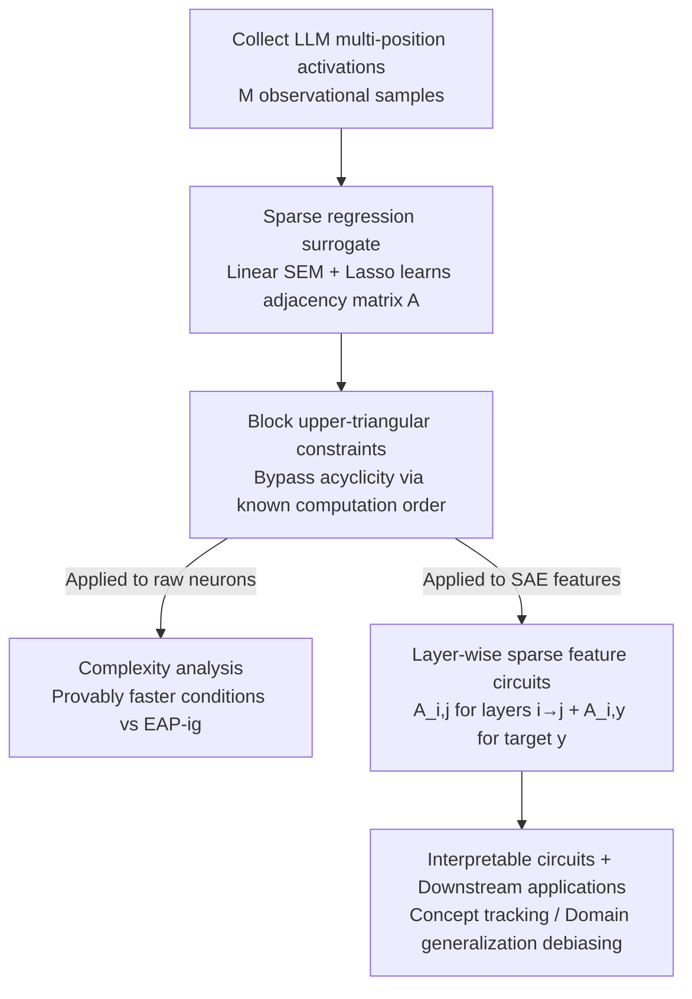

# Scalable Circuit Learning for Interpreting Large Language Models

**Conference**: ICML2026  
**arXiv**: [2606.16939](https://arxiv.org/abs/2606.16939)  
**Code**: To be confirmed  
**Area**: Interpretability / Mechanistic Interpretability  
**Keywords**: Mechanistic Interpretability, Circuit Discovery, Sparse Autoencoders, Sparse Regression, Lasso

## TL;DR
CircuitLasso transforms "circuit discovery in mechanistic interpretability" from expensive intervention-based methods into a **sparse linear regression (Lasso) surrogate**. By using only observational data and relying on $\ell_1$ penalties plus block upper-triangular constraints to identify sparse dependency skeletons between components, it enables circuit discovery directly in high-dimensional SAE feature spaces for the first time. It achieves near-SOTA structural accuracy on InterpBench with a 2–3× speedup and applies the discovered circuits to downstream domain generalization debiasing.

## Background & Motivation
**Background**: The core task of mechanistic interpretability is to discover **circuits**—compact subgraphs connecting internal model components (attention heads, neurons, etc.) that jointly drive a specific behavior. Mainstream approaches prioritize intervention-based methods: causal mediation analysis, causal tracing, and attribution patching (e.g., EAP, EAP-ig), which quantify inter-component influence through counterfactual interventions.

**Limitations of Prior Work**: ① Raw neurons are **polysemantic**—a single neuron can be activated by multiple unrelated concepts, resulting in dense, noisy circuits that are difficult for humans to interpret, contradicting the original goal of interpretability. ② Sparse Autoencoder (SAE) features mitigate polysemanticity (each feature is monosemantic and corresponds to a human-understandable concept), but SAE features are **extremely high-dimensional** ($D \gg d$). Consequently, the computational cost of intervention-based methods explodes, and they are prone to finding spurious correlations; existing methods designed for low-dimensional raw neurons **cannot scale to SAE feature spaces**.

**Key Challenge**: Interpretability seeks monosemantic, clean features like those from SAEs, but the more interpretable the features (high-dimensional monosemanticity), the more computationally intractable intervention-based circuit discovery becomes—**interpretability and scalability are inherently in conflict under the intervention paradigm**.

**Goal**: To find a circuit discovery method that **does not rely on interventions, uses only observational data, and is high-dimension friendly**, allowing it to match SOTA structural accuracy while scaling to SAE features.

**Key Insight**: The authors draw on **continuous causal discovery**—treating circuit discovery as learning a sparse weighted adjacency matrix between components. Linear SEM + Lasso are naturally suited for high-dimensional data: they are computationally efficient, and their sparsity translates directly into interpretable circuits.

**Core Idea**: Use **sparse linear regression (Lasso) as a tractable surrogate for the non-linear computation graph of LLMs**. The objective is not to recover fine-grained edge-wise causal effects, but to efficiently identify the **dependency skeleton** (which components influence others); then, use the known forward computation order of LLMs to construct **block upper-triangular constraints**, bypassing the most expensive acyclicity constraints in causal discovery and reducing the problem to pure Lasso.

## Method

### Overall Architecture
CircuitLasso formulates circuit discovery as a regression problem of "learning a sparse weighted adjacency matrix $A$." Given a vector $\boldsymbol{x} \in \mathbb{R}^N$ formed by concatenating activations from multiple LLM locations, assuming a linear structural relationship $\boldsymbol{X}=A^\top\boldsymbol{X}+\boldsymbol{\varepsilon}$, the optimization problem is:
$$\widehat{A}=\arg\min_A\|\boldsymbol{X}-A^\top\boldsymbol{X}\|_F^2+\lambda\|A\|_1,\quad \text{s.t. } \mathcal{G}(A)\in\mathbb{D}$$
where $A[i,j] \neq 0$ indicates a directed dependency $x_i \to x_j$, $\lambda\|A\|_1$ is the sparsity penalty, and $\mathbb{D}$ is the space of directed acyclic graphs. The primary difficulty—the expensive acyclicity constraint—is replaced by a block upper-triangular structure derived from the "known model computation order," collapsing the problem into scalable Lasso. This framework can be applied **simultaneously** to raw neurons (to verify accuracy) and SAE features (to achieve interpretability), and can incorporate the prediction target $y$ into the regression to explain model behavior.

### Key Designs

**1. Mechanism: Sparse Regression Surrogate — Replacing "edge-wise causal intervention" with "one-shot regression for dependency skeletons"**

This is the foundation of the paper, addressing the pain point where intervention-based costs explode with LLM scale. The authors explicitly state that this is a **surrogate rather than a strict SEM**: they do not claim identifiability theorems (as causal sufficiency, independent noise, and exact linearity only hold approximately in Transformers), and $\boldsymbol{\varepsilon}$ is interpreted as **linearization error** rather than exogenous noise. The goal is to efficiently recover the **dependency skeleton**—a sparse, conservative summary of the strongest dependencies. The $\ell_1$ penalty filters out weak dependencies. The primary advantage is being **observational data only**: it requires no interventions, has broader applicability, and costs do not scale linearly with LLM model size.

**2. Design Motivation: Block Upper-triangular Constraints — Leveraging known LLM computation order for free acyclicity**

The most expensive aspect of continuous causal discovery is enforcing acyclicity. The authors' ingenuity lies in recognizing that the LLM computation order is **designed and known**: neurons in layer $i$ precede layer $j$ when $i < j$. By reordering activations into $\tilde{\boldsymbol{H}} \in \mathbb{R}^{N \times M}$ ($N=Ld$), $A$ is constrained to be **block upper-triangular**:
$$\widehat{A}=\arg\min_A\|\tilde{\boldsymbol{H}}-A^\top\tilde{\boldsymbol{H}}\|_F^2+\lambda\|A\|_1,\quad \text{s.t. } A \text{ is block upper-triangular}$$
Each block $A[i,j]$ is a $d \times d$ matrix, and blocks where $i \ge j$ are zeroed. This ensures that "later layers cannot affect earlier layers," providing **natural acyclicity without explicit constraints**. This reduces an NP-hard-style optimization to pure Lasso. The authors provide a complexity proposition: FISTA reaches $\epsilon$-optimality in $\mathcal{O}(1/\sqrt{\epsilon})$ steps with a total cost of $\mathcal{O}\!\left(\frac{ML(L-1)d^2}{2\sqrt{\epsilon}}\right)$, and prove it is **provably faster than EAP-ig** under certain conditions.

**3. Function: Layer-wise Sparse Feature Circuits — Scaling regression to high-dimensional SAE features and target labels**

Intervention-based methods are infeasible at SAE dimension $D$, but the regression surrogate is high-dimension friendly. For two positions where $i$ precedes $j$, features $\boldsymbol{z}_i, \boldsymbol{z}_j \in \mathbb{R}^D$ are encoded using pre-trained SAEs, and the dependency $i \to j$ is solved pair-wise:
$$\widehat{A}_{i,j}=\arg\min_{A_{i,j}}\|\boldsymbol{Z}_j-A_{i,j}^\top\boldsymbol{Z}_i\|_F^2+\lambda\|A_{i,j}\|_1$$
The cost is only $\mathcal{O}(MD^2/\sqrt{\epsilon})$. Learning $A_{i,j}$ for all adjacent layers reveals how **semantic concepts are transferred and evolved**. Furthermore, incorporating the downstream target $y$ into the regression $\widehat{A}_{i,y}=\arg\min_{A_{i,y}}\mathcal{L}_{\text{pred}}(y,A_{i,y}^\top\boldsymbol{Z}_i)+\lambda\|A_{i,y}\|_1$ allows explaining model behavior and **correcting predictions to mitigate spurious/biased behavior**.

### Loss & Training
All subproblems use least squares with $\ell_1$ penalties (cross-entropy for classification, MSE for regression), solved via FISTA. Pre-trained SAEs (e.g., OpenAI's GPT-2 small SAEs) are used directly without further training. Acyclicity is maintained by freezing lower-triangular blocks.

## Key Experimental Results

### Main Results
On InterpBench (86 semi-synthetic transformers with ground-truth circuits), 16 synthetic cases and real IOI cases were evaluated. Accuracy was measured by Structural Hamming Distance (SHD, lower is better), and efficiency by runtime in seconds (avg. of 3 trials on an A100).

| Method | Mean SHD ↓ | Mean Runtime (s) ↓ | Relative Speedup |
|------|-----------|-------------------|---------|
| EAP | 3.61 | 33.7 | — |
| EAP-ig (SOTA) | **2.98** | 49.1 | 1× |
| CircuitLasso-linear (Ours) | 3.16 | **16.3** | 3.0× vs EAP-ig |
| CircuitLasso-nonlinear | 2.84 | ≈60 (3.7×) | Slower than EAP-ig |

The SHD of 3.16 for CircuitLasso-linear is not statistically significantly different from EAP-ig's 2.98 and outperforms EAP. Crucially, its runtime is only 16.3s—3.0× faster than EAP-ig.

SAE feature comparison with SHIFT (excluding manual interpretation time):

| Model | SHIFT Time (s) | CircuitLasso Time (s) | SHIFT Features | CircuitLasso Features |
|------|----------------|------------------------|--------------|----------------------|
| Pythia-70M | 257.6 | **36.5** | 49 | 41 |
| Gemma-2-2B | 371.2 | **47.2** | 65 | 55 |
| Gemma-2-9B | 908.4 | **107.4** | 71 | 59 |

### Ablation Study

| Configuration | Key Metric | Description |
|------|---------|------|
| CircuitLasso-linear | SHD 3.16 / 16.3 s | Complete method, best efficiency-accuracy balance |
| CircuitLasso-nonlinear | SHD 2.84 / ≈60 s | Nonlinear variant only slightly reduces SHD but costs 3.7× more time |
| Downstream Domain Gen. | Prof. 91.5 / Gender≈50 | Debiasing via circuit insights approaches oracle performance at low cost |

### Key Findings
- **Efficiency matches accuracy**: CircuitLasso-linear matches SOTA intervention methods in structural accuracy while being 2–3× faster. The nonlinear variant shows that linear edge importance is sufficient to characterize dependency structures.
- **Interpretable insights**: On the CoLA task, which was previously unused for mechanistic interpretability, SAE feature circuits in GPT-2 small showed three phenomena: **persistence** (concepts like "-self" continuing along paths), and **merging/dropping** (merging parent concepts or dropping others).
- **Downstream debiasing**: On Bias-in-Bios, using learned circuit insights achieves occupational prediction accuracy comparable to SOTA debiasing methods while reducing gender predictability to near 50%.

## Highlights & Insights
- **Replacing expensive interventions with cheap regression surrogates**: The key insight is that if the goal is to find a "dependency skeleton" rather than "edge-wise causal effects," interventions are unnecessary; a Lasso proxy is sufficient.
- **Using architectural priors for acyclicity**: The LLM forward computation order provides a free and reliable acyclicity prior. Block upper-triangular constraints eliminate the most expensive part of causal discovery.
- **Honest discussion of assumptions**: The authors proactively state they do not rely on identifiability theorems and interpret $\varepsilon$ as linearization error, positioning the result as a "conservative map of strongest dependencies."
- **Transferability**: This "Linear SEM surrogate + fixed computation order + target-inclusive regression" paradigm can be transferred to any scenario where one wants to find sparse dependencies between high-dimensional features with a known topological order.

## Limitations & Future Work
- **Skeleton recovery, not true causality**: The method does not guarantee identifiability or recover exact causal effects, which may be needed for precise causal attribution.
- **Approximation of linear assumptions**: Transformers are inherently nonlinear (attention, LayerNorm, MLP); linear SEM is only an approximation.
- **Dependency on pre-trained SAEs**: Circuit quality depends on the fidelity-sparsity trade-off of the used SAEs; reconstruction errors are absorbed into the residuals.
- **Group-level vs. single prompt**: This work focuses on dataset-level skeletons, complementing but not replacing prompt-specific attribution graphs.

## Related Work & Insights
- **vs. EAP / EAP-ig (Intervention SOTA)**: These rely on counterfactual interventions leading to costs that explode with scale. CircuitLasso is observational-only, requires zero backpropagation, and scales to SAE dimensions.
- **vs. Marks et al. 2025**: They use efficient approximations for SAE features but rely on heuristic preprocessing like clustering. Ours applies sparse regression directly to SAE features.
- **vs. Conmy et al. 2023 (ACDC)**: ACDC iteratively prunes edges. CircuitLasso uses continuous optimization to learn weighted adjacencies in one shot.
- **vs. per-prompt attribution graphs**: While others build graphs for single prompts, CircuitLasso aggregates observations across prompts to find a group-level dependency skeleton.

## Rating
- Novelty: ⭐⭐⭐⭐⭐ 
- Experimental Thoroughness: ⭐⭐⭐⭐ 
- Writing Quality: ⭐⭐⭐⭐⭐ 
- Value: ⭐⭐⭐⭐⭐ 

<!-- RELATED:START -->

## Related Papers

- [\[ICML 2025\] Inference-Time Decomposition of Activations (ITDA): A Scalable Approach to Interpreting Large Language Models](../../ICML2025/interpretability/inference-time_decomposition_of_activations_itda_a_scalable_approach_to_interpre.md)
- [\[ICML 2026\] Towards Atoms of Large Language Models](towards_atoms_of_large_language_models.md)
- [\[ICML 2026\] Equilibrium Reasoners: Learning Attractors Enables Scalable Reasoning](equilibrium_reasoners_learning_attractors_enables_scalable_reasoning.md)
- [\[ICML 2026\] The Expert Strikes Back: Interpreting Mixture-of-Experts Language Models at Expert Level](the_expert_strikes_back_interpreting_mixture-of-experts_language_models_at_exper.md)
- [\[ICML 2026\] Dissecting Multimodal In-Context Learning: Modality Asymmetries and Circuit Dynamics in modern Transformers](dissecting_multimodal_in-context_learning_modality_asymmetries_and_circuit_dynam.md)

<!-- RELATED:END -->
