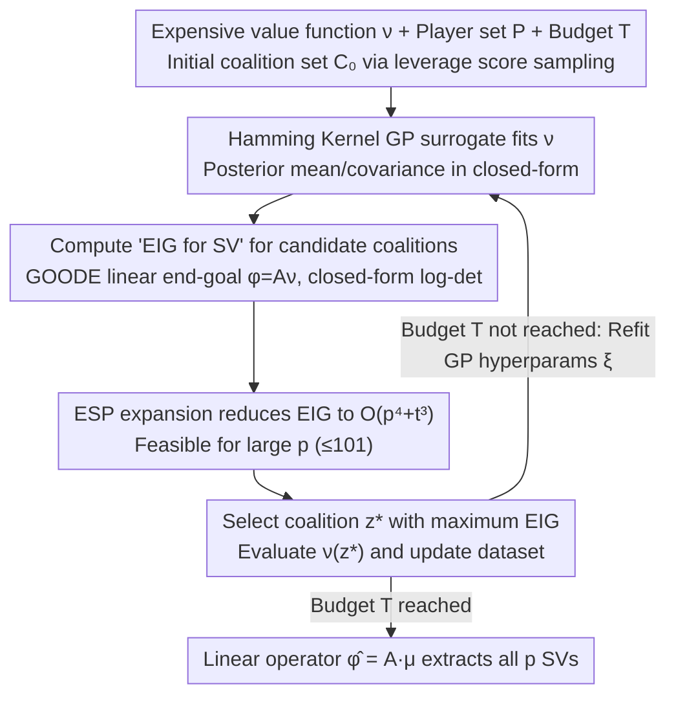

# ShaplEIG: Bayesian Experimental Design for Shapley Value Estimation

**Conference**: ICML 2026  
**arXiv**: [2606.02247](https://arxiv.org/abs/2606.02247)  
**Code**: Available (public repository in Appendix D.1.5)  
**Area**: Interpretable Machine Learning / Shapley Value Estimation / Bayesian Experimental Design  
**Keywords**: Shapley Value, Bayesian Experimental Design, EIG, Gaussian Process, Hamming Kernel

## TL;DR
For expensive games where evaluation budgets are extremely limited (e.g., requiring model retraining), this work utilizes a Gaussian Process (GP) with a Hamming kernel as a surrogate for the value function. It adaptively selects the next coalition based on the "Expected Information Gain (EIG) for the Shapley values" and reduces the EIG computation complexity from $O(4^p t)$ to $O(p^4 + t^3)$.

## Background & Motivation

**Background**: The Shapley Value (SV) is the most widely used axiomatic attribution measure in interpretable ML. However, exact calculation requires enumerating $2^p$ coalitions and calling the value function $\nu(S)$ for each. Existing methods generally fall into two categories: (1) Monte Carlo methods (permutation sampling, MSR, SVARM) which sample coalitions from a **fixed preset distribution**; (2) Surrogate regression methods (Kernel SHAP, Leverage SHAP, Regression MSR) which fit a surrogate and then extract SVs, where coalitions are also sampled from a fixed distribution.

**Limitations of Prior Work**: When the value function itself is expensive—such as feature importance for TabPFN (requiring in-context inference per run), Ghorbani-Zou style data valuation (requiring retraining a RF/GB per run), HyperSHAP hyperparameter importance (requiring one HPO round per run), or local explanations for large vision models (costing credits per API call)—the budget may be as low as a few hundred queries. Fixed distribution sampling wastes precious query budget on samples that provide "homogeneous information" compared to previous coalitions.

**Key Challenge**: While "adaptive coalition selection" is a natural solution, EIG under the BED framework usually lacks a closed-form solution. Common EIG implementations for GPs typically focus on the uncertainty of the surrogate **itself** (e.g., uncertainty sampling, US), rather than targeting the downstream SV quantity directly. Furthermore, even with a suitable criterion, brute-force traversal over $2^p$ coalitions remains exponential.

**Goal**: (i) Derive a closed-form expression for "EIG targeted at SV"; (ii) Reduce EIG computation from $O(4^p t)$ to polynomial time in $p$; (iii) Outperform SOTA sampling/surrogate methods in low-budget regimes.

**Key Insight**: SV is a **linear transformation** of the value function $\phi = A\nu$ (linearity axiom of Shapley). By reframing "selecting coalitions + prioritizing SV" into a **Bayesian Linear Inverse Problem + Goal-Oriented OED (GOODE)** framework, the EIG depends only on the GP posterior covariance rather than specific observations, thus yielding a closed-form $-\tfrac12 \log\det(A\Sigma_{\theta\mid y}A^\top)+C$.

**Core Idea**: Use a Hamming kernel GP as the surrogate + formulate closed-form EIG using SV as a linear end-goal + employ Elementary Symmetric Polynomials (ESP) to expand the multiplicative structure of the Hamming kernel, making EIG computable in polynomial time.

## Method

### Overall Architecture
ShaplEIG reframes the challenge of "enumerating $2^p$ coalitions for exact SV" as a greedy Bayesian Adaptive Design (BAD) loop: it fits the expensive value function $\nu$ with a probabilistic surrogate, and in each round, asks "which coalition evaluation most reduces the uncertainty of the SV," effectively spending the limited budget where it matters most. Given a set of players $P=\{1,\dots,p\}$, a value function $\nu:2^P\to\mathbb{R}$, an initial set $\mathcal{C}_0$ ($T_0=p+1$ samples) obtained via leverage score sampling, and a budget $T$ (typically $\le 512$ in the paper), the method selects the coalition with the maximum expected information gain $\mathrm{EIG}^{(t)}_\phi$ from a candidate pool, evaluates $\nu$ once, updates the dataset with $(z, \nu(z))$, and refits surrogate hyperparameters. Upon termination, a linear operator $\hat\phi = A\mu_{\nu\mid\mathcal{D}_{T+1}}$ extracts all $p$ SVs directly from the posterior mean. The three components—surrogate selection, the target-oriented criterion, and complexity reduction—correspond to the following key designs.

### Key Designs

**1. Hamming Kernel GP Surrogate: Enabling Outcome-Adaptive Design**

The limitation of classical Kernel SHAP is its use of a linear surrogate with fixed weights; its posterior uncertainty depends only on "which coalitions were selected" and is independent of observed $\nu$ values, making the design non-adaptive. ShaplEIG uses a Gaussian Process defined on the binary coalition space $\{0,1\}^p$: representing coalitions as indicator vectors $z$, the kernel takes a weighted Hamming form $k_\xi(z,z')=\prod_{j=1}^p \xi_j^{\mathbb{1}[z_j\ne z'_j]}$, where each player is assigned a learnable weight $\xi_j$. For fixed $\xi$, $\nu(Z)\mid\mathcal{D}_t,\xi$ is a $2^p$-dimensional multivariate Gaussian with closed-form posterior mean and covariance, providing well-calibrated uncertainty even in low-data regimes. Crucially, $\xi$ is refit after each observation round, allowing historical $\nu$ values to influence future EIG calculations via kernel hyperparameters. The multiplicative structure of the Hamming kernel is also the prerequisite for the ESP expansion that reduces complexity to $O(p^4)$.

**2. Treating SV as a GOODE Linear End-goal for Closed-form EIG**

Directly calculating EIG for the untransformed $\nu$ (Information Theoretic Learning, ITL) in a GP setting degenerates into pure uncertainty sampling—selecting coalitions where the surrogate is most uncertain, regardless of how much that evaluation reduces uncertainty for the actual target $\phi$. Methods like EPIG are computationally infeasible due to the required integration over $2^p$ target distributions. ShaplEIG leverages the linearity axiom $\phi=A\nu$ (where $A\in\mathbb{R}^{p\times 2^p}$ contains elements like $\frac{\mathbb{1}_S}{p}\binom{p-1}{|S|-1}^{-1} - \frac{1-\mathbb{1}_S}{p}\binom{p-1}{|S|}^{-1}$) to frame the problem as Goal-Oriented Optimal Design (GOODE) for Bayesian linear inverse problems. Here, SV is simply a linear projection end-goal of the parameters $\nu$. Consequently, EIG depends only on the GP posterior covariance and yields a closed-form expression: $\mathrm{EIG}_\phi(z^{(i)}) \propto C' + \log[e_i^\top(\Sigma_{\nu\mid\mathcal{D}_t}+\sigma_\epsilon^2 I)e_i] - \log[e_i^\top(\Sigma_{\nu\mid\mathcal{D}_t}+\sigma_\epsilon^2 I - Q)e_i]$, where $Q_{i,i}=(A\Sigma_{\nu\mid\mathcal{D}_t}e_i)^\top (A\Sigma_{\nu\mid\mathcal{D}_t}A^\top)^{-1}(A\Sigma_{\nu\mid\mathcal{D}_t}e_i)$. This specializes the GOODE result from Attia (2018) to the SV setting, converting nested MC estimation into a log-det form.

**3. Complexity Reduction to $O(p^4 + t^3)$ via Elementary Symmetric Polynomials**

While the closed-form EIG is elegant, a naive implementation requires constructing the $2^p\times 2^p$ covariance $\Sigma_{\nu\mid\mathcal{D}_t}$ and performing projections with $A$ and $e_i$, leading to $O(4^p t)$ complexity. For $p=10$, this is already a $\sim 10^6$ dimensional matrix. Theorems B.1/B.2 rewrite the linear term $AK_\xi(Z,z^{(i)})\in\mathbb{R}^p$ and quadratic term $AK_\xi(Z,Z)A^\top\in\mathbb{R}^{p\times p}$ as weighted kernel value sums across coalitions. By observing that many kernel evaluations share weights, the authors map these sums to unary and binary Elementary Symmetric Polynomials (ESPs). This maps the two terms to $O(p^2)$ and $O(p^4)$ respectively, resulting in a total complexity for vectorized candidates of $O(p^4+t^3+|W|t^2)$ (SV estimation is $O(t^3)$ and SV posterior covariance $\Sigma_\phi$ is $O(p^4+t^2 p)$). This enables the method to scale to $p=101$ (LE on Crime), a feat made possible specifically by the multiplicative structure of the Hamming kernel.

### Loss & Training
The GP hyperparameters $\xi$ are refit each round (or according to a refit schedule for large $p$) using the MAP estimate $p(\xi\mid\mathcal{D}_{t+1})$. This is the primary channel through which historical observations inform the design. Value function evaluations are assumed to have Gaussian noise $\epsilon\sim\mathcal{N}(0,\sigma_\epsilon^2)$, though the paper also discusses consistency in the noiseless case: if all $2^p$ coalitions were evaluated, the GP interpolation property $\mu_{\nu(z)\mid\mathcal{D}_{2^p+1}}=\nu(z)$ ensures $\mu_\phi=\phi(\nu)$, meaning the estimator is **consistent by construction**. This is an advantage over Regression MSR, where tree-based surrogates are not inherently consistent and require residual correction.

## Key Experimental Results

The experiments cover 4 task categories across 15 games with player counts $p\in[8,101]$, using 30 or 100 seeds per game. All baselines are given an equivalent $\nu$ evaluation budget per round for a fair comparison.

### Main Results

| Task Category | Representative Game | $p$ | ShaplEIG vs SOTA (Low-budget MSE) |
|---------------|----------------------|-----|-----------------------------------|
| FI (TabPFN)   | Diabetes Reg.        | 10  | Strictly superior to Kernel/Leverage SHAP, Perm. Sampling, and Reg. MSR. |
| DV (RF on Bike Sharing) | Bike Sharing | 10 | Leads significantly by multiple orders of magnitude. |
| HPI (XGBoost on Chess) | Chess       | 16  | Competitive with Reg. MSR initially, superior in lower MSE regimes. |
| LE (ViT 16-patch) | ImageNet         | 16  | Consistently outperforms all competitors. |
| LE (RF on Crime, Large $p$) | Crime | 101 | Successfully runs despite GP schedule; eventually leads. |

The results show that ShaplEIG is strictly dominant across almost all budgets and games. Regression MSR occasionally matches performance in narrow windows, but most other baselines are significantly outperformed in the low-budget region.

### Ablation Study

| Configuration | Key Finding |
|---------------|-------------|
| Full ShaplEIG | Best overall performance. |
| GP + Random sampling | Outperformed significantly by ShaplEIG in most games. |
| GP + Leverage Score Sampling | Occasionally approaches ShaplEIG but is consistently surpassed. |
| GP + Uncertainty Sampling (US) | **Worse than GP+Random**, indicating that standard BED US criteria are unsuitable for SV. |
| ShaplEIG (Large $p\ge 60$, scheduled refit) | Slightly outperformed by weak baselines in early rounds (100), then takes the lead. |

### Key Findings
- **Performance is not solely due to the GP surrogate**: GP+Random, GP+Leverage, and GP+US were all defeated by ShaplEIG, confirming that EIG-based coalition selection is the core contribution.
- **US is counter-intuitively worse than random for SV estimation**: US targets coalitions where the surrogate is most uncertain without regard for their impact on the downstream $\phi$. This validates the necessity of deriving EIG specifically for SV.
- **Computational Overhead**: For $p\le 16$, GP hyperparameter refitting takes $\le 2$ mins/round, while EIG takes $< 1$ sec. For $p\le 100$, refitting takes $\le 25$ mins/round and EIG takes $\le 30$ secs. **Hyperparameter refitting is the bottleneck**, meaning non-EIG GP variants are not significantly cheaper.
- **Sweet Spot**: ShaplEIG is most valuable when $\nu$ is genuinely expensive (e.g., retraining or API calls) and $p$ is moderate ($\le 16$ is ideal, up to $\sim 100$ is acceptable).

## Highlights & Insights
- **SV as an "End-goal"**: The authors reject the naive view that "making the surrogate accurate makes the SV accurate." They prove that while EIG on $\nu$ degenerates to US, EIG on the linear projection $A\nu$ is a valid criterion.
- **Hamming Kernel + ESP Synergy**: The structure $\prod_j \xi_j^{\mathbb{1}[\cdot]}$ allows sums over player subsets to be mapped to ESPs, reducing exponential complexity to polynomial. This is a highly specialized solution tailored to the SV structure.
- **Consistency and Closed-form**: Unlike Regression MSR, which requires residual correction for its non-consistent tree surrogate, ShaplEIG is consistent by construction in its noiseless GP formulation.
- **Transferable Design**: This framework can be reused for any linear functional of $\nu$ (e.g., Sobol indices, fANOVA decomposition) simply by changing the operator $A$.

## Limitations & Future Work
- **Overhead**: GP hyperparameter refitting becomes the bottleneck for $p > 100$. The method's cost is only justified when $\nu$ is significantly more expensive than the GP overhead.
- **Pre-computed Games**: Evaluation relied heavily on cached games. The "end-to-end" engineering limit of running this with real-time expensive functions (e.g., training LLMs) was not fully tested.
- **Sensitivity**: US performing poorly suggests that this class of BED criteria is sensitive to the "symmetry/heterogeneity" of the game.
- **Future Directions**: (i) Amortized/lazy hyperparameter refitting; (ii) Batch BED for multi-coalition selection; (iii) Extension to higher-order Shapley interaction indices.

## Related Work & Insights
- **vs Kernel SHAP / Leverage SHAP / Regression MSR**: These use fixed distributions; ShaplEIG is outcome-adaptive and targets SV Directly.
- **vs BayesSHAP (Slack 2021)**: BayesSHAP uses a Bayesian linear model + US. ShaplEIG upgrades to a GP for outcome-adaptivity and replaces US with EIG for SV.
- **vs Mitchell 2022 / Nguyen 2025 (GP+BQ for SV)**: Their kernels are often defined on permutations or data distributions and are typically fixed (non-adaptive). ShaplEIG defines the kernel on the coalition space and adapts hyperparameters.
- **vs Active Learning / ITL / EPIG**: ShaplEIG avoids the nested MC pitfalls of standard BED by leveraging the linearity of SV to obtain a closed-form solution.

## Rating
- **Novelty**: ⭐⭐⭐⭐⭐ Introduces the GOODE perspective to SV estimation with original theoretical and algorithmic results.
- **Experimental Thoroughness**: ⭐⭐⭐⭐ Solid coverage across 15 games and 4 tasks, though limited by the use of pre-computed values.
- **Writing Quality**: ⭐⭐⭐⭐ Clear logical progression from BED theory to Shapley axioms and GP derivations.
- **Value**: ⭐⭐⭐⭐ Provides a SOTA estimator for a specific but important high-cost scenario, with clear interfaces for related problems.

<!-- RELATED:START -->

## Related Papers

- [\[ICLR 2026\] SEED-SET: Scalable Evolving Experimental Design for System-level Ethical Testing](../../ICLR2026/interpretability/seed-set_scalable_evolving_experimental_design_for_system-level_ethical_testing.md)
- [\[ICML 2026\] Verified SHAP: 神经网络精确 Shapley 值的可证明界](verified_shap_provable_bounds_for_exact_shapley_values_of_neural_networks.md)
- [\[ICML 2026\] Prototype Transformer: Towards Language Model Architectures Interpretable by Design](prototype_transformer_towards_language_model_architectures_interpretable_by_desi.md)
- [\[ICML 2026\] Neural Collapse by Design: Learning Class Prototypes on the Hypersphere](neural_collapse_by_design_learning_class_prototypes_on_the_hypersphere.md)
- [\[ICML 2026\] Dual Mechanisms of Value Expression: Intrinsic vs. Prompted Values in Large Language Models](dual_mechanisms_of_value_expression_intrinsic_vs_prompted_values_in_large_langua.md)

<!-- RELATED:END -->
