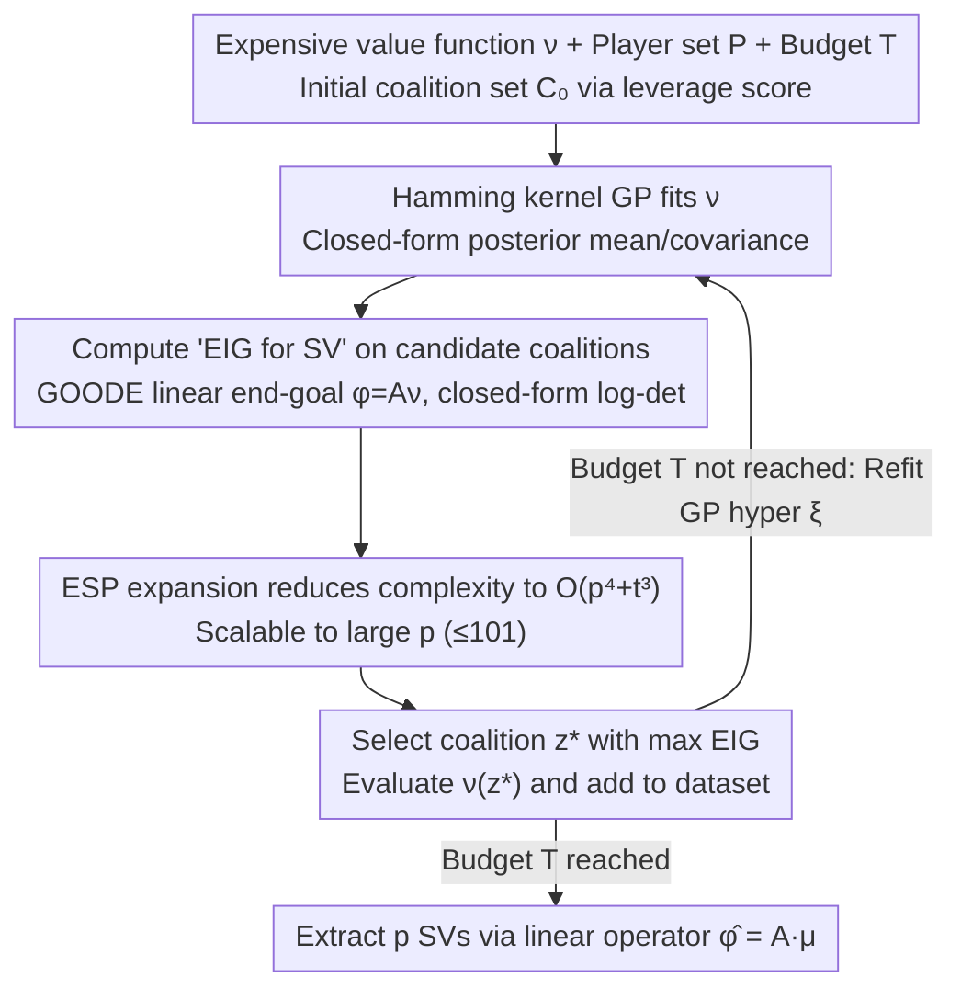

# ShaplEIG: Bayesian Experimental Design for Shapley Value Estimation

**Conference**: ICML 2026  
**arXiv**: [2606.02247](https://arxiv.org/abs/2606.02247)  
**Code**: Yes (In Appendix D.1.5 of the paper, public repository)  
**Area**: Explainable Machine Learning / Shapley Value Estimation / Bayesian Experimental Design  
**Keywords**: Shapley Value, Bayesian Experimental Design, EIG, Gaussian Process, Hamming Kernel

## TL;DR
On expensive games where the evaluation budget is extremely limited (e.g., requiring model retraining), this work utilizes a Gaussian Process (GP) with a Hamming kernel as a surrogate for the value function. It adaptively selects the next coalition based on the "Expected Information Gain (EIG) relative to the Shapley values" and reduces the EIG computation complexity from $O(4^p t)$ to $O(p^4 + t^3)$.

## Background & Motivation

**Background**: The Shapley Value (SV) is the most widely used axiomatic attribution measure in explainable ML. However, exact computation requires enumerating $2^p$ coalitions and calling the value function $\nu(S)$ for each. Existing methods generally fall into two categories: (1) Monte Carlo methods (Permutation sampling, MSR, SVARM) which sample coalitions from a **fixed preset distribution**; (2) Surrogate regression methods (Kernel SHAP, Leverage SHAP, Regression MSR) which fit a surrogate and then extract the SV, where coalitions are also sampled from a fixed distribution.

**Limitations of Prior Work**: When the value function itself is expensive—such as TabPFN feature importance (requiring in-context inference reruns), Ghorbani-Zou style data valuation (requiring RF/GB retraining), HyperSHAP hyperparameter importance (requiring HPO rounds), or local explanations for large vision models (requiring API costs)—the budget may be as low as a few hundred evaluations. Fixed distribution sampling wastes precious query budget on samples that provide "homogeneous information" compared to previous coalitions.

**Key Challenge**: While "adaptive coalition selection" is a natural solution, EIG under the BED framework typically lacks a closed-form solution. Standard EIG on GPs often targets the uncertainty of the surrogate **itself** (e.g., uncertainty sampling, US) rather than the downstream SV. Furthermore, even with a criterion, brute-force traversal over $2^p$ coalitions remains exponential.

**Goal**: (i) Deriving a closed-form for the "EIG relative to SV"; (ii) Reducing EIG computation from $O(4^p t)$ to polynomial in $p$; (iii) Outperforming SOTA sampling/surrogate methods in low-budget regimes.

**Key Insight**: SV is a **linear transformation** of the value function $\phi=A\nu$ (linearity axiom of Shapley). By reframing "coalition selection with a focus on SV" within the framework of **Bayesian Linear Inverse Problems + Goal-Oriented OED (GOODE)**, the EIG depends only on the GP posterior covariance rather than specific observations, yielding a closed-form: $-\tfrac12 \log\det(A\Sigma_{\nu\mid y}A^\top)+C$.

**Core Idea**: Use a Hamming kernel GP as a surrogate + formulate SV as a linear end-goal to derive closed-form EIG + utilize Elementary Symmetric Polynomials (ESP) to expand the multiplicative structure of the Hamming kernel, making EIG computable in polynomial time.

## Method

### Overall Architecture
ShaplEIG recasts the challenge of enumerating $2^p$ coalitions into a greedy Bayesian Adaptive Design (BAD) loop: using a probabilistic surrogate to fit the expensive value function $\nu$, and at each round asking "which coalition evaluation best reduces uncertainty regarding the SV," spending the limited budget precisely. Given player set $P=\{1,\dots,p\}$, value function $\nu:2^P\to\mathbb{R}$, an initial set $\mathcal{C}_0$ ($T_0=p+1$ samples) via leverage score sampling, and budget $T$ (tested $\le 512$), each round selects the coalition with the maximum expected information gain $\mathrm{EIG}^{(t)}_\phi$ from a candidate pool. The function $\nu$ is then evaluated, $(z,\nu(z))$ is added to the dataset, and surrogate hyperparameters are retrained. Finally, all $p$ SVs are extracted from the posterior mean using a linear operator $\hat\phi = A\mu_{\nu\mid\mathcal{D}_{T+1}}$.

### Key Designs

**1. Hamming Kernel GP Surrogate: Enabling Outcome-Adaptive Design**
Classic Kernel SHAP uses a linear surrogate with fixed weights, where posterior uncertainty depends only on "which coalitions were chosen" and not on the actual observed $\nu$ values, making the design non-adaptive. ShaplEIG adopts a Gaussian Process defined on the binary coalition space $\{0,1\}^p$ using a weighted Hamming kernel: $k_\xi(z,z')=\prod_{j=1}^p \xi_j^{\mathbb{1}[z_j\ne z'_j]}$, where each player has a learnable weight $\xi_j$. For a fixed $\xi$, $\nu(Z)\mid\mathcal{D}_t,\xi$ is a $2^p$-dimensional multivariate Gaussian with closed-form posterior moments, providing well-calibrated uncertainty even in low-data regimes. Crucially, $\xi$ is retrained each round, allowing historical $\nu$ values to influence future EIG via kernel hyperparameters, making the design truly outcome-adaptive. The multiplicative structure of the Hamming kernel is also the prerequisite for the ESP expansion that achieves $O(p^4)$ complexity.

**2. Treating SV as a Linear End-Goal in GOODE for Closed-form EIG**
Calculating EIG directly on the untransformed $\nu$ (standard ITL) in a GP setting degenerates into simple uncertainty sampling (US)—selecting coalitions where the surrogate is most uncertain, regardless of its impact on the target $\phi$. ShaplEIG leverages the linearity axiom $\phi=A\nu$ (where $A\in\mathbb{R}^{p\times 2^p}$ consists of elements $\frac{\mathbb{1}_S}{p}\binom{p-1}{|S|-1}^{-1} - \frac{1-\mathbb{1}_S}{p}\binom{p-1}{|S|}^{-1}$) to frame the problem within Goal-Oriented Optimal Experimental Design (GOODE). Here, SV is a linear projection of the parameters $\nu$. Consequently, EIG depends only on the posterior covariance, yielding a closed-form: $\mathrm{EIG}_\phi(z^{(i)}) \propto C' + \log[e_i^\top(\Sigma_{\nu\mid\mathcal{D}_t}+\sigma_\epsilon^2 I)e_i] - \log[e_i^\top(\Sigma_{\nu\mid\mathcal{D}_t}+\sigma_\epsilon^2 I - Q)e_i]$, where $Q_{i,i}=(A\Sigma_{\nu\mid\mathcal{D}_t}e_i)^\top (A\Sigma_{\nu\mid\mathcal{D}_t}A^\top)^{-1}(A\Sigma_{\nu\mid\mathcal{D}_t}e_i)$. This specialization of the GOODE result (Attia 2018) to the SV setting replaces nested MC estimation with a single log-det, ensuring the criterion targets the SV rather than the surrogate.

**3. Complexity Reduction from $O(4^p t)$ to $O(p^4 + t^3)$ via ESP**
The closed-form EIG is theoretically elegant but a naive implementation requires constructing the $2^p\times 2^p$ covariance $\Sigma_{\nu\mid\mathcal{D}_t}$, which is $O(4^p t)$. Theorem B.1/B.2 in the paper rewrites the linear term $AK_\xi(Z,z^{(i)})\in\mathbb{R}^p$ and the quadratic term $AK_\xi(Z,Z)A^\top\in\mathbb{R}^{p\times p}$ as sums of weighted kernel evaluations across coalitions. By observing that many evaluations share weights, these sums are mapped to unary and binary Elementary Symmetric Polynomials (ESP). This reduces the complexity of these terms to $O(p^2)$ and $O(p^4)$ respectively, resulting in a total complexity of $O(p^4+t^3+|W|t^2)$ after vectorizing candidates. This breakthrough enables application to scales as large as $p=101$ (LE on Crime data), relying entirely on the multiplicative structure of the Hamming kernel $k(z,z')=\prod_j\xi_j^{\mathbb{1}[\cdot]}$.

### Loss & Training
GP hyperparameters $\xi$ are retrained every round (or per a refit schedule for large $p$) using MAP optimization of the posterior $p(\xi\mid\mathcal{D}_{t+1})$. This is the primary channel for historical observations to feedback into the design. While function evaluation is assumed to have Gaussian noise $\epsilon\sim\mathcal{N}(0,\sigma_\epsilon^2)$, the paper notes consistency under a noiseless GP: if all $2^p$ coalitions were evaluated, the interpolation property $\mu_{\nu(z)\mid\mathcal{D}_{2^p+1}}=\nu(z)$ ensures $\mu_\phi=\phi(\nu)$, making the estimator **constructively consistent**.

## Key Experimental Results

Experiments used 15 games across 4 categories with player counts $p\in[8,101]$, across 30 or 100 seeds. Baselines were given equivalent $\nu$ evaluation budgets.

### Main Results

| Task Category | Representative Game | $p$ | ShaplEIG vs SOTA (Low-budget MSE) |
|---------------|---------------------|-----|-----------------------------------|
| FI (TabPFN) | Diabetes Reg. | 10 | Strictly superior to Kernel/Leverage SHAP, Perm. Sampling, Reg. MSR |
| DV (RF on Bike Sharing) | Bike Sharing | 10 | Significant lead over all baselines by multiple orders of magnitude |
| HPI (XGBoost on Chess) | Chess | 16 | Competitive with Reg. MSR early, then leads in low MSE regimes |
| LE (ViT 16-patch) | ImageNet | 16 | Superior to all competitors throughout |
| LE (RF on Crime, large $p$) | Crime | 101 | Scalable and eventually leading despite schedule-based refitting |

### Ablation Study

| Configuration | Key Finding |
|---------------|-------------|
| Full ShaplEIG | Best overall performance. |
| GP + Random sampling | Outperformed by ShaplEIG by a large margin on most games. |
| GP + Leverage Score Sampling | Occasionally competitive, but consistently surpassed by ShaplEIG. |
| GP + Uncertainty Sampling (US) | **Worse than GP+Random**, proving standard US is unsuitable for SV estimation. |
| ShaplEIG (Large $p\ge 60$) | Slightly slower start compared to weak baselines, but overtakes later. |

### Key Findings
- Strong performance is not solely due to the GP surrogate—the fact that GP+Random/Leverage/US are beaten by ShaplEIG proves that EIG-based selection is the core contribution.
- US performs poorly because it targets surrogate uncertainty while ignoring impact on the downstream $\phi$, highlighting the necessity of the GOODE formulation.
- Computational Overhead: For $p\le 16$, hyperparameter refitting takes $\le 2$ mins/round, EIG takes $<1$s. For $p\approx 100$, refitting takes $\le 25$ mins/round, EIG $\le 30$s. **Refitting is the bottleneck**, making ShaplEIG ideal when $\nu$ itself is the dominant cost (e.g., training a model).

## Highlights & Insights
- **SV as an "End-goal"**: Directly contradicts the naive view that "better surrogate accuracy automatically leads to better SV accuracy." Proving EIG for $\nu$ is just US, whereas EIG for $A\nu$ is a superior criterion for SV.
- **Hamming Kernel + ESP Synergy**: The structure $\prod_j \xi_j^{\mathbb{1}[\cdot]}$ allows the weighted sum of kernels across player subsets to map exactly to ESPs, converting exponential complexity to polynomial. This is uniquely suited for the Hamming kernel.
- **Constructive Consistency**: Unlike Regression MSR which requires residual correction for consistency, ShaplEIG is inherently consistent in the noiseless GP case.

## Limitations & Future Work
- Computational cost of GP refitting: For $p>100$, the overhead (minutes to hours) makes the method practical only when $\nu$ is significantly more expensive.
- Reliance on pre-computed games: Evaluation mainly used cached tables; end-to-end tests on real-time training of large models (LLMs/Diffusion) are not yet fully stress-tested.
- Future directions: (i) Amortized or lazy hyperparameter refitting; (ii) Batch BED for multi-coalition selection; (iii) Extension to higher-order Shapley interaction indices.

## Related Work & Insights
- **vs Kernel SHAP / Regression MSR**: These use fixed distributions; ShaplEIG is outcome-adaptive and inherently consistent.
- **vs BayesSHAP (Slack 2021)**: BayesSHAP uses Bayesian linear models + US. ShaplEIG upgrades to GP (for outcome-adaptivity) and EIG for SV (overcoming US limitations).
- **vs GP+BQ for SV**: Prior GP approaches typically defined kernels on permutations and were non-adaptive; ShaplEIG's kernel operates on coalition space and targets joint SV uncertainty adaptively.

## Rating
- Novelty: ⭐⭐⭐⭐⭐ Framing SV estimation as GOODE and providing $O(p^4)$ calculation via ESP is highly original.
- Experimental Thoroughness: ⭐⭐⭐⭐ Coverage across multiple game types and ablation studies is strong; real-world "live" evaluation on expensive models would be better.
- Writing Quality: ⭐⭐⭐⭐ Clear logical flow; however, core proofs in the appendix make the main text somewhat dense.
- Value: ⭐⭐⭐⭐ Provides a SOTA estimator for expensive game scenarios with a clear interface for reuse in similar linear functional problems (Sobol indices, etc.).

<!-- RELATED:START -->

## Related Papers

- [\[ICLR 2026\] SEED-SET: Scalable Evolving Experimental Design for System-level Ethical Testing](../../ICLR2026/interpretability/seed-set_scalable_evolving_experimental_design_for_system-level_ethical_testing.md)
- [\[ICML 2026\] Verified SHAP: 神经网络精确 Shapley 值的可证明界](verified_shap_provable_bounds_for_exact_shapley_values_of_neural_networks.md)
- [\[ICML 2026\] Prototype Transformer: Towards Language Model Architectures Interpretable by Design](prototype_transformer_towards_language_model_architectures_interpretable_by_desi.md)
- [\[ICML 2026\] Dual Mechanisms of Value Expression: Intrinsic vs. Prompted Values in Large Language Models](dual_mechanisms_of_value_expression_intrinsic_vs_prompted_values_in_large_langua.md)
- [\[ICML 2026\] Neural Collapse by Design: Learning Class Prototypes on the Hypersphere](neural_collapse_by_design_learning_class_prototypes_on_the_hypersphere.md)

<!-- RELATED:END -->
