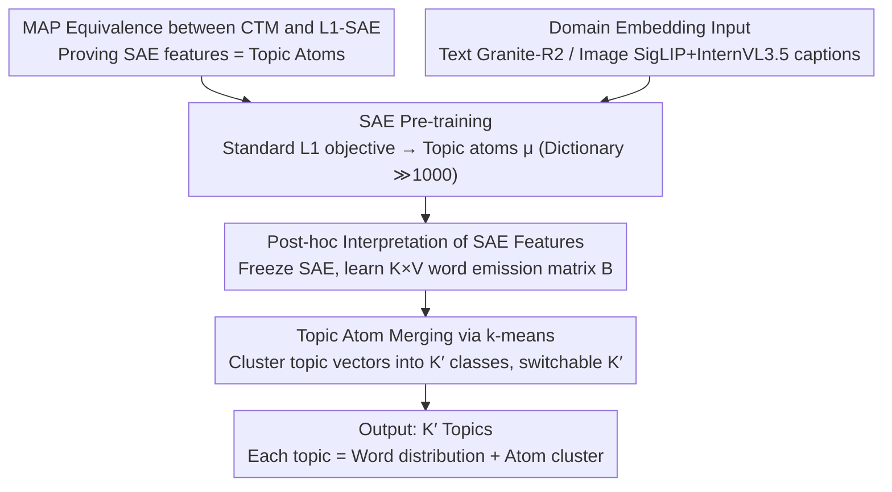

# Sparse Autoencoders are Topic Models

**Conference**: ICML 2026  
**arXiv**: [2511.16309](https://arxiv.org/abs/2511.16309)  
**Code**: https://github.com/ExplainableML/SAE-TM (Available)  
**Area**: Interpretability / Representation Learning  
**Keywords**: Sparse Autoencoders, Topic Models, LDA, Continuous Topic Models, Embedding Interpretation

## TL;DR
This paper proves that the $L_1$ objective of Sparse Autoencoders (SAE) is exactly the MAP estimation of an LDA-style "Continuous Topic Model" (CTM) under the limit of high activity and small contribution. Based on this, the SAE-TM framework is proposed: pre-training SAEs to obtain reusable topic atoms, learning word distributions post-hoc, and merging them into an arbitrary number of topics via clustering. Topic coherence on text and image datasets significantly exceeds current mainstream neural topic models.

## Background & Motivation

**Background**: Sparse Autoencoders (SAE) are currently the mainstream tool for analyzing foundation model activations and performing "mechanistic interpretability." The community generally interprets each SAE feature as a monosemantic direction that can be individually "steered." Neural Topic Models (NTM) represent a parallel research line, evolving from LDA and AVITM to FASTopic and TSCTM, primarily targeting text bags-of-words.

**Limitations of Prior Work**: (1) Recent empirical studies on the SAE side consistently find that behavioral steering via a single feature is ineffective and monosemanticity is less stable than linear probes, leading to a lingering controversy over the utility of SAEs. (2) The NTM side is limited by posterior collapse, fixed topic counts, and a focus on text, making generalization to high-dimensional embeddings (like images) difficult. Both lines have issues, but it has not been noted that they are essentially solving the same mathematical problem.

**Key Challenge**: Treating SAE features as "steerable monosemantic directions" is an over-interpretation—SAE-learned features are more like "topic components," and a single feature does not constitute an independent causal mechanism. This explain why steering often fails. However, a unified probabilistic model to formalize this intuition is lacking.

**Goal**: (1) Provide a principled explanation of SAEs from a generative model perspective; (2) Operationalize this explanation into a topic modeling framework comparable with NTMs; (3) Demonstrate its practical value in analyzing large-scale cross-modal (text + image) datasets.

**Key Insight**: It is observed that the "linear superposition of activations to reconstruct embeddings" in SAEs is structurally isomorphic to the "linear mixture of topics to generate bags-of-words" in LDA—the difference being the observation domain (continuous embeddings instead of discrete words). The authors construct a continuous generalization of LDA in the embedding space to derive the SAE objective.

**Core Idea**: Define a Continuous Topic Model (CTM) where each embedding is a linear combination of topic directions $\mu_k$ plus Gaussian noise. Under the asymptotic limit of "high activity, small contribution," the $L_1$-SAE loss is the MAP objective of the CTM. Thus, SAE features are essentially "topic atoms"; multiple small activities must be aggregated to explain an embedding, and a single atom should not be expected to have controllable behavior.

## Method

### Overall Architecture

The paper first theoretically proves that SAEs are a class of topic models—the $L_1$-SAE loss is equivalent to the MAP objective of an LDA-style "Continuous Topic Model" (CTM). This conclusion is then implemented as the SAE-TM framework. SAE-TM completely decouples "representation learning" from "interpretation": it pre-trains an SAE on large-scale embeddings with a standard $L_1$ objective to obtain reusable "topic atoms" (decoder column vectors $\mu_k$, expansion factor 4, dictionary $\gg 1000$). For downstream tasks, the SAE is frozen, a word emission matrix is learned post-hoc to translate each feature into a word distribution, and $k$-means is used to merge fine-grained atoms into any target number of topics $K'$. The input is a set of domain embeddings $\{D_i\}$ (Granite-R2 for text, SigLIP for images with InternVL3.5 generated captions), and the output is $K'$ topics, each being a word distribution corresponding to a cluster of atoms.

### Key Designs

**1. MAP Equivalence between CTM Generative Model and $L_1$-SAE: Mapping Empirical Loss back to Generative Priors**

SAEs have long been treated as black boxes—it is known that "$L_1$ sparsity + squared reconstruction" works, but it is unclear what it estimates. This paper constructs CTM as a continuous extension of LDA: a document embedding $D=\epsilon+\sum_{i=1}^N\lambda_i c_i$ is a linear superposition of contributions, where each contribution selects a topic $z_n\sim\mathrm{Cat}(\theta)$, emits a direction $w_n\sim\mathcal{N}(\mu_{z_n},\Sigma_{z_n})$, and assigns an intensity $\lambda_n\sim\mathrm{Ga}_{z_n}$, with document-level mixtures $\theta\sim\mathrm{Dir}(\alpha)$. Under the asymptotic limit of "high activity, small contribution" ($\rho_d\to\infty,\alpha_0\to 0,\rho_d\alpha_0\to\kappa$) and $\Sigma_k\to 0$ (contributions aligning with topic directions), the aggregated intensity per topic converges to $S_k\Rightarrow\mathrm{Ga}(\kappa\theta_k,\beta)$. Reparameterizing intensity as $a_k=s\theta_k$, the observation model simplifies to $D\mid a\sim\mathcal{N}(Wa,\sigma^2 I)$. Its negative log-posterior at $\kappa=1,\alpha_k=1$ is exactly the $L_1$-SAE loss from Bricken et al.: $\mathcal{L}(a)=\frac{1}{2\sigma^2}\lVert D-Wa\rVert_2^2+\beta\lVert a\rVert_1$ (Hard-sparse SAEs like TopK/BatchTopK can be included by changing assumption (A1) to a hard-support constraint). This derivation provides a principled probabilistic interpretation of SAEs and explains why single-feature steering fails—SAE features are components of $\theta$ ("topic components") rather than independent causal directions.

**2. Post-hoc Interpretation of SAE Features: Grafting to NTM Evaluation via a Word Emission Matrix**

SAEs operate in the embedding space, while NTMs define "topics" as word distributions. Standard metrics like intruder detection or coherence rating cannot be directly applied. This paper freezes the SAE and learns a $K\times V$ word emission matrix $\mathbf{B}$ to define the bag-of-words likelihood $P(D)=\prod_{w_i\in D}\pi P_0(w_i)+(1-\pi)\sum_k B_{k,i}\cdot\theta_k$, where $\theta_k$ is the normalized activation of the $k$-th SAE feature on document embedding $\mathbf{D}$ (following the $a_k=s\theta_k$ decomposition), and $P_0$ is an unconditional unigram prior to absorb high-frequency non-topical words ($\pi=0.3$). During training, words are weighted by normalized IDF $\log(N/\mathrm{df}(w_i))$ to prevent common words from dominating. This lightweight alignment layer allows a single pre-trained "foundation SAE" to be reused for any small downstream dataset by only relearning $\mathbf{B}$.

**3. Topic Atom Merging via $k$-means: Flexible Post-hoc Topic Count Switching**

SAEs typically have $\gg 1000$ atom-level features, much finer than the 50–500 topics usual for NTMs. This paper calculates a topic vector $\mathbf{T}_k=\sum_{w_i\in\mathcal{V}}B_{k,i}\mathbf{w}_i$ for each feature using the learned $\mathbf{B}$ (where $\mathbf{w}_i$ is a word2vec/GloVe vector, or an SAE decoder column if unavailable) and denoises via top-$p=0.9$ truncation. Then, $k$-means is run on $\{\mathbf{T}_k\}$ to form $K'$ clusters. Finally, word distributions of features in the same cluster are merged as $P_{k'}(w_i)=\sum_{k:c_k=k'}P(w_i\mid\theta_k)P(k)/\sum_{k:c_k=k'}P(k)$, weighted by feature prior $P(k)=\bar{\theta}_k$. This allows $K'$ to be adjusted freely without retraining the SAE, and cluster boundaries provide signals for visualizing topic similarities.

### Loss & Training
SAE training uses $L_1$ penalty (coefficient 2), expansion factor 4 ($K\approx 3072$), batch size 1000, 50k steps, lr=0.001. Learning $\mathbf{B}$ takes 50–200 epochs at lr=0.01. Training an SAE on 50M Twitter embeddings takes ~10 minutes, and interpretation takes ~15 minutes on a single GPU.

## Key Experimental Results

### Main Results

Comparison with 8 NTM baselines across five text datasets (News-20K / IMDB / Yelp / DailyMail / Twitter, embeddings via Granite-R2) at different topic counts (averages across datasets):

| Topics | Metric | SAE-TM | TSCTM (Next Best) | AVITM/CombinedTM |
|--------|------|--------|------------------|------------------|
| 50  | $C_I$ / $C_R$ | **54.31 / 77.25** | 44.61 / 69.75 | 38.72 / 70.24 |
| 100 | $C_I$ / $C_R$ | **51.48 / 78.01** | 35.81 / 58.53 | 38.49 / 67.37 |
| 300 | $C_I$ / $C_R$ | **43.50 / 74.22** | 26.17 / 27.40 | 33.38 / 65.67 |
| 500 | $C_I$ / $C_R$ | **40.49 / 71.22** | 21.68 / 17.67 | 31.79 / 50.77 |

SAE-TM ranks first in $C_I$ (intruder detection) and $C_R$ (coherence rating) across all topic counts, with only slight degradation as $K$ increases. TSCTM's $C_R$ crashes from 69.75 to 17.67 at 500 topics. Diversity $D$ for SAE-TM remains stable in second place.

Results on three image datasets (CIFAR100 / Food101 / SUN397, using SigLIP embeddings + InternVL3.5 captions):

| Topics | Metric | SAE-TM | TSCTM | CombinedTM | FASTopic |
|--------|------|--------|-------|------------|----------|
| 50  | $C_I$ / $C_R$ | **42.57 / 85.05** | 40.51 / 80.40 | 42.30 / 79.39 | 34.44 / 69.56 |
| 200 | $C_I$ / $C_R$ | **38.59 / 85.53** | 34.69 / 72.61 | 23.16 / 30.80 | 32.28 / 68.14 |
| 500 | $C_I$ / $C_R$ | **36.54 / 84.43** | 25.28 / 39.81 | 20.29 / 26.56 | 31.05 / 67.27 |

On images, $C_R$ remains stable at 84+, making SAE-TM the only method that does not decay with topic count.

### Ablation Study

| Config | Key Phenomenon | Description |
|------|----------|------|
| $N=500$ vs. $N=5$ | Embedding distribution is a smooth Gaussian cloud at high $N$, vs. grid-like at low $N$. | Validates (A1): SAE's continuous $L_2$ loss only matches discrete topic mixtures in the small contribution limit. |
| Topics 50 → 500 | SAE-TM $C_R$ drops ~6 pts; TSCTM drops ~52 pts. | Merging does not destroy atoms; increased granularity doesn't break coherence. |
| ImageNet vs. CC3M/CC12M/YFCC | ImageNet scores much higher on categories like "Fluffy Animals." | Matches ImageNet's class-balanced design; SAE-TM reflects dataset construction. |
| Japanese Ukiyo-e (7 periods) | "Domestic Scene" peaks in Edo golden age; "Vibrant Garment" higher in Edo/Meiji. | Trends align with cultural history, demonstrating utility in digital humanities. |

### Key Findings
- **Theory-Practice Loop**: Assumption (A1) (high activity, small contribution) is not just a mathematical trick—sampling visualization confirms that discrete topic mixtures only smooth into the Gaussian reconstruction loss under this limit, explaining why low-sparsity SAE training is unstable.
- **Scalability of Topic Counts**: Traditional NTMs collapse when the topic count increases because capacity is fixed during training. SAE-TM avoids this by first learning atomic features and then using $k$-means; increasing topics merely changes clustering, preserving atom quality.
- **New Paradigm for Image Topic Modeling**: Previously, NTMs mainly consumed bags-of-words. This work establishes the feasibility of "embedding-direct topic modeling," positioning SAEs for large-scale visual dataset auditing.

## Highlights & Insights
- **First proof of SAE objective as a Topic Model MAP estimation**: Previous discussions were analogies; this provides a rigorous derivation from CTM to $L_1$-SAE, a paradigm that could extend to other sparse dictionary learning methods like NMF.
- **Decoupling representation from interpretation via "Topic Atoms + Post-hoc Merging"**: This "foundation representation + lightweight interpretation" paradigm mirrors foundation models in CV/NLP, applying it to topic modeling which previously required end-to-end retraining.
- **Positional shift for the SAE community**: The authors clarify that SAEs are unsuitable for single-feature steering but excellent for large-scale topic/dataset auditing, potentially shifting the evaluation focus from individual monosemanticity to collective distribution behavior.

## Limitations & Future Work
- **Limitations**: (1) SAE feature interpretation quality still has room for improvement; activation strength is not always aligned with topic importance. (2) Embeddings encode non-topic info (style, length), which SAE-TM might inadvertently capture. (3) The independence assumption (A3) excludes hierarchical SAEs like Matryoshka models.
- **Identified Limitations**: Image diversity $D$ is relatively weak; current word emission learning only uses bag-of-words likelihood and does not exploit SAE-specific attention patterns.
- **Improvements**: Modeling hierarchical SAEs as hierarchical CTMs for adaptive granularity topics; using visual prompts + MLLMs to supplement the caption-based word emission path.

## Related Work & Insights
- **vs FASTopic / CombinedTM**: These also use embeddings but are trained as new probabilistic models. SAE-TM leverages existing SAE dictionaries, essentially substituting ELBO with MAP, avoiding posterior collapse and supporting dynamic topic counts.
- **vs Zheng et al. 2025**: They treat SAE features as tokens for an existing NTM. This paper proves a stronger proposition: the SAE *is* the topic model, removing the need for an external NTM.
- **vs Bricken et al. 2023 / Mainstream Interpretability**: The mainstream narrative focuses on "steerable monosemantic directions." This paper provides a counter-narrative—SAEs learn topic components where collective analysis, rather than individual steering, is the primary strength.

## Rating
- Novelty: ⭐⭐⭐⭐⭐ First MAP equivalence proof between $L_1$-SAE and CTM.
- Experimental Thoroughness: ⭐⭐⭐⭐ Solid coverage across 8 datasets and 8 baselines; lacks direct comparison with mechanistic steering tasks.
- Writing Quality: ⭐⭐⭐⭐⭐ Clear derivation and excellent use of visualization to verify theoretical assumptions.
- Value: ⭐⭐⭐⭐⭐ Significant impact for both the interpretability and topic modeling communities.

<!-- RELATED:START -->

## Related Papers

- [\[ICML 2026\] On the Relationship Between Activation Outliers and Feature Death in Sparse Autoencoders](on_the_relationship_between_activation_outliers_and_feature_death_in_sparse_auto.md)
- [\[ICML 2026\] PolySAE: Modeling Feature Interactions in Sparse Autoencoders via Polynomial Decoding](polysae_modeling_feature_interactions_in_sparse_autoencoders_via_polynomial_deco.md)
- [\[ICML 2026\] Ensembling Sparse Autoencoders](ensembling_sparse_autoencoders.md)
- [\[ICLR 2026\] Toward Faithful Retrieval-Augmented Generation with Sparse Autoencoders](../../ICLR2026/interpretability/toward_faithful_retrieval-augmented_generation_with_sparse_autoencoders.md)
- [\[ICLR 2026\] Temporal Sparse Autoencoders: Leveraging the Sequential Nature of Language for Interpretability](../../ICLR2026/interpretability/temporal_sparse_autoencoders_leveraging_the_sequential_nature_of_language_for_in.md)

<!-- RELATED:END -->
