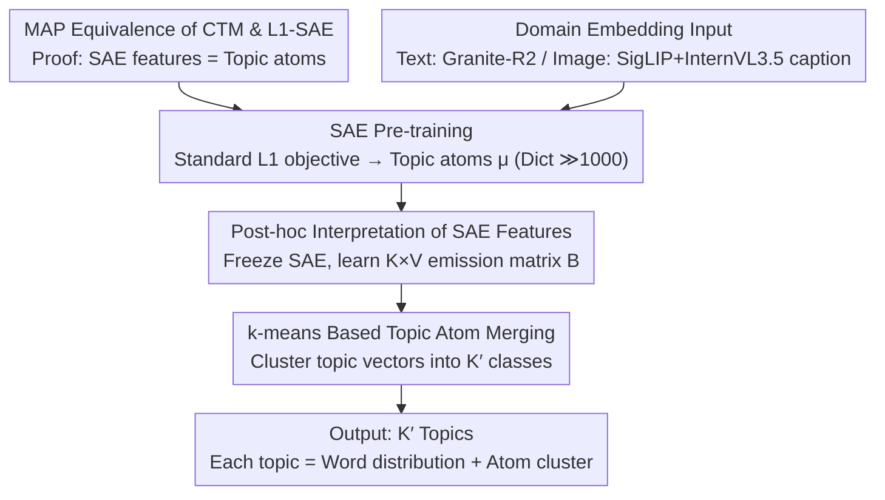

# Sparse Autoencoders are Topic Models

**Conference**: ICML 2026  
**arXiv**: [2511.16309](https://arxiv.org/abs/2511.16309)  
**Code**: https://github.com/ExplainableML/SAE-TM (Available)  
**Area**: Interpretability / Representation Learning  
**Keywords**: Sparse Autoencoders, Topic Models, LDA, Continuous Topic Models, Embedding Interpretation

## TL;DR
This paper proves that the $L_1$ objective of a Sparse Autoencoder (SAE) is precisely the MAP estimate of an LDA-style "Continuous Topic Model" (CTM) in the limit of high activity and small contributions. Based on this, the authors propose the SAE-TM framework: pre-training SAEs to obtain reusable topic atoms, post-hoc learning word distributions, and merging atoms into any number of topics via clustering. Topic coherence on text and image datasets significantly outperforms current mainstream neural topic models.

## Background & Motivation

**Background**: Sparse Autoencoders (SAEs) are currently the primary tools for analyzing foundation model activations and performing "mechanistic interpretability." The community generally interprets each SAE feature as a "monosemantic direction" that can be individually steered. Neural Topic Models (NTMs), a parallel line of research (evolving from LDA/AVITM to FASTopic/TSCTM), primarily target text bags-of-words.

**Limitations of Prior Work**: (1) Recent empirical studies on SAEs consistently find that behavioral steering using individual features is often ineffective and less stable than linear probes, leading to debates over the actual utility of SAEs. (2) NTMs are limited by posterior collapse, fixed topic counts, and a near-exclusive focus on text, making them difficult to generalize to high-dimensional embeddings such as images. While these two fields face distinct challenges, none have noted that they essentially solve the same mathematical problem.

**Key Challenge**: Treating SAE features as "steerable monosemantic directions" is an over-interpretation. SAE features function more like "topic components," where a single feature does not constitute an independent causal mechanism; this explains why steering often fails. However, a unified probabilistic model to formalize this intuition has been lacking.

**Goal**: (1) Provide a principled explanation for SAEs from the perspective of generative models. (2) Operationalize this explanation into a topic modeling framework comparable with NTMs. (3) Demonstrate its practical value in analyzing large-scale cross-modal (text + image) datasets.

**Key Insight**: The paper observes a structural isomorphism between the "linear superposition of activations to reconstruct embeddings" in SAEs and the "linear mixture of topics to generate bags-of-words" in LDA. The primary difference is the observation domain (discrete words vs. continuous embeddings). Following this isomorphism, the authors construct a continuous extension of LDA in the embedding space and derive the SAE objective from it.

**Core Idea**: By defining a Continuous Topic Model (CTM) where each embedding is a linear combination of topic directions $\mu_k$ plus Gaussian noise, it is shown that under the asymptotic limit of "high activity and small contributions," the $L_1$-SAE loss is the MAP objective of the CTM. Consequently, SAE features are essentially "topic atoms." Multiple small activities must be aggregated to explain an embedding; individual features should not be expected to exhibit independent controllable behavior.

## Method

### Overall Architecture

The paper theoretically proves that SAEs are a class of topic models—showing the $L_1$-SAE loss is equivalent to the MAP objective of an LDA-style "Continuous Topic Model" (CTM). This conclusion is implemented as the SAE-TM framework. SAE-TM decouples "representation learning" from "interpretation": first, an SAE is pre-trained on large-scale embeddings with a standard $L_1$ objective to obtain reusable "topic atoms" (decoder column vectors $\mu_k$, expansion factor 4, dictionary $\gg 1000$). For downstream tasks, the SAE is frozen, and an additional word emission matrix is learned to translate each feature into a word distribution. Finally, $k$-means is used to merge fine-grained atoms into any target number of topics $K'$. The pipeline takes domain embeddings $\{D_i\}$ (Granite-R2 for text, SigLIP for images with InternVL3.5 captions) and outputs $K'$ topics, each represented by a word distribution and a cluster of atoms.

### Key Designs

**1. MAP Equivalence of CTM and $L_1$-SAE: Grounding Empirical Loss in Generative Priors**

SAEs have long been treated as black boxes—it is known that "$L_1$ sparsity + squared reconstruction" works, but its probabilistic interpretation was unclear. This paper constructs a continuous extension of LDA called CTM: document embedding $D=\epsilon+\sum_{i=1}^N\lambda_i c_i$ is a linear superposition of contributions. Each contribution selects a topic via $z_n\sim\mathrm{Cat}(\theta)$, selects a direction via $w_n\sim\mathcal{N}(\mu_{z_n},\Sigma_{z_n})$, and a strength via $\lambda_n\sim\mathrm{Ga}_{z_n}$, with document-level mixing $\theta\sim\mathrm{Dir}(\alpha)$. Under the asymptotic limit of "high activity and small contributions" ($\rho_d\to\infty,\alpha_0\to 0,\rho_d\alpha_0\to\kappa$) and $\Sigma_k\to 0$, the aggregate strength per topic converges to $S_k\Rightarrow\mathrm{Ga}(\kappa\theta_k, \beta)$. Reparameterizing strength as $a_k=s\theta_k$, the observation model simplifies to $D\mid a\sim\mathcal{N}(Wa,\sigma^2 I)$. Its negative log-posterior at $\kappa=1,\alpha_k=1$ is exactly the $L_1$-SAE loss from Bricken et al.: $\mathcal{L}(a)=\frac{1}{2\sigma^2}\lVert D-Wa\rVert_2^2+\beta\lVert a\rVert_1$. (Hard-sparsity SAEs like TopK/BatchTopK fit this framework by replacing the prior with hard-support constraints). This derivation provides a principled probabilistic explanation for SAEs and clarifies why single-feature steering fails: SAE features are components of $\theta$, not independent causal directions.

**2. Post-hoc Interpretation of SAE Features: Mapping to NTM Evaluation via Word Emission Matrices**

SAEs operate on embeddings, while NTMs define topics as word distributions. To compare them, the authors freeze the SAE and learn a $K\times V$ word emission matrix $\mathbf{B}$, defining the bag-of-words likelihood as $P(D)=\prod_{w_i\in D}\pi P_0(w_i)+(1-\pi)\sum_k B_{k,i}\cdot\theta_k$. Here, $\theta_k$ is the normalized activation of the $k$-th SAE feature on embedding $\mathbf{D}$, and $P_0$ is an unconditional unigram prior ($\pi=0.3$) to absorb non-topical high-frequency words. Training uses normalized IDF weights $\log(N/\mathrm{df}(w_i))$ to prevent common words from dominating. Since only a lightweight alignment layer is learned, a "foundational SAE" can be reused across small downstream datasets by merely retraining $\mathbf{B}$.

**3. $k$-means Based Topic Atom Merging: Flexible Post-hoc Topic Count Adjustment**

SAEs typically have $\gg 1000$ atomic features, far finer than the 50–500 topics used in NTMs. The authors first compute topic vectors $\mathbf{T}_k=\sum_{w_i\in\mathcal{V}}B_{k,i}\mathbf{w}_i$ (where $\mathbf{w}_i$ are word2vec/GloVe vectors) and denoise them using top-$p=0.9$ truncation. Then, $k$-means clusters $\{\mathbf{T}_k\}$ into $K'$ classes. Finally, word distributions are merged using weights based on feature priors $P(k)=\bar{\theta}_k$. This allows $K'$ to be adjusted without retraining the SAE, naturally supporting the "one foundational SAE, multiple downstream $K'$" paradigm.

### Loss & Training
SAE training uses $L_1$ penalty (coeff 2), expansion factor 4 ($K\approx 3072$), batch size 1000, 50k steps, lr=0.001. Matrix $\mathbf{B}$ is trained for 50–200 epochs, lr=0.01. Training on 50M Twitter embeddings takes ~10 mins for SAE and ~15 mins for interpretation on a single GPU.

## Key Experimental Results

### Main Results

Comparison on 5 text datasets (News-20K / IMDB / Yelp / DailyMail / Twitter using Granite-R2) across different topic counts (averages shown):

| Topics | Metric | SAE-TM | TSCTM (Best Baseline) | AVITM/CombinedTM |
|--------|------|--------|------------------|------------------|
| 50  | $C_I$ / $C_R$ | **54.31 / 77.25** | 44.61 / 69.75 | 38.72 / 70.24 |
| 100 | $C_I$ / $C_R$ | **51.48 / 78.01** | 35.81 / 58.53 | 38.49 / 67.37 |
| 300 | $C_I$ / $C_R$ | **43.50 / 74.22** | 26.17 / 27.40 | 33.38 / 65.67 |
| 500 | $C_I$ / $C_R$ | **40.49 / 71.22** | 21.68 / 17.67 | 31.79 / 50.77 |

Ours achieves the best $C_I$ (intruder detection) and $C_R$ (coherence rating) across all topic counts, with minimal performance decay. In contrast, NTMs like TSCTM see $C_R$ collapse from 69.75 to 17.67 as topics increase to 500. Diversity remains stable and high.

Image datasets (CIFAR100 / Food101 / SUN397 using SigLIP + InternVL3.5 captions):

| Topics | Metric | SAE-TM | TSCTM | CombinedTM | FASTopic |
|--------|------|--------|-------|------------|----------|
| 50  | $C_I$ / $C_R$ | **42.57 / 85.05** | 40.51 / 80.40 | 42.30 / 79.39 | 34.44 / 69.56 |
| 200 | $C_I$ / $C_R$ | **38.59 / 85.53** | 34.69 / 72.61 | 23.16 / 30.80 | 32.28 / 68.14 |
| 500 | $C_I$ / $C_R$ | **36.54 / 84.43** | 25.28 / 39.81 | 20.29 / 26.56 | 31.05 / 67.27 |

On images, $C_R$ remains stable at 84+, making Ours the only method that does not degrade with increased topic counts.

### Ablation Study

| Configuration | Key Phenomenon | Explanation |
|------|----------|------|
| Limit $N=500$ vs. $N=5$ | Smooth Gaussian cloud at high $N$; grid-like blocks at low $N$ | Validates (A1): SAE's $L_2$ reconstruction matches discrete mixing only in the small-contribution limit |
| Topic count 50 → 500 | SAE-TM $C_R$ drops ~6; TSCTM drops ~52 | Merging does not destroy atoms; increased granularity does not compromise coherence |
| ImageNet vs. Web data | ImageNet shows higher scores for "Fluffy Animals", lower for "Human Interaction" | Reflects ImageNet's class balance design, proving utility for dataset auditing |
| Ukiyo-e Art Periods | "Domestic Scene" peaks in Edo period; "Vibrant Garment" much higher in Edo/Meiji than 20th C | Topic trends align with cultural history, demonstrating digital humanities value |

### Key Findings
- **Theory-Practice Loop**: The CTM assumption (A1) is verified via $N=5$ vs $N=500$ sampling; the "smoothness" required for SAE $L_2$ loss explains why SAEs struggle at extremely high sparsity.
- **Topic Scalability**: Traditional NTMs collapse at high topic counts due to capacity constraints. SAE-TM scales because it merges high-quality atoms; increasing $K'$ only changes the clustering boundary, not atom quality.
- **New Image Topic Modeling Paradigm**: While NTMs usually require BoW inputs, this work demonstrates that image embeddings can be used directly for topic modeling, positioning SAEs as tools for large-scale visual dataset analysis.

## Highlights & Insights
- **First MAP Proof for SAEs**: Moves beyond analogy to show that $L_1$-SAE loss is mathematically derived from a CTM. This paradigm (empirical loss $\leftarrow$ generative prior) can be extended to other dictionary learning methods.
- **Decoupling Representations from Interpretation**: The "Topic Atoms + Merging" approach allows for foundational representation learning that is reusable across different $K'$, vocabularies, and domains with minimal overhead.
- **Correction of SAE Positioning**: It argues that SAEs are fundamentally suited for collective data analysis (topic modeling, dataset auditing) rather than individual feature steering.

## Limitations & Future Work
- **Limitations**: (1) Alignment between activation strength and topic importance is not perfect. (2) Embeddings encode non-topical info (style, length), which SAEs may capture. (3) The independence assumption (A3) precludes hierarchical SAEs.
- **Future Work**: Deriving MAP for hierarchical SAEs to enable adaptive granularity; using MLLMs and visual prompts to replace the caption-based word emission layer for better image interpretation.

## Related Work & Insights
- **vs. FASTopic / CombinedTM**: These require training a new probabilistic model from scratch. SAE-TM uses existing SAE dictionaries, essentially substituting ELBO with MAP, avoiding posterior collapse and enabling dynamic $K'$.
- **vs. Zheng et al. 2025**: They use SAE features as tokens for NTMs. This paper goes further, proving that the SAE *is* the topic model, removing the need for an external NTM.
- **vs. mechanistic interp (Bricken et al. 2023)**: Challenges the dominant "steerable direction" narrative, suggesting that SAEs are more effective for aggregate analysis than causal intervention.

## Rating
- Novelty: ⭐⭐⭐⭐⭐ First proof of MAP equivalence between $L_1$-SAE and CTM.
- Experimental Thoroughness: ⭐⭐⭐⭐ Extensive coverage across modalities and baselines, though direct steering benchmarks are omitted.
- Writing Quality: ⭐⭐⭐⭐⭐ Excellent theoretical derivation and clear corroboration through visualizations.
- Value: ⭐⭐⭐⭐⭐ Significant impact on both the interpretability and topic modeling communities.

<!-- RELATED:START -->

## Related Papers

- [\[ICML 2026\] On the Relationship Between Activation Outliers and Feature Death in Sparse Autoencoders](on_the_relationship_between_activation_outliers_and_feature_death_in_sparse_auto.md)
- [\[ICML 2026\] PolySAE: Modeling Feature Interactions in Sparse Autoencoders via Polynomial Decoding](polysae_modeling_feature_interactions_in_sparse_autoencoders_via_polynomial_deco.md)
- [\[ICLR 2026\] Toward Faithful Retrieval-Augmented Generation with Sparse Autoencoders](../../ICLR2026/interpretability/toward_faithful_retrieval-augmented_generation_with_sparse_autoencoders.md)
- [\[ICLR 2026\] Temporal Sparse Autoencoders: Leveraging the Sequential Nature of Language for Interpretability](../../ICLR2026/interpretability/temporal_sparse_autoencoders_leveraging_the_sequential_nature_of_language_for_in.md)
- [\[ACL 2026\] AdaptiveK: Complexity-Driven Sparse Autoencoders for Interpretable Language Model Representations](../../ACL2026/interpretability/adaptivek_complexity-driven_sparse_autoencoders_for_interpretable_language_model.md)

<!-- RELATED:END -->
