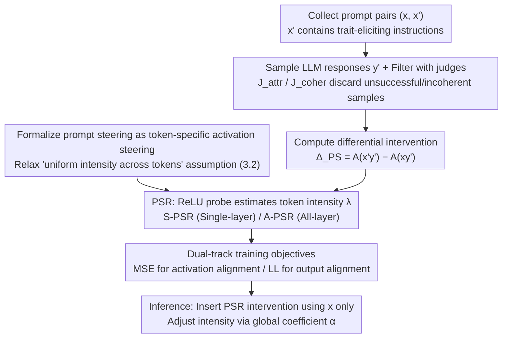

# Steer Like the LLM: Activation Steering that Mimics Prompting

**Conference**: ICML 2026  
**arXiv**: [2605.03907](https://arxiv.org/abs/2605.03907)  
**Code**: <https://github.com/Nokia-Bell-Labs/steer-like-the-llm>  
**Area**: Mechanistic Interpretability / LLM Alignment / Activation Steering  
**Keywords**: activation steering, prompt steering, token-specific coefficients, ReLU probe, PSR

## TL;DR
This paper reinterprets "prompt steering" as a form of activation steering implemented by the LLM itself. It distills activation differences injected by prompts using a **token-specific ReLU probe** to train the PSR (Prompt Steering Replacement) module. PSR outperforms existing steering methods (CAA, ReFT-R1, Stolfo, etc.) across three benchmarks and matches or exceeds prompting performance in AxBench and personality steering.

## Background & Motivation

**Background**: Controlling LLM behavior follows two main paths: (1) prompting / in-context examples; (2) activation steering—adding a fixed vector $\alpha\mathbf z_{attr}$ to the residual stream at a specific layer. The latter is a prominent direction in mechanistic interpretability due to its lighthouse properties: lightweight, robust to prompt injection, and interpretable.

**Limitations of Prior Work**: Despite a long list of methods like ActAdd, CAA, ITI, and ReFT-R1, activation steering **remains systematically weaker than prompting** (repeatedly verified by Wu et al.). The paper presents two visualizations showing that the ground-truth activation difference $\Delta_{PS}$ caused by prompt injection **varies in intensity across different tokens by several orders of magnitude**: some tokens remain almost unchanged, while others are heavily rewritten. All mainstream activation steering methods either use a single constant vector for all tokens or only intervene at the last token, which does not reflect the steering mechanism (prompting) implemented by the LLM itself.

**Key Challenge**: The implicit assumption that "a constant $\alpha\mathbf z$ can replicate prompting behavior" is untenable. Prompting is essentially a **token-specific** non-uniform intervention. Using a constant inevitably leads to trade-offs (either oversteering or understeering).

**Goal**: (a) Explicitly formalize "prompting as a (black-box) activation steering"; (b) distill the differential activations of prompt injection using a simple interpretable model; (c) design the learnable PSR using token-specific coefficients as a first-order necessary condition; (d) systematically outperform baselines while maintaining high coherence.

**Key Insight**: Since the "ground truth intervention" of prompt steering $\Delta_{PS}=\mathbf A^{prompt}-\mathbf A^{base}$ can be **directly computed**, it can be treated as a supervised target. An activation steering module can then be trained as its imitator using MSE.

**Core Idea**: Prompt steering is formulated as $\mathbf A_{y_i'|PS}=\mathbf A_{y_i'}+\alpha\,\lambda(\mathbf A_{y_i'};\theta_{attr})\mathbf z_{attr}$, where $\lambda$ is a **ReLU probe** that decodes token-level intensity from the activations themselves. The training objective is the MSE against prompt-steered activations, resulting in the PSR.

## Method

### Overall Architecture
Training pipeline: (i) Given an attribute $attr$, collect prompt pairs $(x,x')$, where $x'$ includes a trait-eliciting instruction; (ii) Sample responses $y'$ from the LLM on $x'$, filtering unsuccessful or incoherent samples using an attribute judge $J_{attr}$ and coherence judge $J_{coher}$; (iii) Compute $\mathbf A_{y_i'|PS}=\mathrm{LLM}(x'y')$ and $\mathbf A_{y_i'}=\mathrm{LLM}(xy')$, where the difference is the intervention $\Delta_{PS}$; (iv) Train the PSR module (Single-layer or All-layer versions) to approximate prompt-steered activations. Inference: Use only the original prompt $x$, insert the PSR intervention into the forward pass, and use the global coefficient $\alpha$ as an intensity knob.

### Key Designs

**1. Formalizing prompt steering as token-specific activation steering: Translating "adding instructions" into supervised per-token interventions**

Activation steering has long assumed that "a constant vector $\alpha\mathbf{z}$ can replicate prompting," yet this assumption remained unverified. This paper formalizes the activation effect of prompt injection as a layer-wise and token-wise difference $\mathbf A_{l,y_i'|PS}=\mathbf A_{l,y_i'}+\Delta_{PS}(x'y'_{\le i},xy'_{\le i})$ (Eq. 3). It distinguishes between the **accumulated version** $\Delta_{PS_{acc}}$ (relative to a baseline without steering, used for single-layer PSR) and the **local version** $\Delta_{PS_{loc}}$ (relative to a baseline where previous layers were already steered, used for all-layer PSR). Two minimal assumptions are proposed: Hypothesis 3.1 (intervention along a single direction $\mathbf z_{attr}$) and Hypothesis 3.2 (uniform intensity across tokens). Together, these degenerate into existing constant steering (Eq. 2). Visualizations on Llama-3.2-3B sycophancy data demonstrate that Hypothesis 3.2 fails: prompt intensity varies by orders of magnitude across tokens. Thus, **Hypothesis 3.1 is retained while 3.2 is relaxed** into "intensity is decodable from activations" (Hypothesis 3.2a). This formalization ensures that to mimic prompts, the intensity coefficient $\lambda$ must vary by token.

**2. PSR Architecture: Estimating steering intensity per-token using a ReLU probe**

Since Hypothesis 3.2a suggests intensity should vary by token, a module is needed to decode intensity from activations to replace the constant $\alpha$. PSR uses a single-layer probe with ReLU: $\lambda(\mathbf A_{l,y_i'};\theta_{attr,l})=\mathrm{ReLU}(\mathbf A_{l,y_i'}\cdot\mathbf w_{attr,l}+b_{attr,l})$ (Eq. 8), defining the intervention as $\mathbf A_{l,y_i'|AS}=\mathbf A_{l,y_i'}+\alpha\lambda(\cdot)\mathbf z_{attr,l}$ (Eq. 7). Two variants exist: **S-PSR** intervenes at a single layer (targeting $\Delta_{PS_{acc}}$), and **A-PSR** intervenes at all layers simultaneously (targeting $\Delta_{PS_{loc}}$). ReLU is chosen over sigmoid to explicitly allow "zero intervention" on specific tokens—matching the observation that many tokens are unaffected by prompts. The probe reads $\mathbf A_{l,y_i'}$ because prompt influence enters a token's hidden state via self-attention; thus, whether to steer a token should be recoverable from its own activation.

**3. Loss & Training: Dual-track alignining with MSE (activations) and LL (outputs)**

To make PSR behave like a prompt, two complementary signals are used:
- **MSE Objective**: $\mathcal L_{MSE}=\sum_l\|\mathbf A_{l,y_i'|AS}-\mathbf A_{l,y_i'|PS}\|^2$ strictly mimics intermediate activations using filtered successful prompt-steered triplets $(x,x',y')$. During training, $\alpha=J_{attr}\in[0,1]$ serves as a soft label; during inference, $\alpha$ is a tunable knob.
- **LL Objective**: $-\log p_{AS}(y'|x)$ focuses on aligning the final output with the attribute, without requiring intermediate activation similarity.
MSE is highly informative when Hypotheses 3.1/3.2a hold. LL excels in tasks like IFEval that require complex formatting since rank-1 interventions cannot fully replicate all prompting mechanisms. Additionally, a regularization term $\mathcal L_{reg}=\max(0,1-\sum_i\lambda_i)$ prevents ReLU collapse. Negative samples ($J_{attr}<0.5$) are handled via a bias term $b_{m,l}=-0.5$ to map to negative $\alpha$, learning the LLM's default behavior when the attribute should be absent.

## Key Experimental Results

### Main Results

**Persona Vectors** (Personality steering, 5 traits × 3 LLMs): Reported as trait alignment at coherence 80 (TA@C80) and prompt-coherence-aligned (TA@Cp).

| Method (Qwen2.5-7B) | TA@C80 | TA@Cp |
|---|---|---|
| S-Const$_{DiM\|R}$ (CAA-style) | 74.8 | 34.8 |
| S-Const$_{MSE\|QR}$ | 71.6 | 48.8 |
| **S-PSR$_{MSE\|QR}$** | **83.3** | **60.9** |
| A-Const$_{MSE\|QR}$ | 96.1 | 83.6 |
| **A-PSR$_{MSE\|QR}$** | **96.8** | **83.9** |
| prompt (ref upper bound) | – | 71.6 |

A-PSR$_{MSE}$ is the first activation steering method to consistently **outperform prompting** in TA@Cp across all three LLMs.

**IFEval (Formatting / Multilingual instruction following)**: Reports IF Acc and Coherence.

| Method (Gemma-2-9b-it) | IF Acc | Coher |
|---|---|---|
| no steering | 11.4 | 96.6 |
| Stolfo et al. 2025 | 30.8 | 96.1 |
| S-PSR$_{LL}$ | 66.1 | 95.5 |
| **A-PSR$_{LL}$** | **71.9** | 82.3 |
| prompt | 85.7 | 94.8 |
| **S-PSR$_{LL}$+prompt** | **93.1** | 94.6 |

While rank-1 PSR alone does not beat prompts, their combination (PSR+prompt) yields a 7–10 point gain.

**AxBench (500 SAE concepts, Gemma-2)**: Harmonic mean of concept/fluency/relevance (max 2.0).

| Method | 2B-L20 | 9B-L20 |
|---|---|---|
| ReFT-r1 (rank-1) | 0.509 | 0.630 |
| Φ_SV (Wu 25b) | 0.606 | 0.892 |
| **S-PSR$_{LL}$ (rank-1)** | **0.618** | 0.667 |
| LoReFT-RePS (high rank) | 0.805 | 0.757 |
| HyperSteer | 0.742 | 1.091 |
| **A-PSR$_{MSE}$** | **0.871** | **1.120** |
| prompt | 0.731 | 1.075 |

A-PSR$_{MSE}$ achieves **SOTA** on both subsets, outperforming both prompting and LoRA.

### Ablation Study

| Configuration | Key Metric Change | Description |
|------|----------|------|
| Const vs PSR (Single-layer) | TA@Cp +10~20 | Token-specific coefficients provide the largest contribution. |
| MSE vs LL (rank-1 PSR) | MSE better for persona, LL better for IFEval | MSE requires Hypotheses 3.1/3.2a; some IFEval instructions violate these. |
| Single-layer → All-layer (A-PSR) | TA@Cp +25~40 | Multi-layer joint intervention nearly perfectly mimics prompts. |
| Removing $\lambda$ regularization (AxBench) | Performance gain | Weak interventions in AxBench make regularization restrictive. |

### Key Findings
- **Figure 3** shows a byproduct: the relative RMSE between A-PSR$_{MSE}$ and ground truth $\Delta_{PS_{acc}}$ from layer 10 onwards is **lower than the RMSE between equivalent prompts**. This suggests PSR replicates the internal mechanism of a prompt more faithfully than a paraphrased prompt.
- Single-layer constant steering exhibits an RMSE > 1 at the intervention layer, but drops below 1 in subsequent layers. This indicates **self-correction** toward default behavior by the model, explaining why constant steering performs "acceptably"—the model is effectively mitigating the steering errors.
- The limitation of rank-1 intervention on IFEval suggests that complex instructions (e.g., "Japanese + three paragraphs") inherently require rank > 1 mechanisms.

## Highlights & Insights
- **Elegant Perspective Shift**: Treating "prompting as activation steering implemented by the LLM" bridges mechanistic interpretability and prompt engineering, making distillation a natural training objective.
- **ReLU Probe + Token-level Coefficients**: A design transferable to all "sparse injection" scenarios, such as SAE feature steering, safety guardrails, and hard concept editing.
- **Interpretability Byproduct**: Visualizing PSR's $\lambda$ output provides an out-of-the-box tool to locate where the prompt modifies the model's behavior most significantly.

## Limitations & Future Work
- Hypothesis 3.1 (single direction) clearly fails for certain attributes. The paper acknowledges multi-directional traits require expansion to low-rank ($r>1$) interventions, aligning with LoReFT.
- Training cost: Each trait requires ~1k prompt-steered triplets and LLM judging. This remains expensive for large trait lists like AxBench's 500 concepts.
- Adversarial Robustness: Since PSR distills prompting into a learnable module, whether prompt injection attacks can exploit weaknesses in PSR probes remains a new potential risk.

## Related Work & Insights
- **vs ActAdd / CAA / ITI**: These utilize constant $\alpha\mathbf z$ (Hypothesis 3.2), limiting them to uniform intervention; PSR relaxes this via a ReLU probe.
- **vs ReFT-R1 (Wu 2025a)**: ReFT-R1 also uses LL to train low-rank interventions but remains token-uniform. PSR$_{LL}$ systematically improves upon this by adding $\lambda(\cdot)$.
- **vs Stolfo et al. 2025**: Stolfo proposed per-token coefficients to ensure uniform projection of $\mathbf z$ across tokens, which is the opposite of mimicking actual prompt injection.
- **vs HyperSteer (Sun 2025)**: HyperSteer uses a hypernetwork to generate interventions. A-PSR$_{MSE}$ achieves higher scores on AxBench while maintaining better interpretability.

## Rating
- Novelty: ⭐⭐⭐⭐
- Experimental Thoroughness: ⭐⭐⭐⭐
- Writing Quality: ⭐⭐⭐⭐⭐
- Value: ⭐⭐⭐⭐

<!-- RELATED:START -->

1. **ReFT: Representation Finetuning for Language Models**, arXiv 2404.03592, 2024.
2. **Contrastive Activation Addition (CAA): Steering Language Models Without Fine-tuning**, arXiv 2312.06681, 2023.
3. **AxBench: A Comprehensive Benchmark for Activation Steering**, arXiv 2412.04356, 2024.

<!-- RELATED:END -->

## Related Papers

- [\[ICML 2026\] CorrSteer: Generation-Time LLM Steering via Correlated Sparse Autoencoder Features](corrsteer_generation-time_llm_steering_via_correlated_sparse_autoencoder_feature.md)
- [\[NeurIPS 2025\] CBMAS: Cognitive Behavioral Modeling via Activation Steering](../../NeurIPS2025/interpretability/cbmas_cognitive_behavioral_modeling_via_activation_steering.md)
- [\[ICML 2025\] To Steer or Not to Steer? Mechanistic Error Reduction with Abstention for Language Models](../../ICML2025/interpretability/to_steer_or_not_to_steer_mechanistic_error_reduction_with_abstention_for_languag.md)
- [\[ICML 2026\] Do Activation Verbalization Methods Convey Privileged Information?](do_activation_verbalization_methods_convey_privileged_information.md)
- [\[ICML 2026\] On the Relationship Between Activation Outliers and Feature Death in Sparse Autoencoders](on_the_relationship_between_activation_outliers_and_feature_death_in_sparse_auto.md)

<!-- RELATED:END -->
