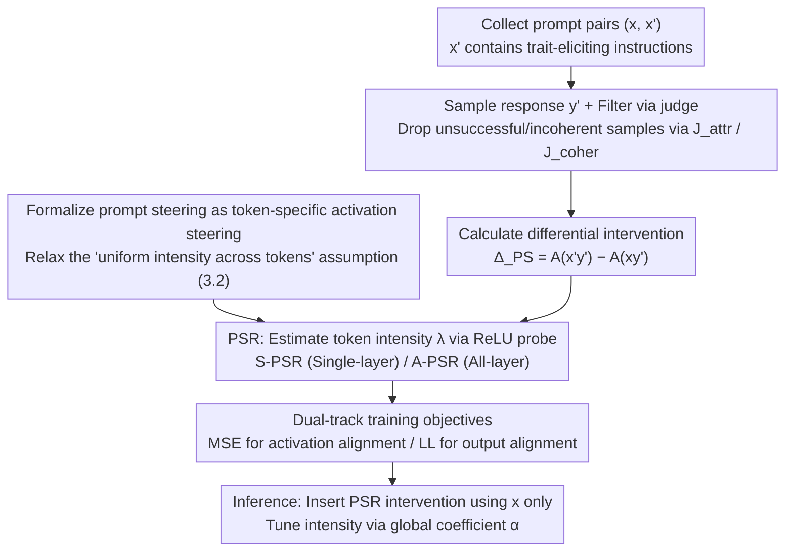

# Steer Like the LLM: Activation Steering that Mimics Prompting

**Conference**: ICML 2026  
**arXiv**: [2605.03907](https://arxiv.org/abs/2605.03907)  
**Code**: <https://github.com/Nokia-Bell-Labs/steer-like-the-llm>  
**Area**: Mechanistic Interpretability / LLM Alignment / Activation Steering  
**Keywords**: activation steering, prompt steering, token-specific coefficient, ReLU probe, PSR

## TL;DR
This paper reinterprets "prompt steering" as a form of activation steering implemented by the LLM itself. By distilling activation differences injected by prompts using a **token-specific ReLU probe**, the authors develop the PSR (Prompt Steering Replacement) module. PSR outperforms existing activation steering methods (CAA, ReFT-R1, Stolfo, etc.) across three benchmarks and matches or surpasses prompting in AxBench and persona steering tasks.

## Background & Motivation

**Background**: There are two primary paths for controlling LLM behavior: (1) prompting / in-context examples; (2) activation steering—adding a fixed vector $\alpha\mathbf z_{attr}$ to the residual stream at a specific layer. The latter is a prominent direction in mechanistic interpretability due to its lightweight nature, robustness to prompt injection, and interpretability.

**Limitations of Prior Work**: Despite a long list of methods such as ActAdd, CAA, ITI, and ReFT-R1, activation steering **remains systematically weaker than prompting** (as verified by Wu et al.). The paper provides two illustrative figures showing that the actual activation difference $\Delta_{PS}$ caused by prompt injection varies in intensity across different tokens by several orders of magnitude: some tokens remain nearly unchanged, while others are heavily rewritten. Most mainstream activation steering methods either use the same constant vector for all tokens or apply it only to the last token, which fails to mimic the steering mechanism (i.e., prompting) implemented by the LLM itself.

**Key Challenge**: The implicit assumption that "prompting behavior can be replicated with a constant $\alpha\mathbf z$" is untenable. Prompting is essentially a **token-specific**, non-uniform intervention. Using a constant inevitably leads to trade-offs (either oversteering or insufficient steering).

**Goal**: (a) Explicitly formalize "prompting as a (black-box) activation steering"; (b) distill differential activations from prompt injection using a simple, interpretable model; (c) design a learnable PSR module using token-specific coefficients as a first-order necessary condition; (d) systematically outperform baselines while maintaining high coherence.

**Key Insight**: Since the "ground truth intervention" of prompt steering $\Delta_{PS}=\mathbf A^{prompt}-\mathbf A^{base}$ can be **calculated directly**, it can be used as a supervised target. An activation steering module can then be trained as its imitator using MSE.

**Core Idea**: Formalize prompt steering as $\mathbf A_{y_i'|PS}=\mathbf A_{y_i'}+\alpha\,\lambda(\mathbf A_{y_i'};\theta_{attr})\mathbf z_{attr}$, where $\lambda$ is a **ReLU probe** that decodes token-level intensity from the activation itself. The training objective is the MSE against prompt-steered activations, resulting in the PSR.

## Method

### Overall Architecture
Training pipeline: (i) Given an attribute $attr$, collect prompt pairs $(x,x')$, where $x'$ includes a trait-eliciting instruction; (ii) sample response $y'$ using the LLM and filter out unsuccessful or incoherent samples using an LLM judge $J_{attr}$ and coherence judge $J_{coher}$; (iii) calculate $\mathbf A_{y_i'|PS}=\mathrm{LLM}(x'y')$ and $\mathbf A_{y_i'}=\mathrm{LLM}(xy')$, where the difference is the intervention $\Delta_{PS}$; (iv) train the PSR module (single-layer or all-layer versions) to approximate $\mathbf A_{y_i'|PS}$ through its activations. Inference: Use only the original prompt $x$, insert the PSR intervention into the forward pass, and use the global coefficient $\alpha$ as an intensity knob.

### Key Designs

**1. Formalizing prompt steering as token-specific activation steering: Translating "adding instructions" into supervisable per-token interventions**

Activation steering has long assumed that "the effects of prompting can be replicated with a constant vector $\alpha\mathbf z$," but this has not been validated. This paper first defines the actual activation effect of prompt injection as a layer-wise, token-wise difference: $\mathbf A_{l,y_i'|PS}=\mathbf A_{l,y_i'}+\Delta_{PS}(x'y'_{\le i},xy'_{\le i})$ (Eq. 3). It distinguishes between a **cumulative version** $\Delta_{PS_{acc}}$ (relative to a completely unsteered baseline, corresponding to single-layer PSR) and a **local version** $\Delta_{PS_{loc}}$ (relative to a baseline where the previous layer was already steered, corresponding to all-layer PSR). Based on this, two minimal assumptions are proposed—Assumption 3.1 (intervention along a single direction $\mathbf z_{attr}$) and Assumption 3.2 (uniform intensity across tokens). Together, these degenerate into existing constant steering (Eq. 2). Visualizing sycophancy data from Llama-3.2-3B, the authors show that Assumption 3.2 is unrealistic: prompt intensity varies by orders of magnitude across tokens, with some tokens barely changing while others are significantly rewritten. Thus, **Assumption 3.1 is retained while 3.2 is relaxed** to "intensity can be decoded from the activation" (Assumption 3.2a). This formalization serves as the framework for subsequent methods, indicating that mimicking prompts requires intensity coefficients $\lambda$ to vary per token.

**2. PSR Architecture: Using a ReLU probe to estimate steering intensity per token**

Since Assumption 3.2a states intensity should vary per token, a module capable of reading intensity from the activation itself is needed to replace the constant $\alpha$. PSR uses a single-layer probe with a ReLU: $\lambda(\mathbf A_{l,y_i'};\theta_{attr,l})=\mathrm{ReLU}(\mathbf A_{l,y_i'}\cdot\mathbf w_{attr,l}+b_{attr,l})$ (Eq. 8). The intervention is defined as $\mathbf A_{l,y_i'|AS}=\mathbf A_{l,y_i'}+\alpha\lambda(\cdot)\mathbf z_{attr,l}$ (Eq. 7). It has two variants: **S-PSR** intervenes only at a single layer (corresponding to $\Delta_{PS_{acc}}$), and **A-PSR** intervenes at all layers simultaneously (corresponding to $\Delta_{PS_{loc}}$). ReLU is chosen over sigmoid to explicitly allow "zero intervention" for certain tokens—aligned with the observed phenomenon in Figure 2 where many tokens are nearly untouched by prompts. The probe reads $\mathbf A_{l,y_i'}$ because the prompt's influence can only enter the current token's hidden state through self-attention; thus, the decision of whether to steer a token can, in principle, be recovered from the token's own activation, providing the physical intuition for Assumption 3.2a.

**3. Training Objectives: Dual tracks of activation-based MSE and output-based LL**

To learn to behave like a prompt, PSR utilizes two complementary supervisory signals. The **MSE objective** $\mathcal L_{MSE}=\sum_l\|\mathbf A_{l,y_i'|AS}-\mathbf A_{l,y_i'|PS}\|^2$ strictly mimics the intermediate activations of prompt injection using filtered successful prompt-steered triplets $(x,x',y')$. During training, $\alpha=J_{attr}\in[0,1]$ is used as a soft label, while at inference, $\alpha$ is freely tuned. The **LL objective** $-\log p_{AS}(y'|x)$ focuses solely on aligning the final output with the attribute, without requiring intermediate activation similarity. Each has its use cases: MSE provides rich signals but depends on Assumptions 3.1/3.2a holding at that layer; LL performs better on tasks like IFEval that require complex formatting, where rank-1 interventions cannot fully replicate all prompt mechanisms. Additionally, a $\lambda$ regularization $\mathcal L_{reg}=\max(0,1-\sum_i\lambda_i)$ prevents all ReLUs from "dying," while negative samples ($J_{attr}<0.5$) are converted to negative $\alpha$ via a bias term $b_{m,l}=-0.5$, automatically learning the LLM's default behavior when the attribute should not appear.

### Loss & Training
- Key hyperparameters: The global coefficient $\alpha$ is tuned during inference via binary search to reach a target coherence of 80. A-PSR is optimized jointly across all layers. Single-layer MSE also considers downstream layer MSE to prevent noise propagation. Training requires only positive successful samples (negative samples are used with bias offsets).
- Data filtering: Triplet samples are discarded if $J_{coher}<0.5$ or if positive samples have $J_{attr}<0.5$, ensuring PSR learns from "successful prompt steering" behavior.

## Key Experimental Results

### Main Results

**Persona Vectors** (5 traits × 3 LLMs): Performance measured by trait alignment at coherence 80 (TA@C80) and prompt-coherence-aligned (TA@Cp). Higher is better.

| Method (Qwen2.5-7B) | TA@C80 | TA@Cp |
|---|---|---|
| S-Const$_{DiM\|R}$ (CAA-like) | 74.8 | 34.8 |
| S-Const$_{MSE\|QR}$ | 71.6 | 48.8 |
| **S-PSR$_{MSE\|QR}$** | **83.3** | **60.9** |
| A-Const$_{MSE\|QR}$ | 96.1 | 83.6 |
| **A-PSR$_{MSE\|QR}$** | **96.8** | **83.9** |
| prompt (Ref. upper bound) | – | 71.6 |

A-PSR$_{MSE}$ TA@Cp **outperforms prompting** across all 3 LLMs, marking it the first activation steering method to consistently surpass prompts.

**IFEval (Format / Multilingual instruction following)**: Reporting IF Acc and Coherence.

| Method (Gemma-2-9b-it) | IF Acc | Coher |
|---|---|---|
| no steering | 11.4 | 96.6 |
| Stolfo et al. 2025 | 30.8 | 96.1 |
| S-PSR$_{LL}$ | 66.1 | 95.5 |
| **A-PSR$_{LL}$** | **71.9** | 82.3 |
| prompt | 85.7 | 94.8 |
| **S-PSR$_{LL}$+prompt** | **93.1** | 94.6 |

While rank-1 PSR cannot beat prompts alone, the combination of PSR and prompt increases performance by 7-10 points.

**AxBench (500 SAE concepts, Gemma-2)**: Harmonic mean of concept / fluency / relevance (max 2.0).

| Method | 2B-L20 | 9B-L20 |
|---|---|---|
| ReFT-r1 (rank-1) | 0.509 | 0.630 |
| Φ_SV (Wu 25b) | 0.606 | 0.892 |
| **S-PSR$_{LL}$ (rank-1)** | **0.618** | 0.667 |
| LoReFT-RePS (High rank) | 0.805 | 0.757 |
| HyperSteer | 0.742 | 1.091 |
| **A-PSR$_{MSE}$** | **0.871** | **1.120** |
| prompt | 0.731 | 1.075 |

A-PSR$_{MSE}$ achieves **SOTA** on both subsets, outperforming prompting and LoRA.

### Ablation Study

| Configuration | Key Metric Change | Description |
|------|----------|------|
| Const vs PSR (Single-layer) | TA@Cp +10\~20 | Token-specific coefficients provide the largest contribution. |
| MSE vs LL (rank-1 PSR) | MSE better for persona, LL better for IFEval | MSE requires Assumptions 3.1/3.2a to hold; some IFEval format instructions do not satisfy this. |
| Single → All layers (A-PSR) | TA@Cp +25\~40 | Joint multi-layer intervention nearly perfectly mimics prompts. |
| Remove $\lambda$ regularization (AxBench) | Performance gain | AxBench interventions are weaker; regularization becomes restrictive. |

### Key Findings
- **Figure 3** shows an interesting byproduct: the relative RMSE between A-PSR$_{MSE}$'s cumulative intervention and the true $\Delta_{PS_{acc}}$ becomes **lower than the RMSE between equivalent prompts** starting from layer 10. This indicates PSR replicates the original prompt's internal mechanism more faithfully than "another prompt expressing the same idea."
- While single-layer Const shows RMSE > 1 (farther away than no steering) at the intervention layer, the RMSE drops below 1 in subsequent layers. This suggests the model **corrects** itself back toward default behavior, explaining why constant steering seems "okay" superficially—it's the model cleaning up the noise.
- The insufficiency of rank-1 intervention on IFEval suggests that prompt injections for "Japanese + Three-paragraph" type combined instructions inherently require rank > 1, marking a clear direction for future work.

## Highlights & Insights
- **Elegant Perspective Shift**: "Prompting = activation steering implemented by the LLM." This connects mechanistic interpretability with prompt engineering, making distillation a natural training objective.
- **ReLU Probe + Token-Level Coefficients**: A design transferable to all "sparse injection" scenarios, such as SAE feature steering, safety guardrail activation, or hard concept editing.
- **Honest Evaluation**: Rather than hiding the fact that rank-1 fails to beat prompts on IFEval, the paper provides full curves for the PSR+prompt combination as a realistic deployment strategy.
- **Interpretability Byproduct**: The $\lambda$ output of PSR allows direct visualization of "which tokens are most modified by the prompt," serving as an out-of-the-box tool for localizing prompt behavior.

## Limitations & Future Work
- Assumption 3.1 (single direction) clearly does not hold for some attributes. The paper acknowledges some traits are multi-directional and require extension to low-rank ($r>1$) interventions—a natural entry point for LoREFT.
- Rank-1 is insufficient for IFEval, and MSE struggle to train there, which the paper admits as a performance ceiling.
- Training Cost: Each trait requires 1k prompt-steered triplets and LLM judging. This remains expensive for large trait lists (e.g., the 500 concepts in AxBench). Using SAE features directly as $\mathbf z_{attr}$ start points is a promising direction.
- **Adversarial Robustness**: Since PSR distills prompt steering into a learnable module, could prompt injection attacks reverse-engineer vulnerabilities in PSR probes? This risk is not discussed.

## Related Work & Insights
- **vs ActAdd / CAA / ITI**: These all use constant $\alpha\mathbf z$ (holding Assumption 3.2), thus being limited by "uniform inter-token intervention." PSR relaxes this using the ReLU probe.
- **vs ReFT-R1 (Wu 2025a)**: ReFT-R1 also uses LL for low-rank intervention training but remains token-uniform. PSR's Const$_{LL}$ is roughly a degenerate version of ReFT-R1, and PSR$_{LL}$ systematically improves performance by adding $\lambda(\cdot)$.
- **vs Stolfo et al. 2025**: Stolfo proposes per-token coefficients but aims to "make the projection of $\mathbf z$ uniform across tokens," which is the opposite goal of mimicking actual prompt injection. This paper directly outperforms it.
- **vs HyperSteer (Sun 2025)**: HyperSteer uses a hypernetwork to generate interventions from a base prompt and steering instruction. A-PSR$_{MSE}$ outperforms it by 0.03-0.13 points on AxBench while being more interpretable.

## Rating
- Novelty: ⭐⭐⭐⭐ (Formalization of "prompting as activation steering" + token-specific ReLU probe provide clear innovation).
- Experimental Thoroughness: ⭐⭐⭐⭐ (3 benchmarks across multiple LLMs and baselines, strong ablation and faithfulness analysis).
- Writing Quality: ⭐⭐⭐⭐⭐ (Clear progression from Assumptions 3.1 to 3.2a, well-explained division between S-PSR and A-PSR).
- Value: ⭐⭐⭐⭐ (A baseline worth reproducing for teams working on activation steering and model behavior control; code and workflows provided).

<!-- RELATED:START -->

## Related Papers

- [\[ICLR 2026\] Activation Steering with a Feedback Controller](../../ICLR2026/interpretability/activation_steering_with_a_feedback_controller.md)
- [\[ICML 2026\] Closing the Loop: PID Feedback Control for Interpretable Activation Steering in Symbolic Music Generation](closing_the_loop_pid_feedback_control_for_interpretable_activation_steering_in_s.md)
- [\[ICML 2026\] CorrSteer: Generation-Time LLM Steering via Correlated Sparse Autoencoder Features](corrsteer_generation-time_llm_steering_via_correlated_sparse_autoencoder_feature.md)
- [\[NeurIPS 2025\] CBMAS: Cognitive Behavioral Modeling via Activation Steering](../../NeurIPS2025/interpretability/cbmas_cognitive_behavioral_modeling_via_activation_steering.md)
- [\[ICML 2025\] To Steer or Not to Steer? Mechanistic Error Reduction with Abstention for Language Models](../../ICML2025/interpretability/to_steer_or_not_to_steer_mechanistic_error_reduction_with_abstention_for_languag.md)

<!-- RELATED:END -->
