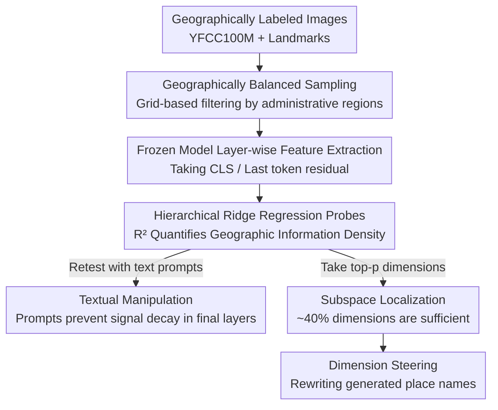

# Textual Supervision Enhances Geospatial Representations in Vision-Language Models

**Conference**: ICML2026  
**arXiv**: [2606.07172](https://arxiv.org/abs/2606.07172)  
**Code**: https://github.com/marceloslo/Textual-Supervision-Enhances-Geospatial-Representations  
**Area**: Interpretability / Multimodal VLM  
**Keywords**: Geospatial representation, linear probes, mechanistic interpretability, textual supervision, model steering

## TL;DR
The authors use **hierarchical linear probes** to investigate whether vision/multimodal models encode information regarding "where on Earth an image was taken" within their hidden layers without explicit geographic supervision; the conclusion is that **VLMs with textual supervision (CLIP, LLaVA, Qwen, Gemma) encode latitude and longitude far better than vision-only models (ViT, DINOv2)**, and this geographic information is concentrated in very few dimensions and can even be manipulated via "dimension steering" to rewrite the place names generated by the model.

## Background & Motivation
**Background**: Image geolocation has traditionally been a **supervised** task—PlaNet discretizes the Earth into a grid for classification, GeoCLIP aligns CLIP image features to a position encoder, and PIGEON performs hierarchical localization on CLIP features. These works demonstrate that "vision models can localize if specifically trained," but they focus on training specialized localization models.

**Limitations of Prior Work**: There has been no systematic answer to a more fundamental question—do general-purpose vision/multimodal foundation models **not trained for localization** "incidentally" learn geospatial information during pre-training? While evidence exists for text-side LLMs (Gurnee & Tegmark found specific neurons in LLMs implicitly encoding latitude and longitude), implicit geographic representations in the vision/multimodal domain remain largely unexplored.

**Key Challenge**: Internal model representations are shaped by architecture, pre-training data, and fine-tuning, making them inherently difficult to interpret; the multimodal complexity of VLMs further obscures "where and how knowledge is stored." This inquiry is not merely out of curiosity—if models implicitly memorize geographic information, it implies **privacy risks** (malicious actors back-inferring locations from photos) and **fairness issues** (systematically lower localization accuracy for underrepresented regions).

**Goal**: This study decomposes the problem into three sub-questions: (1) Which category of models (vision-only / VLM / large multimodal) has the strongest geographic representations? (2) In **which layer** of the network is geographic information most concentrated? (3) Is this information diffused throughout the representation or concentrated in a few dimensions, and can it be steered?

**Key Insight**: Instead of training a localization model, the authors employ **linear probing**, a standard tool in Transformer mechanistic interpretability. The idea is straightforward: if latitude and longitude can be **linearly** regressed from the hidden vectors of a certain layer, it indicates the layer indeed encodes geographic information, and the regression $R^2$ serves as a quantitative measure of information density.

**Core Idea**: By quantifying invisible geographic representations using "frozen models + layer-wise ridge regression probes," it is argued that **textual supervision is a key factor in learning geographic representations, being more efficient than simply scaling up vision models**.

## Method

### Overall Architecture
The "method" comprises an **analytical pipeline based on probes**: treating a set of pre-trained, frozen models as black boxes, geographic-labeled images are fed in to extract residual stream vectors of the summary tokens layer by layer. Ridge regression probes predict latitude and longitude, and $R^2$ is used to compare different model families, layers, and dimensional subsets. Finally, a "dimension-swapping" manipulation experiment is conducted to verify that geographic information is causally intervenable. The input consists of images (optionally with text prompts), and the outputs are the "geographic representation intensity $R^2$ of a specific model layer" and rewritten place names in generated results.

### Key Designs

**1. Hierarchical Linear Probes: Converting "Geographic Density" into Comparable Numbers**

Geographic representations are typically invisible and incomparable across models. The authors represent the residual stream of each Transformer block as $x^{(l+1)}=h^{(l)}_{\mathrm{attn}}+h^{(l)}_{\mathrm{mlp}}$, extract summary representations for each layer $l$ (`[CLS]` for vision models, the last token for VLMs), and fit a ridge regression to map these vectors to two-dimensional targets (latitude, longitude):

$$\hat{\mathbf{W}}=\arg\min_{\mathbf{W}}\bigl\|\bm{Y}-\bm{A}^{(l)}\mathbf{W}\bigr\|_{F}^{2}+\lambda\bigl\|\mathbf{W}\bigr\|_{F}^{2}.$$

The regularization strength $\lambda$ is selected per probe via leave-one-out cross-validation. The **coefficient of determination $R^2$** is used as a unified metric—higher $R^2$ indicates more "linearly readable geographic information" in the residual stream. This allows different architectures, dimensions, and layers to be compared within the same coordinate system. MSE is used as the probe loss instead of haversine distance because MSE is convex and smooth for training shallow probes, serving as a transparent measure of signal density.

**2. Geographically Balanced Sampling: Mitigating "Western Bias" in Datasets**

Without adjustment, YFCC100M and Landmarks images are heavily biased toward major Western cities, causing probes to reflect sampling bias rather than true representation. The authors partition the Earth into non-overlapping geocells based on Global Administrative Areas (GID), performing **hierarchical merging** for underrepresented regions (merging within GID_1, then across GID_0). Each geocell is required to contain at least one full GID_2 city unit to prevent oversampling. Each data source is capped at 5,000 images with at most 5 per geocell. This ensures the conclusion that "VLMs outperform pure vision models" is not an artifact of sampling.

**3. Subspace Localization and Dimension Steering: Proving Information Concentration and Causality**

Beyond probing, the authors demonstrate where geographic information is **concentrated** and its **intervenability**. Subspace analysis reveals that retraining probes on the top-$p$ dimensions (ranked by probe coefficients) yields near-full $R^2$ at $p\approx0.4$. Qwen2.5-VL achieves 90% of peak performance with only the top 10% of dimensions, indicating that geographic information is **compressed into a small cluster of dimensions**. Furthermore, "dimension steering" is performed: taking the summary token residuals of a source and target image at layer 1, the source vector's geographic dimensions $g$ are replaced with those of the target:

$$\tilde{\bm{A}}^{(1)}_{\mathrm{source},t^{\star}}=\bm{A}^{(1)}_{\mathrm{source},t^{\star}}\odot\mathbbm{1}_{g^{C}}+\bm{A}^{(1)}_{\mathrm{target},t^{\star}}\odot\mathbbm{1}_{g},$$

followed by forward decoding. Replacing geographic dimensions of "The Step Pyramid of Djoser" with those of the "Trevi Fountain" leads Qwen2.5-VL-3B to generate: "The image depicts the Step Pyramid, Rome, Italy"—rewriting the place name while largely preserving other semantics. This promotes the correlation findings to **causally intervenable** evidence.

### Loss & Training
The study does not train large models, only shallow probes (ridge regression, closed-form + LOO CV for $\lambda$). A single fine-tuning experiment on a downstream "Country Recognition" task is conducted: taking up to 100 images per country from Landmarks, one large model per vision family + CLIP-large + DINOv2-giant are fine-tuned with aligned inputs and scales for comparability.

## Key Experimental Results

### Main Results
Cross-model probing results (described via Figure 2) show that textual supervision models significantly outperform vision-only models:

| Model Family | Representative Model | Probing $R^2$ Performance | Interpretation |
|--------|----------|-----------------|------|
| Vision-only | ViT / DINOv2 | Mostly below 0.3 | Geographic learning from images alone is weak |
| Vision-only (Scale) | DINOv2-giant(1B) / Web-SSL DINO-7B | Best in family | Scale helps but is surpassed by smaller VLMs |
| VLM | CLIP-base | Avg > 0.4, Landmarks/Street ~0.8 | Small models outperform DINOv2-giant |
| VLM (Scale) | MetaCLIP-huge(600M) | Beats Web-SSL DINO-7B on same data | Textual supervision > pure scaling |

Two key comparisons: (1) The much larger DINOv2-giant is outperformed by the smaller CLIP-base; (2) On identical training data, MetaCLIP-huge outperforms Web-SSL DINO-7B—both point to the **efficiency of language supervision in learning implicit geographic representations**. Across clusters, street/building/landmark clusters show consistently high $R^2$, while object/food close-ups are lowest; sign/text clusters show localizability only in VLMs.

Downstream country recognition fine-tuning validates the utility of probing results:

| Model | Test Accuracy | Val Loss | Train Loss |
|------|-----------|---------|---------|
| ViT-MAE-large | 0.15 | 3.35 | 2.344 |
| ViT-large | 0.23 | 3.17 | 1.346 |
| DINOv2-large | 0.29 | 2.55 | 0.009 |
| DINOv2-giant | 0.32 | 2.78 | 0.001 |
| CLIP-large | **0.36** | **2.39** | 0.009 |

The ranking of downstream accuracy **strictly follows the ranking of probing $R^2$** (ViT-MAE worst, CLIP best), confirming that "strong implicit geographic representation → better downstream geographic performance."

### Ablation Study

| Analysis Dimension | Key Findings | Description |
|----------|---------|------|
| Layer-wise (No Prompt) | Vision-only increases monotonically; VLM plateaus or drops (Gemma $R^2$ turns negative at final layer) | Without prompts, VLMs tend to "discard" geographic signals irrelevant to generation |
| Layer-wise (With Prompt) | "Guess the latitude..." prompt prevents $R^2$ drop in final layers; Qwen reaches 0.88 on Landmarks | Geographic and textual representations entwine; prompts "recall" signals to final layers |
| Dimension Subset $p$ | $p\approx0.4$ nears full $R^2$; Qwen top 10% yields 90% performance | Geographic info is concentrated in a compact subspace |
| Dimension Steering | Swapping 50% of geographic dimensions rewrites generated place names | Information is causally intervenable, though long generation is unstable |

### Key Findings
- **Textual Supervision > Vision Scale**: Scaling pure vision models is helpful but has diminishing returns; linguistic supervision is the primary driver for high-quality geographic representations. This aligns with the Platonic Representation Hypothesis regarding **efficiency**.
- **Optimal Layer Depends on Family and Prompts**: Without prompts, pure vision models peak at the deepest layers, while VLMs peak early in the language modules; with prompts, VLM late-stage layers remain stable.
- **Privacy/Fairness Double-Edged Sword**: Stronger representations enable better location inference from photos but exhibit performance imbalances in underrepresented regions.

## Highlights & Insights
- **Quantifying "Geographic Representation" into Probing Experiments**: Using a single $R^2$ metric to sweep across model families, layers, and clusters provides a clean, hard metric for the ambiguous question of "whether a model understands geography."
- **Recalling Signals with Prompts**: The observation that VLM signals disappear without prompts but return with them suggests that VLMs do not fail to learn geography but rather "deprioritize" it during decoding. This is valuable for extracting implicit knowledge from VLMs: probe early layers or use task-relevant prompts.
- **Dimension Steering as Causal Evidence**: Swapping dimensions in the layer 1 summary token demonstrates that geographic information is encoded very early and directly influences generation.

## Limitations & Future Work
- **MSE vs Haversine Loss**: The authors admit MSE does not account for spherical geometry, which might underestimate or distort true localization errors.
- **Inability to Control Pre-training Data**: Differences in architecture and data selection are confounded; "VLM superiority" may be partially data-driven, though addressed via sub-experiments.
- **Memorization**: Since YFCC100M predates the models, performance may stem from memorization; experiments using non-captioned Landmarks and coordinate-filtered captions suggest the conclusions hold.
- **Steering Instability**: Long-form generation occasionally hallucinates or mixes locations; steering was only verified on Qwen-3B.
- **Future Work**: Extending to other image types like satellite imagery and studying the emergence of geographic representation during pre-training.

## Related Work & Insights
- **vs GeoCLIP / PIGEON / PlaNet**: These works **train** localization models; this study **probes** implicit structures already present in general-purpose models to understand which architectural choices foster them.
- **vs Gurnee & Tegmark (LLM Geography Neurons)**: While prior work found implicit longitude/latitude neurons in text-only LLMs, this study extends the thread to vision and multimodal models, providing evidence that textual supervision is the key factor.
- **vs General Interpretability**: This study applies standard linear probing, subspace analysis, and residual steering to the specific, privacy-sensitive semantic dimension of "geospatial information."

## Rating
- Novelty: ⭐⭐⭐⭐ Systematically quantifies implicit VLM geography and identifies textual supervision as the key driver.
- Experimental Thoroughness: ⭐⭐⭐⭐ Comprehensive sweep across families, layers, and datasets, complemented by fine-tuning and steering.
- Writing Quality: ⭐⭐⭐⭐ Clear problem-probe-conclusion chain with intuitive heatmaps and curves.
- Value: ⭐⭐⭐⭐ Significant implications for geographic AI, privacy governance, and understanding VLM representations.

<!-- RELATED:START -->

## Related Papers

- [\[ICLR 2026\] Linear Mechanisms for Spatiotemporal Reasoning in Vision Language Models](../../ICLR2026/interpretability/linear_mechanisms_for_spatiotemporal_reasoning_in_vision_language_models.md)
- [\[ICLR 2026\] Inducing Dyslexia in Vision Language Models](../../ICLR2026/interpretability/inducing_dyslexia_in_vision_language_models.md)
- [\[ICML 2026\] How Language Models Process Negation](how_language_models_process_negation.md)
- [\[ICML 2026\] Scalable Circuit Learning for Interpreting Large Language Models](scalable_circuit_learning_for_interpreting_large_language_models.md)
- [\[ICML 2026\] Vision-Language Asymmetry in Bistable Image Captioning](vision-language_asymmetry_in_bistable_image_captioning.md)

<!-- RELATED:END -->
