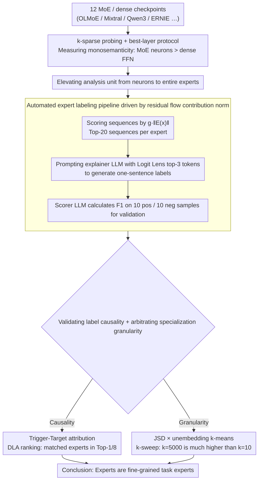

# The Expert Strikes Back: Interpreting Mixture-of-Experts Language Models at Expert Level

**Conference**: ICML 2026  
**arXiv**: [2604.02178](https://arxiv.org/abs/2604.02178)  
**Code**: https://github.com/jerryy33/MoE_analysis  
**Area**: Mechanistic Interpretability / MoE LLMs  
**Keywords**: Mixture-of-Experts, Polysemanticity, Sparse Routing, Automated Interpretability, Expert Specialization

## TL;DR
This paper systematically compares the polysemanticity of MoE expert neurons versus dense FFN neurons using $k$-sparse probing. It finds that MoE neurons are naturally closer to monosemanticity under the pressure of sparse routing. Consequently, the analysis unit is elevated from "neurons" to "entire experts." Using LLMs to automatically generate natural language labels for hundreds of experts and validating them through causal trigger experiments, the study concludes that "experts are neither broad domain experts nor token-level processors, but fine-grained task experts."

## Background & Motivation
**Background**: MoE has become the de facto standard for scaling LLMs (e.g., Gemini 2.5, DeepSeek-V3, Qwen3, ERNIE-4.5), where each token activates only a small fraction of the total parameters. Simultaneously, interpretability research for dense models primarily relies on post-hoc sparse coding like Sparse Autoencoders (SAEs), which are computationally expensive as they require separate training for each layer.

**Limitations of Prior Work**: Neurons in dense FFNs are highly **polysemantic**: a single neuron responds to multiple unrelated concepts due to superposition—networks represent far more than $d$ features using approximately orthogonal directions in a $d$-dimensional space. This makes it nearly impossible to understand a neuron's function by inspection.

**Key Challenge**: MoE already introduces sparsity at the architectural level, yet the academic community still treats MoE models like dense ones for interpretation (inspecting neurons or training SAEs), failing to leverage the structural dividend. Furthermore, there are two opposing views on "what experts specialize in"—one arguing for broad domains (e.g., biology, code) and the other for syntactic/token patterns.

**Goal**: (1) Quantitatively answer whether MoE expert neurons are truly more monosemantic than dense FFN neurons. (2) If so, can the analysis unit be raised to the expert level to enable scalable LLM interpretation without SAEs? (3) Use this toolkit to arbitrate the debate over expert specialization.

**Key Insight**: Chaudhari et al. (2025) observed in toy models that "sparser routing leads to weaker superposition." This study transfers this observation to production-scale LLMs and introduces the "residual flow contribution norm $g_i(x)\|E_i(x)\|_2$" as a key signal for measuring true expert activity.

**Core Idea**: Architectural sparse routing pushes both **individual neurons** and **entire experts** toward monosemanticity. Thus, MoE models can be directly interpreted at the "expert level" using natural language, bypassing the costly neuron-level decomposition.

## Method

### Overall Architecture
The paper addresses whether MoE models can be understood directly at the expert level without SAEs. The approach elevates interpretability analysis from neurons to experts: first, $k$-sparse probing measures that MoE neurons are indeed more monosemantic than dense FFN neurons. Leveraging this sparsity dividend, an LLM automatically generates natural language labels for each expert, followed by causal validation and the use of an objective metric to arbitrate the granularity of specialization. No training is performed on the LLMs; instead, forward analysis is conducted on 12 public MoE/dense checkpoints (OLMoE-1B-7B, Mixtral-8x7B, Qwen3-30B-A3B, ERNIE-4.5-21B-A3B, OLMo-7B, etc.) alongside an external explainer/scorer LLM (Gemini 3 Flash Preview).

### Key Designs

**1. $k$-sparse probing + best-layer protocol: Benchmarking monosemanticity**

Determining neuron monosemanticity was previously qualitative. The authors train an $L_2$-regularized logistic regression on activation vectors for concepts, restricted to top-$k$ dimensions. Neurons are selected by mean difference $a_j=|\mathbb{E}[h_j\mid y=1]-\mathbb{E}[h_j\mid y=0]|$, where $k\in\{1,2,4,8,16,32,64\}$. For MoE, intermediate activations $\mathbf{h}=\mathrm{Swish}(W_{\text{gate}}x)\odot W_{\text{up}}x$ are used; for dense, FFN activations at the same position. For MoE, only tokens routed to the target expert are kept. The best $F_1$ score across all layers/experts is reported for each concept to avoid "wrong layer" bias. A high $F_1$ at $k=1$ signifies a concept is mapped to a single neuron. To control for total parameters, comparisons are matched by active parameters; OLMoE-1B-7B (1B active) outperforms OLMo-7B (7B active), proving the dividend stems from sparse routing.

**2. Automated expert labeling pipeline driven by residual flow contribution norm**

To label experts, sequences that "truly activate" them must be identified. Router weights $g_i(x)$ indicate selection but not necessarily utility, and internal activations may not reach the output. Instead, the norm of the update vector written to the residual flow is used as the activity metric. For a sequence $s$, the score is $\mathrm{score}(s,E_i)=\max_{x\in s}\,g_i(x)\,\|E_i(x)\|_2$, as the residual flow is the only channel for components to affect output. For each expert, the top-20 sequences and top-3 tokens from Logit Lens are fed to the explainer LLM. A scorer LLM then validates the label's discriminative power on held-out samples. Most experts in OLMoE/ERNIE/Qwen3 reach $F_1 > 0.8$, demonstrating the labels are reliable and enabling automated interpretability without layer-wise SAEs.

**3. Trigger-Target causal attribution + JSD specialization metric**

High $F_1$ proves accuracy but not causality. The authors use Gemini 3 Flash Preview to synthesize sentences containing "triggers" (to activate the expert) and "targets" (tokens the expert should promote). Direct Logit Attribution (DLA) $A_{v\to t}=\mathrm{LN}_{\text{linear}}(v)^\top W_U[:,t]$ ranks experts: matched experts consistently rank in the Top-1 or Top-8, while control prompts show 80% are not even routed. For specialization granularity, $k$-means clustering on the unembedding matrix ($k\in\{10, \dots, 5000\}$) defines "native domains." Jensen-Shannon Divergence (JSD) measures how much each expert deviates from the layer average in terms of Routing Specialization and Functional Specialization. The significantly higher JSD at $k=5000$ compared to $k=10$ strongly supports the "fine-grained task expert" hypothesis.

## Key Experimental Results

### Main Results: MoE vs. Dense Monosemanticity
Comparison of best-layer $F_1$ on $k$-sparse probes:

| Setting | MoE performance at $k=1$ | Dense performance at $k=1$ | Key Observation |
|------|------------------|---------------------|----------|
| Active-parameter matching | Near optimal, low variance | Significantly lower than MoE | Gap is largest at $k=1$, meaning MoE concepts are pinned to single neurons |
| OLMo family total param comparison | OLMoE-1B-7B near upper bound | OLMo-7B (7× active) is polysemantic | Sparse routing explains monosemanticity better than raw capacity |
| $N_A/N$ slices | Qwen3-30B-A3B ($N_A/N\approx0.06$) is cleanest | Mixtral-8x7B ($N_A/N=0.25$) is "dirtier" | Sparser routing leads to stronger monosemanticity |

### Key Findings
- **Sparsity is the key, not parameter count**: OLMoE-1B-7B outperforms OLMo-7B in monosemanticity despite fewer active parameters. This suggests the trend toward "more total experts + fewer active experts" in industry naturally improves model transparency.
- **Experts are fine-grained task experts**: JSD is far higher at $k=5000$ than $k=10$. Qualitative taxonomy supports this: OLMoE-L1-E57 handles chemical/biological suffixes; OLMoE-L15-E17 handles LaTeX closing braces `}}`; Qwen3-L44-E12 specializes in Iranian administrative geography.
- **Functional division across layers**: Early layers handle morphology/tokenization; middle layers handle syntactic cohesion and domain knowledge; deep layers handle structural validity and format constraints.

## Highlights & Insights
- **Residual flow contribution norm** is a superior activity measure: Unlike router weights or absolute activation values, $g_i(x)\|E_i(x)\|_2$ directly maps to causal impact on the output.
- **JSD + $k$-sweep** provides a clean arbitration for specialization: Instead of human-defined domains, it lets the model's output space define domains, debunking broad-domain theories in favor of task-level specialization.
- **Modular Monosemanticity**: The combination of single-neuron monosemanticity and homogeneous token routing makes "experts" viable units of interpretation, potentially replacing SAEs for MoE models.

## Limitations & Future Work
- **Scale**: The study did not include the largest models like DeepSeek-V3 or Llama-4-MoE due to GPU memory constraints.
- **Inter-expert superposition**: While internal polysemanticity is reduced, superposition across different experts may still exist.
- **Safety Risks**: Precise mapping of capabilities could be a double-edged sword for model editing or bypassing safety guardrails.

## Related Work & Insights
- **vs. Sparse Autoencoders (Bricken et al., 2023)**: This work proves MoE experts can act as natural sparse code units, **obviating the need for costly SAE training**.
- **vs. Specialization Theories**: Arbitrates between "broad domain" (Muennighoff et al., 2025) and "token-level" (Xue et al., 2024) views, favoring fine-grained task specialization.
- **vs. Geva et al. (2021)**: Extends the "FFN as key-value memory" view by providing human-readable semantic annotations for the "values."

## Rating
- Novelty: ⭐⭐⭐⭐ Successfully scales toy-model hypotheses to production LLMs.
- Experimental Thoroughness: ⭐⭐⭐⭐⭐ Comprehensive cross-model, cross-layer, and causal validation.
- Writing Quality: ⭐⭐⭐⭐ Clear structure and natural progression of motivations.
- Value: ⭐⭐⭐⭐⭐ Provides a cost-effective pathway for MoE interpretability and safety auditing.

<!-- RELATED:START -->

## Related Papers

- [\[CVPR 2026\] ERMoE: Eigen-Reparameterized Mixture-of-Experts for Stable Routing and Interpretable Specialization](../../CVPR2026/interpretability/ermoe_eigen-reparameterized_mixture-of-experts_for_stable_routing.md)
- [\[ACL 2025\] EXPERT: An Explainable Image Captioning Evaluation Metric with Structured Explanations](../../ACL2025/interpretability/expert_an_explainable_image_captioning_evaluation_metric_with_structured_explana.md)
- [\[NeurIPS 2025\] AgentiQL: An Agent-Inspired Multi-Expert Framework for Text-to-SQL Generation](../../NeurIPS2025/interpretability/agentiql_an_agent-inspired_multi-expert_framework_for_text-to-sql_generation.md)
- [\[ACL 2026\] METER: Evaluating Multi-Level Contextual Causal Reasoning in Large Language Models](../../ACL2026/interpretability/meter_evaluating_multi-level_contextual_causal_reasoning_in_large_language_model.md)
- [\[ICML 2026\] Query Circuits: Explaining How Language Models Answer User Prompts](query_circuits_explaining_how_language_models_answer_user_prompts.md)

<!-- RELATED:END -->
