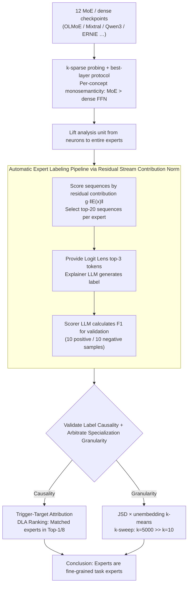

# The Expert Strikes Back: Interpreting Mixture-of-Experts Language Models at Expert Level

**Conference**: ICML 2026  
**arXiv**: [2604.02178](https://arxiv.org/abs/2604.02178)  
**Code**: https://github.com/jerryy33/MoE_analysis  
**Area**: Mechanistic Interpretability / MoE LLMs  
**Keywords**: Mixture-of-Experts, Polysemanticity, Sparse Routing, Auto-interpretability, Expert Specialization

## TL;DR
This paper uses $k$-sparse probing to systematically compare the polysemanticity of MoE expert neurons versus dense FFN neurons. It finds that MoE naturally tends toward monosemanticity under sparse routing pressure. Consequently, the analysis unit is elevated from "neurons" to "entire experts." The authors use LLMs to automatically assign natural language labels to hundreds of experts, validate them through causal trigger experiments, and conclude that "experts are neither broad domain specialists nor token-level processors, but fine-grained task experts."

## Background & Motivation
**Background**: MoE has become the de facto standard for scaling LLMs (Gemini 2.5, DeepSeek-V3, Qwen3, ERNIE-4.5, etc.), where each token activates only a small fraction of the total parameters. Simultaneously, interpretability research for dense models relies primarily on post-hoc sparse coding like Sparse Autoencoders (SAE), which requires separate training for each layer and incurs massive computational costs.

**Limitations of Prior Work**: Neurons in dense FFNs are highly **polysemantic**: a single neuron responds to multiple unrelated concepts due to superposition—networks use approximately orthogonal directions in a $d$-dimensional space to represent far more than $d$ features. This makes it nearly impossible to understand what a neuron does simply by looking at it.

**Key Challenge**: MoE has already introduced sparsity at the architectural level, yet the academic community still interprets MoE as if it were a dense model (examining neurons or training SAEs), failing to exploit its structural dividends. Furthermore, there is a conflict between two schools of thought regarding expert specialization: one argues experts are divided by broad domains (biology, code), while the other claims they are merely syntax/token pattern processors.

**Goal**: (1) Quantitatively answer "Are MoE expert neurons truly more monosemantic than dense FFN neurons?"; (2) If so, can the analysis unit be lifted from neurons to entire experts to interpret LLMs at scale without relying on SAEs?; (3) Use this toolkit to arbitrate the debate on expert specialization.

**Key Insight**: Chaudhari et al. (2025) observed in toy models that "the sparser the routing, the weaker the superposition." The authors migrate this observation to production-scale LLMs. They also introduce the "residual stream contribution norm $g_i(x)\|E_i(x)\|_2$" as a key signal for measuring true expert activity.

**Core Idea**: Architectural sparse routing pushes both **individual neurons** and **entire experts** toward monosemanticity. Thus, MoE models can be interpreted directly at the "expert level" using natural language, bypassing the need for expensive neuron-level decomposition.

## Method

### Overall Architecture
This paper addresses whether MoE models can be understood directly at the expert level without SAEs. The approach elevates interpretability analysis from neurons to experts: first, $k$-sparse probing is used to measure that MoE expert neurons are indeed more monosemantic than dense FFN neurons. Leveraging this sparsity dividend, an LLM automatically generates natural language labels for each expert followed by causal validation. Finally, an objective metric is used to arbitrate the granularity of expert specialization. No LLMs are trained; the analysis is performed via forward passes on 12 public MoE/dense checkpoints (OLMoE-1B-7B, Mixtral-8x7B, Qwen3-30B-A3B, ERNIE-4.5-21B-A3B, OLMo-7B, etc.) alongside an external explainer/scorer LLM (Gemini 3 Flash Preview).

### Key Designs

**1. $k$-sparse probing + best-layer protocol: Making "monosemanticity" a comparable metric**

The challenge is that neuron monosemanticity was previously qualitative. The authors trained a logistic regression with $L_2$ regularization on activation vectors for each concept but restricted it to the top-$k$ dimensions. Top-$k$ neurons are selected by the mean difference between classes $a_j=|\mathbb{E}[h_j\mid y=1]-\mathbb{E}[h_j\mid y=0]|$, where $k\in\{1,2,4,8,16,32,64\}$. For MoE, intermediate expert activations $\mathbf{h}=\mathrm{Swish}(W_{\text{gate}}x)\odot W_{\text{up}}x$ are used; for dense models, FFN activations at the same position. For MoE, only tokens routed to the target expert are kept. To avoid the "wrong layer" bias, the best $F_1$ score across all layers/experts is selected for each concept. High $F_1$ at $k=1$ indicates a concept is mapped to a single neuron. To control for total parameters, comparisons are matched by active parameters and total parameters (e.g., OLMoE-1B-7B vs. OLMo-7B).

**2. Residual stream contribution norm driven auto-labeling pipeline: Causal activity for sample selection**

To label experts, one must identify sequences that "truly activate" them. Router weights $g_i(x)$ only indicate an expert was selected, not that it produced meaningful output. The authors use the norm of the update vector written into the residual stream as the activity measure: $\mathrm{score}(s,E_i)=\max_{x\in s}\,g_i(x)\,\|E_i(x)\|_2$. This is because the residual stream is the only channel for components to affect the transformer's output. The top-20 scoring sequences per expert, combined with top-3 tokens from Logit Lens, are fed to the explainer LLM. A scorer LLM validates the labels on held-out samples. Most experts in OLMoE/ERNIE/Qwen3 achieved $F_1 > 0.8$, proving the labels are not hallucinations.

**3. Trigger-Target causal attribution + JSD specialization metrics: Arbitrating specialization**

High $F_1$ proves label accuracy but not causality. The authors had Gemini 3 Flash Preview synthesize sentences with "trigger" words (to activate the expert) and "target" words (which the expert should promote). Using DLA $A_{v\to t}=\mathrm{LN}_{\text{linear}}(v)^\top W_U[:,t]$, experts are ranked within their layer. In matched prompts, the target expert almost always appeared in Top-1 or Top-8, while in 80% of control prompts, it was not even routed. For granularity arbitration, $k$-means clustering on the unembedding matrix ($k\in\{10, \dots, 5000\}$) defined "native domains." Jensen-Shannon Divergence (JSD) measured how much each expert's distribution (Routing and Functional) deviated from the layer average. The fact that JSD was significantly higher at $k=5000$ than $k=10$ strongly supports the "fine-grained task expert" conclusion.

## Key Experimental Results

### Main Results: Monosemanticity in MoE vs. Dense
Comparing best-layer $F_1$ on $k$-sparse probes:

| Setting | MoE performance at $k=1$ | Dense performance at $k=1$ | Key Observation |
|------|------------------|---------------------|----------|
| Active-param matched (12 models) | Near optimal, low variance | Significantly lower than MoE | Gap is largest at $k=1$, meaning MoE concepts are pinned to single neurons |
| OLMo family (Total-param control) | OLMoE-1B-7B near upper bound | OLMo-7B (7× active) remains polysemantic | Sparse routing explains monosemanticity better than capacity |
| Slice by $N_A/N$ | Qwen3-30B-A3B ($N_A/N\approx0.06$) is cleanest | Mixtral-8x7B ($N_A/N=0.25$) is noticeably "dirtier" | Sparser routing leads to stronger monosemanticity |

### Key Findings
- **Sparsity is key, not parameter count**: OLMoE-1B-7B (1B active) outperforms OLMo-7B (7B active) in monosemanticity. The interpretability dividend comes from architectural sparse routing, not total or active parameters.
- **Experts are fine-grained task experts**: JSD is much higher at $k=5000$ than $k=10$. Qualitative taxonomy (e.g., OLMoE-L1-E57 for chem/bio suffixes; OLMoE-L15-E17 for LaTeX `}}` closing braces; Qwen3-L44-E12 for Iranian administrative geography) supports this.
- **Loose functional division across layers**: Early layers $\to$ morphology/tokenization, middle layers $\to$ syntax, late-middle $\to$ domain knowledge, deep layers $\to$ structural validity/format constraints.

## Highlights & Insights
- **Residual stream contribution norm** is an elegant metric. Previous methods using router weights or absolute activation values do not directly map to causal impact on the final prediction; $g_i(x)\|E_i(x)\|_2$ tracks the actual influence on the model's output channel.
- **JSD + unembedding $k$-means $k$-sweep** provides a clean criterion for the "broad domain vs. task expert" debate. Instead of human-defined domains, it uses the model's own output space structure.
- **Modular monosemanticity**: The combination of single-neuron monosemanticity and the router feeding homogeneous tokens to the same expert makes "experts-as-analysis-units" viable.

## Limitations & Future Work
- **Scale limitations**: Due to GPU memory constraints, massive models like DeepSeek-V3 or Llama-4-MoE were not included; conclusions are extrapolated.
- **Inter-expert superposition**: While intra-expert polysemanticity is reduced, superposition across experts may still exist.
- **Label risks**: A natural language label might hide prompt dependencies or dataset artifacts.
- **Future directions**: High-precision model editing/ablation at the expert level without affecting all parameters.

## Related Work & Insights
- **vs. Sparse Autoencoder (Bricken et al., 2023)**: SAEs are expensive to train for every layer. This paper proves MoE experts can be used as natural sparse code units, **eliminating the SAE training step**.
- **vs. Expert Specialization schools**: This paper arbitrates between domain-level (Muennighoff et al., 2025) and token-level (Xue et al., 2024) schools, finding that "fine-grained task expert" is the most accurate description.

## Rating
- Novelty: ⭐⭐⭐⭐ 
- Experimental Thoroughness: ⭐⭐⭐⭐⭐ 
- Writing Quality: ⭐⭐⭐⭐ 
- Value: ⭐⭐⭐⭐⭐ 

<!-- RELATED:START -->

## Related Papers

- [\[CVPR 2026\] ERMoE: Eigen-Reparameterized Mixture-of-Experts for Stable Routing and Interpretable Specialization](../../CVPR2026/interpretability/ermoe_eigen-reparameterized_mixture-of-experts_for_stable_routing.md)
- [\[ICLR 2026\] Understanding Cross-Layer Contributions to Mixture-of-Experts Routing in LLMs](../../ICLR2026/interpretability/understanding_cross-layer_contributions_to_mixture-of-experts_routing_in_llms.md)
- [\[ICML 2026\] Scalable Circuit Learning for Interpreting Large Language Models](scalable_circuit_learning_for_interpreting_large_language_models.md)
- [\[ACL 2025\] EXPERT: An Explainable Image Captioning Evaluation Metric with Structured Explanations](../../ACL2025/interpretability/expert_an_explainable_image_captioning_evaluation_metric_with_structured_explana.md)
- [\[NeurIPS 2025\] AgentiQL: An Agent-Inspired Multi-Expert Framework for Text-to-SQL Generation](../../NeurIPS2025/interpretability/agentiql_an_agent-inspired_multi-expert_framework_for_text-to-sql_generation.md)

<!-- RELATED:END -->
