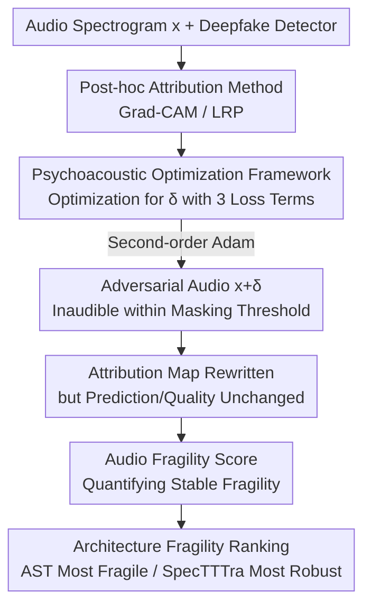

# The Perceived Fragility of Explanations in Audio Models: Manipulation of Attribution with Unchanged Predictions

**Conference**: ICML2026  
**arXiv**: [2606.14466](https://arxiv.org/abs/2606.14466)  
**Code**: https://github.com/cncPomper/Audio-XAI  
**Area**: Interpretability / XAI Security / Audio Deepfake Detection  
**Keywords**: Attribution Map Manipulation, Psychoacoustic Masking, Adversarial Perturbation, Audio Deepfake, Interpretability Fragility

## TL;DR
The authors transfer "explanation manipulation attacks" from the visual to the audio deepfake detection domain, proposing an **optimization framework constrained by psychoacoustic masking thresholds**. This framework systematically alters Grad-CAM/LRP attribution heatmaps while remaining **completely inaudible and without changing the model's final prediction**, demonstrating that "explanations" in audio models are fragile in a security context.

## Background & Motivation
**Background**: The proliferation of synthetic audio via generative models makes audio deepfake detection critical. To foster trust in these detectors, XAI (post-hoc attribution methods like Grad-CAM, LRP) is used to highlight "acoustic artifacts driving the decision," providing visual explanations.

**Limitations of Prior Work**: While the fragility of attribution maps has been repeatedly proven in the visual domain (explanations can be manipulated), **almost no research exists in the audio domain**. Worse, visual attacks use $L_p$ norms to measure perturbation cost, whereas $L_p$ does not correlate with human auditory perception—a perturbation with a small $L_p$ norm might be clearly audible in audio, rendering the attack meaningless.

**Key Challenge**: A "valid" explanation manipulation attack on audio must simultaneously satisfy three conflicting constraints: (1) drastically changing the attribution map; (2) keeping the perturbation **inaudible** to the human ear; and (3) maintaining the **unchanged** deepfake prediction of the model. Missing any of these makes the attack either meaningless, detectable, or semantically altered. Existing works do not unify these three via domain-specific perceptual constraints.

**Goal**: To test whether audio post-hoc explanation methods remain stable under "inaudible masking perturbations"—whether XAI explanations are robust interpretations of data or can be **decoupled** from the classification decision boundary.

**Key Insight**: The authors introduce psychoacoustic masking—the effect where the human ear cannot hear certain frequency components if their energy is below a masking threshold near strong signals. Using this threshold as a perturbation budget allows for maximizing attribution disruption under the hard constraint of "inaudibility."

**Core Idea**: Design an optimization framework with a three-term loss, using dynamic psychoacoustic masking thresholds instead of $L_p$ constraints to maximize attribution shift while preserving prediction and audio quality; a continuous Audio Fragility Score is proposed to quantify this "fragility under stable conditions."

## Method

### Overall Architecture
The input is an audio segment (represented as a spectrogram) and a deepfake detector to be explained. The output is an adversarial audio with an inaudible perturbation $\delta$ that significantly rewrites the attribution heatmap while keeping the classification label and audio quality unchanged. The workflow is: select a post-hoc explanation method (Grad-CAM / LRP) → apply to three target models (VGGish / AST / SpecTTTra) → use a 3-loss optimizer to find perturbation $\delta$ → evaluate using domain-specific perception and attribution alignment metrics, summarized by the Audio Fragility Score.

### Key Designs

**1. Psychoacoustic Masking Loss: Substituting "Inaudibility" for $L_p$ as Perturbation Budget**

Addressing the disconnect between $L_p$ and auditory perception, the authors build perturbation constraints directly on the human masking threshold. The total loss consists of three weighted terms:

$$\mathcal{L}(\delta)=\mathcal{L}_{explain}(\delta)+\lambda_{aud}\mathcal{L}_{audibility}(\delta)+\lambda_{pred}\mathcal{L}_{pred\_preserve}(\delta)$$

The audibility penalty is the core innovation:

$$\mathcal{L}_{audibility}(\delta)=\mathbb{E}\big[\max(0,\,20\log_{10}|\mathcal{F}(\delta)|-T(x))^2\big]$$

$T(x)$ is the static masking threshold pre-calculated from the clean input. This term **only penalizes perturbation spectral energy that exceeds the human perceptual threshold**. Perturbations below the threshold are "free." This guides the optimizer to place perturbations in "inaudible" frequency bands, guaranteeing imperceptibility by mechanism, supplemented by a hard waveform constraint $\delta\in[-\varepsilon,\varepsilon]$.

**2. Explanation Shift + Prediction Preservation: Decoupling Explanations from Decisions**

$\mathcal{L}_{explain}$ minimizes the cosine similarity between the original and perturbed attribution maps, forcing a large shift in the heatmap. $\mathcal{L}_{pred\_preserve}$ is a margin-based hinge loss that penalizes any perturbation that changes the original prediction. These two terms push the attack to **decouple the explanation from the decision boundary**: the model still classifies the input as deepfake, but the "reason given" is rewritten. Since attacking attribution requires second-order derivatives, the authors use Adam for optimization rather than standard sign-based PGD.

**3. Audio Fragility Score: Continuous Metric for "Manipulability under Stability"**

Binary attack success rates fail to describe how much an explanation is shifted while maintaining prediction and quality. The authors define the continuous metric $AFS^{stable}$:

$$AFS^{stable}_i=\Big(1-\frac{C_i+T_i}{2}\Big)\mathbf{1}[\hat{y}^{orig}_i=\hat{y}^{adv}_i]\,Q_i$$

The first term $(1-\frac{C_i+T_i}{2})$ measures the magnitude of attribution shift using cosine similarity $C_i$ and Top-10 overlap $T_i$. The indicator function $\mathbf{1}[\cdot]$ acts as a hard gate—**it returns zero if the predicted class changes**. $Q_i\in[0,1]$ is the normalized perceptual quality score. $AFS^{stable}\to 1$ indicates a "successful and stealthy" attack, while $\to 0$ signifies either no shift, a changed prediction, or poor audio quality.

## Key Experimental Results

### Main Results
On the SONICS deepfake dataset with 100 random audio samples, comparing the perceptual quality of three attacks (median values, higher is more stealthy):

| Model | Attack | PESQ ↑ | ViSQOL ↑ | CDPAM ↑ |
|------|------|--------|----------|---------|
| AST | Psychoacoustic (**Ours**) | 4.06 | 4.64 | 0.989 |
| AST | PGD | 2.77 | 3.80 | 0.858 |
| AST | X-Shift | 3.87 | 4.46 | 0.950 |
| VGGish | Psychoacoustic (**Ours**) | 4.43 | 4.89 | 0.995 |
| VGGish | PGD | 2.84 | 3.86 | 0.842 |

Unconstrained PGD drops quality to PESQ≈2.8, introducing audible artifacts. The proposed psychoacoustic framework keeps noise within the masking threshold (ViSQOL>4.1, CDPAM≥0.98), allowing for large-scale explanation rewriting while remaining inaudible.

### Ablation Study / Robustness Ranking
Ranking "Model × Attack" combinations by $AFS^{stable}$ (lower rank = easier to manipulate, i.e., more fragile):

| Configuration | Median Rank | Average Rank (±SD) | Meaning |
|------|-----------|------------------|------|
| SpecTTTra | 8.0 | 7.83 ± 0.48 | Most Robust |
| VGGish | 4.5 | 4.17 ± 0.95 | Medium |
| AST | 3.0 | 3.00 ± 0.58 | Most Fragile |
| Psychoacoustic (**Ours**) | 3.0 | 4.17 ± 1.28 | Attack Side |
| PGD | 5.5 | 5.00 ± 0.68 | Attack Side |

### Key Findings
- **Architecture Determines Fragility**: Token-based AST is easiest to manipulate (attention maps are easily directed), while SpecTTTra is most robust by "diluting" constrained adversarial noise through long-range temporal modeling. PCA shows attention models shift smoothly in attribution space, while CNN models exhibit variance contraction rather than directional guidance.
- **Acoustic Texture Determines Budget**: Samples with wide bandwidth, high zero-crossing rates, and high-frequency energy (e.g., rock/electronic music) provide a larger masking budget for the optimizer. Sparse audio with high dynamic range (e.g., classical/acoustic) severely limits available perturbations.
- **Grad-CAM and LRP Complementarity**: LRP provides high-resolution per-frame attribution focused on low-frequency features, while Grad-CAM aggregates these into macro-temporal windows. Attacks exploit both by injecting periodic pixel-level perturbations affecting LRP to shift the global attention window of Grad-CAM.

## Highlights & Insights
- **Replacing $L_p$ with Psychoacoustic Masking** is the pivotal insight: it aligns attack "stealthiness" with actual human perception rather than mathematical norms, enabling inaudible explanation manipulation in the audio domain for the first time.
- **AFS^{stable} Gate Design**: Using an indicator function to force the metric to zero if predictions change cleanly characterizes the concept of "fragility under stable conditions."
- **Transferable Diagnostic Perspective**: Treating "whether an explanation can be decoupled from the decision boundary" as a probe for XAI trustworthiness is a framework transferable to other high-stakes detection systems (e.g., medical audio).
- **Practical Safety Warnings**: The study identifies which architectures (attention-based) and audio types (dense/broadband) are more vulnerable, providing actionable risk assessment for deployment.

## Limitations & Future Work
- **Static Masking Thresholds**: $T(x)$ is fixed from clean input and not updated dynamically, which may slightly misestimate true audibility.
- **Limited Evaluation Scale**: Verified on only 100 samples per model across three models and one dataset; universality needs larger-scale testing.
- **Scope of Methods**: Only Grad-CAM and LRP were attacked; other attribution families like SHAP or Integrated Gradients remain to be tested.
- **Lack of Defense**: The paper proves attacks are feasible but does not yet provide robust explanation methods "mathematically bound" to the classifier's decision boundary.
- **Dual-use Risk**: Manipulation mechanisms could be misused to hide model behavior; the authors call for corresponding defensive standards.

## Related Work & Insights
- **vs. Visual Explanation Manipulation**: Previous work proved image attribution is manipulable using $L_p$ costs. This paper argues $L_p$ is irrelevant to audio and applies psychoacoustic constraints to achieve inaudible audio manipulation.
- **vs. X-Shift**: While X-Shift forces correlations into irrelevant target regions, it lacks perceptual constraints, making it less stealthy than the proposed framework in the audio domain.
- **vs. Early Audio Robustness Work**: Prior work identified the need for domain-specific attacks or structural limits of LRP; this paper goes further by showing these are not just "inherent inaccuracies" but can be **systematically and inaudibly manipulated by an adversary**.

## Rating
- Novelty: ⭐⭐⭐⭐⭐ First implementation of perception-constrained explanation manipulation in audio deepfake detection.
- Experimental Thoroughness: ⭐⭐⭐ Covered 3 architectures × 3 attacks, but the 100-sample scale per model is relatively small.
- Writing Quality: ⭐⭐⭐⭐ Clear motivation, rigorous metric definitions, and insightful analysis of architectural dependencies.
- Value: ⭐⭐⭐⭐ High warning value for using attribution maps to audit audio detectors.

<!-- RELATED:START -->

## Related Papers

- [\[AAAI 2026\] Distribution-Based Feature Attribution for Explaining the Predictions of Any Classifier](../../AAAI2026/interpretability/distribution-based_feature_attribution_for_explaining_the_predictions_of_any_cla.md)
- [\[ICML 2026\] Manifold-Aligned Guided Integrated Gradients for Reliable Feature Attribution](manifold-aligned_guided_integrated_gradients_for_reliable_feature_attribution.md)
- [\[ICML 2026\] ExPLAIND: Unifying Model, Data, and Training Attribution to Study Model Behavior](explaind_unifying_model_data_and_training_attribution_to_study_model_behavior.md)
- [\[ICML 2026\] Towards Long-Horizon Interpretability: Efficient and Faithful Multi-Token Attribution for Reasoning LLMs](towards_long-horizon_interpretability_efficient_and_faithful_multi-token_attribu.md)
- [\[CVPR 2026\] Measuring the (Un)Faithfulness of Concept-Based Explanations](../../CVPR2026/interpretability/measuring_the_unfaithfulness_of_concept-based_explanations.md)

<!-- RELATED:END -->
