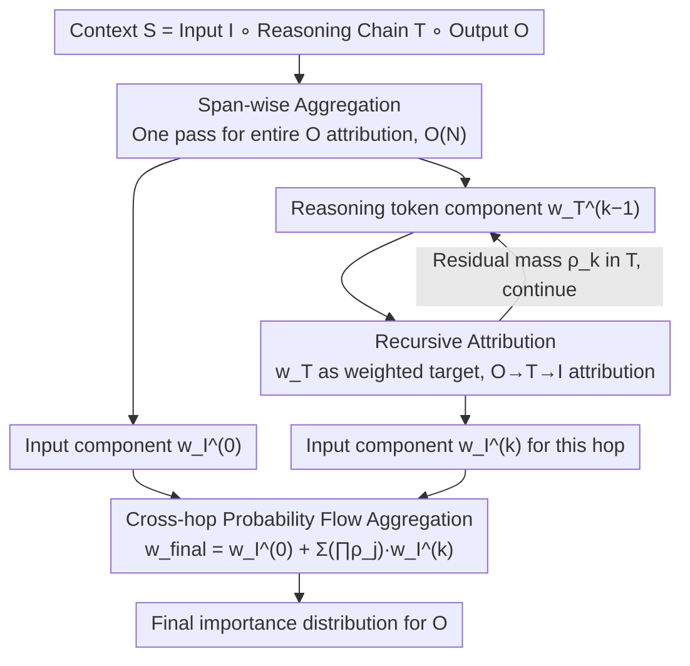

# Towards Long-Horizon Interpretability: Efficient and Faithful Multi-Token Attribution for Reasoning LLMs

**Conference**: ICML 2026 Oral  
**arXiv**: [2602.01914](https://arxiv.org/abs/2602.01914)  
**Code**: https://github.com/wbopan/flashtrace  
**Area**: Interpretability / LLM Reasoning / Token Attribution  
**Keywords**: token attribution, reasoning LLM, span-wise aggregation, recursive attribution, long-context interpretability

## TL;DR
Addressing the efficiency bottleneck of $\mathcal{O}(M\cdot N)$ in token-wise attribution and the "information absorption" effect where intermediate reasoning tokens soak up attribution mass in reasoning LLMs, this paper proposes FlashTrace. It utilizes span-wise aggregation to compute attribution for an entire target span in a single pass and employs recursive attribution to backtrace importance from the output through the reasoning chain to the original input. FlashTrace is over 130x faster than the strongest baseline IFR on 5k target spans while consistently outperforming in faithfulness across RULER, MATH, and MoreHopQA.

## Background & Motivation

**Background**: Token attribution is a primary interpretability tool for explaining LLM outputs. Mainstream approaches include perturbation-based (REAGENT/CLP), gradient-based (Integrated Gradients), and attention+relevance propagation (IFR, AttnLRP). These methods typically assume the target for explanation is a single token, calculating the causal contribution of each context token as a distribution.

**Limitations of Prior Work**: Modern reasoning LLMs (o1, DeepSeek-R1, Qwen-3) generate thousands of chain-of-thought tokens before providing an answer, posing two specific problems for token attribution:
- **Efficiency Bottleneck**: To explain an output span of length $M$, one must run attribution for each token individually, increasing complexity from $\mathcal{O}(N)$ to $\mathcal{O}(M\cdot N)$. Explaining 5k outputs takes over 10 hours with IG and 38 minutes with the fastest IFR, making it unusable in agent workflows.
- **Faithfulness Degradation (Information Absorption)**: Since the next token in an autoregressive model is directly triggered by the preceding one, reasoning tokens $\mathbf{T}$ absorb the vast majority of the attribution mass. Figure 1 quantifies this—when CoT is active, the mass assigned to $\mathbf{T}$ increases from ~80% to >90%, while the recovery rate of ground-truth input tokens drops from 26% to <10%. Explanations merely reveal that "the answer was decided by the previous reasoning step," rather than tracing back to the actual evidence in the prompt.

**Key Challenge**: Existing methods only characterize direct input→output dependencies, whereas the causal chain in reasoning LLMs is a three-stage $\mathbf{I}\to\mathbf{T}\to\mathbf{O}$ process. It is necessary to bypass the intermediate bridge $\mathbf{T}$ to transmit importance back to $\mathbf{I}$, while avoiding brute-force attribution for every token in $\mathbf{T}$. In other words, "multi-token targets" and "multi-hop propagation" must be solved simultaneously.

**Goal**: Define the multi-token attribution problem and decompose it into two sub-problems: (i) given a span $S$, calculate the contribution of all source tokens to $S$ in one pass; (ii) trace the mass absorbed by reasoning tokens back to the original input along the causal chain.

**Key Insight**: Under the ALTI/IFR framework, the contribution of an attention head to a single target position $i$ is formulated as $\mathbf{f}_{j\to i}(\mathbf{x}_j)=\alpha_{i,j}^h \cdot (\mathbf{x}_j W_V^h W_O^h)$, where $\mathbf{v}_j = \mathbf{x}_j W_V^h W_O^h$ depends only on the source token and is decoupled from the target position $i$. Extending this observation to an entire target span allows the calculation of contributions to the whole span to be algebraically factorized.

**Core Idea**: Use span-wise aggregation to compress "attribution for the entire span" into a single forward pass, then use recursive attribution to treat the scores assigned to reasoning tokens in the previous hop as "weighted targets" for the next hop, flowing importance along $\mathbf{O}\to\mathbf{T}\to\mathbf{I}$ without significant cost increases.

## Method

### Overall Architecture
The target for FlashTrace is the final output span $\mathbf{O}$ given a full context $\mathbf{S}=\mathbf{I}\circ\mathbf{T}\circ\mathbf{O}$ (input + reasoning chain + output). It aims to produce a final importance score $\mathbf{w}_{final}$ for each context token, ideally concentrating scores on the tokens in $\mathbf{I}$ that actually determine the answer. This is achieved in two layers: first, span-wise aggregation calculates attribution for the entire $\mathbf{O}$ in one forward pass (Hop 0), identifying the component $\mathbf{w}_{\mathbf{I}}^{(0)}$ falling on the input and $\mathbf{w}_{\mathbf{T}}^{(0)}$ absorbed by reasoning tokens. Second, $\mathbf{w}_{\mathbf{T}}^{(k-1)}$ is used as a weighted target for recursive attribution (Hop $k\ge 1$), allowing mass to continue flowing towards the input. Finally, components from each hop are synthesized into a single distribution based on "residual mass." All steps utilize the L1 proximity metric from ALTI: $\text{Proximity}(\mathbf{z},\mathbf{y}) = \max(0, -\|\mathbf{y}-\mathbf{z}\|_1 + \|\mathbf{y}\|_1)$. Experimentally, $K=1$ is sufficient.

### Key Designs

**1. Span-wise Aggregation: Compressing Span Attribution into One Forward Pass**

The efficiency bottleneck stems from $M$ target tokens requiring $M$ separate attribution runs, totaling $\mathcal{O}(M\cdot N)$. FlashTrace represents the entire target span by summing its hierarchical representations $\mathbf{Y}_S=\sum_{i\in S}\mathbf{y}_i$. The contribution of source token $j$ to the span is defined as $\mathbf{Z}_S=\sum_{i\in S}\mathbf{z}_{j\to i}$. Leveraging the linearity of attention, the attention head contribution $\alpha_{i,j}^h \cdot \mathbf{v}_j$ where $\mathbf{v}_j = \mathbf{x}_j W_V^h W_O^h$ can be rewritten as $\mathbf{F}_{j\to S}=\mathbf{v}_j \cdot (\sum_{i\in S}\alpha_{i,j}^h)$. The expensive V/O projections are computed only once; each additional target position requires only one scalar multiplication-addition. This is a pure algebraic rearrangement with no approximation, preserving the faithfulness properties of ALTI/IFR while reducing complexity from $\mathcal{O}(M\cdot N)$ to $\mathcal{O}(N)$.

**2. Recursive Attribution: Backtracing Mass Along the Reasoning Chain**

Single-hop attribution often identifies the reasoning token $\mathbf{T}$ as the primary influence due to information absorption. FlashTrace converts the importance $\mathbf{w}_{\mathbf{T}}^{(k-1)}$ assigned to reasoning tokens into a "weighted target" for the next hop. Span-wise aggregation is generalized from a 0/1 mask to a weighted span: the new target is $\mathbf{Y}^{(k)}=\sum_{j\in \mathbf{T}} w_j^{(k-1)} \cdot \mathbf{y}_j$, with corresponding contribution $\mathbf{Z}^{(k)}=\sum_{j\in \mathbf{T}} w_j^{(k-1)} \cdot \mathbf{z}_{k\to j}$. The factorization still applies ($\mathbf{v}_k$ is computed once, multiplied by $\sum_j w_j^{(k-1)}\alpha_{j,k}^h$), keeping the cost of each hop roughly equal to one forward pass. This interprets importance as "information flow probability," allowing mass to flow back to $\mathbf{I}$.

**3. Cross-hop Probability Flow Aggregation**

After $K$ hops, multiple input component distributions $\mathbf{w}_{\mathbf{I}}^{(k)}$ exist. To avoid unfairly amplifying hops with short reasoning chains, FlashTrace treats the recursion as a step-by-step diversion of mass: at each hop, mass either "settles" into the input or "remains in the reasoning chain." The final distribution is $\mathbf{w}_{final}=\mathbf{w}_{\mathbf{I}}^{(0)}+\sum_{k=1}^{K}(\prod_{j=0}^{k-1}\rho_j)\cdot \mathbf{w}_{\mathbf{I}}^{(k)}$, where $\rho_j$ is the residual mass in $\mathbf{T}$. This merges distributions on the same probabilistic scale, making results comparable and visualizable.

### Loss & Training
FlashTrace is a training-free, post-hoc interpretability algorithm. It requires no training loss, model weight modifications, or intrusive assumptions about the underlying Transformer—only forward attention weights and value/output projections are needed. The only hyperparameter is the number of recursive hops $K$ (default $K=1$).

## Key Experimental Results

### Main Results

Evaluated on RULER (Needle-in-a-Haystack mq, Variable Tracking mv, HotpotQA), using Qwen-3 8B Instruct. Metrics: Recovery Rate ↑ / RISE ↓ / MAS ↓.

| Dataset (Task) | Metric | FlashTrace | Best Baseline | Gain |
|---|---|---|---|---|
| mq q4 (NIAH) | Recovery Rate ↑ | 0.413 | 0.328 (IFR) | +8.5 pp |
| mv v4 (Var Tracking) | Recovery Rate ↑ | 0.516 | 0.452 (IFR) | +6.4 pp |
| HotpotQA h4 c1 | Recovery Rate ↑ | 0.755 | 0.253 (IFR) / 0.229 (AttnLRP) | +50 pp |
| HotpotQA(1024) | RISE ↓ | 0.033 | 0.074 (IFR) | −55% |
| MATH | MAS ↓ | 0.446 | 0.490 (IFR) | −9% |
| MoreHopQA | MAS ↓ | 0.205 | 0.228 (IFR) | −10% |
| Aider Code Gen | MAS ↓ | 0.173 | 0.773 (IFR avg) | −78% |

**Efficiency** (5k token target span, RULER): FlashTrace < 20 s, IFR > 38 min, **130×+ acceleration**. IG/Perturbation methods OOM on long contexts.

### Ablation Study

| Configuration | Complexity | Time (s) | RISE ↓ | MAS ↓ | Description |
|---|---|---|---|---|---|
| Exhaustive Token-Level Rollout | $\mathcal{O}(M\cdot N)$ | 11.2 | 0.116 | 0.193 | Theoretical upper bound on MoreHopQA |
| FlashTrace (Span-wise + Rec.) | $\mathcal{O}(N)$ | 0.72 | 0.128 | 0.205 | Time ↓93.6%, Faithfulness drop ~10% |
| FlashTrace, K=0 (No Recursion) | — | — | — | — | Mass stuck in $\mathbf{T}$, recovery rate <10% |

### Key Findings
- **Recursion is a Paradigm Shift**: With just $K=1$, the HotpotQA Recovery Rate jumps from ~0.20 to >0.70, proving that information absorption requires explicit modeling of the $\mathbf{O}\to\mathbf{T}\to\mathbf{I}$ flow.
- **Span-wise as a Free Lunch**: Compared to exhaustive rollout, FlashTrace reduces runtime by 93.6% while only degrading faithfulness by 6-10%.
- **Cross-task Stability**: On Aider (Code Gen), MAS improves nearly 5-fold over IFR, showing the method handles structured intermediate outputs (diffs) as effectively as natural language.
- **Efficiency Dominance**: FlashTrace memory and time remain nearly flat relative to target span length, making it viable for real-time agent auditing.

## Highlights & Insights
- **Algebraic Identity Leverage**: The extraction of $\mathbf{F}_{j\to S}$ is the "lever" of the paper—it transforms span attribution into a scalar-weighted version of single-token attribution, eliminating the $M$-dimensional loop without approximation.
- **Probability Flow Perspective**: Treating recursion as mass settlement ($\rho_k$) provides a probabilistic framework that naturally supports early stopping and ensures hops are merged on a comparable scale.
- **Diagnostic-Driven Method**: The paper quantifies the "information absorption" problem first, turning a fuzzy observation into measurable metrics before proposing specific architectural solutions.

## Limitations & Future Work
- **Proximity vs. Counterfactuals**: L1 proximity measures informational contribution (correlation-like) rather than strict counterfactual causation, though experiments show high predictive power for the latter.
- **Fixed Hops**: While $K=1$ works for most cases, hyper-long reasoning traces might benefit from adaptive $K$ or threshold-based stopping.
- **Continuous Span Constraint**: While mathematically applicable to any subset, the method naturally favors continuous spans. Identifying optimal non-continuous targets remains an open challenge.

## Related Work & Insights
- **vs AttnLRP / IFR**: FlashTrace upgrades the target from a token to a weighted span and introduces multi-hop recursion, addressing both the speed and information absorption flaws of these predecessors.
- **vs CAGE**: CAGE also uses recursion but operates at the sentence level with multiple full attribution runs. FlashTrace is orders of magnitude faster by working at the token-span level with $\mathcal{O}(N)$ complexity.
- **vs Integrated Gradients**: While IG has axiomatic guarantees, its memory footprint causes OOM in long-context scenarios where FlashTrace excels.

## Rating
- Novelty: ⭐⭐⭐⭐ 
- Experimental Thoroughness: ⭐⭐⭐⭐ 
- Writing Quality: ⭐⭐⭐⭐⭐ 
- Value: ⭐⭐⭐⭐⭐ 

<!-- RELATED:START -->

## Related Papers

- [\[ICLR 2026\] Hessian-Enhanced Token Attribution (HETA): Interpreting Autoregressive LLMs](../../ICLR2026/interpretability/hessian-enhanced_token_attribution_heta_interpreting_autoregressive_llms.md)
- [\[ACL 2026\] Jacobian Scopes: Token-Level Causal Attributions in LLMs](../../ACL2026/interpretability/jacobian_scopes_token-level_causal_attributions_in_llms.md)
- [\[ICML 2026\] IQA-Spider: Unifying Multi-Granularity Image Quality Assessment with Reasoning, Grounding and Referring](iqa-spider_unifying_multi-granularity_image_quality_assessment_with_reasoning_gr.md)
- [\[ICML 2026\] From Rashomon Theory to PRAXIS: Efficient Decision Tree Rashomon Sets](from_rashomon_theory_to_praxis_efficient_decision_tree_rashomon_sets.md)
- [\[ICML 2026\] Interpretability Can Be Actionable](interpretability_can_be_actionable.md)

<!-- RELATED:END -->
