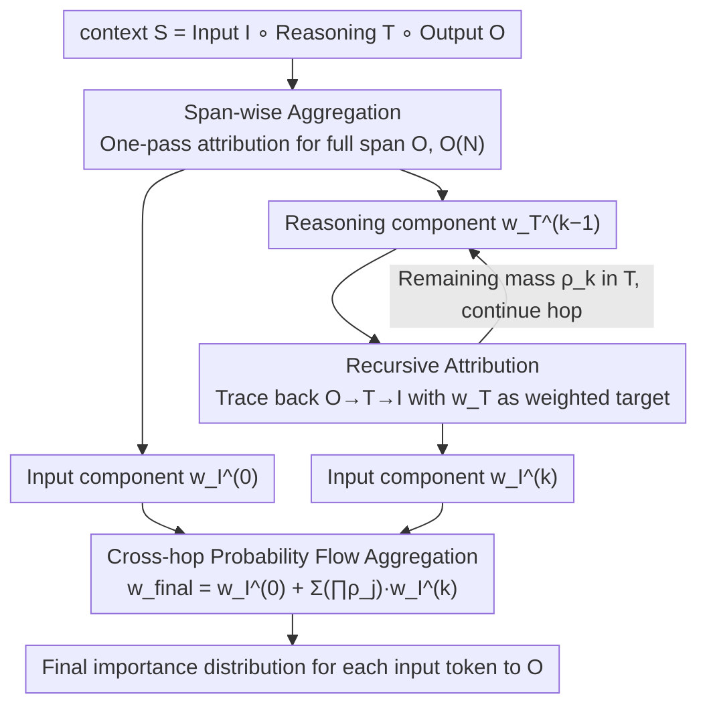

# Towards Long-Horizon Interpretability: Efficient and Faithful Multi-Token Attribution for Reasoning LLMs

**Conference**: ICML 2026 Oral  
**arXiv**: [2602.01914](https://arxiv.org/abs/2602.01914)  
**Code**: https://github.com/wbopan/flashtrace  
**Area**: Interpretability / LLM Reasoning / Token Attribution  
**Keywords**: token attribution, reasoning LLM, span-wise aggregation, recursive attribution, long-context interpretability

## TL;DR
Addressing the issues where per-token attribution is slow ($\mathcal{O}(M\cdot N)$) and attribution quality is "absorbed" by intermediate reasoning tokens in long chain-of-thought scenarios of reasoning LLMs, this paper proposes FlashTrace. It utilizes span-wise aggregation to calculate attribution for an entire target span in one pass, and recursive attribution to trace importance back from the output through the reasoning chain to the original input. It is over 130x faster than the strongest baseline IFR on 5k target spans, while comprehensively outperforming in faithfulness on RULER / MATH / MoreHopQA.

## Background & Motivation

**Background**: Token attribution is a mainstream interpretability method for explaining LLM outputs. Dominant approaches include perturbation-based (REAGENT/CLP), gradient-based (Integrated Gradients), and attention+relevance propagation (IFR, AttnLRP). These methods typically assume the attribution target is a single token and calculate the distribution of causal contributions from every context token to that target.

**Limitations of Prior Work**: Modern reasoning LLMs (o1, DeepSeek-R1, Qwen-3) generate thousands of chain-of-thought tokens before providing an answer, revealing two specific problems for token attribution:
- Efficiency Bottleneck: To explain an output span of length $M$, attribution must be run for each token individually, increasing complexity from $\mathcal{O}(N)$ to $\mathcal{O}(M\cdot N)$. Using IG for 5k outputs takes over 10 hours, and even the fastest baseline IFR takes 38 minutes, making it unusable in agent workflows.
- Faithfulness Decline (Information Absorption): In autoregressive models, a token is directly triggered by its preceding token, causing reasoning tokens $\mathbf{T}$ to absorb the vast majority of attribution mass. Figure 1 quantifies this: when CoT is active, the mass assigned to $\mathbf{T}$ rises from ~80% to >90%, while the recovery rate of ground-truth input tokens plummets from 26% to <10%. Ultimately, explanations only indicate that "the answer was determined by the previous reasoning sentence," failing to trace back to the actual evidence in the prompt.

**Key Challenge**: Existing methods only characterize direct input→output dependencies, whereas the causal chain in reasoning LLMs is a three-stage $\mathbf{I}\to\mathbf{T}\to\mathbf{O}$ process. One must bypass the intermediate bridge $\mathbf{T}$ to propagate importance back to $\mathbf{I}$, while avoiding brute-force attribution for every token in $\mathbf{T}$. In other words, "multi-token targets" and "multi-hop propagation" must be solved simultaneously to avoid choosing between efficiency and faithfulness.

**Goal**: Define the multi-token attribution problem and split it into two sub-problems: (i) given a span $S$, calculate the contributions of all source tokens to $S$ in one pass; (ii) trace the mass absorbed by reasoning tokens back to the original input along the causal chain.

**Key Insight**: The authors observe that under the ALTI/IFR framework, the contribution of an attention head to a single target position $i$ can be written as $\mathbf{f}_{j\to i}(\mathbf{x}_j)=\alpha_{i,j}^h \cdot (\mathbf{x}_j W_V^h W_O^h)$, where $\mathbf{v}_j = \mathbf{x}_j W_V^h W_O^h$ depends only on the source token and is decoupled from the target position $i$. By extending this observation to an entire target span, the task of "calculating all source token contributions to the full span" can be algebraically factorized.

**Core Idea**: Use span-wise aggregation to compress "attribution to a full span" into a single forward pass, and then use recursive attribution to treat the scores assigned to reasoning tokens in the previous hop as "weighted targets" for the next hop. This allows importance to flow back along $\mathbf{O}\to\mathbf{T}\to\mathbf{I}$ without significant additional cost.

## Method

### Overall Architecture
The target to be explained by FlashTrace is the model's final output span $\mathbf{O}$. The input is a complete context $\mathbf{S}=\mathbf{I}\circ\mathbf{T}\circ\mathbf{O}$ (user input + reasoning chain + output). The final result is an importance score $\mathbf{w}_{final}$ for each context token, ideally aggregating scores precisely onto the few tokens in the original input $\mathbf{I}$ that truly determine the answer. This is achieved in two layers: first, span-wise aggregation calculates the attribution for the entire span $\mathbf{O}$ in one forward pass (Hop 0), obtaining components $\mathbf{w}_{\mathbf{I}}^{(0)}$ falling on the input and $\mathbf{w}_{\mathbf{T}}^{(0)}$ absorbed by reasoning tokens. Then, $\mathbf{w}_{\mathbf{T}}^{(k-1)}$ is treated as a weighted target for the next hop to recursively redo attribution (Hop $k\ge 1$), letting mass flow further back to the input along $\mathbf{O}\to\mathbf{T}\to\mathbf{I}$. Finally, input components from each hop are synthesized into a single distribution based on "remaining mass." All attributions share the L1 proximity metric from ALTI: $\text{Proximity}(\mathbf{z},\mathbf{y}) = \max(0, -\|\mathbf{y}-\mathbf{z}\|_1 + \|\mathbf{y}\|_1)$ (measuring how much the norm of target vector $\mathbf{y}$ shrinks after removing contribution $\mathbf{z}$), which is more stable than cosine in high-dimensional anisotropic Transformer spaces. In experiments, $K=1$ is sufficient.

### Key Designs

**1. Span-wise Aggregation: Compressing Full-Span Attribution into a Single Pass**

The efficiency bottleneck stems from the fact that an output span has $M$ tokens, each requiring a separate attribution run, leading to $\mathcal{O}(M\cdot N)$ complexity. FlashTrace defines the hierarchical representation of the entire target as a sum $\mathbf{Y}_S=\sum_{i\in S}\mathbf{y}_i$, and the contribution of source token $j$ to the full span as $\mathbf{Z}_S=\sum_{i\in S}\mathbf{z}_{j\to i}$, applying the same L1 proximity. The key leverage is the linearity of attention: in the head contribution $\alpha_{i,j}^h \cdot \mathbf{v}_j$, the term $\mathbf{v}_j = \mathbf{x}_j W_V^h W_O^h$ depends only on the source token and is decoupled from target position $i$. Thus, it can be factored out: $\mathbf{F}_{j\to S}=\mathbf{v}_j \cdot (\sum_{i\in S}\alpha_{i,j}^h)$. The expensive V/O projections are calculated only once; each additional target position adds only a scalar multiply-add. Residual flows are similarly summed by span. This is a pure algebraic rearrangement with no approximation, preserving all faithfulness properties of ALTI/IFR while reducing complexity from $\mathcal{O}(M\cdot N)$ to $\mathcal{O}(N)$.

**2. Recursive Attribution: Backtracking Mass Along the Reasoning Chain**

Single-hop attribution identifies that "the answer was decided by the previous reasoning sentence" because reasoning tokens $\mathbf{T}$ absorb most of the mass. FlashTrace converts the importance assigned to reasoning tokens in the previous hop, $\mathbf{w}_{\mathbf{T}}^{(k-1)}$, into a "weighted target" for the next hop, allowing mass to bypass $\mathbf{T}$ and reach $\mathbf{I}$. Specifically, span-wise aggregation is extended from 0/1 masks to weighted spans. The new target is $\mathbf{Y}^{(k)}=\sum_{j\in \mathbf{T}} w_j^{(k-1)} \cdot \mathbf{y}_j$, with corresponding contribution $\mathbf{Z}^{(k)}=\sum_{j\in \mathbf{T}} w_j^{(k-1)} \cdot \mathbf{z}_{k\to j}$. The same factorization holds—$\mathbf{v}_k$ is calculated once and multiplied by the scalar $\sum_j w_j^{(k-1)}\alpha_{j,k}^h$, making each hop's cost roughly equal to one forward pass. This equates importance to "information flow probability." By designing this as the same "weighted span-wise op," it answers "which part of the prompt decided that reasoning step" without expensive sentence-level segmentation.

**3. Cross-hop Probability Flow Aggregation: Synthesizing Multi-hop Results**

After $K$ hops, there are $K$ input components $\mathbf{w}_{\mathbf{I}}^{(k)}$. Simple addition would unfairly amplify hops with shorter reasoning chains. FlashTrace views the recursive process as a hop-by-hop diversion of mass—at each hop, mass either "precipitates" to the input or "remains in the reasoning chain awaiting the next explanation." Results are merged after adjusting for remaining mass: $\mathbf{w}_{final}=\mathbf{w}_{\mathbf{I}}^{(0)}+\sum_{k=1}^{K}(\prod_{j=0}^{k-1}\rho_j)\cdot \mathbf{w}_{\mathbf{I}}^{(k)}$, where $\rho_j$ is the remaining mass on $\mathbf{T}$ at hop $j$. This merges distributions on the same probability scale. Small $\rho_k$ values naturally provide an early-stopping signal; in experiments, $K=1$ resolves most reasoning chain dependencies.

### Loss & Training
FlashTrace is a training-free, post-hoc interpretability algorithm. It requires no training loss, no weight modifications, and makes no intrusive assumptions about the underlying Transformer architecture—it only uses forward attention weights and value/output projections. The only hyperparameter is the number of recursive hops $K$ (default $K=1$).

## Key Experimental Results

### Main Results

Evaluated on RULER series (multi-query Needle-in-a-Haystack mq, Variable Tracking mv, long-context HotpotQA) using Qwen-3 8B Instruct. Metrics: Recovery Rate↑ / RISE↓ / MAS↓.

| Dataset (Task) | Metric | FlashTrace | Strongest Baseline | Gain |
|---|---|---|---|---|
| mq q4 (NIAH) | Recovery Rate ↑ | 0.413 | 0.328 (IFR) | +8.5 pp |
| mv v4 (Variable Tracking) | Recovery Rate ↑ | 0.516 | 0.452 (IFR) | +6.4 pp |
| HotpotQA h4 c1 | Recovery Rate ↑ | 0.755 | 0.253 (IFR) / 0.229 (AttnLRP) | +50 pp |
| HotpotQA(1024) | RISE ↓ | 0.033 | 0.074 (IFR) | −55% |
| MATH | MAS ↓ | 0.446 | 0.490 (IFR) | −9% |
| MoreHopQA | MAS ↓ | 0.205 | 0.228 (IFR) | −10% |
| Aider Code Gen | MAS ↓ | 0.173 | 0.773 (IFR per-token avg) | −78% |

Efficiency (5k token target span, RULER): FlashTrace < 20 s, IFR > 38 min, **130×+ acceleration**. IG / IG-Attn / Perturbation OOM on long contexts (Figure 4).

### Ablation Study

| Configuration | Complexity | Time (s) | RISE ↓ | MAS ↓ | Description |
|---|---|---|---|---|---|
| Exhaustive Token-Level Rollout | $\mathcal{O}(M\cdot N)$ | 11.2 | 0.116 | 0.193 | Brute-force upper bound on MoreHopQA |
| FlashTrace (span-wise + recursion) | $\mathcal{O}(N)$ | 0.72 | 0.128 | 0.205 | Time ↓93.6%, Faithfulness ↓ ~10% |
| FlashTrace, K=0 (No recursion) | — | — | — | — | Figure 1: Mass stuck in $\mathbf{T}$, recovery rate <10% |
| FlashTrace on LLaMA-3.1-8B-It | — | — | 0.171 | 0.231 | Outperforms IFR (0.206/0.298) and AttnLRP (0.398/0.683) |

### Key Findings
- **Recursion is a qualitative leap**: With just $K=1$, the HotpotQA Recovery Rate jumps from 0.13–0.25 (IFR/AttnLRP) to 0.51–0.76. This proves that information absorption is not a minor issue but requires explicit $\mathbf{O}\to\mathbf{T}\to\mathbf{I}$ modeling.
- **Span-wise is a near-costless approximation**: Compared to Exhaustive Rollout, FlashTrace degrades RISE/MAS by only 6–10% on MoreHopQA while reducing runtime by 93.6%. Aggregating multi-token targets is a high-quality approximation.
- **Stable across tasks and models**: On Aider (code generation), MAS dropped nearly 5x compared to IFR, showing it handles structured intermediate products like code diffs.
- **Efficiency curve determines usability**: FlashTrace's memory and time remain nearly flat relative to target span length, allowing it to run in real-time agent workflows.

## Highlights & Insights
- **Free lunch via algebraic identities**: Factoring out $\mathbf{v}_j$ makes span-wise attribution mathematically equivalent to scalar-weighted single-token attribution, eliminating the $M$-dimensional loop without introducing approximations.
- **Interpretability as probability flow**: Treating recursion as mass diversion provides a probabilistic meaning and natural early stopping, avoiding arbitrary hyperparameter tuning.
- **Diagnosis is half the solution**: By first quantifying information absorption, the authors transformed a vague problem into measurable metrics, leading to targeted design choices.

## Limitations & Future Work
- **Proximity is correlation, not counterfactual**: The metric measures informational flow rather than strict causal intervention (mediation analysis).
- **Fixed $K=1$ cost**: While sufficient for most cases, hyper-long reasoning traces (nested tool-calls) might need adaptive $K$.
- **Continuous span requirement**: While the formula works for any subset, the paper focuses on continuous spans. Automatically selecting key non-continuous targets remains an open question.
- **Scale**: Experiments were limited to 8B models; validation on MoE or 30B+ models is pending.

## Related Work & Insights
- **vs AttnLRP / IFR**: FlashTrace upgrades targets to weighted spans and adds explicit multi-hop recursion, addressing speed and reasoning absorption.
- **vs CAGE**: CAGE uses sentence-level targets and multiple full attributions, whereas FlashTrace stays at the token-span level with $\mathcal{O}(N)$ complexity.
- **vs Integrated Gradients / Perturbation**: FlashTrace sacrifices "perfect" axiomatic guarantees for engineering-ready latency in long contexts.

## Rating
- Novelty: ⭐⭐⭐⭐
- Experimental Thoroughness: ⭐⭐⭐⭐
- Writing Quality: ⭐⭐⭐⭐⭐
- Value: ⭐⭐⭐⭐⭐

<!-- RELATED:START -->

## Related Papers

- [\[ICML 2026\] IQA-Spider: Unifying Multi-Granularity Image Quality Assessment with Reasoning, Grounding and Referring](iqa-spider_unifying_multi-granularity_image_quality_assessment_with_reasoning_gr.md)
- [\[ICML 2026\] Manifold-Aligned Guided Integrated Gradients for Reliable Feature Attribution](manifold-aligned_guided_integrated_gradients_for_reliable_feature_attribution.md)
- [\[ICML 2026\] From Rashomon Theory to PRAXIS: Efficient Decision Tree Rashomon Sets](from_rashomon_theory_to_praxis_efficient_decision_tree_rashomon_sets.md)
- [\[ICML 2026\] Interpretability Can Be Actionable](interpretability_can_be_actionable.md)
- [\[ICML 2026\] LLMs Lean on Priors, Not Programming Language Semantics](llms_lean_on_priors_not_programming_language_semantics.md)

<!-- RELATED:END -->
