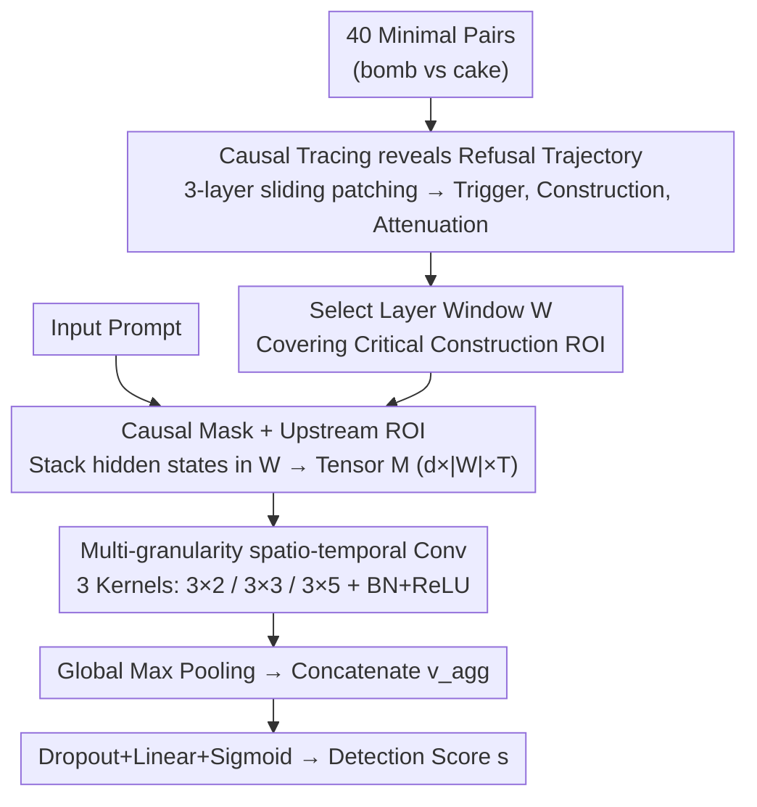

# Tracing the Dynamics of Refusal: Exploiting Latent Refusal Trajectories for Robust Jailbreak Detection

**Conference**: ICML 2026  
**arXiv**: [2605.02958](https://arxiv.org/abs/2605.02958)  
**Code**: Not public  
**Area**: LLM Security / Mechanistic Interpretability / Jailbreak Detection  
**Keywords**: Refusal vector, Causal Tracing, Causal Mask, Sparse Activation, Zero-shot Detection

## TL;DR
This paper utilizes Causal Tracing to discover that "refusal" in LLMs is not a static vector at terminal tokens but a "Refusal Trajectory" spanning upstream intermediate layers and tokens. Based on this, the authors design SALO—a <20M parameter detector trained only on standard alignment data. By leveraging the irreversibility of Transformer causal masks, SALO identifies adversarial attacks like GCG, AutoDAN, and Prefilling, increasing the detection rate from 0% to >85% on GCG/Prefilling tasks.

## Background & Motivation

**Background**: Large model alignment primarily relies on RLHF/DPO and external detectors (Llama Guard, PPL Filter, SmoothLLM, GradSafe). The mechanistic interpretability (MI) branch seeks a "refusal direction" within residual flows, using Representation Engineering (RepE) to extract a static vector from the hidden states of terminal tokens to describe or manipulate refusal behavior (Arditi et al. 2024, Wollschläger et al. 2025).

**Limitations of Prior Work**: (1) PPL Filters are only effective against high-perplexity GCG suffixes and drop to 0% when encountering Prefilling or AutoDAN. (2) Methods requiring gradient backpropagation through the LLM, such as GradSafe, are equally fragile against Prefilling and adaptive attacks (12% detection rate for Prefilling on Llama-3.1). (3) RepE/Linear Probes based on terminal hidden states perform adequately on direct harmful prompts but collapse on GCG attacks specifically optimized to suppress terminal refusal signals (64.2% for Linear Probe on Llama-3.1-GCG).

**Key Challenge**: All existing white-box defenses share an unquestioned assumption: "refusal signals are concentrated at the terminal tokens or the final layer." Optimization attacks like GCG target this terminal readout vector via gradient descent to suppress the signal. However, the causal mask of attention ($h_i=f(x_1,\dots,x_i)$) implies that adversarial suffixes appended to instructions **cannot retroactively modify the hidden states of preceding tokens**. Therefore, if refusal occurs upstream, it should be preserved. The core question becomes: is the refusal signal truly only at the terminal?

**Goal**: (1) Use causal intervention (Causal Tracing) rather than observational correlation to mechanistically locate the internal positions carrying "refusal decisions"; (2) Design a robust detector that examines only upstream activity and does not rely on adversarial samples for training.

**Key Insight**: Refusal is a dynamic sparse trajectory consisting of "Semantic Trigger → Critical Construction → Terminal Attenuation" rather than a single terminal point. Using multi-scale convolutions on the upstream Region of Interest (ROI) covered by this trajectory can bypass attacks targeting the terminal.

## Method

### Overall Architecture
The method consists of two parts: **Mechanistic Discovery (Section 3)**—using Causal Tracing on Qwen2.5-3B with 3-layer sliding window patching to scan which hidden state pairs $(l,i)$ trigger a refusal when replaced, then aggregating results across 40 minimal pairs to map the sparse distribution of the Refusal Trajectory. **SALO Detector (Section 4)**—fixing a layer window $W=\{l_{start},\dots,l_{end}\}$ covering the high-activation trajectory zone, stacking hidden states of all tokens in these layers into a 3D tensor $\mathbf{M}\in\mathbb{R}^{d\times|W|\times T}$. Three sets of 2D convolutional kernels with different temporal widths ($2/3/5$) are used for multi-granularity spatio-temporal feature extraction, followed by BN + ReLU + Global Max Pooling to obtain $\mathbf{v}_{(h,w)}$. After concatenation, a Dropout (p=0.5) + Linear layer + Sigmoid outputs the detection score $s$. The training data **only includes standard PKU-SafeRLHF + Toxic-Chat (~5500 prompts), with no jailbreak samples seen during training**, relying on the irreversibility of Causal Attention for zero-shot generalization to unseen attacks.

### Key Designs

**1. Causal Tracing Reveals Refusal Trajectory: Refusal as a Sparse Trajectory, Not a Terminal Point**

To challenge the assumption that refusal signals concentrate at terminal tokens, the authors use activation patching for causal intervention. They construct minimal pairs $(x_{\text{mal}}, x_{\text{ben}})$ differing only by a semantic anchor (e.g., "bomb" vs. "cake"), cache malicious hidden states $h_i^l$, and patch them into the benign forward pass. The intensity is measured by the cross-entropy loss of the "I'm sorry" prefix. Heatmaps aggregated from 40 pairs reveal a three-stage trajectory: The **Semantic Trigger** phase shows strong signals at the anchor word position even in shallow layers. The **Critical Construction** phase follows immediately (e.g., at the "?") in intermediate layers where refusal decisions are truly written into the residual stream. Finally, the **Terminal Attenuation** phase shows the signal decaying as it moves down the sequence, only partially recovering at terminal tokens. This trajectory explains why GCG bypasses terminal probes: it never modifies the upstream trajectory, only flattens the terminal readout.

**2. Causal Mask + Upstream ROI: Provable Generalization via Architecture**

SALO's zero-shot detection of GCG is grounded in the mathematical structure of Transformers rather than data fitting. Causal attention follows $h_i = f(x_1,\dots,x_i)$, meaning adversarial suffixes appended after a malicious instruction **cannot rewrite** the hidden states of preceding instruction tokens. By restricting detection features strictly to the malicious instruction tokens (the ROI tensor $\mathbf{M}\in\mathbb{R}^{d\times|W|\times T}$), SALO remains robust. Since GCG suffixes physically follow these tokens, their optimization cannot alter the intermediate activations of the query. This provides a theoretical pillar for generalization: it is impossible for an attacker to erase the upstream trajectory without modifying the malicious query itself.

**3. Multi-granularity Spatio-temporal Convolution: Handling Heterogeneous Construction Lengths**

Different prompts have varying "critical construction" ranges (e.g., 1 to 5 tokens after the anchor). SALO addresses this with a set of convolutional kernels $\mathcal{K}=\{(3,2),(3,3),(3,5)\}$ with a fixed layer height of 3 (corresponding to the sliding window depth). The varying widths capture "Refusal Onset" (3x2), medium receptive fields (3x3), and wider contexts for long-range dependencies (3x5). Each kernel performs $\mathbf{H}_{(h,w)}=\text{ReLU}(\text{BN}(\text{Conv2d}_{(h,w)}(\mathbf{M})))$, followed by global max pooling to obtain $\mathbf{v}_{(h,w)}$. These are concatenated into $\mathbf{v}_{\text{agg}}$ to handle heterogeneous construction lengths with fewer than 20M parameters.

### Loss & Training
SALO uses a binary cross-entropy (BCE) loss based on harmful/benign labels from PKU-SafeRLHF and Toxic-Chat (~5500 prompts). All adversarial and long-context samples (>400 tokens) are filtered out. Each model (Qwen2.5-7B, Mistral-7B-v0.3, Llama-3.1-8B) is trained independently. SALO is a lightweight wrapper (<20M parameters), and the LLM backbone remains frozen with no gradient backpropagation required. Thresholds $\theta$ are calibrated on XSTest at 10% FPR before reporting Detection Success Rate (DSR) across attack scenarios.

## Key Experimental Results

### Main Results
DSR (Detection Success Rate, %) for three models across four attack types (Direct, Prefilling, GCG, AutoDAN):

| Method | Params | Gradient | Qwen-Dir | Qwen-Pre | Qwen-GCG | Qwen-DAN | Mist-Pre | Mist-GCG | Mist-DAN | Llama-Pre | Llama-GCG | Llama-DAN |
|---|---|---|---|---|---|---|---|---|---|---|---|---|
| No Defense (1-ASR) | - | - | 97.9 | 24.8 | 71.2 | 55.6 | 15.0 | 44.6 | 3.2 | 39.8 | 88.3 | 54.4 |
| PPL Filter | - | ✗ | 0 | 39.2 | **100.0** | 32.8 | 0 | **100.0** | 0 | 0 | 43.7 | **100.0** |
| GradSafe | - | ✓ | 99.4 | 0 | 17.7 | 10.0 | 1.7 | 36.7 | 2.0 | 12.0 | 76.4 | 76.0 |
| Linear Probe | <1M | ✗ | 99.0 | 96.5 | 82.9 | 99.2 | 68.1 | 71.0 | 32.0 | 87.3 | 64.2 | 98.8 |
| SmoothLLM | - | ✗ | 94.4 | 57.9 | 94.6 | 82.0 | 42.9 | 55.8 | 1.6 | 66.5 | 80.6 | 72.0 |
| **SALO** | <20M | ✗ | 99.0 | **99.4** | 88.3 | 98.8 | **99.4** | 96.5 | 98.8 | **98.3** | 85.4 | **100.0** |

AUC on XSTest: SALO achieved 94.6 / 93.2 / 94.8 for Qwen/Mistral/Llama, outperforming Linear Probe and SmoothLLM.

### Ablation Study

| Configuration | Metric (GCG / Pre on Mistral) | Description |
|---|---|---|
| Full SALO (Multi-granularity 3-kernel + Upstream ROI) | 96.5 / 99.4 | Full version |
| Terminal token only (~ Linear Probe) | 71.0 / 68.1 | Removing upstream ROI verifies terminal probe vulnerability to GCG |
| Single granularity $3\times 3$ | (Decrease as per Sec 5) | Multi-granularity is essential for heterogeneous construction |
| No Causal Tracing for layer window | (Decrease as per Appendix) | Feature selection must be mechanically driven |

### Key Findings
- **Baseline failure modes are complementary**: PPL Filter works on GCG but fails on Prefilling/AutoDAN; GradSafe works on direct prompts but collapses on adversarial attacks. SALO maintains $\geq 85\%$ across almost all scenarios.
- **Zero-shot detection without jailbreak training**: This provides empirical evidence that the refusal trajectory is an intrinsic fingerprint of malicious intent—attackers can change the output but cannot erase the model's internal awareness.
- **Terminal representation suppression is systematic**: The uniform collapse of Linear Probe and GradSafe on GCG/Prefilling confirms that the terminal tokens are the "final mile" actively suppressed by attackers.
- **Multi-granularity is more robust**: Specifically for AutoDAN's evolved long prompts, the 3x5 kernel captures scattered context, pushing Mistral-AutoDAN DSR to 98.8%.

## Highlights & Insights
- **From Correlation to Causation**: Moving from observation-based MI to intervention-based tools (Causal Tracing) provides harder evidence that translates into engineering robustness.
- **Exploiting Architectural Irreversibility**: Leveraging the mathematical fact of causal attention for zero-shot generalization is an elegant paradigm.
- **Strict Isolation of Training/Testing Distributions**: Deliberately excluding jailbreak samples from training addresses concerns regarding overfitting to known attack patterns.
- **Multi-granularity + ROI Motif**: Encoding prior mechanistic analysis (trajectory shape) into the network architecture is more data-efficient and interpretable than pure end-to-end learning.

## Limitations & Future Work
- **Limited Model Scale**: Verified only on 7-8B models. Trajectory sparsity in 70B+ or o1-level models remains untested.
- **Adaptive Attacks**: Attacks specifically targeting upstream trajectories (e.g., using metaphor/encoding to mask query semantics) have not been evaluated.
- **Manual ROI Selection**: Layer window selection still requires per-model Causal Tracing.
- **Multilingual/Cross-cultural Context**: Experiments focused on English; the consistency of trajectory patterns in mixed-language scenarios is an open question.

## Related Work & Insights
- **vs Refusal Direction**: While prior work extracts static terminal vectors susceptible to GCG optimization, this paper identifies those as "attenuated ends" and moves detection upstream.
- **vs GradSafe**: Unlike GradSafe, SALO requires no backpropagation and operates efficiently with <20M parameters.
- **vs PPL Filter / SmoothLLM**: Those are black-box methods; SALO's internal activation analysis survives "semantic traps" (e.g., AutoDAN) invisible in the input space.
- **vs ROME**: While ROME used Causal Tracing for fact storage, SALO successfully applies it to safety behavior, providing a case for MI-driven engineering.

## Rating
- Novelty: ⭐⭐⭐⭐⭐ Establishes the Refusal Trajectory mechanism and converts architectural facts into provable defense properties.
- Experimental Thoroughness: ⭐⭐⭐⭐ High coverage across models and attacks, though lacks adaptive and large-scale model testing.
- Writing Quality: ⭐⭐⭐⭐⭐ Logical progression from hypothesis to intervention to engineering implementation.
- Value: ⭐⭐⭐⭐⭐ Provides a robust paradigm for zero-shot jailbreak detection by applying mechanistic interpretability to real-world defense.

<!-- RELATED:START -->

## Related Papers

- [\[AAAI 2026\] SOM Directions are Better than One: Multi-Directional Refusal Suppression in Language Models](../../AAAI2026/interpretability/som_directions_are_better_than_one_multi-directional_refusal_suppression_in_lang.md)
- [\[ICML 2026\] Memorization Dynamics of Fill-in-the-Middle Pretraining](memorization_dynamics_of_fill-in-the-middle_pretraining.md)
- [\[ACL 2025\] Safety is Not Only About Refusal: Reasoning-Enhanced Fine-tuning for Interpretable LLM Safety](../../ACL2025/interpretability/safety_is_not_only_about_refusal_reasoning-enhanced_fine-tuning_for_interpretabl.md)
- [\[ICML 2026\] BLOCK-EM: Preventing Emergent Misalignment via Latent Blocking](block-em_preventing_emergent_misalignment_via_latent_blocking.md)
- [\[ICML 2026\] Is One Layer Enough? Understanding Inference Dynamics in Tabular Foundation Models](is_one_layer_enough_understanding_inference_dynamics_in_tabular_foundation_model.md)

<!-- RELATED:END -->
