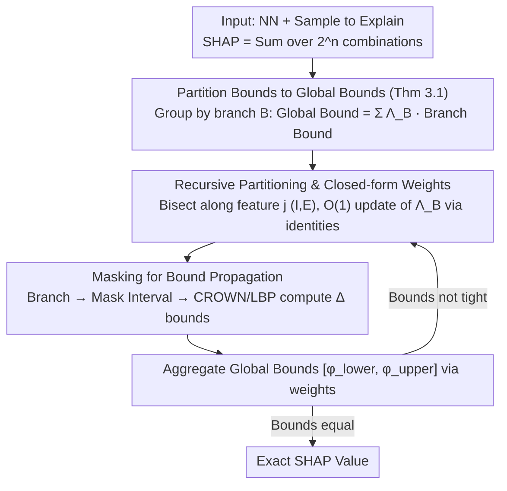

# Verified SHAP: Provable Bounds for Precise Shapley Values in Neural Networks

**Conference**: ICML 2026  
**arXiv**: [2605.24084](https://arxiv.org/abs/2605.24084)  
**Code**: https://github.com/sen-uni-kn/verishap  
**Area**: Interpretability / Neural Network Verification  
**Keywords**: SHAP, Interpretability, Neural Network Verification, Branch-and-Bound, Provable Bounds

## TL;DR
VERISHAP provides the first provable bounds for SHAP value computation in neural networks by combining branch-and-bound with neural network verification techniques—scaling to feature search spaces orders of magnitude larger than existing exact methods.

## Background & Motivation

**Background**: SHAP is the most widely used feature attribution method. While it can be computed efficiently for tree-based and linear models, exact computation for neural networks faces exponential complexity.

**Limitations of Prior Work**: Computing SHAP values for neural networks requires exploring an exponential search space over feature subsets ($2^n$ combinations). Existing methods only provide statistical approximations (KernelSHAP, DeepSHAP), which suffer from two fundamental limitations: (1) insufficient accuracy under highly non-linear models; (2) lack of a principled evaluation framework (unavailability of "ground truth" for verification).

**Key Challenge**: The contradiction between the #P-hard nature of exact SHAP computation and practical interpretability requirements—researchers cannot verify the quality of approximation methods using exact values.

**Goal**: (1) Extend the feasible scale of exact SHAP computation; (2) Provide provable bounds at arbitrary precision; (3) Establish a "ground truth" benchmark for evaluating SHAP approximation methods.

**Key Insight**: Neural network verification fields (branch-and-bound, bound propagation like CROWN) can be used to compute complex function properties but have not been applied to SHAP. The marginal contribution $\Delta_i(S)$ can be approximated as linear within feature space partitions, which perfectly aligns with the piecewise linear structure of ReLU networks.

**Core Idea**: Transform SHAP computation into an interval optimization problem using branch-and-bound—recursively partition the feature set and use bound propagation techniques from neural network verification to calculate upper and lower bounds for marginal contributions within each partition, finally recovering the exact values.

## Method

### Overall Architecture

The core challenge VERISHAP addresses is the exponential explosion of traversing $2^n$ feature combinations for exact SHAP computation in neural networks. The proposed solution reformulates "enumerating all combinations for an exact value" into an interval optimization problem. Instead of individual computations, the feature set is recursively split into multiple partitions (branches). Within each partition, bound propagation from neural network verification is used to directly calculate the upper and lower bounds of marginal contributions. These partition-level bounds are then aggregated into global SHAP bounds according to Shapley weights. If a partition remains too loose, it is further refined until the bounds converge to the exact value. This process possesses an anytime property: early termination yields provable bounds, while running to completion recovers the exact value.

### Key Designs

**1. Partition-level bounds to global bounds: Decomposing exponential sums into branch sums**

Directly handling $2^n$ terms is impractical. The first step bridges "global SHAP values" and "local quantities computable within partitions." Theorem 3.1 provides this bridge: SHAP is defined as $\varphi_i = \sum_{S \in S_i} \lambda(|S|) \Delta_i(S)$. By grouping feature subsets into branches $B_k$, obtaining a pair of bounds for marginal contributions within each branch $\Delta_{i,B}^{lower} \leq \Delta_i(S) \leq \Delta_{i,B}^{upper}$ allows deriving global bounds $\sum_{B} \Lambda_B \Delta_{i,B}^{lower} \leq \varphi_i \leq \sum_{B} \Lambda_B \Delta_{i,B}^{upper}$. Consequently, exponential per-combination summation is replaced by summation at the scale of partition counts, which is the theoretical starting point for efficiency gains.

**2. Recursive partitioning and closed-form weights: Constant-time updates via identities**

Partitions must be refined iteratively. To avoid recalculating Shapley combinatorial weights for every new branch, VERISHAP characterizes a branch using $(I, E)$ (fixed included features $I$, fixed excluded features $E$). With $r = |I|$ and $s = |I| + |E|$, the aggregated weight of the branch has a closed form $\Lambda_B = \binom{s}{r}^{-1} (s+1)^{-1}$. When a branch is bisected along an unfixed feature $j$, the child weights are derived from the parent via identities: for the inclusion child $\Lambda_{B'} = \frac{r+1}{s+2} \Lambda_B$, and for the exclusion child $\Lambda_{B''} = \frac{s+1-r}{s+2} \Lambda_B$. This allows recursive refinement with constant-time weight updates.

**3. Masking for bound propagation: Feeding discrete subsets to continuous domain verifiers**

SHAP feature subsets are discrete combinatorial objects, while bound propagation tools like CROWN are designed for continuous input intervals. VERISHAP uses a binary mask $m \in \{0,1\}^n$ to represent subset $S$ and writes the marginal contribution as $\Delta_i(m) = v(m^{+i}) - v(m)$. A branch $(I,E)$ corresponds exactly to a mask interval $[\underline{m}, \bar{m}] \subseteq [0,1]^n$, where fixed features are 0 or 1 and unfixed features span the $[0,1]$ free dimension. Passing this interval to an LBP (like CROWN) computes the bounds $[\Delta_{i,B}^{lower}, \Delta_{i,B}^{upper}]$. This step translates discrete combinatorial optimization (SHAP) into continuous convex optimization (NN verification).

## Key Experimental Results

### Main Results

| Dataset | Feature Count $n$ | Combinations | EXACTSHAP (s) | VERISHAP Exact (s) | Gain |
|--------|-----------|--------|---------------|--------------------|---------|
| Obesity | 17 | $2^{17} > 10^4$ | 4 | 18 | ✓ Feasible |
| German | 20 | $2^{20} > 10^6$ | 9 | 16 | ✓ Feasible |
| Mushroom | 22 | $2^{22} > 10^6$ | – (OOM) | 17 | **Unmatchable** |
| Default | 23 | $2^{23} > 10^6$ | – (OOM) | 127 | **Unmatchable** |
| Auto | 25 | $2^{25} \approx 3 \times 10^7$ | – (OOM) | 81 | **Unmatchable** |
| Sonar | 60 | $2^{60} > 10^{18}$ | – | 13 (10% HR) | **Huge Expansion** |

### MNIST CNN Convergence

| Iterations | Runtime (s) | Key Metric |
|------|-----------|---------|
| t=1 | 1s | Bound width > 200% NN Output |
| t=121 (25% HR) | 25s | Bound width reduced to 25% |
| t=278 (10% HR) | 29s | Attribution patterns clearly visible |
| t=512 Exact | 34s | Bounds converge; exact value recovered |

### Key Findings
- VERISHAP scales exact computation for tabular data with $n \geq 22$ by 1-2 orders of magnitude.
- Achieved bound computation in 13s for Sonar data ($n=60$) where previous methods hit OOM.
- CROWN-IBP detects function constancy across multiple combinations (Application of Theorem 3.5), avoiding enumeration of $2^{64}$ combinations.
- Bounds become usable after a few dozen iterations—attribution patterns emerge at 10% relative error.
- Splitting strategy ablation: SMEARS > SmartBranching > StrongBranching > InOrder.

## Highlights & Insights
- **Paradigm shift from verification to interpretation**: For the first time, NN verification tools are systematically introduced to SHAP computation, revealing deep links between adversarial robustness and interpretability.
- **Theory-Practice gap**: Theorem 3.5 proves that piecewise linear networks can degrade to constant queries after sufficient partitioning, bypassing combinatorial explosion.
- **Provable bounds as intermediate products**: The generated sequences of bounds are practical dozens of iterations before reaching the exact value, providing a principled solution for the time-accuracy trade-off.
- **Reversal of the evaluation framework**: For the first time, exact values can be obtained for real tabular data with 20-25 features to evaluate KernelSHAP and TreeMSR.

## Limitations & Future Work
- High-dimensional bottleneck—exact computation for $n > 25$ still requires > 100s; image RGB pixels remain impractical.
- Dependency on value function tractability—if bounds are too loose, recursion explores exponentially many branches.
- Implicit assumptions on background distributions—choice of background affects the tightness of verifier bounds.
- Future work: Integrating stronger NN verification algorithms; investigating feature aggregation theories; adapting to other attribution methods (IG, DeepLIFT).

## Related Work & Insights
- **vs ExactSHAP**: Enumerates all $2^{n-1}$ combinations, causing NN OOM; VERISHAP bypasses enumeration via BaB and bound propagation.
- **vs KernelSHAP/DeepSHAP**: MC sampling has no accuracy guarantees; VERISHAP provides a "ground truth benchmark" and upper bounds.
- **Inspiration Chain**: NN verification evolved from adversarial robustness to general bound propagation; this work flows back into the area of interpretation.

## Rating
- Novelty: ⭐⭐⭐⭐⭐ Systematic use of verification for SHAP; innovation in both paradigm and technique.
- Experimental Thoroughness: ⭐⭐⭐⭐ Comprehensive tabular data + complete ablation + MNIST visualization; lacks experiments on high-dim images.
- Writing Quality: ⭐⭐⭐⭐ Mathematically rigorous with clear pseudocode; splitting strategy section is a bit brief.
- Value: ⭐⭐⭐⭐⭐ Significant theoretical and practical value for the convergence of XAI and formal verification.

<!-- RELATED:START -->

## Related Papers

- [\[ICML 2026\] ShaplEIG: Bayesian Experimental Design for Shapley Value Estimation](shapleig_bayesian_experimental_design_for_shapley_value_estimation.md)
- [\[NeurIPS 2025\] SHAP Values via Sparse Fourier Representation](../../NeurIPS2025/interpretability/shap_values_via_sparse_fourier_representation.md)
- [\[ICML 2025\] DeltaSHAP: Explaining Prediction Evolutions in Online Patient Monitoring with Shapley Values](../../ICML2025/interpretability/deltashap_explaining_prediction_evolutions_in_online_patient_monitoring_with_sha.md)
- [\[ICML 2026\] From Rashomon Theory to PRAXIS: Efficient Decision Tree Rashomon Sets](from_rashomon_theory_to_praxis_efficient_decision_tree_rashomon_sets.md)
- [\[ICML 2026\] Interpretable Self-Supervised Learning via Representer Landmarks and Nyström Approximation](interpretable_self-supervised_learning_via_representer_landmarks_and_nyström_app.md)

<!-- RELATED:END -->
