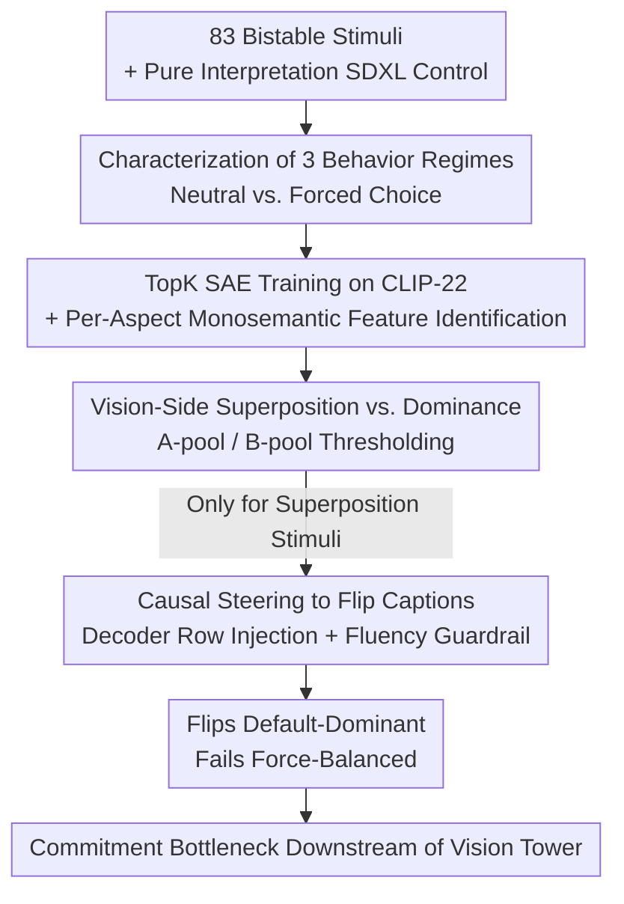

# Vision-Language Asymmetry in Bistable Image Captioning

**Conference**: ICML 2026  
**arXiv**: [2606.08031](https://arxiv.org/abs/2606.08031)  
**Code**: Yes (Authors promise to release code/configs/per-stimulus result tables upon acceptance)  
**Area**: Interpretability / Multimodal VLM  
**Keywords**: Bistable images, Vision-language asymmetry, Sparse Autoencoders, Causal intervention, Seeing and Seeing-as

## TL;DR
This paper uses Wittgensteinian "duck-rabbit" style bistable images as probes. After characterizing three behavioral regimes of LLaVA across 3320 generations, a TopK Sparse Autoencoder (SAE) is trained on the CLIP layer it consumes. The study finds that 72% of bistable stimuli activate **feature pools for both interpretations simultaneously** in the vision tower (superposition). However, causal steering can only flip "default-dominant" stimuli but fails to flip "force-balanced" ones like the Young/Old Woman—proving that the bottleneck for "committing to a specific seeing-as" lies not in the vision tower but in the downstream language decoder.

## Background & Motivation
**Background**: Feeding bistable or ambiguous images (duck-rabbit, face-vase, young-old woman, Necker cube) to VLMs has established behavioral benchmarks, generally finding that models exhibit a strong "language prior dominance"—they tend to report only one interpretation for a single image. However, these works are purely behavioral: they score generated captions against ground truth without making assertions about the representation layer.

**Limitations of Prior Work**: Behavioral benchmarks reveal "which side the model favors" but cannot answer **"where exactly the commitment to a specific side is made within the model."** Recent mechanistic work (AmbiBench) achieved intervention at the level of attention heads to improve task accuracy, but it measured "gain in accuracy after intervention" rather than "locating the representational commitment."

**Key Challenge**: Wittgenstein in *Philosophical Investigations* distinguished between "seeing" (an image) and "seeing-as" (something). For a Necker cube under a neutral prompt "What is in the image?", LLaVA provides interpretation-agnostic descriptions 40/40 times; yet, under a forced-choice prompt "Is it looking from above or below?", the same image leads to nearly a 50/50 commitment to one side. **Same input, different prompt → different reports**—where exactly is this gap between "seeing" vs. "seeing-as" implemented in a VLM?

**Goal**: Treat the contrast between "neutral vs. forced-choice" prompts as a controlled experimental handle to locate the implementation of the "gap between reports"—does the vision encoder fail to represent both interpretations, or are they represented while the language side fails to commit?

**Key Insight**: The authors argue that bistable images represent the minimal experimental condition for studying "feature competition" (instead than "feature detection")—only stimuli supporting two simultaneous interpretations allow for comparing "visual superposition" with "language-side commitment."

**Core Idea**: Train a Sparse Autoencoder on the CLIP layer actually consumed by LLaVA to decompose each interpretation into interpretable feature pools. Then, compare "whether both pools are active in vision" against "whether the language side can be flipped by steering" to locate the "commitment bottleneck" downstream of the vision tower.

## Method

### Overall Architecture
The target VLM is LLaVA-1.6-Vicuna-7B (CLIP ViT-L/14-336 + Vicuna 7B). Representation analysis occurs on the **CLIP Layer 22** patch tokens consumed by LLaVA (CLS discarded). The pipeline consists of four serial phases: Phase 1 characterizes **behavior regimes** (neutral vs. forced-choice prompts) using extensive sampling, categorizing stimuli into *default-dominant*, *force-dominant*, and *force-balanced*; Phase 2 trains a TopK SAE on CLIP-22 activations and identifies a set of **monosemantic features** for each interpretation; Phase 3 calculates the activation of "feature pools" for both interpretations on each bistable image to determine if it is superposition (both pools fire) or dominance; Phase 4 uses the SAE decoder rows of the target interpretation as steering vectors injected into CLIP-22, scanning coefficients to see if captions flip, while filtering with a fluency guardrail. Captions are evaluated by Qwen3-8B (agreement with humans $\geq 95\%$).

### Key Designs

**1. Three Behavioral Regimes: Separating "Behavioral Absence" from "Representational Absence"**

Looking only at model bias cannot answer mechanistic questions. The authors first establish a behavioral baseline using 3320 generations (83 stimuli $\times$ 40 trials). Under neutral prompts ("What is in the image?"), the average dominance score $|P(A)-P(B)|=0.558$, with 38/83 images showing the classic **default-dominant** pattern (dominance $>0.5$ and $P(\text{neither})<0.2$), replicating the language prior bias. Another 10 images fall on the diagonal—under neutral prompts $P(\text{neither}) \geq 0.95$, the model refuses to commit to either side, giving interpretation-agnostic descriptions like "a black and white line drawing of a person." When these 10 are switched to binary forced-choice prompts ("Is this X or Y?"), 10/10 commit to a side: 7 show asymmetric commitment ($\geq 70/30$, labeled as **force-dominant**), and 3 show near 50/50 splits (e.g., Necker cube, labeled as **force-balanced**). The crux of this contrast is: **behavioral abstention does not equal representational unavailability**—the model possesses interpretation-specific information that simply does not surface under neutral prompts. These three regimes generate distinct mechanistic predictions for the SAE feature layer tested in later phases.

**2. CLIP-side TopK SAE + Per-Aspect Monosemantic Feature Identification: Decomposing Interpretations into Feature Pools**

To compare "two interpretations" at the representation layer, they must be mapped to interpretable units. The authors train a **TopK SAE** ($k=32$, 65,536 features) on CLIP Layer 22 patch activations from 200,000 CC3M images, achieving an explained variance (EV) of 0.93. They specifically train their own instead of reusing pre-trained CLIP-Scope because the latter was trained on LAION-CLIP activations; on the bistable stimuli used here, its reconstruction error is $\sim 40\%$ higher than its own MSE baseline, whereas LLaVA consumes OpenAI-CLIP, necessitating distribution matching. To identify features, for each group and interpretation aspect $X \in \{A, B\}$, they use **leave-one-out, tie-corrected** AUROC to measure each SAE feature's ability to distinguish "pure interpretation controls for $X$" from "opposite-side controls." Features with leave-one-out AUROC $\geq 0.85$ and mean-match activation $> 0.005$ (sparsity floor) are retained. A second AUROC against 10,000 random CC3M patches is used for interference specificity screening, with the top 15 features per side selected. A critical methodological detail: TopK SAE outputs are $>99\%$ sparse, meaning many features tie at zero. `numpy.argsort` is a stable sort that resolves ties based on input row order, which can **silently bias rank-based statistics toward whichever category occupies the front of the matrix**. The authors used `scipy.stats.rankdata(method="average")` for tie correction; otherwise, an early run returned $\sim 14,000$ "ghost B-preference features" all clustered in the same feature index segment.

**3. Vision-Side Superposition vs. Dominance: Determining if Both Interpretations are Represented in the Vision Tower**

With feature pools defined, the average activation of the 15 A-features and 15 B-features (pool A and pool B) is calculated for each bistable stimulus. The threshold for "pool activation" is defined as the **median activation of that pool observed on the opposite interpretation controls**—i.e., the level of activation an image of the wrong class can produce by chance. If both pools exceed the threshold, it is labeled **superposition**; if only one exceeds, it is dominance_X; if neither, it is neither. The result is that superposition is the **dominant regime**: 50 out of 69 stimuli (72%) where both pools were available exhibited superposition, regardless of behavioral results. For the default-dominant duck-rabbit, 12/12 were superposition (despite behavioral bias toward "duck"); for force-balanced Necker cubes, 13/14; for force-dominant Young/Old woman, 7/8. This directly demonstrates: **whatever distinguishes the three behavioral regimes does not happen at the CLIP-22 SAE feature layer**—the vision side has already represented both interpretations.

**4. Causal Steering Exposes Vision/Language Asymmetry: Locating the Commitment Bottleneck Downstream**

The final phase performs causal testing. For each superposition stimulus from Phase 3, the **mean SAE decoder row** of the 15 target (non-default) interpretation features is used as a steering vector $v_X$. This is added to the CLIP-22 patch residuals ($\alpha v_X$) via a forward hook. Respective $\alpha \in \{2^{-1}, \dots, 2^4\}$ are scanned, generating a caption for each. Success rate is the proportion judged as the target interpretation by Qwen3. Only $\alpha$ with a perplexity ratio (relative to unsteered) $\leq 1.2$ are accepted (**fluency guardrail** to prevent "flipping" by breaking the sentence). The three groups show distinct results: the duck-rabbit (default-dominant, base 91.7% duck) flips to 33.3% rabbit at $\alpha=16$ with a 1.06 perplexity ratio; the "hidden_face" group (mixed) can be pushed to 50–60% in either direction. However, **the force-balanced Young/Old Woman (base 0%/0%/100% neither) fails to yield a single committed caption at any $\alpha$**, despite 7/8 being in visual superposition. Crucially, the steering signal **does reach the language model** (at $\alpha=16$, low-level visual descriptions of hair, hats, and lighting in the captions are clearly modified), yet the language model **refuses to commit to "young" or "old."** The captions remain interpretation-agnostic across the $\alpha$ range and lose fluency before any flip occurs. Conclusion: **The commitment bottleneck is located in the language decoder downstream of the vision tower**—there is an empirically measurable gap between visual superposition and linguistic commitment, corresponding to the "seeing vs. seeing-as" distinction.

### A Complete Example
Using the Necker Cube (representative of force-balanced): Phase 1 neutral prompts give "wireframe cube" 40/40 times (zero commitment); forced-choice prompts show near 50/50 commitment, categorizing it as force-balanced. Phase 3 finds it is 13/14 in vision-side superposition—both face-up and face-down pools fire. Phase 4 injects the decoder row of the "non-default" side into CLIP-22 and scans $\alpha$ up to 16. While line/perspective descriptions in the caption are modified (signal reached LM), the model never commits to "upward/downward" and breaks the fluency guardrail before flipping. This chain clearly shows: visual representation is dual-sided, but language commitment cannot be steered—the bottleneck is at the language end.

## Key Experimental Results

### Main Results
Vision-side superposition is the modal regime (Phase 3, 69 stimuli with available pools):

| Group | Superposition Ratio | Notes |
|------|-------------------|------|
| duck_rabbit | 12/12 | All superposition, behavior favors "duck" |
| necker_cube | 13/14 | force-balanced still shows superposition |
| young_old_woman | 7/8 | force-dominant |
| hidden_face | 10/15 | Mixed |
| face_vase | 7/16 | — |
| schroeder_stairs | 1/4 | Small control sample (n=8), weakest case |
| **Total** | **50/69 (72%)** | Superposition is the modal regime |

### Causal Steering (Phase 4, superposition stimuli only)

| Group (Regime) | Baseline | Best Steering Result | Perplexity Ratio | Can Flip? |
|---------------|------|------------------|---------|---------|
| duck_rabbit (default-dominant) | 91.7% Duck | To Rabbit 33.3% @α=16 | 1.06 | Yes (Within guardrail) |
| hidden_face (Mixed) | 30%A/50%B/10%neither | A→60% @α=16 / B→50% @α=8 | 0.99 / 1.04 | Yes |
| young_old_woman (force-balanced) | 0%/0%/100% neither | 0 commitment at any α | — | **No** |

### Key Findings
- **Visual superposition is the norm**: 72% of bistable stimuli activate both interpretation feature pools simultaneously, independent of behavioral regime—the three behavioral differences do not originate at the CLIP-22 feature layer.
- **Commitment bottleneck lies at the language end**: Steering can flip default-dominant cases but not force-balanced ones, even when the steering signal significantly modifies low-level visual descriptions in the caption (signal reached the LM).
- **Fluency guardrails distinguish "true flip vs. broken output"**: By only accepting perplexity ratios $\leq 1.2$, results show that force-balanced stimuli break fluency before they flip, indicating a structural refusal to commit rather than insufficient steering force.
- **Tie correction is not a detail**: Failing to use tie-corrected ranking creates $\sim 14,000$ "ghost features" clustered in a single index segment. Any rank-based SAE statistics must account for this silent row-order bias.

## Highlights & Insights
- **Turning philosophical propositions into measurable experiments**: Using "neutral vs. forced-choice" prompt contrasts, the author converts Wittgenstein's "seeing vs. seeing-as" into a measurable 100% abstention vs. 100% commitment gap and maps it to a mechanistic location—a rare attempt to mechanistically ground philosophical literature.
- **Training SAEs on the "layer actually consumed by the model"**: The emphasis on distribution matching for OpenAI-CLIP Layer 22 (reusing LAION-trained SAEs increases error by 40%) is a subtle engineering detail that determines the credibility of the conclusions.
- **Clever definition of superposition vs. dominance thresholds**: Using the "median activation of the opposite control" as the firing threshold establishes "activation reachable by chance" as a baseline, which is more principled than an arbitrary threshold.
- **Reusable methodological warning**: The trap of high sparsity in TopK SAEs + `argsort` row-order bias is a practical lesson for anyone performing SAE rank statistics; tie correction should be enabled by default.

## Limitations & Future Work
- The authors explicitly caveat: the findings are validated on **one VLM and a single SAE training run**. Generalization across models/SAEs, as well as random feature and permuted interpretation baselines, are left for future work.
- Observation: The `schroeder_stairs` group has only 8 pure B controls and 1/4 superposition ratio, representing the weakest evidence; conclusions for this group should be treated with caution.
- Scale: 83 stimuli across six groups provide limited statistical power. While Qwen3-as-judge agrees $\geq 95\%$ with humans, it remains an LLM-as-judge.
- Future Work: Extending the measurement of the "visual superposition vs. language commitment" gap to more VLM architectures is necessary to determine if the "language-end commitment bottleneck" is a LLaVA-specific quirk or a universal VLM property.

## Related Work & Insights
- **vs. Panagopoulou et al. (Bistable Behavioral Benchmark)**: They established a 29-image benchmark showing language prior dominance in 12 VLMs behaviorally. This paper replicates those biases but digs deeper to provide a mechanistic localization: "superposition in vision, commitment in language."
- **vs. AmbiBench (Ma et al. 2026)**: They used attention-head-level interventions to raise InternVL3-2B accuracy from 29% to 42%, measuring task accuracy gains. This paper uses SAE feature granularity to measure where representational commitment is located.
- **vs. Pach et al. / Joseph et al. (CLIP-SAE → LLaVA Pipeline)**: They quantified the steerability of SAE features ($\sim 10-15\%$ are reliably controllable). This paper does not innovate the pipeline but applies it to "representation competition"—bistable stimuli are the minimal condition for studying feature competition rather than simple detection.

## Rating
- Novelty: ⭐⭐⭐⭐⭐ Unique perspective in turning "seeing vs. seeing-as" into a mechanistic experiment and locating the commitment bottleneck at the language end.
- Experimental Thoroughness: ⭐⭐⭐ Behavioral/Representational/Causal loops with tie-correction are solid, but limited to one VLM, one SAE, small stimulus scale, and lacks random/permuted baselines.
- Writing Quality: ⭐⭐⭐⭐⭐ Natural bridge between philosophical motivation and mechanistic evidence; clear four-phase structure and honest caveats.
- Value: ⭐⭐⭐⭐ Provides a measurable handle for "where a VLM commits to an interpretation" and provides a reusable warning for SAE rank statistics.

<!-- RELATED:START -->

## Related Papers

- [\[ACL 2025\] EXPERT: An Explainable Image Captioning Evaluation Metric with Structured Explanations](../../ACL2025/interpretability/expert_an_explainable_image_captioning_evaluation_metric_with_structured_explana.md)
- [\[ICML 2026\] Textual Supervision Enhances Geospatial Representations in Vision-Language Models](textual_supervision_enhances_geospatial_representations_in_vision-language_model.md)
- [\[ICLR 2026\] Cross-Modal Redundancy and the Geometry of Vision-Language Embeddings](../../ICLR2026/interpretability/cross-modal_redundancy_and_the_geometry_of_vision-language_embeddings.md)
- [\[NeurIPS 2025\] Efficient Vision-Language Reasoning via Adaptive Token Pruning](../../NeurIPS2025/interpretability/efficient_vision-language_reasoning_via_adaptive_token_pruning.md)
- [\[ACL 2026\] Learning What Matters: Dynamic Dimension Selection and Aggregation for Interpretable Vision-Language Reward Modeling](../../ACL2026/interpretability/learning_what_matters_dynamic_dimension_selection_and_aggregation_for_interpreta.md)

<!-- RELATED:END -->
