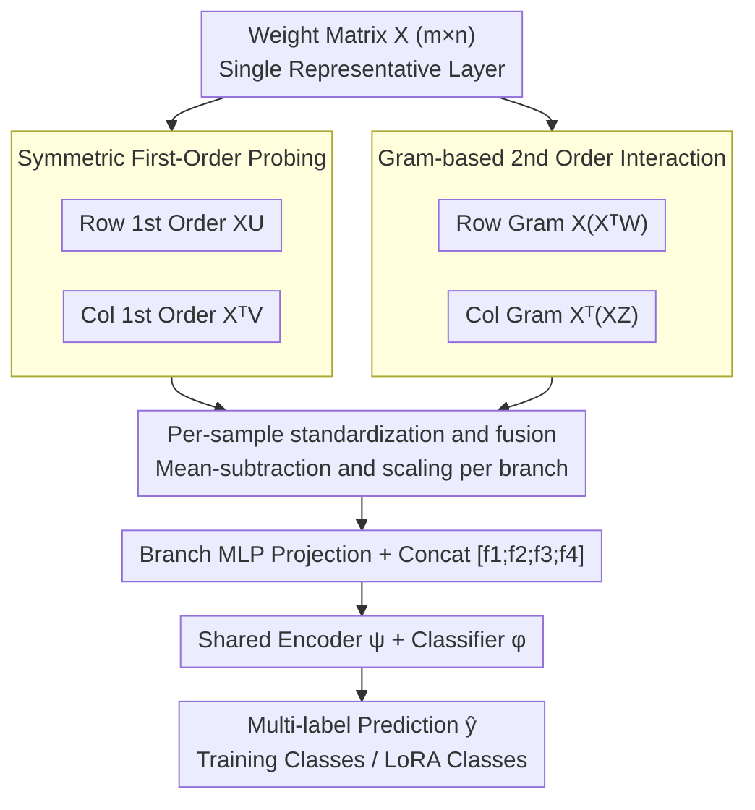

# What Linear Probes Miss: Multi-View Probing for Weight-Space Learning

**Conference**: ICML2026  
**arXiv**: [2605.23410](https://arxiv.org/abs/2605.23410)  
**Code**: https://github.com/AI-hew-math/MVProbe  
**Area**: Interpretability / Weight-Space Learning  
**Keywords**: Weight-space learning, probing, model identification, Gram matrix, LoRA identification  

## TL;DR
This paper points out that single-view first-order probes miss row-column interactions and second-order correlation structures within weight matrices. It proposes MVProbe, which uses multi-view representations consisting of row/column first-order projections and row/column Gram branches, significantly outperforming ProbeX on Model Jungle and Stable Diffusion LoRA identification.

## Background & Motivation
**Background**: Open-source model repositories are expanding rapidly, yet many checkpoints lack complete documentation for datasets, tasks, or capabilities. Weight-space learning attempts to infer training categories, data distributions, or model attributes directly from model parameters without relying on external metadata. Directly flattening weights is computationally expensive and destroys structure; thus, probing methods use learnable probe vectors passed through the weight matrix to generate lightweight, permutation-equivariant representations.

**Limitations of Prior Work**: Single-layer probing, exemplified by ProbeX, can scale to large models but primarily relies on first-order single-view projections like $XU$. This essentially observes responses of each row along the probe direction, neglecting column-side structures and pairwise correlations between rows or columns. Different weight matrices can produce identical first-order responses as long as their differences lie in the probe nullspace.

**Key Challenge**: The semantics of a weight matrix reside not only in linear projections of individual rows or columns but also in the similarity structures between neurons and input features. To maintain scalability, one cannot directly construct complex graphs or flatten all parameters; however, to improve identification capabilities, more geometric information must be captured than what first-order single-view probes provide.

**Goal**: The authors aim to retain the efficiency of single-layer probing while filling the expressivity gap of first-order methods. MVProbe observes rows, columns, row Gram, and column Gram simultaneously through four complementary branches. Theoretical analysis explains why second-order branches distinguish matrices that first-order probes cannot and why multi-order responses require standardization.

**Key Insight**: The paper interprets probe vectors as learnable landmarks in weight matrix geometry. First-order probes observe the projection of weights onto landmark directions, while second-order Gram probes observe the response of sample-to-sample similarities to landmark combinations. This enables capturing kernel-like geometric information without explicitly forming massive graph structures.

**Core Idea**: Multi-view probing captures both the first-order directional responses and second-order similarity structures of weight matrices, with per-sample standardization applied to each branch to balance signals of different orders.

## Method
MVProbe takes a weight matrix $X \in \mathbb{R}^{m \times n}$ from a single representative layer as input to predict attribute labels of the checkpoint, such as CIFAR-100 classes used in fine-tuning or ImageNet classes corresponding to a LoRA. Unlike ProbeX, which only computes $XU$, MVProbe extracts four responses for the same matrix: row-side first-order, column-side first-order, row Gram second-order, and column Gram second-order. Each response is standardized individually before being mapped to a common dimension by branch-specific projections. The four branches are concatenated and fed into a shared encoder and classification head.

### Overall Architecture
Given a weight matrix $X$, MVProbe learns four probe matrices $U, V, W, Z$. The row first-order branch computes $XU$, and the column first-order branch computes $X^\top V$. The row kernel branch computes $XX^\top W$, and the column kernel branch computes $X^\top X Z$. To prevent the second-order branches from naturally dominating in scale, each branch response matrix $S$ is transformed via $\tilde{S} = (S - \mu(S)) / (\sigma(S) + \epsilon)$. After standardization, each branch is projected into $f_i$ via an MLP, concatenated as $[f_1; f_2; f_3; f_4]$, and processed by a shared encoder $\psi$ and classifier $\phi$ to output multi-label predictions $\hat{y}$.

### Key Designs
1. **Symmetric Row-Column 1st-Order Probing**:
    - **Function**: Simultaneously observes the patterns of output neurons aggregating inputs and input coordinates connecting to outputs.
    - **Mechanism**: $XU$ is a row-centric sketch where each row represents an output neuron's response along probe directions; $X^\top V$ is a column-centric sketch where each row represents an input dimension's connection pattern to the output side. Theoretically, there exist $X_1 \neq X_2$ such that $X_1 U = X_2 U$ but $X_1^\top V \neq X_2^\top V$.
    - **Design Motivation**: Neural network weight matrices have dual-sided geometry (input/output). Single-sided first-order probes completely ignore variations falling into the probe nullspace. Adding a transposed view reduces this blind spot.

2. **Gram-based 2nd Order Interaction Branches**:
    - **Function**: Captures pairwise similarity between rows and between columns, addressing correlation structures invisible to first-order projections.
    - **Mechanism**: Row Gram $K_{row} = XX^\top$ encodes similarities between output neurons, and column Gram $K_{col} = X^\top X$ encodes similarities between input features. MVProbe avoids explicitly forming large Gram matrices by computing $XX^\top W = X(X^\top W)$ and $X^\top X Z = X^\top(XZ)$, keeping complexity at $O(mnr)$.
    - **Design Motivation**: Theorem 4.1 demonstrates that when $rank(U) < n$, one can construct two matrices with identical first-order responses but different second-order responses. Thus, second-order branches provide non-redundant information that separates folded weight geometries.

3. **Per-sample Standardization and Simple Fusion**:
    - **Function**: Prevents second-order responses from overwhelming first-order branches due to larger magnitudes, allowing all four views to contribute to the decision.
    - **Mechanism**: Theoretical analysis shows that for i.i.d. Gaussian weights, the ratio of the expected second-order response norm to the first-order norm is approximately $O(n\sigma^2)$. Direct concatenation would let the higher-order branch dominate. MVProbe independently subtracts the mean and divides by the standard deviation for each sample and branch, making branch Frobenius norms proportional to the number of elements rather than the order.
    - **Design Motivation**: Without scale control, multi-view methods might only learn from the branch with the largest magnitude. Standardizing before simple concatenation proved more stable than L2 normalization or learned weighting in experiments.

### Loss & Training
The training objective is the standard multi-label binary cross-entropy loss $\mathcal{L} = \mathcal{L}_{BCE}(\hat{y}, y)$. In the implementation, each branch uses $r=128$ probes, with a projection dimension of 128, resulting in a final representation dimension of 512. It uses Adam with a learning rate of $3 \times 10^{-4}$, a batch size of 128, and trains for 500 epochs. Training can be completed on a single RTX 3090. Optimal single layers used on Model Jungle: ResNet 67, SupViT 59, MAE 64, DINO 47; for Stable Diffusion LoRA, layer 46 is used.

## Key Experimental Results

### Main Results

| Dataset / Arch | Metric | MVProbe | Prev. SOTA | Gain |
|----------------|--------|---------|------------|------|
| Model Jungle ResNet | Accuracy | 92.24 | ProbeX×4 87.16 | +5.08 |
| Model Jungle SupViT | Accuracy | 92.33 | ProbeX×4 90.33 | +2.00 |
| Model Jungle MAE | Accuracy | 81.62 | ProbeX×4 77.26 | +4.36 |
| Model Jungle DINO | Accuracy | 78.29 | ProbeX×4 73.25 | +5.04 |
| SD200 LoRA In-Dist. | Accuracy | 99.80±0.00 | ProbeX 98.48±0.48 | +1.32 |
| SD1k LoRA Zero-shot | Accuracy | 97.96±0.29 | ProbeX 52.42±2.48 | +45.54 |

### Ablation Study

| Configuration | Key Metric | Description |
|---------------|------------|-------------|
| $XU$ only | ResNet 90.42 / DINO 74.17 | Single row first-order branch is strong but inferior to full version |
| $X^\top V$ only | ResNet 88.94 / DINO 72.04 | Column first-order provides complementary but weaker signals alone |
| second-order only | SupViT 92.04 / MAE 80.57 | Second-order combination is close to full on some archs, showing strong Gram info |
| MVProbe all four | ResNet 92.24 / etc. | All four branches achieve best performance across all architectures |
| w/o Std vs w/ Std | Avg 65.9 → 68.8 | Standardization gives +2.8 avg, 89.2% of layers benefit, aligning with scale analysis |
| all-layer win rate | 95.1% | MVProbe outperforms ProbeX on 311 out of 327 available layers |

### Key Findings
- Simply increasing the number of probes in ProbeX is insufficient. ProbeX×4 still trails MVProbe, suggesting gains stem from view design rather than parameter count.
- Second-order Gram branches provide complementary information rather than just a stronger replacement for first-order probes. On DINO, second-order alone is slightly lower than first-order, yet the full version is best, indicating different architectures need different view combinations.
- Standardization is an essential component. Without it, multi-order responses are unbalanced; with it, performance improves by +2.8% on average, notably +4.2 and +4.1 on DINO and ResNet, respectively.
- The LoRA experiments highlight the largest gap. In the difficult SD1k setting (1000 classes, 5 models per class), ProbeX in-distribution is only 35.75%, while MVProbe reaches 97.88%.

## Highlights & Insights
- The paper clearly explains the failure modes of probing: it is not that probing itself is inherently limited, but that single-view first-order sketches fold away nullspace and pairwise interaction structures. Theorem 4.1 provides a clean construction for this intuition.
- MVProbe's design is engineering-friendly. While second-order branches appear to require forming Gram matrices, applying the associative property as $X(X^\top W)$ and $X^\top(XZ)$ keeps complexity at $O(mnr)$, with training time comparable to ProbeX×4.
- Per-sample standardization is a critical yet often overlooked detail. Multi-branch models often use direct concatenation; this work uses scaling theory to explain why this biases toward high-order responses and validates this with cross-layer ablations.
- From an interpretability standpoint, MVProbe provides a lightweight tool for checkpoint analysis: even without metadata, training categories or LoRA attributes can be inferred through weight geometry, aiding model repository governance and selection.

## Limitations & Future Work
- The method still relies on selecting a single representative layer. While MVProbe is more robust to layer selection, absolute accuracy for MAE and DINO remains lower than ResNet/SupViT, suggesting individual layers in some architectures contain insufficient information.
- Current tasks are mainly training category and LoRA identification. Whether more complex attributes like model capability, bias, safety, or data leakage can be reliably predicted from the same representation needs further experimentation.
- Multi-view branches are manually defined and not adaptive to architecture types. Since optimal views and depths vary for ResNet, ViT, and LoRA, future work may require architecture-aware branch selection.
- Weight-space identification may introduce risks regarding privacy and model provenance. If training data attributes can be recovered from weights, discussions on data governance and release strategies are necessary.

## Related Work & Insights
- **vs ProbeX**: ProbeX proved single-layer probing scales to large models but mostly uses first-order single-view representations; MVProbe adds column and Gram views under the same single-layer constraints, significantly improving accuracy and layer robustness.
- **vs ProbeGen / Neural Graph**: ProbeGen and graph methods are valuable for small models or multi-layer settings but are computationally heavy for large weight matrices; MVProbe maintains the lightweight nature of probing while introducing second-order geometry.
- **vs hand-crafted statistics / StatNN**: Statistical methods look at coarse features like mean or variance, failing to represent neuron relationships; MVProbe's Gram branches directly model these correlation structures.
- **Insight**: For model repository search, LoRA auto-tagging, checkpoint deduplication, and model provenance analysis, MVProbe-like weight geometric representations can serve as foundational features, optionally combined with limited real-world evaluations or metadata.

## Rating
- Novelty: ⭐⭐⭐⭐ Multi-view probing and Gram branch concepts are clear; theoretical motivation is more convincing than simple branch stacking.
- Experimental Thoroughness: ⭐⭐⭐⭐⭐ Covers Model Jungle, all-layer win rates, standardization ablations, higher-order branch ablations, and SD LoRA.
- Writing Quality: ⭐⭐⭐⭐ Strong link between methodology and theory; tables are informative, though some notation is dense and requires familiarity with weight-space learning.
- Value: ⭐⭐⭐⭐ Highly practical for model identification and weight-space analysis, providing a clear path for probing methods to move beyond first-order linear responses.

<!-- RELATED:START -->

## Related Papers

- [\[ICLR 2026\] Domain Expansion: A Latent Space Construction Framework for Multi-Task Learning](../../ICLR2026/interpretability/domain_expansion_a_latent_space_construction_framework_for_multi-task_learning.md)
- [\[ICLR 2026\] Beyond Linear Probes: Dynamic Safety Monitoring for Language Models](../../ICLR2026/interpretability/beyond_linear_probes_dynamic_safety_monitoring_for_language_models.md)
- [\[ACL 2026\] Rhetorical Questions in LLM Representations: A Linear Probing Study](../../ACL2026/interpretability/rhetorical_questions_in_llm_representations_a_linear_probing_study.md)
- [\[ACL 2026\] Linear Probes Detect Task Format, Not Reasoning Mode in Language Model Hidden States](../../ACL2026/interpretability/linear_probes_detect_task_format_not_reasoning_mode_in_language_model_hidden_sta.md)
- [\[AAAI 2026\] Share Your Attention: Transformer Weight Sharing via Matrix-Based Dictionary Learning](../../AAAI2026/interpretability/share_your_attention_transformer_weight_sharing_via_matrix-based_dictionary_lear.md)

<!-- RELATED:END -->
