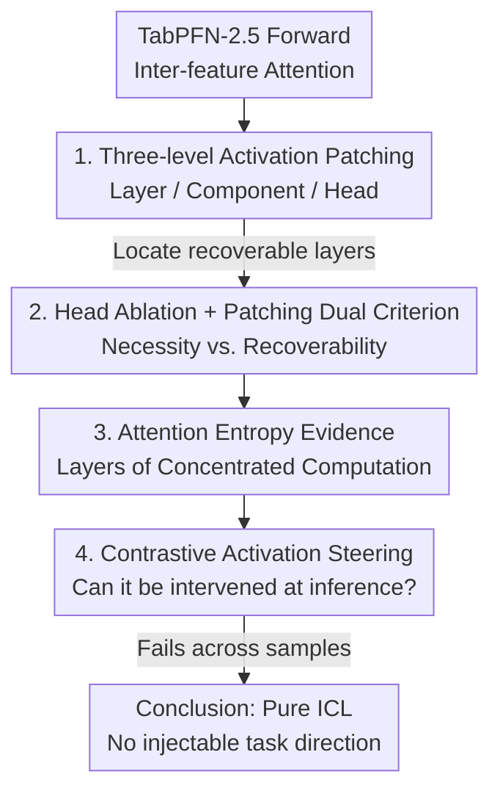

# Where Computation Lives Inside TabPFN: Causal Localisation of Attention Head Function

**Conference**: ICML 2026  
**arXiv**: [2606.12917](https://arxiv.org/abs/2606.12917)  
**Code**: TBD  
**Area**: Mechanistic Interpretability / Tabular Foundation Models  
**Keywords**: TabPFN, Activation Patching, Attention Head Ablation, Attention Entropy, In-Context Learning (ICL)

## TL;DR
This paper presents the first causal mechanistic analysis of the tabular foundation model TabPFN-2.5 using activation patching, ablation, and attention entropy. The study reveals that one of the three feature attention heads (Head 2) possesses a causal necessity $2\text{--}5\times$ greater at its peak layer than other heads, with the peak layer shifting based on task complexity. In contrast, other heads exhibit symmetric late-layer patterns. Furthermore, the failure of activation steering across samples suggests that pure ICL architectures lack "injectable stable task directions."

## Background & Motivation
**Background**: TabPFN-2.5 is pre-trained on synthetic structural causal models and transfers predictive capabilities to new tabular tasks via **in-context learning (ICL)**. It generates predictions in a single forward pass with performance competitive with tree-based models. However, its internal computational mechanisms remain a black box.

**Limitations of Prior Work**: Existing interpretability research on TabPFN is confined to **post-hoc attribution**, which identifies important features but fails to pinpoint which internal components at which layers perform the actual computation. While recent studies have found selective neuron responses to high-level concepts, these provide only **correlational** evidence rather than causal proof.

**Key Challenge**: While mechanistic interpretability for language models and time-series Transformers is well-developed (e.g., induction heads, function vectors), **no comparable causal analysis exists for tabular architectures**. The distinctions between correlation vs. causation and "encoded information" vs. "used information" have not been rigorously decoupled in tabular foundation models.

**Goal**: To answer a specific question: which components of TabPFN-2.5 bear **causal responsibility** for specific computations, and at which layers do they emerge?

**Key Insight**: TabPFN utilizes two serial self-attention mechanisms per layer: `self_attn_between_items` (cross-sample) and `self_attn_between_features` (cross-feature-block). The authors focus exclusively on **inter-feature attention**, as it is the only module operating across feature representations and serves as the natural locus for cross-feature computation in regression.

**Core Idea**: Porting the mechanistic interpretability causal toolbox (activation patching + ablation + attention entropy + contrastive steering) to tabular foundation models. By using "perturb-restore" interventions, the study precisely localizes the function and depth of individual attention heads.

## Method

### Overall Architecture
The study analyzes `TabPFNRegressor`: an 18-layer Transformer with $H=3$ attention heads per layer, a head dimension $d_h=64$, and a model dimension $d_{\text{model}}=192$. The input consists of a labeled training set and a test sample, where labels $y_i$ are embedded as the final token. The authors apply top-down causal interventions on inter-feature attention using two **synthetic regression datasets**. The analysis follows a pipeline: locating where information resides via multi-granularity activation patching, measuring necessity via ablation, corroborating active layers with attention entropy, and testing manipulability via contrastive steering.

### Key Designs

**1. Causal Activation Patching: Three-level localization**
Post-hoc attribution cannot identify causally responsible components. This study uses **activation patching**: in a "corrupted" forward pass, specific hidden activations are replaced with values from a "clean" pass to measure output recovery. The authors scan at three levels: **Layer** (entire residual stream at depth $\ell$), **Component** (feature-block level output), and **Attention Head** (individual head before output projection $W_O$). A key negative finding is that **layer-level patching restores ~100% at every layer**, indicating high distributed redundancy and necessitating head-level analysis to reveal differences.

**2. Ablation + Patching Dual Criterion: Distinguishing "Necessity" from "Recoverability"**
Recovery rates can be masked by redundancy. Thus, the authors add **ablation** (zeroing a head to see the loss increase). Patching measures "information recoverability," while ablation measures "causal necessity." In the multiplication dataset, Head 2's ablation effect peaks at Layer 0 ($0.076\sigma$), $5\times$ larger than any other head-layer combination, yet its patching peak is at Layer 6. **The "most needed layer" and "most recoverable layer" are distinct.**

**3. Attention Entropy as Convergence Evidence: Selectivity $\neq$ Causal Necessity**
To independently corroborate active computation layers, the authors calculate **normalized attention entropy**. Lower entropy indicates more focused attention. Head 2 reaches minimum entropy at Layer 6 ($0.21$ in both datasets). Crucially, at Layer 0, Head 0 and Head 2 are **equally concentrated** (entropy ~0.22), but only Head 2 demonstrates a large ablation effect. This proves **"attention selectivity" is not equivalent to "causal necessity."**

**4. Contrastive Activation Steering Failure: No injectable task direction in pure ICL**
Finally, the authors test **inference-time manipulability** using contrastive activation steering. The resulting steering direction **fails to transfer across samples**, yielding nearly zero improvement in MSE. This suggests that while language models use "function vector heads" to represent tasks, TabPFN relies **entirely on context-dependent attention** to encode relationships dynamically, leaving no stable parameter directions for injection.

### Loss & Training
The study performs post-hoc analysis on the pre-trained TabPFN-2.5 without further training. Two synthetic datasets are used: **Multiplication dataset** ($y=a\cdot b+c$) for non-linear interaction, and **Pairwise-50 dataset** ($y=(\sum x_i)^2$) involving 2500 pairwise terms. Patching utilizes a `mean_shift` corruption mode with $n=512$.

## Key Experimental Results

### Main Results
Head ablation effects ($\sigma$, subscript denotes layer) and minimum attention entropy:

| Head | Ablation (Mult) | Ablation (Pair-50) | Min Entropy (Mult) | Min Entropy (Pair-50) |
|------|------|------|------|------|
| Head 0 | 0.015 (L13) | 0.023 (L15) | 0.220 | 0.220 |
| Head 1 | 0.016 (L12) | 0.035 (L17) | 0.610 | 0.636 |
| **Head 2** | **0.076 (L0)** | **0.074 (L16)** | **0.216 (L6)** | **0.216 (L6)** |

Key activation patching recovery data:

| Dataset | Head | Peak Layer | Recovery Rate | Note |
|--------|----|--------|--------|------|
| Mult | Head 0/1/2 | L13/L12/L6 | 0.228/0.196/0.228$\sigma$ | Similar recovery across heads |
| Pair-50 | Head 0 | L5 | +13.2% | Positive recovery |
| Pair-50 | Head 1 | L17 | −25.5% (abs) | Negative; interference |
| Pair-50 | Head 2 | L13 | −18.5% (abs) | Negative; active at L13 entropy min |

### Ablation Study

| Configuration / Observation | Key Metrics | Description |
|------|---------|------|
| Head 2 Ablation @ L0 (Mult) | 0.076$\sigma$ | $5\times$ larger than other head-layer pairs |
| Head 2 Ablation @ L0 ($n=64$ vs $512$) | 0.078 vs 0.076$\sigma$ | Peak is stable, not a single-batch artifact |
| Head 0 @ L0 Selectivity vs Causal | Entropy 0.22 / Ablation $\approx 0$ | Selectivity does not imply causal necessity |
| Head 2 Peak Magnitude across tasks | 0.074–0.076$\sigma$ | Magnitude consistent; peak layer shifts L0 $\to$ L16 |

### Key Findings
- **Head 2 provides the strongest evidence of functional localization**: Its peak ablation magnitude is highly consistent across tasks (0.074–0.076$\sigma$), although the peak layer shifts from L0 (Multiplication) to L16 (Pairwise-50), likely due to task complexity.
- **Interpretation of negative restoration**: Large negative deviations (e.g., Head 1@L17) indicate that patching clean activations into a corrupted pass **disrupts** the already diverged computation, identifying these as active but sensitive layers.
- **Zero improvement from steering**: This confirms that TabPFN's ICL mechanism differs from LLMs; it is purely relational and lacks fixed task "directions."

## Highlights & Insights
- **First deployment of causal mechanistic toolboxes for tabular foundation models**: Porting patching, ablation, and steering fills a significant gap in tabular interpretability research.
- **Clean counter-example for "Selectivity $\neq$ Causal Necessity"**: Head 0 and Head 2 are equally selective at Layer 0, but only one is causally necessary. This is a vital warning against over-interpreting attention maps.
- **Decoupling Necessity and Recoverability**: By differentiating ablation and patching peaks, the study highlights how distributed redundancy can mislead single-metric interpretations.
- **Value in Negative Results**: The failure of activation steering is framed as a fundamental insight into the structural nature of ICL-based tabular models.

## Limitations & Future Work
- **Generalization**: With only two synthetic datasets, the observed "head functional classification" cannot yet be established as a universal property of TabPFN-2.5.
- **Visualization Depth**: The study lacks direct visualization of attention weights for specific feature pairs at active layers (L6, L13).
- **Scope**: The analysis is restricted to synthetic regression. Future work must extend to real-world data and classification tasks.
- **Effect Size**: The absolute magnitudes ($\approx 0.07\sigma$) are relatively small. Whether these effects remain dominant in noisier or more complex settings remains to be seen.

## Related Work & Insights
- **vs. LLM Mechanistic Interpretability**: LLMs possess "function vector heads" that allow for steering; this paper proves TabPFN does not, due to its pure ICL structure.
- **vs. Post-hoc Attribution**: Unlike feature importance methods, this work answers "where and how" the model calculates outputs via causal intervention.
- **vs. Knauer & Rodner (2026)**: While they found correlational evidence of neuron selectivity, this study provides the necessary causal investigation.

## Rating
- Novelty: ⭐⭐⭐⭐⭐ 
- Experimental Thoroughness: ⭐⭐⭐ 
- Writing Quality: ⭐⭐⭐⭐⭐ 
- Value: ⭐⭐⭐⭐ 

<!-- RELATED:START -->

...

<!-- RELATED:END -->

## Related Papers

- [\[NeurIPS 2025\] Causal Head Gating: A Framework for Interpreting Roles of Attention Heads in Transformers](../../NeurIPS2025/interpretability/causal_head_gating_a_framework_for_interpreting_roles_of_attention_heads_in_tran.md)
- [\[ICML 2026\] How Few-Shot Examples Add Up: A Causal Decomposition of Function Vectors in In-Context Learning](how_few-shot_examples_add_up_a_causal_decomposition_of_function_vectors_in_in-co.md)
- [\[CVPR 2026\] CIGMA: Causal Information-Gain Mechanistic Attribution of Attention Heads in Vision Transformers](../../CVPR2026/interpretability/cigma_causal_information-gain_mechanistic_attribution_of_attention_heads_in_visi.md)
- [\[AAAI 2026\] Attention Gathers, MLPs Compose: A Causal Analysis of an Action-Outcome Circuit in VideoViT](../../AAAI2026/interpretability/attention_gathers_mlps_compose_a_causal_analysis_of_an_action-outcome_circuit_in.md)
- [\[ICLR 2026\] Decomposing LLM Computation with Jets](../../ICLR2026/interpretability/decomposing_llm_computation_with_jets.md)

<!-- RELATED:END -->
