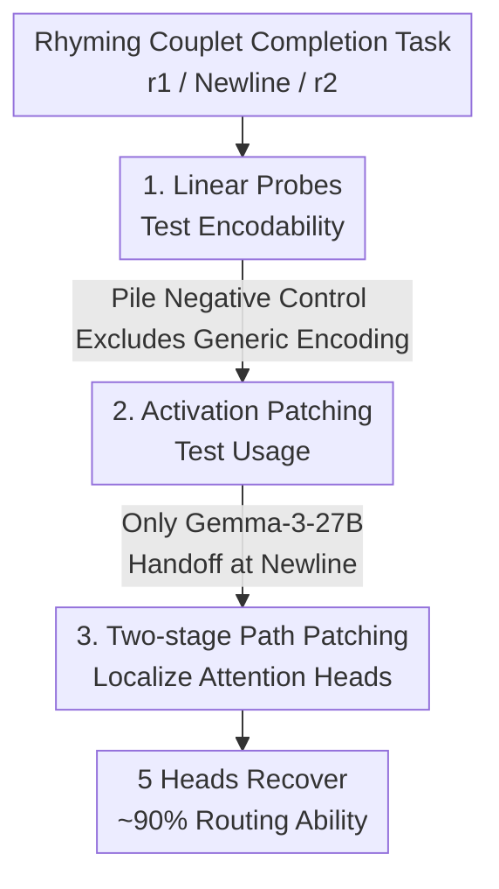

# Where's the Plan? Locating Latent Planning in Language Models with Lightweight Mechanistic Interventions

**Conference**: ICML 2026  
**arXiv**: [2605.07984](https://arxiv.org/abs/2605.07984)  
**Code**: To be confirmed  
**Area**: Mechanistic Interpretability / Large Language Models / Latent Planning  
**Keywords**: Latent Planning, Activation Patching, Linear Probes, Path Patching, Attention Head Localization

## TL;DR
This paper employs "rhyming couplet completion" as a clean test for look-ahead constraints. Using only lightweight tools—linear probes and activation patching—the study investigates "planning site formation" across more than ten scales in three model families: Qwen3, Gemma-3, and Llama-3. Probing reveals that information regarding future rhymes is linearly decodable at the newline character and strengthens with model scale. however, activation patching demonstrates that **only Gemma-3-27B truly exhibits a causal dependence on this encoding**. A "representational handoff," where causal drive transitions from the rhyme word to the newline character, occurs around layer 30. This handoff is ultimately localized to 5 attention heads, which recover approximately 90% of the rhyme-routing capability at the newline character.

## Background & Motivation
**Background**: Autoregressive language models generate text token by token, yet produce outputs requiring long-range structural consistency (e.g., rhyming couplets where the final word of the second line must rhyme with the final word of the first). A natural question arises: do models form internal representations of **future outputs** that causally drive generation, all while remaining invisible to behavioral evaluation? The authors term this **latent planning**.

**Limitations of Prior Work**: Unlike Chain-of-Thought (where intermediate steps are observable), latent planning is entirely hidden within hidden activations. Prior work has proven that "planning-compatible information" exists in some models, but none have answered specific questions regarding **where exactly** planning information resides during the forward pass and whether it **migrates**. The authors call this **planning site formation**.

**Key Challenge**: Rigorous study of planning sites requires providing both **encoding evidence** (what information is present) and **causal evidence** (what information is used). Probing can measure "what is encoded," but flexible probes may "cheat" by memorizing labels, achieving high accuracy without reflecting true representation. Conversely, tools that establish true causality—such as training transcoders to build feature circuits—are computationally expensive and have largely been limited to closed-source models like Claude, making them difficult to scale to new open-source architectures.

**Goal**: To define two levels of evidence—the weaker **planning-compatible representation** (measurable by probes) and the stricter **causally active planning site** (established by activation patching)—and systematically characterize planning site formation across multiple open-source families and scales (up to 70B) using lightweight tools.

**Key Insight**: Rhyming couplets serve as a "clean test" for look-ahead constraints. The rhyme $r_2$ of the second line must match the end-word $r_1$ of the first line. This constraint is determined long before $r_2$ is generated, making it an ideal probe for observing "where and when future token representations form."

**Core Idea**: Replace expensive transcoders with "linear probes + activation patching" to strictly decouple "information being encoded" from "information being used," revealing that the two are **dissociable**—probe signals do not necessarily imply the existence of a true planning site.

## Method

### Overall Architecture
The authors set the newline token (`\n` at the end of the first line) as relative position 0. Position $i$ denotes the $i$-th token before (negative) or after (positive) the newline. $r_1$ is the final word of the first line, and $r_2$ is the rhyme to be generated for the second line. The methodology follows a "weak-to-strong" evidentiary chain: first using **linear probes** to detect if the future rhyme $r_2$ can be decoded at position $(i,\ell)$ (planning-compatible representation), then using **activation patching** to test if the hidden state at that position causally drives generation (causally active planning site). Once a planning site is identified at the newline in Gemma-3-27B, **two-stage path patching** is used to localize it to a sparse set of attention heads.

### Key Designs

**1. Rhyming Couplets: Look-ahead Constraints as Measurable Latent Planning Probes**

The hardest part of latent planning is the lack of clean observational signals. The authors solve this with rhyming couplets: given a context containing $r_1$, the model must generate $r_2$ rhyming with $r_1$. Since $r_2$ typically appears 8 tokens after the newline, this structure—where constraints are fixed early but realized much later—perfectly exposes when future representations form. Two levels of definitions are provided: if $r_2$ can be decoded from $\mathbf{h}_{\ell,i}$ via a probe at position $i$ **significantly better** than elsewhere, $(i,\ell)$ contains a **planning-compatible representation**; if replacing $\mathbf{h}_{\ell,i}$ with an activation targeting a different rhyme group **significantly redirects** the output to that group, $(i,\ell)$ is a **causally active planning site**.

**2. Linear Probes for "Encodability": Identifying Active Planning vs. Passive Accumulation**

Probes are parametric functions $f_{(W,b)}(\mathbf{h})=\text{softmax}(W\mathbf{h}+\mathbf{b})$, trained with cross-entropy (AdamW, lr $10^{-4}$, weight decay $10^{-3}$, batch 32, 10 epochs), reporting Wilson 95% confidence intervals. A **negative control** is crucial: probes trained on *The Pile* to predict tokens $k$ steps ahead show accuracy monotonically decreasing, hitting unigram baselines at $k=8$—proving that planning-compatible representations are not a generic feature of the residual stream. Conversely, probes trained on couplets to predict $r_2$ show that accuracy at the newline ($i=0$) and end-word ($i\le -1$) **far exceeds** that at $i>0$, creating a massive gap compared to the $k=8$ Pile probe. This control excludes the trivial explanation that the probe is merely memorizing token frequencies.

**3. Activation Patching for "Usage": Discovering the "Representational Handoff" in Gemma-3-27B**

The fundamental limitation of probes is that "linearly decodable $\neq$ causally driving generation." Activation patching addresses this: given a prompt naturally leading to a clean rhyme group $\mathcal{R}^{(c)}$, an activation at a specific position is replaced with one from a "corrupted" rhyme group $\mathcal{R}^{(r)}$ to see if the generation is pushed toward $\mathcal{R}^{(r)}$. Layers are scanned at the end-word position ($i=-1$ for Qwen/Llama, $i=-2$ for Gemma due to comma tokenization) and the newline ($i=0$). The results show a striking divergence: **only Gemma-3-27B** exhibits a **representational handoff** near layer 30. End-word patching is highly effective in early layers but drops sharply near L30, while newline patching simultaneously rises, peaking at L33 with a corrupted rhyme rate of 0.63. Qwen3-32B and Llama-3.1-70B remain **entirely dependent** on the end-word position throughout, with newline effects near zero despite strong probe signals. This confirms: **encoding and usage are dissociable**.

**4. Two-stage Path Patching: Localizing the Handoff to 5 Sparse Attention Heads**

After identifying the planning site in Gemma-3-27B, the authors investigate whether it can be attributed to specific heads. Single-head patching shows no signal, indicating the representation is not in a single component. **Attention weights are used as proxies**: weights from the newline ($i=0$) back to the end-word ($i=-2$) are extracted. In L27–45, weights are highly concentrated in three heads: L30H4 ($\approx 0.99$), L28H14 ($\approx 0.97$), and L28H15 ($\approx 0.95$). **Simple top-$k$ patching** at $k=5$ yields a corrupted rhyme rate of 46% (73% of the full residual reference of 63%). To avoid injecting conflicting contexts, a stricter **two-stage path patching** isolates the path $i{=}-2\to\text{head}\to i{=}0\to\text{output}$: stage one replaces the $i=-2$ residual and caches head outputs at $i=0$; stage two patches these cached outputs into an unmodified clean forward pass. This method recovers 57% with 5 heads—**90%** of the full residual's routing capability. Corresponding MLP patches yield zero across all $k$, proving the handoff is mediated by attention.

### Loss & Training
The model weights are frozen; only lightweight linear probes are trained (hyperparameters in Design 2). Data: 1200 sequences from *The Pile* for negative control (1000 train / 200 eval); 1200 rhyming couplets synthesized via Claude Sonnet 4.6 (1000 train / 200 eval) with diverse themes and rhyme schemes. Patching used $N=20$ random samples per layer/prompt pair. Results are averaged across 5 prompt pairs ($N=100$), with 95% cluster bootstrap intervals (10,000 resamples at the prompt-pair level).

## Key Experimental Results

### Main Results
Maximum accuracy gap between newline vs. first generation position probes (increasing with scale):

| Model Family | Small Scale gap | Large Scale gap | Trend |
|--------------|-----------------|-----------------|-------|
| Gemma-3      | 0.11 (1B)       | 0.38 (27B)      | >0 at every scale; monotonic increase |
| Qwen3         | CI includes 0 (0.6B–8B) | Significant non-zero | Emerges with scale |
| Llama-3      | CI includes 0 (1B–8B) | Significant non-zero | Emerges with scale |

Activation Patching—Causal results for three models:

| Model | End-word Patching | Newline Patching | Conclusion |
|-------|-------------------|------------------|------------|
| **Gemma-3-27B** | High in early layers, drops at L30 | Rises at L30, peaks L33 at **0.63** [0.48, 0.78] | L30 Handoff observed |
| Qwen3-32B | High across layers | Near zero | Dependent on end-word |
| Llama-3.1-70B | High across layers | Near zero | Dependent on end-word |

### Ablation Study
Gemma-3-27B Attention Head Localization (Full Residual Reference = 63%):

| Intervention | $k=5$ Corrupted Rhyme Rate | % of Full Reference | Description |
|--------------|----------------------------|---------------------|-------------|
| Simple top-$k$ patching | 46% | 73% | Jumps at $k=5$ |
| Two-stage Path Patching | 57% | **90%** | Isolates $i{=}-2\to$head$\to i{=}0$ path |
| Random / Control heads | 0% | 0 | Zero for all $k$ |
| MLP top-$k$ patching | 0% | 0 | Upper bound $\le 0.04$ |

### Key Findings
- **The 5 Heads are**: (L30,H4), (L28,H14), (L28,H15), (L30,H5), (L28,H29). Performance peaks at $k=5$; at $k=10/15$ the rate drops to 47%/32%, showing specialized capability that is diluted by additional heads.
- **Negative Patching Sign**: Patching clean activations into a corrupted pass also markers active layers via entropy/patching divergence.
- **Architectural Mystery**: All Qwen3 and Llama-3 models fail to show a handoff despite strong probe signals—why Gemma-3-27B is different remains an open question.

## Highlights & Insights
- **Decoupling "Encoding vs. Usage"**: The presence of probe signals without causal impact serves as a powerful warning against using probe accuracy as a proxy for explanation—this insight is transferable to all probing-based interpretability research.
- **Scaling Mechanistic Tools**: Achieving circuit-level localization on a 70B-class model using only probes and patching, without training transcoders, demonstrates high methodological scalability.
- **"Representational Handoff" as a Primitive**: The migration of causal drive from the rhyme word to the newline is a structured, localizable emergence rather than a diffuse property.
- **Couplets as Elegant Probes**: Using a linguistically clean task with clear constraints turns the abstract "latent planning" into a measurable object.

## Limitations & Future Work
- **Scope**: Studies were limited to three model families and a single structured task. Generalization to prose or code is needed to verify if "handoffs" are general primitives.
- **Statistical Intervals**: Upper bounds on the 5-head recovery exceed 1.0 due to a small number of prompt pairs; a larger dataset is required to tighten bounds.
- **Architectural Differences**: The cause for why only Gemma-3-27B forms a planning site is not yet explained.
- **Observation**: Dependence on the newline token might partially depend on the specific tokenizer's behavior at punctuation.

## Related Work & Insights
- **vs. Transcoders / Feature Circuits (Lindsey et al.)**: Lindsey et al. build fine-grained circuits but require secondary training and closed models. Ours uses lightweight patching for circuit-level localization on open models and independently replicates the migration to the newline.
- **vs. Steering Vectors (Maar et al. 2026)**: Maar et al. found planning sites remain at the end-word for most open models under 30B. Ours corroborates this result with more data-efficient patching and localizes the mechanism to 5 heads.
- **vs. Probing Interpretability (Hewitt & Liang)**: Ours reinforces their warning that "probes can cheat," using causal patching to verify "usage."

## Rating
- Novelty: ⭐⭐⭐⭐⭐ First systematic characterization of "planning site formation" and discovery of the "handoff" phenomenon.
- Experimental Thoroughness: ⭐⭐⭐⭐ Solid cross-scale analysis; however, limited prompted pairs result in wide confidence intervals.
- Writing Quality: ⭐⭐⭐⭐⭐ Clear distinction between "encoding vs. usage" and honest treatment of negative results.
- Value: ⭐⭐⭐⭐⭐ Highly scalable methodology with significant implications for AI safety and interpretability.

<!-- RELATED:START -->

## Related Papers

- [\[ICLR 2026\] Latent Planning Emerges with Scale](../../ICLR2026/interpretability/latent_planning_emerges_with_scale.md)
- [\[ICLR 2026\] Path Channels and Plan Extension Kernels: A Mechanistic Description of Planning in a Sokoban RNN](../../ICLR2026/interpretability/path_channels_and_plan_extension_kernels_a_mechanistic_description_of_planning_i.md)
- [\[ICLR 2026\] Emotions Where Art Thou: Understanding and Characterizing the Emotional Latent Space of Large Language Models](../../ICLR2026/interpretability/emotions_where_art_thou_understanding_and_characterizing_the_emotional_latent_sp.md)
- [\[ICML 2026\] Where Computation Lives Inside TabPFN: Causal Localisation of Attention Head Function](where_computation_lives_inside_tabpfn_causal_localisation_of_attention_head_func.md)
- [\[ICLR 2026\] Latent Concept Disentanglement in Transformer-based Language Models](../../ICLR2026/interpretability/latent_concept_disentanglement_in_transformer-based_language_models.md)

<!-- RELATED:END -->
