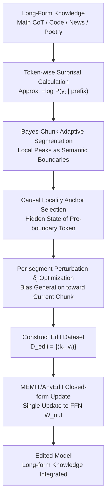

# AnyEdit++: Adaptive Long-Form Knowledge Editing via Bayesian Surprise

**Conference**: ICML 2026  
**arXiv**: [2606.01053](https://arxiv.org/abs/2606.01053)  
**Code**: The paper claims availability on GitHub, though the local cache does not contain a specific URL.  
**Area**: Knowledge Editing / Long-Form Knowledge Editing  
**Keywords**: Bayesian Surprise, Adaptive Chunking, Long-Form Knowledge Editing, Structural Independence, Causal Locality  

## TL;DR
AnyEdit++ utilizes token-level Bayesian Surprise to identify semantic turning points in long-form text, replacing the fixed-window partitioning of AnyEdit with structure-aware Bayes-Chunk. This approach consistently improves BLEU and BERT Scores across long-form knowledge editing tasks including mathematics, code, news, and poetry.

## Background & Motivation
**Background**: Knowledge editing aims to incorporate specific facts or knowledge into model parameters without retraining the entire large model, while minimizing damage to unrelated knowledge. Locate-and-edit methods such as ROME, MEMIT, and AlphaEdit typically locate edits at the FFN output matrices of key layers. By optimizing a local perturbation or target value, they enable the model to generate a new object when encountering a specific subject/relation.

**Limitations of Prior Work**: This paradigm is natural for triplet facts but encounters capacity bottlenecks when facing long-form knowledge such as mathematical derivations, code snippets, news narratives, and poetry. Long-form knowledge is not a single-point fact but a sequence of semantic units with internal dependencies. Compressing an entire segment of knowledge into a single perturbation vector often leads to generative collapse, broken logical chains, or partial memorization.

**Key Challenge**: AnyEdit previously decomposed long-form editing into autoregressive multi-segment edits, using multiple anchor keys and perturbations to write into model weights, thereby alleviating the length constraints of single-point editing. However, AnyEdit's segmentation relies on fixed-window cutting. These window boundaries do not understand semantic structures and may forcibly split function definitions, mathematical conditions, conclusions, or narrative shifts. Consequently, the resulting anchor keys may be semantically ambiguous or highly correlated with adjacent segments, causing mutual interference between multiple edits during a single weight update.

**Goal**: The authors do not aim to redesign the entire knowledge editing algorithm but rather to address two specific questions in long-form editing: first, where should long-form text be partitioned to ensure segment independence; second, where should the editing control signal be injected after partitioning to effectively influence subsequent generation.

**Key Insight**: The paper observes that when a language model reads text, its internal belief state does not move smoothly. The model's expectation for the next token changes significantly at new arguments, new events, code structure shifts, or reasoning jumps. Bayesian Surprise can quantify the intensity of this "belief rewriting," making high-surprise points naturally suited as semantic boundaries.

**Core Idea**: Replace fixed window lengths with the model's own token-level surprise values to partition long-form text into segments that align with semantic transitions. Place editing perturbations on the token immediately preceding high-surprise segments to reduce cross-segment crosstalk and enhance local control.

## Method

### Overall Architecture
AnyEdit++ addresses "where to cut long-form text and where to inject signals" without rewriting the entire editor. It retains AnyEdit's autoregressive editing and MEMIT-style closed-form weight updates, merely replacing the segmentation and anchor selection with structure-aware versions as a plug-and-play module. The process is as follows: The model first calculates token-wise surprisal on the original long-form text (math CoT, code, news, or poetry) to obtain an information density curve. Bayes-Chunk takes local peaks of this curve as semantic boundaries to partition the text into multiple chunks. For the $j$-th chunk, the system uses the hidden state of the token immediately preceding the boundary as the anchor, optimizing a local perturbation $\delta_j$ at the target layer so the model tends to generate the current chunk following that anchor. Once all key-value target pairs for the chunks are collected, a single-step weight update is performed using the MEMIT/AnyEdit closed-form solution.

In the context of locate-and-edit: standard methods construct a key $k$ and target value $v^*$, updating the FFN output matrix $W_{out}$ such that $W_{out}k \approx v^*$. AnyEdit extends this to multiple segments where the $t$-th segment has its own anchor key $k_t$ and perturbation $\delta_t$, forming an edit dataset $D_{edit}=\{(k_t,v_t)\}_{t=1}^{M}$. AnyEdit++ keeps this solver intact but ensures $k_t$ originates from semantic boundaries rather than fixed-window ends.

### Key Designs

**1. Bayes-Chunk Adaptive Semantic Segmentation: Aligning Boundaries with Information Jumps**

Fixed windows only guarantee similar segment lengths but can split function definitions, math conditions, or narrative turns, which is a weakness of AnyEdit. Bayes-Chunk delegates segmentation to the model's own belief changes: when processing prefix $y_{<t}$, the model holds a prior belief distribution $\pi_t$, which is updated to $\pi_{t+1}$ upon seeing $y_t$. Theoretical Bayesian Surprise is $D_{KL}(\pi_{t+1}\|\pi_t)$, approximated in practice by the information surprisal $S(y_t)\approx -\log P(y_t|y_{<t};\theta)$. Points such as logical transitions, code structure shifts, or new narrative events correspond to peaks in the surprisal curve. Bayes-Chunk identifies these local peaks to form a boundary set $B=\{b_1,\ldots,b_M\}$. This results in segments that are internally consistent and mutually distinguishable without requiring an external boundary detector.

**2. Structural Independence: Orthogonalizing Multi-segment Anchor Keys to Reduce Crosstalk**

Closed-form updates for multi-segment editing are essentially superpositions of multiple rank-1 updates, which can lead to interference. The paper provides a crosstalk bound showing that the interference in the $j$-th segment from others is proportional to $\sum_{t\neq j}\|\delta_t\|_2\cdot |k_t^T A k_j|$, where $A$ is the precision matrix of pre-training statistics. High similarity between segment keys makes it difficult for the solver to distinguish them, leading to overrides or crosstalk. Bayes-Chunk ensures segments are more dispersed in both semantic embedding and anchor key space. Results on EditEverything show that average cross-segment similarity drops from 0.594 (fixed window) to 0.509, with key heatmaps demonstrating weaker off-diagonal correlations.

**3. Causal Locality: Placing Perturbations at Precursors of High-Surprise Segments**

After segmentation, the system must decide where to inject the edit signal. The paper defines positional controllability $\kappa(i\to t)=\|\nabla_{h_i}L(y_t)\|_2$ to measure the impact of position $i$ on target token $y_t$. In the Transformer residual stream, backpropagation from $t-1$ upwards is an approximately norm-preserving "vertical channel," whereas influencing $y_t$ from an earlier point $t-k$ must pass through attention weight distribution, diluting the signal. Thus, $\Delta\kappa_k=\kappa(t-1\to t)-\kappa(t-k\to t)>0$ for $k>1$. High-surprisal tokens denote points where the semantic trajectory is about to turn; the preceding hidden state is the most direct control entry point. Placing the perturbation here is more parameter-efficient and causes fewer side effects than acting on distant historical tokens.

### Loss & Training
The optimization occurs at two levels. Locally, for each Bayes-Chunk segment, a perturbation $\delta_t$ is optimized to maximize the generation probability of the current chunk, conditioned on the preceding segments and previously optimized perturbations. Globally, all $(k_t, v_t)$ target pairs are inserted into a MEMIT-style least-squares update, satisfying the edit segments while constraining the update using covariance statistics $C$ to preserve general knowledge. For fair comparison, AnyEdit and AnyEdit++ both use MEMIT as the base editing algorithm; the authors also applied Bayes segmentation to FT-UKE to verify its general applicability.

## Key Experimental Results

### Main Results
The paper utilizes EditEverything, UnKE, and CounterFact datasets. EditEverything covers seven long-form domains: Math, Code, Physics, Chemistry, Biology, News, and Poetry. UnKE and CounterFact test effectiveness on traditional unstructured QA and factual editing benchmarks. Metrics include BLEU and BERT Score (based on all-MiniLM-L6-v2).

| Model | Method | EditEverything Avg BLEU | EditEverything Avg BS | Main Changes vs AnyEdit |
|------|------|--------------------------|-------------------------|--------------------------|
| Llama-3.1-8B-Instruct | MEMIT | 42.61 | 82.74 | Trad. triplet editors are insufficient |
| Llama-3.1-8B-Instruct | AnyEdit | 72.64 | 94.23 | Fixed-window editing is a major baseline |
| Llama-3.1-8B-Instruct | AnyEdit++ | 75.00 | 94.50 | BLEU +2.36, BS +0.27 |
| Llama-2-7B | AnyEdit | 42.30 | 86.33 | Fixed windows are fragile on weaker models |
| Llama-2-7B | AnyEdit++ | 50.13 | 87.66 | BLEU gain ~+8, BS +1.33 |
| Qwen-2.5-7B-Instruct | AnyEdit | 81.81 | 95.28 | Baseline is already strong on reasoning models |
| Qwen-2.5-7B-Instruct | AnyEdit++ | 85.33 | 96.29 | BLEU +3.52, BS +1.01 |

The crucial observation is the improvement pattern: AnyEdit++ outperforms AnyEdit across all three models, with the largest gains on Llama-2-7B, which is more prone to collapse during long-form editing. Gains are more pronounced in Math and Code categories; for instance, AnyEdit++ exceeds AnyEdit by nearly 20 BLEU points in Code on Llama-2-7B, indicating that structured text benefits more from semantic segmentation.

| Method | UnKE BLEU | UnKE BS | CounterFact BLEU | CounterFact BS | Avg BLEU | Avg BS |
|------|-----------|---------|------------------|----------------|-----------|---------|
| MEMIT | 24.76 | 76.50 | 32.21 | 75.79 | 28.49 | 76.15 |
| AlphaEdit | 21.34 | 73.86 | 23.51 | 72.42 | 22.43 | 73.14 |
| AnyEdit | 79.02 | 95.88 | 86.27 | 97.85 | 82.65 | 96.87 |
| AnyEdit++ | 81.57 | 96.03 | 90.69 | 98.29 | 86.13 | 97.16 |

Reference benchmarks confirm that AnyEdit++ does not sacrifice basic editing capabilities. Even on traditional datasets, Bayes-Chunk maintains or improves performance, with average BLEU rising from 82.65 to 86.13.

### Ablation Study
The paper provides structural independence analysis and plug-and-play verification with FT-UKE.

| Analysis Item | Fixed Window / Original | Bayes-Chunk / with Bayes | Note |
|--------|-------------------|------------------------------|------|
| EditEverything Avg Semantic Similarity | 0.594 | 0.509 | Bayes-Chunk segments are more independent |
| FT-UKE Avg BLEU / BS (Llama-3.1-8B) | 99.90 / 99.99 | 99.95 / 99.99 | Slight gains even on saturated baselines |
| FT-UKE Avg BLEU / BS (Qwen-2.5-7B) | 99.52 / 99.93 | 99.57 / 99.96 | Shows transferability to FT-based editing |
| QwQ-Edit Long CoT Math | AnyEdit (Control) | Higher across length/density bins | Structure matters for logical density |

### Key Findings
- Gains from Bayes-Chunk correlate with text structural intensity. In math and code, fixed windows frequently split indentations or definitions, whereas adaptive boundaries yield greater improvements.
- BERT Score improvements are generally smaller than BLEU because AnyEdit already maintains high semantic similarity; AnyEdit++ specifically improves precision and structural details.
- Structural independence experiments provide mechanism-level evidence: lower anchor key similarity makes closed-form updates less likely to override each other.
- QwQ-Edit experiments show that AnyEdit++ outperforms the baseline across all complexity bins, proving it is not limited to medium-length samples.

## Highlights & Insights
- The transformation of "text segmentation" from an engineering hyperparameter to a model-aware internal state reading is ingenious. Fixed window lengths are hard to tune across tasks, whereas the surprisal curve directly reflects information jumps.
- Theoretical foundations (structural independence and causal locality) align closely with the methodology, answering "where to cut" and "where to modify."
- Incremental costs are manageable. It does not require external detectors or memory banks; it only requires a single probability scan by the target LLM.
- Applicable to other tasks: any scenario requiring decomposition of long sequences into controllable units (e.g., CoT distillation, preference editing) could benefit from surprisal-based chunking.

## Limitations & Future Work
- The paper focuses on gains and lacks detailed analysis of failure cases. It is unclear if specific text types (e.g., noisy formulas or tokenization anomalies) cause surprisal misinterpretations of boundaries.
- Calculating surprisal requires an additional forward pass. While small compared to the full edit cost, it adds overhead in massive batch editing scenarios.
- The method assumes the model's surprise reflects useful semantic boundaries. If a model is poorly calibrated or unfamiliar with a domain, it might cut at rare tokens rather than logical transitions.
- Metrics are primarily BLEU and BERT Score; finer-grained evaluations on locality, portability, and long-term side effects could be strengthened.

## Related Work & Insights
- **vs ROME / MEMIT**: These target short facts. AnyEdit++ inherits MEMIT's math but extends it to multiple long-form segments, specifically solving key interference.
- **vs AlphaEdit**: AlphaEdit emphasizes null-space constraints to preserve unrelated knowledge; AnyEdit++ focuses on segment topology to make targets more distinguishable.
- **vs AnyEdit**: AnyEdit introduced the autoregressive sequence; AnyEdit++ identifies the fixed window as a bottleneck and uses Bayes-Chunk to align boundaries with semantics.
- **vs FT-UKE**: Bayes segmentation also improves fine-tuning-based methods, proving structure-aware chunking is a general component for long-form editing.

## Rating
- Novelty: ⭐⭐⭐⭐☆ Using Bayesian Surprise for segmentation is straightforward but becomes highly effective when combined with structural independence and causal locality.
- Experimental Thoroughness: ⭐⭐⭐⭐☆ Covers multiple models and datasets, though more detailed locality assessments would be beneficial.
- Writing Quality: ⭐⭐⭐⭐☆ Clear methodology and strong motivation, though discussion of limitations is relatively brief.
- Value: ⭐⭐⭐⭐☆ Highly practical for long-form editing and provides a reusable approach for long-sequence decomposition.

<!-- RELATED:START -->

<!-- Papers will be listed here -->

<!-- RELATED:END -->

## Related Papers

- [\[ACL 2025\] ToxEdit: Adaptive Detoxification Safeguarding General Capabilities of LLMs through Toxicity-Aware Knowledge Editing](../../ACL2025/knowledge_editing/adaptive_detoxification_safeguarding_general_capabilities_of_llms_through_toxici.md)
- [\[ICML 2026\] Do Text Edits Generalize to Visual Generation? Benchmarking Cross-Modal Knowledge Editing in UMMs](do_text_edits_generalize_to_visual_generation_benchmarking_cross-modal_knowledge.md)
- [\[ICML 2026\] The Labyrinth and the Thread: Rethinking Regularizations in Sequential Knowledge Editing for Large Language Models](the_labyrinth_and_the_thread_rethinking_regularizations_in_sequential_knowledge_.md)
- [\[ICML 2026\] Revisiting Parameter-Based Knowledge Editing in Large Language Models: Theoretical Limits and Empirical Evidence](revisiting_parameter-based_knowledge_editing_in_large_language_models_theoretica.md)
- [\[ICML 2026\] KORE: Enhancing Knowledge Injection for Large Multimodal Models via Knowledge-Oriented Controls](kore_enhancing_knowledge_injection_for_large_multimodal_models_via_knowledge-ori.md)

<!-- RELATED:END -->
