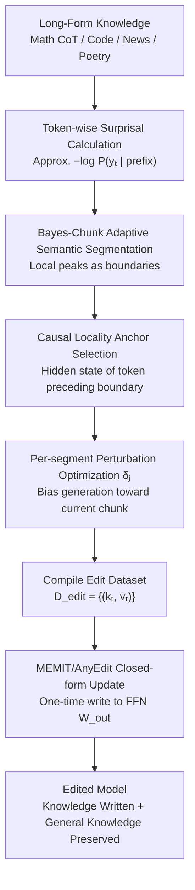

# AnyEdit++: Adaptive Long-Form Knowledge Editing via Bayesian Surprise

**Conference**: ICML 2026  
**arXiv**: [2606.01053](https://arxiv.org/abs/2606.01053)  
**Code**: The paper claims GitHub availability, though the local cache does not include a specific URL  
**Area**: Knowledge Editing / Long-form Knowledge Editing  
**Keywords**: Bayesian Surprise, Adaptive Chunking, Long-form Knowledge Editing, Structural Independence, Causal Locality  

## TL;DR
AnyEdit++ utilizes token-level Bayesian Surprise to identify semantic transition points in long-form text, replacing the fixed-window segmentation of AnyEdit with structure-aware Bayes-Chunk. It achieves stable improvements in BLEU and BERT Score across long-form knowledge editing tasks such as mathematics, code, news, and poetry.

## Background & Motivation
**Background**: Knowledge editing aims to write a specific fact or a piece of knowledge into model parameters without retraining the entire large model, while minimizing damage to unrelated knowledge. Locate-and-edit methods like ROME, MEMIT, and AlphaEdit typically locate edits at the FFN output matrices of several key layers, optimizing a local perturbation or target value to make the model generate the new object when seeing a specific subject/relation.

**Limitations of Prior Work**: This paradigm is natural for triple-based facts but faces capacity bottlenecks when dealing with long-form knowledge like mathematical derivations, code snippets, news narratives, and poetry. Long-form text is not a single-point fact but a series of semantic units with internal dependencies; compressing the entire segment into a single perturbation vector often leads to generation collapse, logical chain breaks, or memorization of only local fragments.

**Key Challenge**: AnyEdit already deconstructed long-form editing into autoregressive multi-segment edits, using multiple anchor keys and perturbations to write into weights, alleviating length constraints of single-point edits. However, AnyEdit's segmentation uses fixed-window splitting. Window boundaries are agnostic to semantic structure and may forcefully split function definitions, mathematical conditions, conclusions, or narrative transitions. This results in anchor keys that are either semantically ambiguous or highly correlated with adjacent fragments, causing mutual interference between multiple edits during a single weight update.

**Goal**: The authors do not aim to redesign the entire knowledge editing algorithm, but rather to answer two finer questions in long-form editing: first, where should long-form text be segmented to make segments more independent; second, where should the edit control signal be injected after segmentation to influence subsequent generation more effectively.

**Key Insight**: The paper observes that when a language model reads text, its internal belief state does not move smoothly; the model's expectation for the next token changes significantly at new arguments, new events, code structure switches, or reasoning leaps. Bayesian Surprise perfectly quantifies this "belief rewriting" intensity, making high surprise points naturally suitable as semantic boundaries.

**Core Idea**: Replace fixed window lengths with the model's own token-level surprise values to segment long-form text into chunks that align with semantic transitions. By placing edit perturbations on the token preceding a high-surprise segment, the system reduces cross-segment crosstalk and enhances local control.

## Method

### Overall Architecture
AnyEdit++ addresses "where to cut long-form text and where to inject edit signals," but it does not rewrite the entire editor. Instead, it retains the autoregressive editing and MEMIT-style closed-form weight updates of AnyEdit, replacing only the segmentation and anchor selection with structure-aware versions as a plug-and-play module. The process is as follows: the model first calculates token-wise surprisal on the original long text (Math CoT, code, news, or poetry) to obtain an information density curve. Bayes-Chunk takes local peaks of the curve as semantic boundaries to segment the text into chunks. For the $j$-th chunk, the system uses the hidden state of the token preceding the boundary as the anchor, optimizing a local perturbation $\delta_j$ at the target layer to bias the model toward generating the current chunk after that anchor. Once key-value target pairs for all chunks are collected, a single-shot weight update is performed using MEMIT/AnyEdit closed-form solutions.

In the context of locate-and-edit: standard methods construct a key $k$ and target value $v^*$, updating the FFN output matrix $W_{out}$ such that $W_{out}k \approx v^*$. AnyEdit extends this to multiple segments, where the $t$-th segment has its own anchor key $k_t$ and perturbation $\delta_t$, forming an edit dataset $D_{edit}=\{(k_t,v_t)\}_{t=1}^{M}$. AnyEdit++ keeps the solver but ensures $k_t$ originates from semantic boundaries rather than fixed window ends.

### Key Designs

**1. Bayes-Chunk Adaptive Semantic Segmentation: Aligning Boundaries with Information Jumps**

Fixed windows guarantee similar lengths but forcefully cut function definitions or logical transitions, which is a weakness of AnyEdit. Bayes-Chunk delegates segmentation to the model's own belief changes: the model maintains a prior belief $\pi_t$ given prefix $y_{<t}$, updated to $\pi_{t+1}$ after seeing $y_t$. Theoretical Bayesian Surprise is $D_{KL}(\pi_{t+1}\|\pi_t)$, approximated in practice by information surprisal $S(y_t)\approx -\log P(y_t|y_{<$t};\theta)$. Transition points in arguments, code structures, or narratives correspond to peaks in the surprisal curve. Bayes-Chunk selects these local peaks, sorted by position, as the boundary set $B=\{b_1,\ldots,b_M\}$. This results in chunks that are internally consistent and mutually distinguishable without requiring an external boundary detector.

**2. Structural Independence: Orthogonalizing Anchor Keys to Suppress Crosstalk**

Multi-segment closed-form updates are essentially superpositions of multiple rank-1 updates, leading to interference. The paper provides a crosstalk bound showing that horizontal interference for the $j$-th segment is proportional to $\sum_{t\neq j}\|\delta_t\|_2\cdot |k_t^T A k_j|$, where $A$ is the precision matrix of pre-training statistics. High similarity between keys makes them indistinguishable to the solver, causing overwrites. Bayes-Chunk ensures segments are more dispersed in both semantic embedding and anchor key space. The paper measured a reduction in average cross-segment similarity from 0.594 (fixed window) to 0.509 on EditEverything, explaining why semantic boundaries stabilize long-form editing.

**3. Causal Locality: Placing Perturbations at High-Surprise Precursors**

After segmentation, the injection point must be decided. The paper defines positional controllability $\kappa(i\to t)=\|\nabla_{h_i}L(y_t)\|_2$. In Transformer residual flows, backpropagation from $t-1$ is a nearly norm-preserving "vertical channel," while influencing $y_t$ from $t-k$ requires passing through attention weights, diluting the signal. Thus, for $k>1$, $\Delta\kappa_k=\kappa(t-1\to t)-\kappa(t-k\to t)>0$. A high surprisal token is where the semantic trajectory shifts; the preceding hidden state is the most direct entry point. Placing the perturbation here requires less parameter change and has fewer side effects.

### Loss & Training
Optimization occurs at two levels. Locally, for each Bayes-Chunk segment, perturbation $\delta_t$ is optimized to maximize the probability of generating the current chunk, conditioned on previous segments and historical perturbations. Globally, all $(k_t,v_t)$ pairs are used in a MEMIT-style least-squares update, satisfying edit constraints while using covariance statistics $C$ to preserve general knowledge. To ensure fairness, AnyEdit++ and AnyEdit both use MEMIT as the base algorithm. The authors also applied Bayes segmentation to FT-UKE to verify its general applicability.

## Key Experimental Results

### Main Results
The paper uses EditEverything, UnKE, and CounterFact datasets. EditEverything covers math, code, physics, chemistry, biology, news, and poetry. UnKE and CounterFact check performance on traditional facts. Metrics include BLEU and BERT Score (using all-MiniLM-L6-v2).

| Model | Method | Avg BLEU (EditEverything) | Avg BS (EditEverything) | Major Change vs AnyEdit |
|------|------|--------------------------|-------------------------|--------------------------|
| Llama-3.1-8B-Instruct | MEMIT | 42.61 | 82.74 | Inadequate for long-form |
| Llama-3.1-8B-Instruct | AnyEdit | 72.64 | 94.23 | Significant improvement |
| Llama-3.1-8B-Instruct | AnyEdit++ | 75.00 | 94.50 | BLEU +2.36, BS +0.27 |
| Llama-2-7B | AnyEdit | 42.30 | 86.33 | Weak models more fragile |
| Llama-2-7B | AnyEdit++ | 50.13 | 87.66 | BLEU ~+8, BS +1.33 |
| Qwen-2.5-7B-Instruct | AnyEdit | 81.81 | 95.28 | Strong baseline |
| Qwen-2.5-7B-Instruct | AnyEdit++ | 85.33 | 96.29 | BLEU +3.52, BS +1.01 |

The key finding is the consistent improvement across models, with the largest gains on models like Llama-2-7B that struggle with long-form edits. Gains are particularly pronounced in Math and Code categories (e.g., ~20 BLEU point gain on Code for Llama-2-7B), indicating that structured, logical text benefits most from semantic-aware chunking.

| Method | UnKE BLEU | UnKE BS | CounterFact BLEU | CounterFact BS | Avg BLEU | Avg BS |
|------|-----------|---------|------------------|----------------|-----------|---------|
| MEMIT | 24.76 | 76.50 | 32.21 | 75.79 | 28.49 | 76.15 |
| AlphaEdit | 21.34 | 73.86 | 23.51 | 72.42 | 22.43 | 73.14 |
| AnyEdit | 79.02 | 95.88 | 86.27 | 97.85 | 82.65 | 96.87 |
| AnyEdit++ | 81.57 | 96.03 | 90.69 | 98.29 | 86.13 | 97.16 |

Reference benchmarks confirm that AnyEdit++ does not damage basic editing capabilities, with improvements in both BLEU (82.65 to 86.13) and BERT Score (97.16).

### Ablation Study
The paper provides structural independence analysis and plug-and-play verification with FT-UKE.

| Analysis | Orig / Prior Method | With Bayes-Chunk | Notes |
|--------|-------------------|------------------------------|------|
| Avg Similarity (EditEverything) | 0.594 | 0.509 | Fragments are more independent |
| FT-UKE BLEU/BS (Llama-3.1-8B) | 99.90 / 99.99 | 99.95 / 99.99 | Slight gain on saturated baseline |
| FT-UKE BLEU/BS (Qwen-2.5-7B) | 99.52 / 99.93 | 99.57 / 99.96 | Transferable to fine-tuning |
| QwQ-Edit Long CoT Math | AnyEdit Baseline | Higher in all groups | Value scales with logic density |

### Key Findings
- Gains from Bayes-Chunk correlate with text structure strength; fixed windows often break logic in math and code.
- BERT Score improvements are smaller than BLEU because AnyEdit already maintains high semantic similarity; AnyEdit++ specifically improves precision and structural details.
- Experiments on structural independence confirm that reducing anchor key similarity prevents overwriting in closed-form updates.
- QwQ-Edit experiments show AnyEdit++ excels on long, logic-dense CoT samples, not just mid-length text.

## Highlights & Insights
- Successfully transforms "text segmentation" from an engineering hyperparameter into an observable model internal state. Surprisal curves directly reflect information jumps.
- Structural independence justifies *where to cut*, while causal locality justifies *where to edit*, addressing the two core questions of long-form editing.
- Incremental costs are low; no external memory or detector is needed, only a single probability pass by the target LLM.
- The use of surprisal for segmentation could be applied to other tasks like long CoT distillation or code patch learning.

## Limitations & Future Work
- The paper lacks detailed failure case analysis. It is unclear if specific patterns (e.g., high-frequency formatting or formula noise) cause surprisal peaks that do not align with semantic boundaries.
- Calculating surprisal requires an extra forward pass, which might be costly for ultra-long documents or massive batch edits.
- The method depends on the model's own calibration; if a model is unfamiliar with a domain, segments might be fragmented based on rare tokens rather than logical structure.
- Future work could combine Bayes-Chunk with layer selection or post-edit validators to adjust editing intensity based on segment difficulty.

## Related Work & Insights
- **vs ROME / MEMIT**: AnyEdit++ inherits MEMIT's closed-form updates but scales from single facts to multiple textual segments.
- **vs AlphaEdit**: While AlphaEdit focuses on null-space constraints to preserve unrelated knowledge, AnyEdit++ focuses on segment topology. They are potentially complementary.
- **vs AnyEdit**: AnyEdit introduced autoregressive sequence editing; AnyEdit++ identifies and fixes the weakness of fixed-window segmentation using Bayes-Chunk.
- **vs FT-UKE**: Bayes segmentation also improves fine-tuning-based editing, proving it is a general component for long-form text processing.

## Rating
- Novelty: ⭐⭐⭐⭐☆ Using Bayesian Surprise for segmentation is intuitive but highly effective when paired with structural independence and causal locality.
- Experimental Thoroughness: ⭐⭐⭐⭐☆ Covers multiple models and datasets, including transferability to other editing paradigms.
- Writing Quality: ⭐⭐⭐⭐☆ Logic is clear and motivations are well-founded, though discussion of limitations is slightly brief.
- Value: ⭐⭐⭐⭐☆ Practical for long-form knowledge management and offers a reusable strategy for sequence chunking.

<!-- RELATED:START -->

- ROME: Locating and Editing Factual Associations in GPT, NeurIPS 2022
- MEMIT: Mass-Editing Memory in a Transformer, ICLR 2023
- AnyEdit: Long-Form Knowledge Editing for Large Language Models, arXiv 2024

<!-- RELATED:END -->

## Related Papers

- [\[ACL 2025\] ToxEdit: Adaptive Detoxification Safeguarding General Capabilities of LLMs through Toxicity-Aware Knowledge Editing](../../ACL2025/knowledge_editing/adaptive_detoxification_safeguarding_general_capabilities_of_llms_through_toxici.md)
- [\[ICML 2026\] Do Text Edits Generalize to Visual Generation? Benchmarking Cross-Modal Knowledge Editing in UMMs](do_text_edits_generalize_to_visual_generation_benchmarking_cross-modal_knowledge.md)
- [\[ICML 2026\] The Labyrinth and the Thread: Rethinking Regularizations in Sequential Knowledge Editing for Large Language Models](the_labyrinth_and_the_thread_rethinking_regularizations_in_sequential_knowledge_.md)
- [\[ICML 2026\] KORE: Enhancing Knowledge Injection for Large Multimodal Models via Knowledge-Oriented Controls](kore_enhancing_knowledge_injection_for_large_multimodal_models_via_knowledge-ori.md)
- [\[ICML 2026\] Revisiting Parameter-Based Knowledge Editing in Large Language Models: Theoretical Limits and Empirical Evidence](revisiting_parameter-based_knowledge_editing_in_large_language_models_theoretica.md)

<!-- RELATED:END -->
