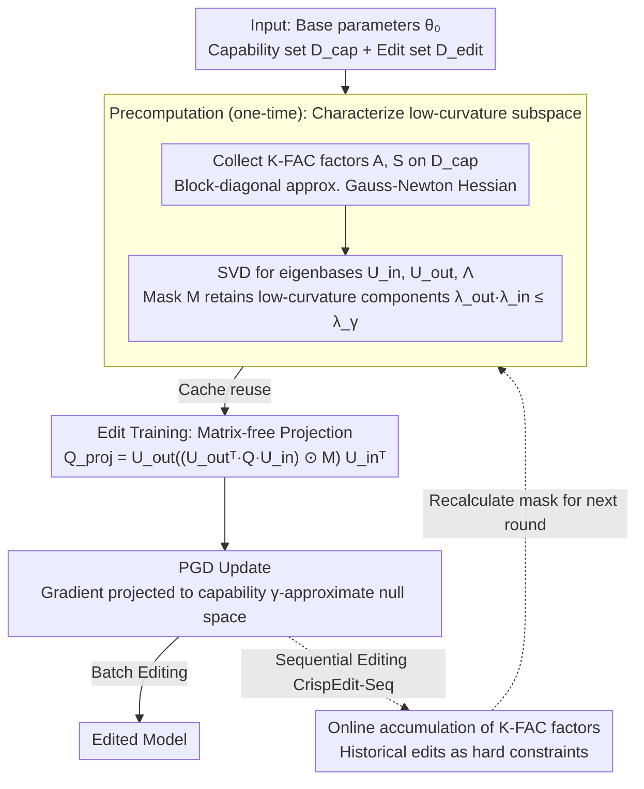

# CrispEdit: Low-Curvature Projections for Scalable Non-Destructive LLM Editing

**Conference**: ICML 2026  
**arXiv**: [2602.15823](https://arxiv.org/abs/2602.15823)  
**Code**: https://github.com/zarifikram/CrispEdit  
**Area**: Model Editing / LLM Knowledge Update / Second-order Optimization  
**Keywords**: Gauss-Newton Hessian, K-FAC, Bregman divergence, Matrix-free projection, Capability preservation

## TL;DR
LLM editing is formulated as a constrained optimization problem: "minimize edit loss s.t. capability loss remains invariant". This is equivalently transformed via Bregman divergence into a low-curvature subspace projection of the Gauss-Newton Hessian (GNH). By employing K-FAC and a Kronecker eigenbasis technique that avoids explicit construction of the projection matrix, 3,000 edits are completed in 6 minutes on an A40. The average performance drop of LLaMA-3-8B across MMLU/IFEval/ARC-C/TruthfulQA/GSM8K is suppressed to $< 1\%$, significantly outperforming AlphaEdit, MEMIT, and fine-tuning.

## Background & Motivation
**Background**: LLM knowledge becomes outdated (new facts, new events), and full retraining is prohibitively expensive. Model editing, which updates a small number of weights to inject new facts or remove harmful behaviors, serves as a practical alternative. Representative methods like ROME and MEMIT perform least-squares updates on "knowledge-storing MLP layers." AlphaEdit and Adam-NSCL project updates onto the null space of activation covariance, while LoRA and FT directly fine-tune a small subset of parameters.

**Limitations of Prior Work**: Methods with high editing success rates often "quietly" destroy general capabilities (akin to reward hacking). For LLaMA-3-8B on 3,000 ZsRE edits, MEMIT's MMLU score plummets from 69.5 to 22.9, and GSM8K drops to 0. While AlphaEdit is better, its MMLU still falls to 52.7 and GSM8K to 45.5. These issues are invisible in "teacher-forced" evaluations and must be assessed through autoregressive generation (yang-etal-2025-mirage). Furthermore, existing methods rely on heuristics like "knowledge location" or "activation covariance null space," which involve strong assumptions and are only indirectly related to capability preservation.

**Key Challenge**: Achieving both "successful modification" and "preservation of general capability" is equivalent to finding a direction in a high-dimensional parameter space that minimizes edit loss without perturbing capability loss. This is a hard-constrained quadratic program, which was previously unachievable at LLM scale ($10^{10}$ parameters).

**Goal**: (1) Formalize editing as constrained optimization without using Lagrangian relaxation; (2) Replace heuristics with geometric quantities directly linked to capability preservation; (3) Make second-order methods feasible for billion-parameter transformers in terms of both memory and time.

**Key Insight**: The authors observe that the neural network loss landscape is highly anisotropic (most Hessian eigenvalues are very small); thus, "moving along low-curvature directions" barely affects capability loss. Further, the second-order Taylor expansion of Bregman divergence is exactly equal to the Gauss-Newton Hessian (GNH), which does not require the base model to converge to a stationary point—a more realistic assumption than standard Hessians. Finally, K-FAC and Kronecker eigenbases make GNH projection matrix-free.

**Core Idea**: Project editing gradients onto the "$\gamma$-approximate null space of capability loss," defined by the Gauss-Newton Hessian. This is implemented via K-FAC's $A_{l-1} \otimes S_l$ Kronecker decomposition combined with a Hadamard mask to achieve matrix-free projection with $O(d_{\text{in}}^2 + d_{\text{out}}^2)$ memory.

## Method

### Overall Architecture
Given base parameters $\theta_0$, a capability reference set $\mathcal{D}_{\text{cap}}$ (defaulting to WikiText), and an edit set $\mathcal{D}_{\text{edit}}$. Stage 1 (Precomputation, once): For each layer $l$ to be edited, collect K-FAC factors $A_{l-1} = \mathbb{E}[a_{l-1} a_{l-1}^\top]$ and $S_l = \mathbb{E}[g_l g_l^\top]$ on $\mathcal{D}_{\text{cap}}$. Perform SVD to get $U_{\text{in}}, U_{\text{out}}, \Lambda_{\text{in}}, \Lambda_{\text{out}}$, and compute the mask $M_{ij} = \mathbb{1}[\lambda_i^{\text{out}} \lambda_j^{\text{in}} \le \lambda_\gamma]$. Stage 2 (Edit Training): Compute gradient $Q_l$ for the edit batch, project it using $Q_l^{\text{proj}} = U_{\text{out}}((U_{\text{out}}^\top Q_l U_{\text{in}}) \odot M) U_{\text{in}}^\top$, and perform PGD updates. No $d_{\text{in}} d_{\text{out}} \times d_{\text{in}} d_{\text{out}}$ projection matrix is explicitly constructed. Stage 3 (Optional, Sequential): Accumulate K-FAC factors online, treating previous edits as new capability constraints.

### Key Designs

**1. Bregman Divergence Constraint $\to$ Gauss-Newton Hessian: A quadratic form for "capability invariance" independent of convergence**

The hard constraint that "capability loss remains nearly invariant" typically requires the base model to be at a stationary point on capability data ($\nabla \mathcal{L}_{\text{cap}}(\theta_0) = 0$), which real LLMs do not satisfy. This work instead uses Bregman divergence: $\mathsf{d}^{\text{Breg}}_{\ell, y} = \ell(f_\theta(x), y) - \ell(f_{\theta_0}(x), y) - \langle \nabla \ell(f_{\theta_0}(x), y), f_\theta(x) - f_{\theta_0}(x) \rangle$. Its second-order Taylor expansion eliminates the linear term, yielding $\mathsf{d}^{\text{Breg}} \approx \frac{1}{2}(\theta-\theta_0)^\top G_{\text{cap}}(\theta-\theta_0)$, where $G_{\text{cap}} = \mathbb{E}[J^\top H_{\hat y} J]$ is the Gauss-Newton Hessian. This establishes the "low-curvature subspace" on a geometric quantity that actually holds for LLMs. Crucially, Proposition 1 proves that $\mathsf{Null}(K_{\text{cap}}^l) \subseteq \mathsf{Null}(G_{\text{cap}}^l)$—the activation covariance null space used by AlphaEdit/Adam-NSCL is merely a subset of the GNH null space. Thus, they are over-conservative special cases of CrispEdit; GNH provides a larger set of "safe editing" directions.

**2. K-FAC + Matrix-free Kronecker Projection: Enabling second-order projection for billion-scale parameters**

Explicitly storing a $d_{\text{in}} d_{\text{out}} \times d_{\text{in}} d_{\text{out}}$ projection matrix is infeasible (e.g., $\approx 3.4$ TB for LLaMA-3-8B's MLP). This method uses K-FAC to block-diagonalize the GNH into Kronecker products $G_{\text{cap}}^l \approx A_{l-1} \otimes S_l$, where the eigenvalues are the products $\lambda_{ij} = \lambda_i^{\text{out}} \cdot \lambda_j^{\text{in}}$. For a gradient matrix $Q_l$, projection involves rotating to the eigenbasis, filtering high-curvature components via mask $M$, and rotating back: $Q_l^{\text{proj}} = U_{\text{out}}((U_{\text{out}}^\top Q_l U_{\text{in}}) \odot M) U_{\text{in}}^\top$. This uses 3 matrix multiplications and 1 Hadamard product, with storage compressed from $O(d_{\text{in}}^2 d_{\text{out}}^2)$ to $O(d_{\text{in}}^2 + d_{\text{out}}^2)$ ($\approx 200$ MB). K-FAC factors are precomputed once on $\mathcal{D}_{\text{cap}}$ and cached, reducing editing costs from hours to minutes.

**3. Sequential Editing CrispEdit-Seq: Mitigating forgetting via accumulation of K-FAC factors**

Sequential editing is essentially continual learning. CrispEdit-Seq exploits the fact that $A_{l-1}, S_l$ factors are sufficient statistics for the "base capability + historical edit loss null space." After each editing round, factors are merged via streaming average into accumulated factors $\{A_{\text{acc}}^{l-1}, S_{\text{acc}}^l\}$, and the projection mask is recalculated. This automatically forces subsequent edits to preserve both the base model's capacity and all previous edits without storing historical data, making it suitable for privacy-sensitive scenarios.

### Loss & Training
Constraint: $\min_\theta \mathcal{L}_{\text{edit}}(\theta)$ s.t. $(\theta - \theta_0)^\top G_{\text{cap}} (\theta - \theta_0) \le \varepsilon$. In practice, PGD is used with K-FAC projection once per epoch. The energy threshold $\gamma \in (0, 1)$ controls the projection aggressiveness. K-FAC factors are precomputed on $\mathcal{D}_{\text{cap}}$ and cached. For LLaMA-3-8B, the full 3,000-edit pipeline takes 4–6 minutes.

## Key Experimental Results

### Main Results
Controlled experiments on LeNet-5 (MNIST $\to$ Fashion-MNIST) verify that PGD projection onto the Hessian low-curvature subspace yields the best pre-train/fine-tune trade-off, followed by K-FAC, significantly outperforming activation covariance (Adam-NSCL heuristic), supporting Proposition 1.

For LLaMA-3-8B-Instruct with 3,000 edits on ZsRE / CounterFact / WikiBigEdit, utilizing WILD (autoregressive) to evaluate edit reliability/generalization and 5 benchmarks for capability preservation:

| Dataset | Method | Edit Rel (QA Context) | Edit Gen (No Context) | MMLU | GSM8K | Time |
|--------|------|-----------------------|----------------------|------|-------|------|
| ZsRE | base | 2.1 | 2.1 | 69.5 | 73.5 | – |
| ZsRE | MEMIT | 0.1 | 0.1 | **22.9** | **0.0** | 9h27m |
| ZsRE | AlphaEdit | 70.1 | 39.4 | 52.7 | 45.5 | 7h19m |
| ZsRE | LocBF-FT | 69.5 | 22.1 | 69.5 | 75.5 | 22m |
| ZsRE | **CrispEdit** | **80.5** | **50.9** | **69.5** | **76.0** | **4m6s** |
| CounterFact | AlphaEdit | 74.9 | 44.1 | 47.4 | 37.5 | 5h56m |
| CounterFact | **CrispEdit** | **79.4** | 32.4 | **69.3** | **76.5** | **3m17s** |

CrispEdit achieves the highest editing success rate with almost zero capability drop, while being 100$\times$ faster than AlphaEdit.

### Ablation Study

| Configuration | Pre-train Acc | Fine-tune Acc | Note |
|------|---------------|---------------|------|
| Hessian (gold) | 99% (Stable) | High | Control baseline, computed for LeNet |
| GNH (Bregman) | $\approx$ Hessian | $\approx$ Hessian | Bregman replacement is nearly lossless |
| K-FAC | Slightly < GNH | $\approx$ GNH | Block-diag approximation is effective |
| EK-FAC (CrispEdit) | $\approx$ K-FAC | $\approx$ K-FAC | Comparable to K-FAC |
| Adam-NSCL (Act Cov) | Poor | Poor | Consistent with Prop 1: heuristic is overly conservative |

### Key Findings
- **AlphaEdit is a strict sub-case of CrispEdit** (Proposition 1): The relation $\mathsf{Null}(K_{\text{cap}}^l) \subseteq \mathsf{Null}(G_{\text{cap}}^l)$ explains why AlphaEdit drops MMLU by 17 points due to over-conservatism, while CrispEdit edits freely in a wider range of directions.
- Autoregressive (WILD) evaluation reveals "teacher-forced evaluation inflation": MEMIT appears viable in ROME-style metrics but drops to 0.0 GSM8K in generation.
- Caching K-FAC factors reduces editing costs from hours to minutes, enabling production readiness (3,000 edits in 6 min on A40).
- LoRA / FT / FT Sequential suffer catastrophic capability failure in sequential settings; CrispEdit-Seq maintains 73–74 GSM8K.

## Highlights & Insights
- **Bregman divergence $\to$ GNH is an elegant theoretical substitution**: It bypasses the requirement for the base model to reach a stationary point, opening a new door for Hessian-based LLM editing/fine-tuning/continual learning.
- **Proposition 1 unifies the AlphaEdit / Adam-NSCL lineage**: It identifies prior methods as special cases, providing both theoretical unification and an explanation for the performance gap.
- **Matrix-free Kronecker projection**: While technically a numerical linear algebra trick, the engineering gains (3.4TB $\to$ 200MB, hours $\to$ minutes) are decisive.
- **Autoregressive (WILD) evaluation**: By adopting generation-based assessment, the work exposes the "teacher-forced illusion" of previous SOTA methods.

## Limitations & Future Work
- K-FAC is a block-diagonal approximation that ignores cross-layer coupling.
- The choice of "capability reference set" $\mathcal{D}_{\text{cap}}$ is critical; universal corpora like WikiText may not protect reasoning-heavy tasks like GSM8K as effectively as reasoning-specific sets.
- Not yet tested on 70B+ models; K-FAC factor scale still grows with $d^2$, requiring further compression for MoE or larger architectures.
- The energy threshold $\gamma$ is a key hyperparameter requiring tuning.
- CrispEdit-Seq still shows some generalization decay (80.5 $\to$ 71.1 on ZsRE), indicating that streaming K-FAC is not yet perfectly lossless.

## Related Work & Insights
- **vs AlphaEdit / Adam-NSCL**: Both use null-space projection, but their reliance on activation covariance $K_{\text{cap}}$ makes them over-restrictive special cases (Prop 1), leading to the 17-point MMLU gap.
- **vs MEMIT / ROME**: These methods suffer catastrophic MMLU failure in generation-based evaluation; CrispEdit avoids the "knowledge localization" assumption.
- **vs LoRA / FT**: Fine-tuning methods fail in sequential editing without explicit capability constraints; CrispEdit's projection is complementary to FT.
- **vs UltraEdit**: UltraEdit is fast (3 min) but has low success rates ($\approx$ 20.0); CrispEdit achieves 80.5 in 4 min, dominating the time-quality Pareto front.

## Rating
- Novelty: ⭐⭐⭐⭐⭐ Bregman $\to$ GNH substitution + matrix-free Kronecker projection is original.
- Experimental Thoroughness: ⭐⭐⭐⭐ Extensive benchmarks and sequential settings; lacks 70B+ validation.
- Writing Quality: ⭐⭐⭐⭐⭐ Clear geometric intuition and rigorous proof.
- Value: ⭐⭐⭐⭐⭐ Provides a production-ready solution (4 min, 1% drop) and a unified framework for heuristic methods.

<!-- RELATED:START -->

## Related Papers

- [\[ICML 2026\] From Backward Spreading to Forward Replay: Revisiting Target Construction in LLM Parameter Editing](from_backward_spreading_to_forward_replay_revisiting_target_construction_in_llm_.md)
- [\[ACL 2026\] CLaRE-ty Amid Chaos: Quantifying Representational Entanglement to Predict Ripple Effects in LLM Editing](../../ACL2026/knowledge_editing/clare-ty_amid_chaos_quantifying_representational_entanglement_to_predict_ripple_.md)
- [\[ACL 2025\] ChainEdit: Propagating Ripple Effects in LLM Knowledge Editing through Logical Rule-Guided Chains](../../ACL2025/knowledge_editing/chainedit_propagating_ripple_effects_in_llm.md)
- [\[ICML 2026\] Reverse-Engineering Model Editing on Language Models](reverse-engineering_model_editing_on_language_models.md)
- [\[ICML 2026\] Do Text Edits Generalize to Visual Generation? Benchmarking Cross-Modal Knowledge Editing in UMMs](do_text_edits_generalize_to_visual_generation_benchmarking_cross-modal_knowledge.md)

<!-- RELATED:END -->
