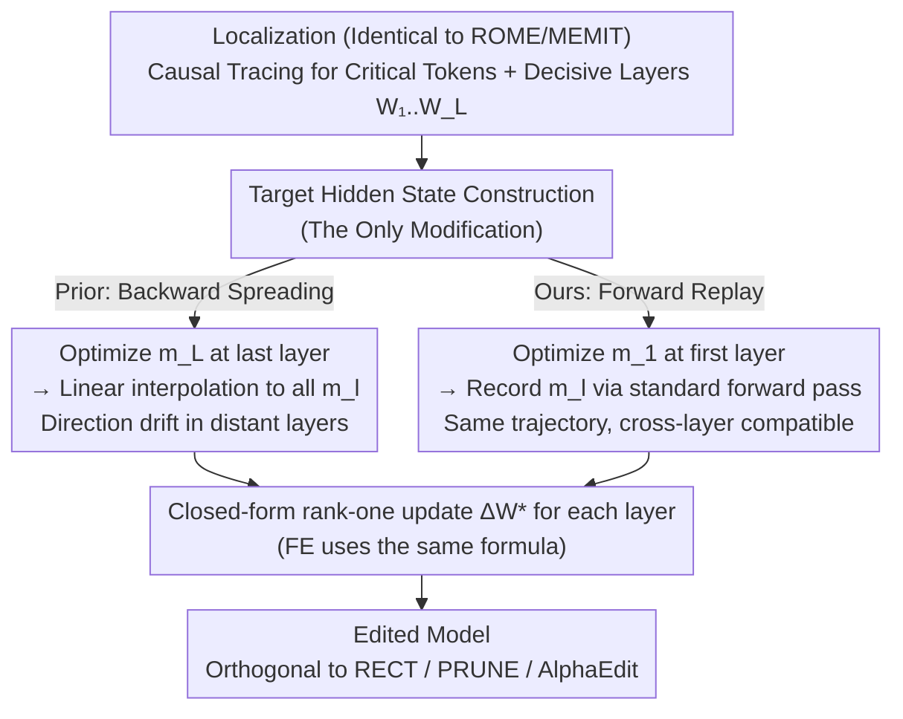

# From Backward Spreading to Forward Replay: Revisiting Target Construction in LLM Parameter Editing

**Conference**: ICML 2026  
**arXiv**: [2605.00358](https://arxiv.org/abs/2605.00358)  
**Code**: https://github.com/jugechengzi/FE (Available)  
**Area**: LLM Knowledge Editing / Locate-then-edit  
**Keywords**: Parameter Editing, MEMIT, Multi-layer Coordination, Forward Propagation, Hidden State

## TL;DR
This paper systematically analyzes why backward spreading in locate-then-edit works and where it falls short. It proposes forward replay: treating the hidden state of the first decisive layer as an optimization variable and performing a standard forward pass to obtain targets for subsequent layers. This achieves consistent performance gains over MEMIT/RECT/PRUNE/AlphaEdit without additional computational overhead.

## Background & Motivation

**Background**: The locate-then-edit (LTE) paradigm, represented by ROME/MEMIT, has become the mainstream for LLM knowledge editing. It involves locating critical tokens and decisive MLP layers via causal tracing, calculating the ideal hidden state $m_L$ for the final layer, and solving a closed-form rank-one update. To prevent modifications to a single layer from being suppressed by regularization, mainstream approaches use backward spreading (linear interpolation) to distribute $m_L$ across earlier layers (e.g., $m_1 = h_1 + (m_3-h_3)/3$).

**Limitations of Prior Work**: The rationality of backward spreading has lacked systematic verification. It implicitly assumes that the residual direction of the last layer applies to all previous layers. However, forward dynamics are non-linear, and directions rotate across layers. Recent methods like BLUE attempt independent optimization for the first and last layers, doubling computational costs while producing targets that may not be mutually compatible in high-dimensional space.

**Key Challenge**: Closed-form solutions for a single layer depend on accurate $m_l$, while multi-layer coordination requires compatibility between all $m_l$. Backward spreading uses one direction to cover all layers, whereas independent optimization breaks compatibility. The root cause is that the **propagation direction of the target is inconsistent with the actual forward dynamics of the model**.

**Goal**: (1) Formally characterize when backward spreading works and when it fails; (2) Propose a multi-layer target construction method that is naturally consistent with forward dynamics without increasing computational costs.

**Key Insight**: When performing gradient descent on the last layer's hidden state $m_L$, the backpropagation graph already contains information about "where previous layers should move to reach the goal." By optimizing at the **first decisive layer** and performing a forward replay pass, this information can be explicitly recovered.

**Core Idea**: Replace backward spreading with forward replay—shift the anchor point from the final layer to the first layer. Targets for subsequent layers emerge naturally through standard forward propagation, maintaining identical complexity while ensuring cross-layer compatibility.

## Method

### Overall Architecture
The difficulty in locate-then-edit lies not in the closed-form solution itself, but in constructing a set of mutually compatible target hidden states $m_l$ for each decisive layer $W_1, \dots, W_L$. This work shifts the source of these targets from "spreading backward" to "propagating forward": first optimize $m_1$ at the first decisive layer, then let the model perform a forward pass to compute $m_l$ for subsequent layers. The closed-form update part remains unchanged. Given the hidden state $k_l$ before $W_l$, all layers share the same update formula $\Delta W^* = (M_I - W K_I) K_I^\top (K_I K_I^\top + \lambda K_J K_J^\top)^{-1}$. While MEMIT calculates only $m_L$ and uses linear interpolation for the rest, FE (Forward propagation Edit) calculates only $m_1$ and relies on replay. This is the sole difference in the pipeline.

### Key Designs

**1. Formalizing the Conditions for Backward Spreading: Success vs. Failure**

Before replacing the default practice, the paper formally characterizes why it "partially works." Let $\delta m_l = \Delta W_l k_l$ be the output perturbation of layer $l$, which propagates through the Jacobian to the last layer as $\delta^l_{m_L} = J_{l\to L}\,\delta m_l$. Backward spreading implicitly assumes this passive change is in the same direction as the original perturbation, differing only by a scalar, i.e., $\delta^l_{m_L} = \beta\,\delta m_l$. Theorem 1 states this is equivalent to $\delta m_l$ being an eigenvector of $J_{l\to L}$, an extremely strong condition unlikely to hold. Relaxing this to require only a positive cosine similarity, $\cos(\delta^l_{m_L}, \delta m_l) > 0$, Theorem 2 provides the condition: the symmetrized Jacobian $\frac{1}{2}(J_{l\to L}+J_{l\to L}^\top)$ must be positive definite. Empirically, this holds for deeper layers, but on Llama3-8B, the cosine similarity from layer 4 to 8 increases from $0.34$ to $1.00$. This indicates that as layers get further from the output, direction drift becomes severe, making shallow layers contribute almost nothing when using the final layer's direction. This rotation effect is the structural reason why backward spreading cannot scale to many layers.

**2. Forward Replay: Letting Targets Emerge via Forward Dynamics**

Since the final direction cannot be reliably pushed backward, FE shifts the anchor point to the first layer. While MEMIT treats the last layer $h_L$ as an optimizable parameter to minimize cross-entropy $H(Y, Y_{\text{target}})$ and then back-interpolates, FE optimizes the first layer $h_1$ via gradient descent to get $m_1$. It then feeds $m_1$ back into the model for a standard forward pass, recording the hidden states at each decisive layer as $m_l$. The resulting $\{m_l\}$ originate from a single forward trajectory, ensuring natural cross-layer compatibility without extra constraints. Moreover, since the gradient for $m_1$ already passes through the entire network, $m_1$ implicitly contains information on where downstream layers should go. Forward replay simply reads out this information, maintaining the same complexity as MEMIT.

**3. Plug-and-Play across LTE Pipelines**

FE specifically replaces only the target propagation mechanism. It does not modify the closed-form solution, the optimization objective for the initial $m$, or the regularization terms. Consequently, any method modifying the form of $\Delta W$ can be combined with "+FE." RECT (norm regularization), PRUNE (singular value pruning), and AlphaEdit (null-space projection) are all orthogonal to FE's target source modification.

## Key Experimental Results

### Main Results
Llama3-8B-Instruct, decisive layers $[4,5,6,7,8]$, 2000 knowledge entries each for MCF and ZsRE, batch editing.

| Dataset | Method | Efficacy Success ↑ | Generalization Acc ↑ | DKL ↓ | Top-1 ↑ |
|--------|------|--------------------|------------------------|-------|---------|
| MCF | MEMIT | 97.4 | 48.0 | 0.41 | 77.5 |
| MCF | BLUE (2-layer independent) | 98.4 | 60.1 | 0.35 | 81.0 |
| MCF | **MEMIT+FE** | **99.9** | **61.0** | **0.34** | **82.7** |
| ZsRE | MEMIT | 92.6 | 72.6 | 0.60 | 45.3 |
| ZsRE | BLUE | 94.6 | 78.2 | 0.18 | 66.7 |
| ZsRE | **MEMIT+FE** | **97.6** | **84.3** | **0.09** | **75.6** |

### Ablation Study

| Configuration | MCF Efficacy Success | Note |
|------|-----------------------|------|
| OneLayer (Last layer only) | 76.2 | Multi-layer coordination is necessary |
| MEMIT (backward, dividing) | 97.4 | Standard baseline |
| MEMIT (backward, no-dividing) | — | Last layer residual 0.23, but first layer moves away |
| MEMIT+FE | **99.9** | Targets are compatible; residuals drop significantly |

**Cosine measurement (Llama3-8B, layer 4→8)**: $0.34, 0.41, 0.54, 0.72, 1.00$. This quantitatively demonstrates direction drift in distant layers, explaining why backward spreading's contribution at layer 4 is near zero.

### Key Findings
- The failure of backward spreading in shallow layers is a structural issue caused by the linear accumulation of Jacobian rotation effects over depth.
- FE's improvement extends beyond efficacy, significantly reducing DKL (MCF 0.41 → 0.34, ZsRE 0.60 → 0.09). More accurate targets align the closed-form solution better with the objective, reducing collateral damage.
- Applying FE to RECT/PRUNE/AlphaEdit yields consistent gains (e.g., AlphaEdit Efficacy 95.2 → 99.8), confirming its value as a general-purpose plugin.

## Highlights & Insights
- The authors transform the "common sense" of backward spreading into two formal hypotheses: positive definiteness of the symmetric Jacobian and small step sizes. This "explain-then-replace" approach is robust.
- The core insight of Forward Replay: Model gradients already "calculate" where each layer should go; one only needs a forward pass to extract it. This is an elegant reuse of implicit backpropagation information.
- As a pure plugin that requires no extra compute or component changes, it can be adopted by any LTE pipeline in the model editing community.

## Limitations & Future Work
- Experiments were restricted to MLP layers; applicability to attention layers remains unverified.
- Scaling performance for extremely large batches ($10^4$+ edits) was not specifically evaluated.
- In very deep models (70B+), the forward trajectory from $m_1$ to the final layer might distort; whether segmented anchors are needed is an open question.
- Potential integration with non-LTE methods (Hypernetworks, memory-based WISE) was not discussed.

## Related Work & Insights
- **vs MEMIT**: Retains the closed-form solution and regularization while reversing the target source from backward to forward.
- **vs BLUE**: BLUE independently optimizes the first and last layers but skips intermediate ones. FE obtains all layer targets with half the optimization cost and full compatibility.
- **vs RECT / PRUNE / AlphaEdit**: These modify the regularization or subspace of $\Delta W$, which is orthogonal to and stackable with FE.
- **vs WISE / RLEdit**: These follow non-LTE routes (extra memory or hypernetworks). This work demonstrates that the LTE route's ceiling is higher than previously thought.

## Rating
- **Novelty**: ⭐⭐⭐⭐ Reversing backward to forward is a simple yet paradigm-level shift.
- **Experimental Thoroughness**: ⭐⭐⭐⭐ Comprehensive comparison across two datasets, three models, and 5+ baselines with theoretical proofs.
- **Writing Quality**: ⭐⭐⭐⭐ Clear "analysis then proposal" structure; intuitive visualizations.
- **Value**: ⭐⭐⭐⭐⭐ A general-purpose plugin that benefits any LTE method, with broad impact on the community.

<!-- RELATED:START -->

## Related Papers

- [\[ICML 2026\] Revisiting Parameter-Based Knowledge Editing in Large Language Models: Theoretical Limits and Empirical Evidence](revisiting_parameter-based_knowledge_editing_in_large_language_models_theoretica.md)
- [\[ICML 2026\] CrispEdit: Low-Curvature Projections for Scalable Non-Destructive LLM Editing](crispedit_low-curvature_projections_for_scalable_non-destructive_llm_editing.md)
- [\[ACL 2025\] The Mirage of Model Editing: Revisiting Evaluation in the Wild](../../ACL2025/knowledge_editing/the_mirage_of_model_editing_revisiting_evaluation_in_the_wild.md)
- [\[ACL 2026\] CLaRE-ty Amid Chaos: Quantifying Representational Entanglement to Predict Ripple Effects in LLM Editing](../../ACL2026/knowledge_editing/clare-ty_amid_chaos_quantifying_representational_entanglement_to_predict_ripple_.md)
- [\[ICML 2026\] Do Text Edits Generalize to Visual Generation? Benchmarking Cross-Modal Knowledge Editing in UMMs](do_text_edits_generalize_to_visual_generation_benchmarking_cross-modal_knowledge.md)

<!-- RELATED:END -->
