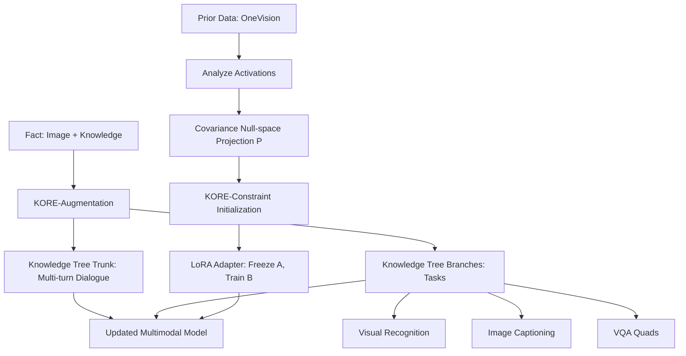

# KORE: Enhancing Knowledge Injection for Large Multimodal Models via Knowledge-Oriented Controls

**Conference**: ICML 2026  
**arXiv**: [2510.19316](https://arxiv.org/abs/2510.19316)  
**Code**: Undisclosed (paper mentions "to be released upon acceptance")  
**Area**: Knowledge Editing / Multimodal / Continual Learning  
**Keywords**: Knowledge Injection, LMM, Catastrophic Forgetting, Null-space Projection, Data Augmentation

## TL;DR
Ours injects new knowledge into LMMs via a two-stage "knowledge-oriented control." One stage automatically expands a single fact into a structured knowledge tree of multi-turn dialogues and instruction tasks to enhance generalization; the other stage initializes the LoRA adapter in the null-space of the covariance matrix of prior knowledge to minimize interference with existing capabilities. KORE achieves strong adaptation and retention simultaneously on LLaVA-v1.5 and Qwen2.5-VL.

## Background & Motivation
**Background**: LMMs freeze world knowledge within pre-trained weights, yet the real world is dynamic (new persons, events, products). This necessitates a "knowledge injection" mechanism that can learn new knowledge (adaptation) without losing existing capabilities (retention).

**Limitations of Prior Work**: (1) Full fine-tuning is computationally expensive and tends to overfit to sample surfaces, failing to generalize (e.g., Full-FT on EVOKE merely recites training prompts); (2) PEFT methods (LoRA, Prompt Tuning) are efficient but still suffer from catastrophic forgetting; (3) Continual learning methods (EWC, LwF) preserve old knowledge but inhibit new knowledge absorption, often resulting in "irrelevant answers + instruction forgetting."

**Key Challenge**: The internalization of knowledge requires sufficient and diverse training signals, which tend to disrupt existing representations. Conversely, protecting old representations limits the plasticity for new concepts—adaptation and retention exhibit a trade-off relationship.

**Goal**: (1) Use knowledge augmentation to promote true "internalization" of new knowledge over rote memorization; (2) Employ structural constraints to ensure fine-tuning directions "avoid" subspaces carrying old capabilities; (3) Integrate both into a two-stage optimization framework adaptable to various LMM architectures and scales.

**Key Insight**: The authors observe that (a) standard text/image augmentation acts as surface-level paraphrasing and cannot construct logical associations between knowledge points; (b) old knowledge is essentially the covariance structure of input activations in linear layers—modifying parameters in the null-space of the covariance matrix is equivalent to "not changing the output under old inputs."

**Core Idea**: Knowledge injection control is partitioned into two dimensions: in the data dimension, a single fact is expanded into a systematic knowledge tree (trunk: multi-turn dialogue; branches: visual recognition/Caption/VQA tasks); in the parameter dimension, the LoRA $A$ matrix is initialized in the null-space of the old knowledge covariance, ensuring $AC \approx 0$ and thus $BAC \approx 0$, leaving old representations largely untouched.

## Method

### Overall Architecture
Ours is a two-stage pipeline: (1) KORE-augmentation—automatically produces 4 categories of training samples (multi-turn dialogue + visual recognition + image caption + VQA) for each original (image, text) fact. The KORE-74K dataset was constructed using EVOKE facts (comprising 75K dialogues and 46K VQA pairs); (2) KORE-constraint—samples 256 OneVision instances across all linear layers of LLaVA/Qwen to obtain the activation covariance matrix $C=XX^\top$. For each layer, SVD is performed to select the $r$ smallest singular vectors to form $\hat U$, obtaining the projector $P=\hat U\hat U^\top$. LoRA weights $B, A$ are initialized using $\text{SVD}(W_0P)$, and the original weight is adjusted to $W_0'=W_0-BA$ to ensure identical model behavior at the start of training. During training, $A$ is frozen and only $B$ is updated.

### Key Designs

1.  **KORE-augmentation: Knowledge Tree Structure**:
    - **Function**: Automatically expands an isolated (image, knowledge) pair into a tree structure with a "trunk" (dialogue) and "branches" (three instruction tasks), forcing the model to understand the internal logic of knowledge rather than memorizing it.
    - **Mechanism**: The trunk consists of "heuristic Q&A (template) + 10-turn dialogue generated by GPT-4o based on original text"; branches use News titles/Entity names as keywords to retrieve the top-5 images from Google, keeping 2 relevant images via CLIP cosine similarity for: ① Visual Recognition ("Is this X in the image?" Answer: Yes), ② Image Captioning (GPT-4o generated summaries), ③ VQA (GPT-4o generated $(Q, A, S, H)$ quads, where $S$ is the subject and $H$ is the hypernym for retrieval).
    - **Design Motivation**: Traditional augmentations (synonym replacement, rotation) are superficial and discrete, only increasing "exposure" without contributing to knowledge structure. Presenting the same knowledge through dialogue, recognition, description, and Q&A forces cross-validation across abstraction levels for true internalization.

2.  **KORE-constraint: Covariance Null-space Initialization**:
    - **Function**: Constrains the LoRA low-rank matrix $A$ to the null-space of prior task activation covariance, ensuring fine-tuning occurs only in directions that do not affect old representations.
    - **Mechanism**: Collects activations $X \in \mathbb{R}^{d_{in} \times BL}$ for each linear layer and computes $C=XX^\top$. Perform $\text{SVD}(C)=\sum_i \sigma_i u_i u_i^\top$, selecting the $r$ left singular vectors corresponding to the smallest eigenvalues to form $\hat U$, resulting in projection $P = \hat U \hat U^\top$. Initialize $B=U^*\sqrt{\Sigma^*}$ and $A=\sqrt{\Sigma^*}(V^*)^\top$ using $\text{SVD}(W_0 P)=U^*\Sigma^*(V^*)^\top$, setting $W_0'=W_0-BA$. Since $AC \approx 0$, it follows $BAC \approx 0$, preserving outputs for old inputs.
    - **Design Motivation**: CO-SVD experiments verify that the covariance matrix captures multimodal knowledge. Removing small singular values preserves performance much better than plain SVD/ASVD, with different tasks showing distinct outlier patterns. Allocating null-space directions for "new knowledge writing" isolates new and old knowledge into orthogonal subspaces.

3.  **Customizable Covariance Source**:
    - **Function**: Allows users to select specific datasets to build the covariance matrix based on the capabilities they most want to preserve (e.g., MME or OCR).
    - **Mechanism**: Experiments used both a "general covariance" sampled from 4 OneVision subsets (General/Doc/Chart/Math/OCR) and "specific covariances" sampled from single benchmarks like MME/ScienceQA/POPE.
    - **Design Motivation**: Different deployment scenarios have varying retention needs; making the covariance source configurable transforms KORE-constraint from a one-size-fits-all approach to "retention-on-demand."

### Loss & Training
Standard LoRA cross-entropy loss is used without extra regularization. For LLaVA-v1.5 (7B): rank=235, batch=54, $\eta=2 \times 10^{-4}$, cosine decay, 6 epochs, AdamW, DeepSpeed Zero3, 4 $\times$ H100. The same config is used for 13B; Qwen2.5-VL uses rank=274 and grad accum=8. Covariance extraction requires only one inference pass.

## Key Experimental Results

### Main Results
Comparison on LLaVA-v1.5 (7B) between KORE and 9 baselines on EVOKE (adaptation) + 12 retention benchmarks:

| Method | Params | K.A (EVOKE F1) | K.R (Mean) | Avg | HARS |
| :--- | :--- | :--- | :--- | :--- | :--- |
| Pre-trained | — | 9.34 | 54.32 | 46.74 | — |
| Full-FT | 6759M | 15.17 | 16.09 | 31.66 | 24.13 |
| LoRA | 340M | 18.31 | 41.38 | 33.47 | 25.12 |
| Replay | 340M | 17.98 | 51.67 | 43.00 | 28.83 |
| EWC | 340M | 19.42 | 43.50 | 35.14 | 26.30 |
| CIA | 340M | 20.27 | 44.52 | 35.99 | 26.69 |
| **KORE (r=235)** | 340M | **41.26** | 51.75 | **40.00** | **82.81** |
| **KORE (r=256)** | 369M | **41.32** | 51.50 | **42.10** | **84.93** |

Ours pushes EVOKE F1 from LoRA's 18.31 to 41.26 while maintaining a retention score on par with Replay, effectively bridging the adaptation-retention trade-off.

### Ablation Study

| Config | K.A | K.R | Avg | HARS | Insight |
| :--- | :--- | :--- | :--- | :--- | :--- |
| Full KORE (r=235) | 35.96 | 40.00 | 37.98 | 82.81 | Full |
| W/o Augmentation | 14.57 | 40.16 | 27.37 | 64.14 | K.A drops 21.4 — Aug is key for adaptation |
| W/o Constraint | 38.82 | 35.78 | 37.30 | 79.04 | K.R drops 4.2 — Constraint is key for retention |
| W/o Freezing $A$ | 36.85 | 38.92 | 37.88 | 81.96 | Freezing $A$ provides marginal gain |

### Key Findings
- **Complementary Mechanisms**: Removing augmentation hurts adaptation; removing constraints hurts retention. Both are required for optimal performance on both dimensions.
- **Knowledge Tree Efficacy**: Under the same GPT-4o backbone, KORE-aug outperforms "knowledge-aware text augmentation" by 18.5 K.A points, indicating improvements stem from the structured design rather than LLM distillation.
- **Fine-grained Coverage**: KORE outperforms all baselines across 4 news subcategories and 4 entity subcategories, achieving best scores in OCR/MMMU/HallB retention.
- **Customizable Utility**: Using MME subsets for covariance improves MME scores by 7.17 without significant drops elsewhere.
- **Architecture Agnostic**: HARS of 85.46 on LLaVA-13B and 67.10 on Qwen2.5-VL (compared to Replay's 66.73 / 30.89) proves KORE's generalizability.

## Highlights & Insights
- "Knowledge Tree Augmentation" is an insightful design: Unlike traditional augmentation that expands one fact into $N$ isolated samples, KORE establishes semantic links, teaching the model how a fact answers varied questions. This structure makes internalization distinct from memorization.
- Using the "null-space of input activation covariance" as a LoRA initialization base transforms "old knowledge protection" into a clean linear algebra operation—no KL regularization or replay data is needed, only an SVD. This "geometric isolation vs. loss regularization" design is more scalable.
- Freezing $A$ while updating $B$ exploits LoRA asymmetry: as long as $A$ is in the null-space, $BAC \approx 0$ holds regardless of $B$, shifting "protection" from a training dynamic constraint to a parameterized structural constraint.
- The proposed HARS (Harmonic Adaptation-Retention Score) provides a balanced metric for benchmarking, analogous to the F1 score in Precision-Recall.

## Limitations & Future Work
- Covariance $C$ is estimated with 256 samples, which might lack coverage for long-tail or novel inputs, although robustness was shown down to 32 samples.
- Augmentation depends on GPT-4o, making the construction of KORE-74K costly and prone to propagating the teacher's biases.
- The constraint method only ensures "forward output invariance" without constraining attention patterns or intermediate semantics, which might hinder multi-step reasoning.
- Optimal LoRA rank selection remains a manual trade-off between parameter budget and performance.
- Sequential multi-round injection was not evaluated; in "lifelong" scenarios, the null-space may eventually be exhausted.

## Related Work & Insights
- **vs. AlphaEdit**: Both use null-space projection for editing, but AlphaEdit targets fact editing in LLMs without augmentation; KORE targets LMMs and couples augmentation with structural constraints.
- **vs. CorDA/CIA/EWC/LwF**: Traditional CL relies on regularizing all parameters; KORE utilizes geometric isolation to limit only the directions that would disrupt old representations, offering lower interference and higher capacity.
- **vs. Replay**: Replay requires storing old data (privacy risks); KORE only requires a one-time covariance matrix (aggregated statistics), making it more lightweight and privacy-friendly.

## Rating
- Novelty: ⭐⭐⭐⭐ — The combination of knowledge tree augmentation and null-space LoRA into a two-stage multimodal system is novel.
- Experimental Thoroughness: ⭐⭐⭐⭐⭐ — Comprehensive evidence across 12 benchmarks, 3 model scales, and 9 baselines.
- Writing Quality: ⭐⭐⭐⭐ — Clear concepts, intuitive diagrams, and rigorous mathematical derivations.
- Value: ⭐⭐⭐⭐ — Provides a practical, cost-controllable solution for updating production LMMs; the HARS metric is likely to become a standard reference.

<!-- RELATED:START -->

## Related Papers

- [\[ICLR 2026\] When Large Multimodal Models Confront Evolving Knowledge: Challenges and Explorations](../../ICLR2026/knowledge_editing/when_large_multimodal_models_confront_evolving_knowledge_challenges_and_explorat.md)
- [\[ICML 2026\] The Labyrinth and the Thread: Rethinking Regularizations in Sequential Knowledge Editing for Large Language Models](the_labyrinth_and_the_thread_rethinking_regularizations_in_sequential_knowledge_.md)
- [\[ICML 2026\] Revisiting Parameter-Based Knowledge Editing in Large Language Models: Theoretical Limits and Empirical Evidence](revisiting_parameter-based_knowledge_editing_in_large_language_models_theoretica.md)
- [\[AAAI 2026\] Hybrid-DMKG: A Hybrid Reasoning Framework over Dynamic Multimodal Knowledge Graphs for Multimodal Multihop QA with Knowledge Editing](../../AAAI2026/knowledge_editing/hybrid-dmkg_a_hybrid_reasoning_framework_over_dynamic_multimodal_knowledge_graph.md)
- [\[ACL 2026\] EvoEdit: Evolving Null-space Alignment for Robust and Efficient Knowledge Editing](../../ACL2026/knowledge_editing/evoedit_evolving_null-space_alignment_for_robust_and_efficient_knowledge_editing.md)

<!-- RELATED:END -->
## Related Papers

- [\[ICLR 2026\] When Large Multimodal Models Confront Evolving Knowledge: Challenges and Explorations](../../ICLR2026/knowledge_editing/when_large_multimodal_models_confront_evolving_knowledge_challenges_and_explorat.md)
- [\[ICML 2026\] The Labyrinth and the Thread: Rethinking Regularizations in Sequential Knowledge Editing for Large Language Models](the_labyrinth_and_the_thread_rethinking_regularizations_in_sequential_knowledge_.md)
- [\[ACL 2025\] Structure-aware Domain Knowledge Injection for Large Language Models](../../ACL2025/knowledge_editing/structure-aware_domain_knowledge_injection_for_large_language_models.md)
- [\[ICML 2026\] Revisiting Parameter-Based Knowledge Editing in Large Language Models: Theoretical Limits and Empirical Evidence](revisiting_parameter-based_knowledge_editing_in_large_language_models_theoretica.md)
- [\[AAAI 2026\] Hybrid-DMKG: A Hybrid Reasoning Framework over Dynamic Multimodal Knowledge Graphs for Multimodal Multihop QA with Knowledge Editing](../../AAAI2026/knowledge_editing/hybrid-dmkg_a_hybrid_reasoning_framework_over_dynamic_multimodal_knowledge_graph.md)

<!-- RELATED:END -->
