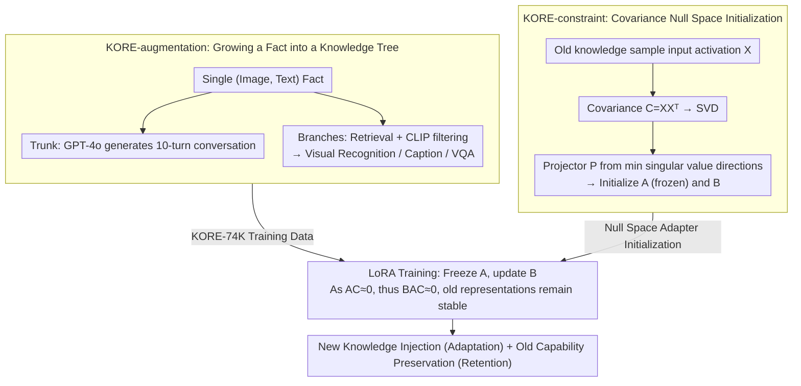

# KORE: Enhancing Knowledge Injection for Large Multimodal Models via Knowledge-Oriented Controls

**Conference**: ICML 2026  
**arXiv**: [2510.19316](https://arxiv.org/abs/2510.19316)  
**Code**: Underspecified (paper mentions "public upon acceptance")  
**Area**: Knowledge Editing / Multimodal / Continual Learning  
**Keywords**: Knowledge Injection, Multimodal Large Language Models, Catastrophic Forgetting, Null Space Projection, Data Augmentation

## TL;DR
KORE injects new knowledge into LMMs through two-stage "knowledge-oriented controls": automatically expanding single facts into structured multi-turn conversations and instruction tasks (to enhance generalization), while initializing LoRA adapters using the null space of the covariance matrix of prior knowledge (to minimize interference with existing capabilities). It achieves both strong adaptation and strong retention on LLaVA-v1.5 / Qwen2.5-VL.

## Background & Motivation
**Background**: LMMs freeze world knowledge in pre-trained weights, but the real world changes (new people, events, products), necessitating "knowledge injection" mechanisms that can learn new knowledge (adaptation) without losing existing capabilities (retention).

**Limitations of Prior Work**: (1) Full fine-tuning is computationally expensive and tends to overfit to training sample surfaces, failing to generalize (e.g., Full-FT on EVOKE merely repeats the training prompt); (2) PEFT methods (LoRA, Prompt Tuning) are cheaper but still suffer from catastrophic forgetting; (3) Continual learning methods (EWC, LwF) retain old knowledge but inhibit new knowledge absorption, often resulting in "irrelevant answers + instruction forgetting."

**Key Challenge**: Knowledge internalization requires sufficient and diverse training signals, which tend to disrupt existing representations. Conversely, protecting old representations limits the plastic capacity for new concepts—adaptation and retention form a see-saw relationship.

**Goal**: (1) Enhancing true "internalization" of new knowledge via knowledge augmentation rather than rote memorization; (2) Using structural constraints to ensure fine-tuning directions do not perturb subspaces carrying old capabilities; (3) Integrating both into a two-stage optimization pipeline adaptable to different LMM architectures and scales.

**Key Insight**: The authors noted that (a) ordinary text/image augmentation provides only surface-level paraphrasing and cannot construct logical associations between knowledge points; (b) old knowledge is essentially the covariance structure of input activations in linear layers—modifying parameters in the null space of this covariance matrix is equivalent to "not changing the output for old inputs."

**Core Idea**: Control "knowledge injection" across two dimensions: expanding a single fact into a systematic knowledge tree (trunk: multi-turn dialogue, branches: visual recognition/Caption/VQA tasks) in the data dimension, and initializing the LoRA $A$ matrix in the null space of old knowledge covariance in the parameter dimension, ensuring $AC\approx 0$ and thus $BAC\approx 0$, leaving old representations nearly untouched.

## Method

### Overall Architecture
KORE deconstructs the conflict between "learning new knowledge" and "retaining old capabilities" into two independent controllable lines, forming a two-stage process. In the first stage, KORE-augmentation operates on the data side, automatically expanding each isolated (image, text) fact into a structured "knowledge tree," allowing the model to digest the same knowledge from multiple perspectives. In the second stage, KORE-constraint operates on the parameter side, initializing LoRA adapters into the null space of "old knowledge activation covariance," so that the writing direction of new knowledge naturally avoids the subspace carrying old capabilities. Each stage manages one side—augmentation for adaptation and constraint for retention—finally merging into a standard LoRA training session: freezing $A$ (which lies in the null space), updating only $B$, and using the augmented knowledge tree data for supervision.

### Key Designs

**1. KORE-augmentation: Growing a Fact into a Knowledge Tree**

Traditional augmentations (synonym replacement, image rotation) are surface-level paraphrases that expand knowledge into isolated samples, increasing exposure without establishing internal logical associations; models often learn to "repeat the training prompt" rather than internalize. KORE adopts a "trunk + branches" tree expansion: the trunk is a multi-turn dialogue flow consisting of heuristic template Q&A plus 10 rounds of conversation generated by GPT-4o based on the original text; branches are three types of visual instruction tasks—using News headlines or Entity names as keywords to retrieve the top-5 images from Google, filtering for 2 relevant images via CLIP cosine similarity, and constructing visual recognition ("Is this X in the image?" Answer: Yes), Image Caption (paragraph summaries by GPT-4o), and VQA (GPT-4o outputting $(Q,A,S,H)$ quadruplets where $S$ is the subject and $H$ is the hypernym for retrieval). The same knowledge is presented across four abstraction levels (dialogue, recognition, description, Q&A), forcing the model to cross-validate the fact across duties, leading to true absorption. The authors generated the KORE-74K dataset (75K dialogues + 46K VQA) using EVOKE original knowledge.

**2. KORE-constraint: Null Space Initialization for Orthogonal Updates**

The essence of old knowledge lies in the "covariance structure of input activations" across linear layers. As long as parameter changes do not alter outputs for old inputs, old capabilities remain unaffected. KORE initializes the LoRA low-rank matrix $A$ within the null space of old task activation covariances: for each linear layer, activations $X\in\mathbb{R}^{d_{in}\times BL}$ are collected to compute $C=XX^\top$. SVD is performed as $\text{SVD}(C)=\sum_i\sigma_i u_i u_i^\top$. The $r$ left-singular vectors corresponding to the smallest singular values are concatenated into $\hat U$ to form the projector $P=\hat U\hat U^\top$. Then, $\text{SVD}(W_0 P)=U^*\Sigma^*(V^*)^\top$ is used to initialize $B=U^*\sqrt{\Sigma^*}$ and $A=\sqrt{\Sigma^*}(V^*)^\top$, with the original weights adjusted to $W_0'=W_0-BA$ to ensure identical behavior at the start of training. $A$ is frozen during training, and only $B$ is updated—since $A$ lies in the null space such that $AC\approx 0$, any change in $B$ results in $BAC\approx 0$, leaving the output for old tasks virtually unchanged. This transforms "old knowledge protection" from a loss constraint requiring KL regularization or replay data into a pure geometric isolation settled by a single SVD, effectively placing new and old knowledge into two orthogonal subspaces. CO-SVD experiments (Figure 4) verified that covariance indeed captures multimodal knowledge: after removing small singular values using MME/ScienceQA covariance, performance retention is far superior to plain SVD/ASVD, and different tasks exhibit distinguishable outlier patterns. Furthermore, the "target of protection" for this constraint is configurable: by default, a "General Covariance" is built from 256 samples across 4 subsets of OneVision (General / Doc·Chart / Math / OCR). Alternatively, it can be built specifically from 256 samples of a target benchmark (e.g., MME / ScienceQA / POPE) to prioritize that benchmark—Figure 6 shows that MME-specific constraints improve MME by 7.17 without significant regression elsewhere. Thus, the same mechanism serves both "blanket" universal retention and "on-demand" retention.

### Loss & Training
Standard LoRA cross-entropy loss is used without extra regularization. LLaVA-v1.5 (7B): rank=235, batch=54, $\eta=2\times10^{-4}$, cosine decay, 6 epochs, AdamW, DeepSpeed Zero3, 4x H100; 13B uses the same config; Qwen2.5-VL uses rank=274, batch=24, grad accum=8. Covariance extraction requires only one inference pass.

## Key Experimental Results

### Main Results
Overall comparison of KORE vs. 9 baselines on EVOKE (adaptation) + 12 retention benchmarks on LLaVA-v1.5 (7B):

| Method | Parameters | K.A (EVOKE F1) | K.R (Mean) | Avg | HARS |
|------|--------|---------------|-----------|-----|------|
| Pre-trained | — | 9.34 | 54.32 | 46.74 | — |
| Full-FT | 6759M | 15.17 | 16.09 | 31.66 | 24.13 |
| LoRA | 340M | 18.31 | 41.38 | 33.47 | 25.12 |
| Replay | 340M | 17.98 | 51.67 | 43.00 | 28.83 |
| EWC | 340M | 19.42 | 43.50 | 35.14 | 26.30 |
| CIA | 340M | 20.27 | 44.52 | 35.99 | 26.69 |
| **KORE (r=235)** | 340M | **41.26** | 51.75 | **40.00** | **82.81** |
| **KORE (r=256)** | 369M | **41.32** | 51.50 | **42.10** | **84.93** |

KORE pushes the adaptation F1 from LoRA's 18.31 to 41.26, while maintaining retention scores comparable to Replay—completely bridging the adaptation-retention trade-off.

### Ablation Study
Retention by dimension + key ablations:

| Config | K.A | K.R | Avg | HARS | Interpretation |
|------|------|-----|-----|------|------|
| Full KORE (r=235) | 35.96 | 40.00 | 37.98 | 82.81 | Complete |
| W/o Augmentation | 14.57 | 40.16 | 27.37 | 64.14 | Adaptation drops 21.4 — Augmentation is key to adaptation |
| W/o Constraint | 38.82 | 35.78 | 37.30 | 79.04 | Retention drops 4.2 — Constraint is key to retention |
| W/o Freezing $A$ | 36.85 | 38.92 | 37.88 | 81.96 | Freezing $A$ provides marginal positive gain |
| KORE-aug vs Text-Aug | K.A 38.82 vs 20.29 | — | — | — | Knowledge tree outperforms surface paraphrase by 18.5 points |

The same pattern holds for 13B and Qwen2.5-VL: HARS reaching 85.46 and 67.10 respectively, significantly outperforming Replay's 66.73 / 30.89.

### Key Findings
- **The two mechanisms are perfectly complementary**: Removing augmentation primarily hurts adaptation (K.A $\downarrow$ 21); removing constraints primarily hurts retention (K.R $\downarrow$ 4). Only simultaneous use achieves top scores in both dimensions.
- **Knowledge tree augmentation is genuinely effective**: Using the same GPT-4o engine, KORE-aug outperforms "knowledge-aware text augmentation" by 18.5 K.A points, indicating performance stems from the "trunk + branches" structure rather than mere distillation from GPT-4o.
- **Fine-grained coverage**: KORE comprehensively outperforms all baselines across 4 news subcategories and 4 entity subcategories, while achieving best scores in retention dimensions like OCR / MMMU / HallB.
- **Customizable constraints are practical**: Using an MME subset for covariance improved MME by 7.17 without significant drops elsewhere, proving "on-demand" protection is viable.
- **Architecture-agnostic and scalable**: On LLaVA-13B, HARS reached 85.46 (augmentation is more effective on larger models); on the architecturally different Qwen2.5-VL, it still outperformed Replay, proving KORE is a universal framework.

## Highlights & Insights
- The "knowledge tree augmentation" is a profound design: rather than expanding a fact into $N$ isolated samples as in traditional methods, KORE builds semantic associations, teaching the model "this knowledge can be used to answer these different questions." This structured exposure shifts internalization away from simple memorization.
- Using the "null space of input activation covariance" as a LoRA initialization basis transforms "old knowledge protection" into a clean linear algebra operation—no KL regularization or replay data needed, just a one-time SVD. This "geometric isolation vs. loss regularization" design is more scalable.
- Freezing $A$ while updating $B$ is a clever use of LoRA's asymmetry: theoretical proof shows that as long as $A$ is in the null space, $BAC\approx 0$ holds regardless of $B$'s updates. This shifts "protection" from a "training dynamic constraint" to a "parameterized structural constraint."
- The introduction of the HARS (Harmonic Adaptation-Retention Score) provides a robust metric for managing the bias in previous synthetic benchmarks, analogous to the F1 score for Precision-Recall.

## Limitations & Future Work
- Covariance $C$ is estimated using 256 samples, which may not sufficiently cover long-tail or highly novel inputs; although the authors show robustness with as few as 32 samples, extreme OOD scenarios remain untested.
- Augmentation relies on GPT-4o, making KORE-74K construction costly and potentially inheriting biases from GPT-4o.
- The constraint method focuses on "forward output consistency" without constraining attention patterns or intermediate layer semantics, which might be less effective than explicit replay on multi-step reasoning tasks.
- While performance scales with LoRA rank, the trade-off between parameter budget and performance persists; adaptive rank selection remains unresolved.
- Continuous multi-round injections (Task $t+1, t+2, \dots$) were not evaluated; in a true "lifelong" scenario, the null space would be gradually exhausted, requiring expansion strategies.

## Related Work & Insights
- **vs AlphaEdit (Fang 2025)**: Both use null space projection for editing, but AlphaEdit targets factual editing in LLMs without data augmentation; KORE targets LMMs and bundles augmentation + constraints into a two-stage optimization.
- **vs CorDA / CIA / EWC / LwF**: Traditional continual learning relies on regularizing all parameters. KORE uses geometric isolation to only restrict directions that disrupt old representations, leading to lower interference and higher capacity.
- **vs Replay (image+text rehearsal)**: Replay requires storing original old data, posing privacy risks; KORE only requires a one-time covariance matrix (aggregated statistics), which is more lightweight and privacy-friendly.
- **vs SEFE**: SEFE classifies forgetting into surface and essential types; KORE addresses both through augmentation and constraints respectively, sharing similar logic but with a more operational implementation.

## Rating
- Novelty: ⭐⭐⭐⭐ — While neither knowledge tree augmentation nor null-space LoRA are entirely new individually, their combination as a "two-stage control" system for multimodal scenarios is novel.
- Experimental Thoroughness: ⭐⭐⭐⭐⭐ — 12 retention benchmarks x 3 model scales x 9 baselines, with 13B and Qwen results included in appendices; the evidence is very complete.
- Writing Quality: ⭐⭐⭐⭐ — Clear concepts, intuitive diagrams (Figures 1/2/3 are highly informative), and rigorous mathematical derivation (Theorems C.1/C.2).
- Value: ⭐⭐⭐⭐ — Provides an operational, cost-controlled solution for LMM knowledge updates in production environments; the HARS metric is likely to become a standard for subsequent work.

<!-- RELATED:START -->

## Related Papers

- [\[ICLR 2026\] When Large Multimodal Models Confront Evolving Knowledge: Challenges and Explorations](../../ICLR2026/knowledge_editing/when_large_multimodal_models_confront_evolving_knowledge_challenges_and_explorat.md)
- [\[ACL 2025\] Structure-aware Domain Knowledge Injection for Large Language Models](../../ACL2025/knowledge_editing/structure-aware_domain_knowledge_injection_for_large_language_models.md)
- [\[ICML 2026\] The Labyrinth and the Thread: Rethinking Regularizations in Sequential Knowledge Editing for Large Language Models](the_labyrinth_and_the_thread_rethinking_regularizations_in_sequential_knowledge_.md)
- [\[ICML 2026\] Revisiting Parameter-Based Knowledge Editing in Large Language Models: Theoretical Limits and Empirical Evidence](revisiting_parameter-based_knowledge_editing_in_large_language_models_theoretica.md)
- [\[AAAI 2026\] Hybrid-DMKG: A Hybrid Reasoning Framework over Dynamic Multimodal Knowledge Graphs for Multimodal Multihop QA with Knowledge Editing](../../AAAI2026/knowledge_editing/hybrid-dmkg_a_hybrid_reasoning_framework_over_dynamic_multimodal_knowledge_graph.md)

<!-- RELATED:END -->
