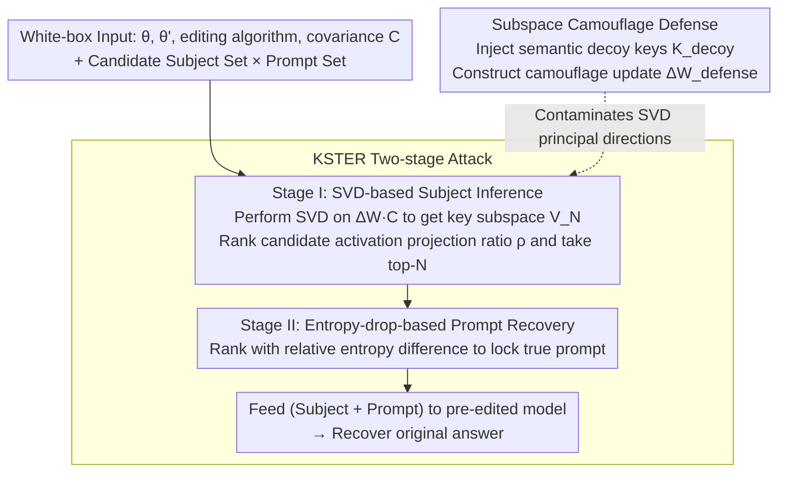

# Reverse-Engineering Model Editing on Language Models

**Conference**: ICML 2026  
**arXiv**: [2602.10134](https://arxiv.org/abs/2602.10134)  
**Code**: https://github.com/reanatom/EditingAttack  
**Area**: Knowledge Editing / LLM Security  
**Keywords**: locate-then-edit, reverse-engineering attack, subspace reconstruction, entropy drop, subspace camouflage defense

## TL;DR
The paper reveals that parameter update matrices of locate-then-edit knowledge editing methods (ROME/MEMIT/AlphaEdit) leak "edited subject" fingerprints through their row spaces. It proposes a two-stage attack, KSTER (recovering subjects via SVD, then prompts via relative entropy drop), and a defense called Subspace Camouflage based on "semantic decoy" injection.

## Background & Motivation

**Background**: LLMs inevitably memorize massive amounts of sensitive information (personal privacy, copyrighted snippets) during pre-training. Since retraining is extremely costly, *model editing* has become a mainstream mitigation solution. Specifically, the **locate-then-edit** paradigm (ROME/MEMIT/AlphaEdit) is widely used as an "after-the-fact deletion/modification" tool for sensitive knowledge due to its interpretability, zero inference overhead, and FFN parameter localization, often serving as privacy-preserving infrastructure.

**Limitations of Prior Work**: Previous studies focused on editing *efficacy* and *generalization* (accuracy after editing and preservation of other knowledge), but few have systematically investigated whether the editing action itself creates a *leakage side channel*. If an attacker obtains both pre- and post-editing weights $\theta$ and $\theta'$, can the erased content be reconstructed from the weight difference $\Delta\theta$?

**Key Challenge**: The core closed-form solutions of locate-then-edit (rank-1 for ROME, low-rank least squares for MEMIT) naturally compress the "key vector of the edited subject" into a low-dimensional structure within $\Delta\mathbf{W}$. **The mechanism intended to protect privacy** becomes a high-fidelity signature of the edited information—the more precise the erasure, the purer the signature.

**Goal**: (1) Formally prove that $\Delta\mathbf{W}$ encodes a recoverable "fingerprint" of the edited subject; (2) design practical attacks to recover the *subject + prompt template + original answer*; (3) propose a defense strategy that does not compromise editing utility.

**Key Insight**: Authors observe that the "hidden state of the subject's last token at the edited layer" in FFNs exhibits strong **subject invariance**—the activation for the same subject across different prompt templates is nearly identical (cos sim near 1), and attention focuses on the subject tokens. This means the $\mathbf{K}$ matrix primarily encodes "subject identity" and is decoupled from the prompt context, allowing attackers to lock onto the subject without knowing the prompt beforehand.

**Core Idea**: Using the Woodbury identity, the MEMIT update is rewritten as $\Delta\mathbf{W} = \mathbf{R}(\mathbf{I}+\mathbf{K}^\top\mathbf{C}^{-1}\mathbf{K})^{-1}\mathbf{K}^\top\mathbf{C}^{-1}$, proving that $\mathrm{RowSpace}(\Delta\mathbf{W}\mathbf{C}) \subseteq \mathrm{ColSpace}(\mathbf{K})$. Applying SVD to $\Delta\mathbf{W}\mathbf{C}$ directly retrieves the "subject key subspace." Candidate subject activations are projected onto this subspace, and those with the highest projection ratios are identified as the edited subjects. The second stage uses the "near-zero entropy on true prompts" overfitting phenomenon in the post-edited model to recover prompts via relative entropy drop ranking.

## Method

### Overall Architecture
The paper addresses the question of whether erased privacy can be reconstructed given two sets of weights. It decomposes this into a two-stage attack, KSTER, and a defense mechanism. The threat model assumes a white-box attacker possessing $\theta$, $\theta'$, the editing algorithm, the covariance $\mathbf{C}$, and a "candidate subject set × candidate prompt set" constructed from public knowledge. The attack first extracts the edited subject from the algebraic structure of $\Delta\mathbf{W}$ in Stage I and then identifies the true prompt for each subject using the entropy difference between models in Stage II. Feeding the "subject + prompt" back into the pre-edited model yields the original answer. The Subspace Camouflage defense actively injects "semantic decoy" subjects during editing to contaminate the subspace observed by the attacker's SVD.

### Key Designs

**1. SVD-based Subject Inference (Stage I): Reducing "Subject Recovery" to Subspace Projection**

The attacker seeks the edited subject's key vector $\mathbf{K}$, but since $\mathbf{R}$ in $\Delta\mathbf{W}$ is unknown, $\mathbf{K}$ cannot be solved directly. The breakthrough is that only the *subspace* spanned by $\mathbf{K}$ is needed: Woodbury rewriting proves $\mathrm{RowSpace}(\Delta\mathbf{W}\mathbf{C})\subseteq\mathrm{ColSpace}(\mathbf{K})$. First, the batch size $N$ is estimated from $\mathrm{rank}(\Delta\mathbf{W})$. Then, SVD is performed on $\mathbf{M}=\Delta\mathbf{W}\mathbf{C}$ to obtain the top-$N$ right singular vectors $\mathbf{V}_N$ as the reconstructed key subspace. To determine if a candidate subject $s_i^c$ was edited, its activation $\mathbf{k}_i^c=\mathcal{F}_\theta(s_i^c,\mathcal{T}_{\rm gen})$ is extracted from the pre-edited model using a generic template. The projection ratio is defined as $\rho_i^c = \|\mathbf{V}_N^\top \mathbf{k}_i^c\|_2 / \|\mathbf{k}_i^c\|_2$; ranking by $\rho$ identifies the subjects. This works due to subject invariance: activations under generic templates nearly overlap with those under true editing templates. Multiplying by $\mathbf{C}$ cancels geometric distortion of the row space. For AlphaEdit, which involves null-space projection $\mathbf{P}$, scores are calculated on a $\mathbf{P}$-adjusted version.

**2. Entropy-drop-based Prompt Recovery (Stage II): Using "Editing Overfitting" as a Signal**

After locking the subject, the prompt template must be recovered. Direct logit comparison fails in large batches due to interference. The authors use a metric more sensitive to editing objectives: editing essentially compresses the next-token distribution of target prompts into a near one-hot distribution, causing Shannon entropy to collapse. For each candidate pair $(\hat{s}_i, r_j^c)$, the relative entropy drop is calculated: $\mathrm{Score}=\dfrac{H(\hat{s}_i,r_j^c;\theta)-H(\hat{s}_i,r_j^c;\theta')}{H(\hat{s}_i,r_j^c;\theta')+\epsilon}$. The denominator amplifies prompts pushed toward zero entropy, distinguishing the true prompt even in batches of $N=100$.

**3. Subspace Camouflage: Contaminating the Attacker's SVD with Semantic Decoys**

The defense shifts the row space of $\Delta\mathbf{W}$ from the true $\mathrm{ColSpace}(\mathbf{K})$ to a decoy-contaminated $\mathrm{ColSpace}(\tilde{\mathbf{K}})$ without hurting utility. Decoy keys $\mathbf{K}_{\rm decoy}$ are sampled from irrelevant real subjects to construct $\tilde{\mathbf{K}} = \mathbf{K} + \alpha \cdot \frac{\|\mathbf{K}\|_2}{\|\mathbf{K}_{\rm decoy}\|_2}\mathbf{K}_{\rm decoy}$. A unique defense update $\Delta\mathbf{W}_{\rm defense} = \Delta\mathbf{W}\mathbf{K}(\tilde{\mathbf{K}}^\top \mathbf{C}^{-1}\mathbf{K})^{-1}\tilde{\mathbf{K}}^\top \mathbf{C}^{-1}$ is solved to satisfy "row space in $\mathrm{ColSpace}(\tilde{\mathbf{K}})$ while remaining equivalent on original keys" ($\Delta\mathbf{W}_{\rm defense}\mathbf{K}=\Delta\mathbf{W}\mathbf{K}$). Unlike random noise, decoys correspond to real activations and "compete" to pull the attacker's singular vectors toward themselves. Reconstruction of $\mathbf{K}$ from $\tilde{\mathbf{K}}$ requires $\mathbf{R}$, which is equivalent to knowing the protected knowledge, creating a circular dependency that blocks recovery.

The method involves no training: the attack is a one-time operation, and the defense is a reformulation of the closed-form solution with one hyperparameter $\alpha$ (typically $\alpha\in[1,5]$).

## Key Experimental Results

Models: GPT-J (6B), Llama3-8B-Instruct, Qwen2.5-7B-Instruct. Methods: ROME / MEMIT / AlphaEdit. Batch size $N\in\{10,50,100\}$.

### Main Results: Subject Inference Top-N Recall (CounterFact)

| Model | $N$ | MEMIT (KSTER White-box) | MEMIT Grey-box Baseline | AlphaEdit (KSTER White-box) | AlphaEdit Grey-box Baseline |
|-------|-----|-------------------------|-------------------------|------------------------------|-----------------------------|
| GPT-J | 100 | **0.95** | 0.88 | **0.96** | 0.86 |
| Llama3-8B-Instruct | 100 | **0.99** | 0.68 | **0.99** | 0.45 |
| Qwen2.5-7B-Instruct | 100 | **0.94** | 0.59 | **0.95** | 0.51 |

Prompt Recovery (Llama3-8B-Instruct, $N=100$): top-1 0.51 / top-5 0.81 / top-20 0.94, semantic similarity 0.88. End-to-end original answer recovery top-20 reaches 0.74.

### Ablation Study: Camouflage Intensity $\alpha$ (MEMIT, Llama3-8B-Instruct)

| $\alpha$ | True Subject Avg Rank (Higher is safer) | Efficacy | Generalization | Fluency |
|----------|-----------------------------------------|----------|----------------|---------|
| 0 (None) | 50.83 | 0.95 | 0.52 | 6.33 |
| 1 | 148.62 | 0.98 | 0.49 | 6.33 |
| 3 | 206.47 | 0.96 | 0.52 | 6.34 |
| **5** | **394.12** | 0.96 | 0.53 | 6.32 |
| 7 | 634.39 | 0.91 | 0.42 | 6.26 |

## Key Findings
- **Grey-box vs. White-box gap widens with $N$**: While grey-box matches white-box at $N=10$, it drops to 0.45–0.68 at $N=100$, while white-box remains at 0.94–0.99. This indicates that the algebraic structure of $\Delta\mathbf{W}$ contains far more separable information than logit differences.
- **Covariance estimation is extremely robust**: While $\mathbf{C}$ is usually estimated using 100k Wikipedia samples, 100 samples are sufficient for convergence, showing the attack does not require knowing the exact training distribution.
- **Failure modes are bimodal**: True prompt ranks in the 6–100 range are due to *semantic generalization errors* (model misidentifies subject category). Ranks in the 700–1000 range stem from *optimization constraint conflicts* where entropy increases after editing, breaking the entropy-drop score.
- **Defense sweet spot at $\alpha=5$**: The true subject rank is pushed to 394 with negligible efficacy loss. However, at $\alpha=7$, AlphaEdit efficacy drops significantly due to matrix inversion instability caused by small eigenvalues.

## Highlights & Insights
- **"Security mechanism as side channel"**: Using the Woodbury identity to rewrite the MEMIT solution transforms a weight difference problem into a standard subspace recovery problem. This elegantly reduces the attack to a single SVD and projection.
- **Subject invariance as a reusable finding**: The discovery that subject activations in FFNs are nearly prompt-independent is valuable for understanding fact storage in LLMs beyond just attacks.
- **Entropy drop as a robust signal**: Leveraging "overfitting" as a signal by tracking the collapse of distributions on target prompts is a perspective that can be transferred to other white-box analysis tasks.
- **Circular dependency in defense**: The defense's robustness relies on the fact that reversing the camouflage requires the very information (prompt/answer) the attacker is trying to steal, effectively closing the backdoor.

## Limitations & Future Work
- The attack assumes a white-box setting with a candidate pool containing the ground truth; open-set complexity remains unquantified.
- Experiments cover single-layer FFN editing with $N \le 100$; sequential editing and thousand-scale batches need further validation.
- Defense is limited to locate-then-edit on FFNs; it does not cover external memory (SERAC) or meta-learning (MEND) methods.
- Decoy subjects may introduce *out-of-target hallucinations*: at $\alpha \ge 3$, fluency and knowledge space stability slightly decline.

## Related Work & Insights
- **vs. Youssef et al. (2025)**: They recover pre-edit behavior, but KSTER recovers the prompt and the original answer.
- **vs. Patil et al. (2024)**: Their method requires the attacker to know the original prompt; this work breaks that assumption.
- **vs. Membership Inference**: Traditional privacy attacks have low recall on unedited models; this work proves that "edited" models are actually easier to target, defining a new "edit-aware privacy attack" direction.
- **Insight**: This logic extends to any "low-rank update + closed-form" algorithm (LoRA, prefix tuning diffs, unlearning). Any update lying in a low-dimensional subspace spanned by sample activations poses a similar risk.

## Rating
- Novelty: ⭐⭐⭐⭐⭐ First to reveal locate-then-edit as a side channel with a self-consistent attack/defense/theory.
- Experimental Thoroughness: ⭐⭐⭐⭐ Extensive model/algorithm coverage, but lacks large-scale sequential editing evaluation.
- Writing Quality: ⭐⭐⭐⭐⭐ Logical flow from Woodbury rewriting to decoy defense is rigorous.
- Value: ⭐⭐⭐⭐⭐ Provides an immediate security auditing tool and influences future privacy-preserving editing designs.

<!-- RELATED:START -->

## Related Papers

- [\[ICML 2026\] The Labyrinth and the Thread: Rethinking Regularizations in Sequential Knowledge Editing for Large Language Models](the_labyrinth_and_the_thread_rethinking_regularizations_in_sequential_knowledge_.md)
- [\[ICML 2026\] Revisiting Parameter-Based Knowledge Editing in Large Language Models: Theoretical Limits and Empirical Evidence](revisiting_parameter-based_knowledge_editing_in_large_language_models_theoretica.md)
- [\[ICLR 2026\] Disentangling Knowledge Representations for Large Language Model Editing](../../ICLR2026/knowledge_editing/disentangling_knowledge_representations_for_large_language_model_editing.md)
- [\[ACL 2026\] The Model Agreed, But Didn't Learn: Diagnosing Surface Compliance in Large Language Models](../../ACL2026/knowledge_editing/the_model_agreed_but_didn39t_learn_diagnosing_surface_compliance_in_large_langua.md)
- [\[AAAI 2026\] Multiplicative Orthogonal Sequential Editing for Language Models (MOSE)](../../AAAI2026/knowledge_editing/multiplicative_orthogonal_sequential_editing_for_language_models.md)

<!-- RELATED:END -->
