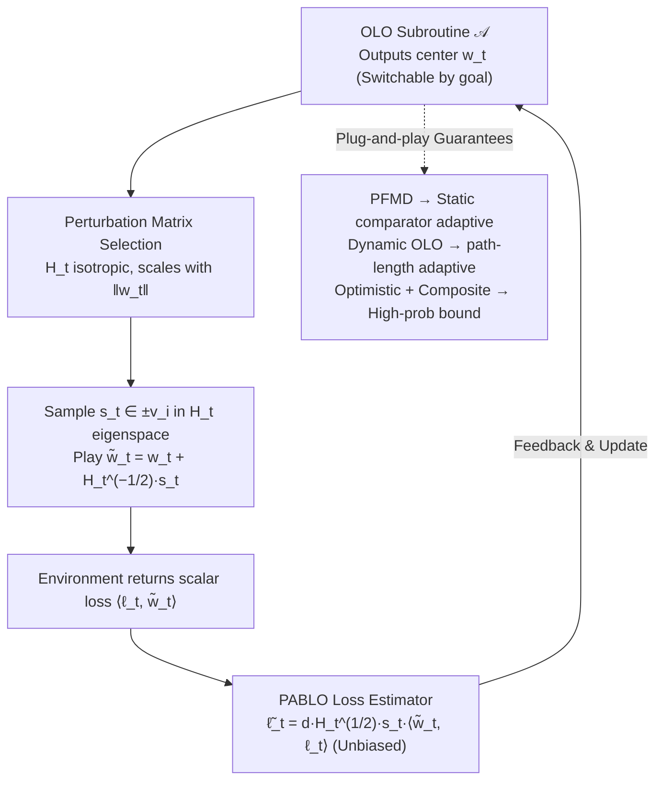

# A Perturbation Approach to Unconstrained Linear Bandits

**Conference**: ICML2026  
**arXiv**: [2603.28201](https://arxiv.org/abs/2603.28201)  
**Code**: No public code (theoretical paper, repository not provided in cache)  
**Area**: Optimization / Online Learning / Bandit Theory  
**Keywords**: Unconstrained linear bandit, online linear optimization, perturbation estimation, dynamic regret, high-probability bounds  

## TL;DR
This paper revisits the perturbation-based bandit linear optimization approach of Abernethy et al. and proposes the PABLO reduction. This framework transforms unconstrained linear bandit problems into tasks that can call arbitrary OLO subroutines, leading to comparator-adaptive static/dynamic regret, high-probability bounds, and discussions on lower bounds.

## Background & Motivation
**Background**: Bandit Linear Optimization requires the learner to select an action $w_t$ in each round and observe only the scalar loss $\langle \ell_t,w_t\rangle$ instead of the full gradient $\ell_t$. Classical works typically study bounded action sets, such as Euclidean balls or polytopes; in these settings, exploration noise must ensure actions remain within the feasible domain, and regret is controlled by the domain's diameter.

**Limitations of Prior Work**: Unconstrained BLO (uBLO) extends the action set to $\mathbb{R}^d$, aiming to adapt to an arbitrary comparator $u$ while controlling the risk $R_T(0)\le \epsilon$ relative to the zero action. This setting is closer to parameter-free online learning, but it remains unclear how to simultaneously achieve comparator-norm adaptation, dynamic comparator adaptation, and high-probability bounds using only one-dimensional bandit feedback.

**Key Challenge**: While an unconstrained domain appears more difficult due to the lack of a fixed radius limiting the actions, the absence of feasible region constraints implies that the perturbation matrix is no longer dictated by barrier geometry and can be chosen freely. The key insight of the paper is that as long as an unbiased loss estimate with a controllable norm can be constructed, the problem can be delegated to mature Online Linear Optimization subroutines.

**Goal**: The authors aim to establish a modular reduction: the bandit component handles stochastic perturbations and constructs loss estimates, while the full-information OLO component manages comparator-adaptive or dynamic regret. Based on this framework, the paper provides expected regret, high-probability static/dynamic regret, and discusses dimension dependencies for static lower bounds.

**Key Insight**: The paper starts from the SCRiBLe/Abernethy perturbation methods but decouples the OLO update from the self-concordant barrier. PABLO allows an arbitrary OLO algorithm to output $w_t$ each round, samples a randomized perturbation point controlled by a matrix around $w_t$, and utilizes single-point bandit feedback to derive an unbiased estimate $\tilde{\ell}_t$.

**Core Idea**: In unconstrained linear bandits, loss estimates are constructed using adjustable matrix perturbations to reduce uBLO to OLO subroutine calls, thereby inheriting the strong regret guarantees of parameter-free and dynamic OLO.

## Method
The primary contribution of this paper is PABLO (Perturbation Approach for Bandit Linear Optimization). In each round, it uses the OLO learner's output $w_t$ as the center, selects a positive definite matrix $H_t$, and randomly samples $s_t\in\{\pm v_i\}$ along the eigenvectors of $H_t$ to play $\tilde{w}_t=w_t+H_t^{-1/2}s_t$. The environment returns only the scalar loss $\langle \ell_t, \tilde{w}_t\rangle$. Based on this, the algorithm constructs $\tilde{\ell}_t=dH_t^{1/2}s_t\langle \tilde{w}_t,\ell_t\rangle$, which is fed back to the OLO learner for its update.

### Overall Architecture
The input consists of an arbitrary OLO algorithm $\mathcal{A}$, time horizon $T$, and a sequence of bandit losses. The output is a sequence of unconstrained actions and regret guarantees. PABLO does not restrict the OLO subroutine: selecting parameter-free mirror descent yields static comparator-adaptive expected regret; selecting a dynamic comparator-adaptive OLO algorithm yields path-length adaptive dynamic regret; selecting an OLO variant with an optimistic composite penalty handles additional terms arising from unconstrained action norms in high-probability bounds.

The key technique involves the configuration of $H_t$. The paper adopts an isotropic selection satisfying $H_t\preceq \frac{1}{d(\|w_t\|^2\vee \varepsilon^2)}I_d$, such that the perturbation scale tightens when $w_t$ is large and is capped by $\varepsilon$ when $w_t$ is near zero to prevent division by zero. This leads to two critical estimation properties: $\tilde{\ell}_t$ is unbiased, and both its second moment and almost-sure norm have controllable upper bounds. These properties determine which OLO guarantees can be integrated. Essentially, PABLO acts as a per-round reduction where the OLO subroutine and bandit estimate construction are decoupled, allowing guarantees to be swapped by changing the subroutine.

### Key Designs

**1. PABLO Loss Estimator: Converting 1D bandit feedback into vector losses for OLO**

Full-information OLO algorithms require full gradient or linear loss vectors, while bandit feedback offers only a scalar $\langle \ell_t, \tilde{w}_t \rangle$. PABLO bridges this gap by applying a random perturbation around the OLO learner's center $w_t$: sampling $s_t \in \{\pm v_i\}$ uniformly across the eigenvectors of a positive definite matrix $H_t$, playing $\tilde{w}_t = w_t + H_t^{-1/2}s_t$, and using:

$$\tilde{\ell}_t = d\,H_t^{1/2}s_t\,\langle \tilde{w}_t, \ell_t \rangle$$

to estimate the true $\ell_t$. The symmetric sampling of $s_t$ across positive and negative eigen-directions ensures that cross-terms in the estimate cancel out under conditional expectation, yielding unbiasedness $\mathbb{E}[\tilde{\ell}_t \mid \mathcal{F}_{t-1}] = \ell_t$. With this unbiased proxy, the bandit problem is translated into a full-information OLO problem, allowing off-the-shelf comparator-adaptive algorithms to be integrated directly.

**2. Perturbation Matrix Selection in Unconstrained Domains: Adaptive exploration scale**

Classical BLO operates in bounded domains, where perturbations must ensure $\tilde{w}_t$ remains within the feasible set, tying the perturbation geometry to the barrier. Extending the action set to $\mathbb{R}^d$ removes this constraint, granting the freedom to choose $H_t$ solely for "estimation stability." However, since the action norm is unbounded, the estimate might explode if the perturbation scale remains fixed. The paper scales $H_t$ with the norm of the center point such that:

$$H_t \preceq \frac{1}{d\,(\|w_t\|^2 \vee \varepsilon^2)}I_d$$

resulting in tighter perturbations for larger $w_t$ and a floor provided by $\varepsilon$ near zero. This choice yields two properties essential for OLO subroutines: an almost-sure norm upper bound $\|\tilde{\ell}_t\|^2 \le 4d^2\|\ell_t\|^2$ and a conditional second moment bound $\mathbb{E}[\|\tilde{\ell}_t\|^2 \mid \mathcal{F}_{t-1}] \le 2d\|\ell_t\|^2$. These properties determine the safety of various OLO guarantees.

**3. Switching OLO Subroutines for Regret Goals: A unified reduction for diverse uBLO guarantees**

Previous uBLO algorithms often coupled bandit geometry, direction learning, and scale learning, requiring a full rewrite of the analysis for different regret targets. PABLO isolates the bandit feedback processing, making the reduction a black-box to the OLO subroutine. Switching the "plugin" changes the guarantee: parameter-free mirror descent provides static comparator-adaptive expected regret; unconstrained dynamic OLO yields adaptation to the true path-length $P_T$; and variants with optimistic updates and Huber-like composite penalties achieve high-probability bounds by canceling out unconstrained iterate terms $\sum_t \|w_t\|^2$. This generic reduction translates any OLO regret bound into a bandit regret bound, with the added cost stemming only from estimation noise and perturbation stability.

### Loss & Training
This work is a theoretical paper and does not involve neural network training losses. The analysis focuses on regret under linear loss $f_t(w_t)=\langle \ell_t,w_t\rangle$. Key strategies include: utilizing the ghost-iterate trick to reduce PABLO regret to OLO subroutine regret; distinguishing whether the comparator norm is oblivious or norm-adaptive in expected regret; employing the path-length $P_T=\sum_{t=2}^T\|u_t-u_{t-1}\|$ and its log-linear version for dynamic regret; and canceling unconstrained iterate norm terms in high-probability bounds via composite penalties and optimism.

## Key Experimental Results

### Main Results
The paper does not include traditional empirical experiments; the "Main Results" are presented as theoretical comparisons. The table below organizes the core theorems by setting.

| Result | Setting | Main Guarantee | Significance |
|------|------|----------|--------------------|
| Theorem 3.1 | Static comparator-adaptive expected regret | Appx. $\tilde{O}(G\epsilon + \frac{d}{\kappa}\|u\|\sqrt{V_T})$, $\kappa=\sqrt{d}$ for oblivious, $\kappa=1$ for adaptive | Reveals that whether the comparator norm depends on the trajectory causes a $\sqrt{d}$ difference |
| Theorem 3.3 | Dynamic expected regret | Depends on $\Phi_T+P_T^\Phi$ and $\sum_t\|\ell_t\|^2\|u_t\|$, no prior knowledge of $P_T$ | First $\sqrt{P_T}$ type adaptation to the true path-length $P_T$ in uBLO |
| Theorem 4.3 | Static high-probability regret | $\tilde{O}(dG(\epsilon+\|u\|)\log(T/\delta)+G\|u\|\sqrt{dT\log(T/\delta)})$ | Matches best-known order for constrained Euclidean balls (ignoring polylog) in high probability |
| Theorem 4.4 | Dynamic high-probability regret | Appx. $\sqrt{d(\Phi_T+P_T^\Phi)[d\mathcal{V}_T\wedge\Omega_T]}$ and lower-order terms | Retains worst-case $\sqrt{d(M^2+MP_T)T}$ while providing per-comparator adaptation |
| Theorem 5.2 | Bounded Euclidean ball lower bound | Proves folklore $\Omega(\sqrt{dT})$ direction regret lower bound | Provides independent evidence for the directional difficulty in uBLO scale/direction decomposition |

### Ablation Study
Theoretical papers do not feature module ablation experiments. The following comparison of analytical choices demonstrates how key assumptions and design decisions alter the regret form.

| Comparison | Option A | Option B | Impact |
|--------|--------|--------|------|
| Timing of Comparator Norm | Oblivious / Fixed initially | Norm-adaptive / Trajectory-dependent | Determines if shaper second-moment bounds are used in expected regret; causes $\kappa=\sqrt{d}$ vs $\kappa=1$ dimensional difference |
| Bandit-to-OLO Path | Scale/direction decomposition | PABLO unbiased estimation + OLO subroutine | Former may degrade to $\tilde{O}((dT)^{2/3})$ in norm-adaptive settings; PABLO maintains $\sqrt{T}$ horizon dependency |
| Dynamic Variation Measure | Switch count $S_T$ | Path-length $P_T$ | $S_T$ only counts changes; $P_T$ reflects magnitude. Ours achieves $\sqrt{P_T}$ adaptation without prior knowledge of $P_T$ |
| High-Probability Analysis | Directly apply OLO high-prob bounds | Composite penalty + optimistic hints | Latter cancels unconstrained $\|w_t\|$ terms, preventing uncontrollable iterate norms in the bound |
| Lower Bound Assumptions | Control only expected comparator norm | Consider worst-case magnitude simultaneously | Controlling only expectation allows meaningless linear lower bounds from rare, huge comparators; norm-adaptive lower bounds need finer assumptions |

### Key Findings
- The PABLO estimator serves as the pivot for the framework: it is unbiased, possesses a small second moment, and has an almost-surely bounded norm, enabling modern comparator-adaptive OLO algorithms to function under bandit feedback.
- Unconstrained domains actually provide more freedom. Since there is no requirement to keep perturbation points within a bounded set, $H_t$ can be selected based on $\|w_t\|$, prioritizing estimation stability.
- The "timing" of selecting the comparator norm is not a technical triviality. If the norm is coupled with loss or algorithm randomness, Jensen's inequality steps used in prior works may fail, altering dimensional dependency.
- Path-length dependence for dynamic regret is more granular than switch counts. While $S_T$ treats small changes and large jumps equally, $P_T$ reflects the actual length of the comparator's trajectory.
- The primary challenge for high-probability bounds is not the unbiased estimate itself, but the potential for large unconstrained OLO iterates. Optimistic composite-penalty cancellation is the key to managing this.

## Highlights & Insights
- The most elegant aspect of the paper is its modularity. PABLO separates "constructing vector estimates from bandit scalar feedback" from "controlling regret via OLO algorithms," allowing the theory to upgrade as OLO subroutines advance.
- The distinction between oblivious and norm-adaptive comparators is highly instructive. Many parameter-free conclusions seem to "hold for all $u$ simultaneously," but independence assumptions become sensitive when the norm of $u$ depends on the trajectory post-hoc.
- The dynamic regret section highlights the unique nature of unconstrained problems. In many constrained bandit settings, it is difficult to achieve good results without prior knowledge of path-length; this work shows uBLO may bypass some limitations of constrained lower bounds.
- The lower bound discussion, while not fully resolving the conjecture, honestly points out that scale and direction lower bounds do not automatically merge, which is more valuable than a simple claim of tightness.

## Limitations & Future Work
- The paper is primarily a theoretical contribution and lacks experimental validation regarding constants, stability, and implementability of PABLO in practical bandit/online decision applications.
- Several regret bounds hide polylog terms, and the algorithmic subroutines are complex. Constants and tuning costs may be non-trivial for practitioners.
- The static lower bound remains a conjecture, particularly concerning how to simultaneously force scale and direction difficulties within the same hard sequence.
- The appropriate lower bound model for the norm-adaptive setting remains unclear. The paper notes that controlling only $\mathbb{E}\|u\|$ is too weak but does not yet provide a definitive alternative assumption.
- Extending the framework to Bandit Convex Optimization is a future direction. The linear structure is vital for both unbiased estimation and regret decomposition; the non-linear case may require entirely new estimators.

## Related Work & Insights
- **vs SCRiBLe / Abernethy et al.**: Classic SCRiBLe couples the FTRL regularizer with local perturbation geometry; PABLO decouples the OLO subroutine and perturbation matrix, making it better suited for unconstrained domains.
- **vs uBLO works by van der Hoeven / Luo / Rumi**: Existing methods often use scale/direction decomposition. This paper points out they frequently rely on implicit comparator-norm-oblivious assumptions and provides a more robust PABLO path for norm-adaptive scenarios.
- **vs Parameter-free OLO**: This work can be seen as porting the comparator-adaptive capabilities of parameter-free OLO to bandit feedback at the cost of constructing and controlling stochastic loss estimates.
- **vs Constrained Adversarial Linear Bandits**: In bounded domains, minimax regret depends on the geometry of the decision set; uBLO naturally focuses on the comparator norm, risk control, and path-length, leading to a different problem structure.

## Rating
- Novelty: ⭐⭐⭐⭐☆ Reconstructing uBLO modularly with PABLO and revealing implicit difficulties of norm-adaptive comparators offers a fresh theoretical perspective.
- Experimental Thoroughness: ⭐⭐⭐☆☆ No empirical experiments are provided, though the theorems, comparisons, and lower bound discussions are relatively comprehensive.
- Writing Quality: ⭐⭐⭐⭐☆ The main narrative is clear and contributions are well-layered; however, the reliance on complex OLO subroutines and appendix proofs presents a high barrier to entry.
- Value: ⭐⭐⭐⭐☆ Highly instructive for online learning and bandit theory, particularly in providing a general interface for the combination of uBLO and parameter-free OLO.

<!-- RELATED:START -->

<!-- RELATED:END -->

## Related Papers

- [\[NeurIPS 2025\] Infrequent Exploration in Linear Bandits](../../NeurIPS2025/learning_theory/infrequent_exploration_in_linear_bandits.md)
- [\[ICML 2025\] Heavy-Tailed Linear Bandits: Huber Regression with One-Pass Update](../../ICML2025/learning_theory/heavy-tailed_linear_bandits_huber_regression_with_one-pass_update.md)
- [\[ICLR 2026\] Lipschitz Bandits with Stochastic Delayed Feedback](../../ICLR2026/learning_theory/lipschitz_bandits_with_stochastic_delayed_feedback.md)
- [\[ICML 2026\] Multi-task Linear Regression without Eigenvalue Lower Bounds: Adaptivity, Robustness and Safety](multi-task_linear_regression_without_eigenvalue_lower_bounds_adaptivity_robustne.md)
- [\[ICLR 2026\] An Efficient, Provably Optimal Algorithm for the 0-1 Loss Linear Classification Problem](../../ICLR2026/learning_theory/an_efficient_provably_optimal_algorithm_for_the_0-1_loss_linear_classification_p.md)

<!-- RELATED:END -->
