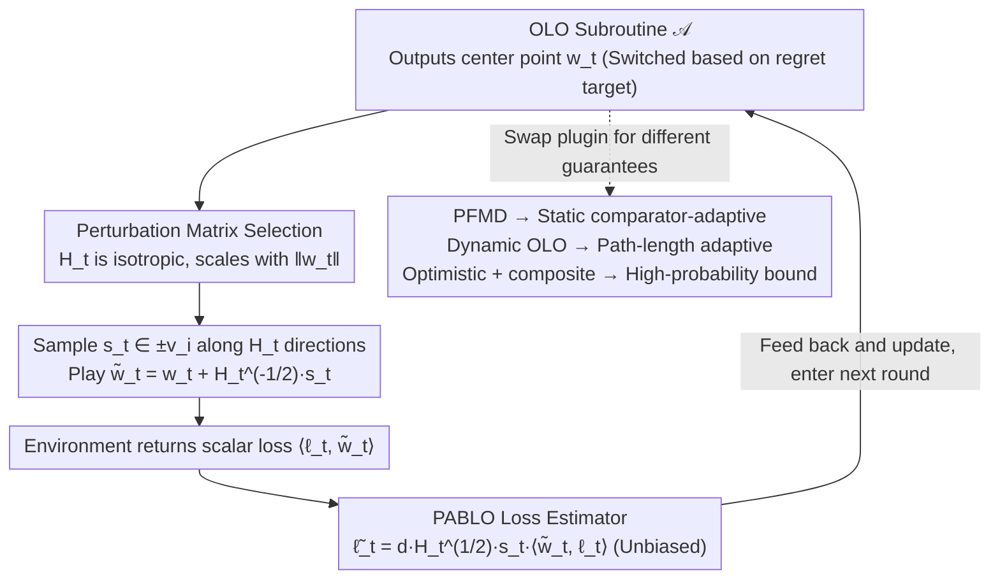

# A Perturbation Approach to Unconstrained Linear Bandits

**Conference**: ICML2026  
**arXiv**: [2603.28201](https://arxiv.org/abs/2603.28201)  
**Code**: No public code (Theoretical paper, no repository provided in cache)  
**Area**: Optimization / Online Learning / Bandit Theory  
**Keywords**: Unconstrained linear bandits, online linear optimization, perturbation estimation, dynamic regret, high-probability bounds  

## TL;DR
This paper revisits the perturbation-based bandit linear optimization approach by Abernethy et al., proposing the PABLO reduction. This reduction transforms unconstrained linear bandits into a problem that can call any OLO subroutine, thereby obtaining comparator-adaptive static/dynamic regret, high-probability bounds, and discussions on various lower bounds.

## Background & Motivation
**Background**: Bandit Linear Optimization (BLO) requires the learner to choose an action $w_t$ in each round and observe only the scalar loss $\langle \ell_t, w_t \rangle$ instead of the full gradient $\ell_t$. Classical works typically study bounded action sets, such as Euclidean balls or polytopes; in these settings, exploration noise must ensure that actions remain within the feasible region, and the regret is controlled by the domain's diameter.

**Limitations of Prior Work**: Unconstrained BLO (uBLO) expands the action set to $\mathbb{R}^d$, where the goal is to adapt to any comparator $u$ while controlling the risk relative to the zero action $R_T(0) \le \epsilon$. This setting is closer to parameter-free online learning, but since bandit feedback only providing one-dimensional observations, it remains unclear how to simultaneously achieve comparator norm adaptation, dynamic comparator adaptation, and high-probability bounds.

**Key Challenge**: The unconstrained domain appears more difficult because there is no fixed radius to restrict actions. However, precisely because there are no feasible region constraints, the perturbation matrix does not have to be determined by barrier geometry and can be chosen freely. The key insight of this paper is that as long as an unbiased and norm-controlled loss estimate is constructed in uBLO, the problem can be delegated to mature Online Linear Optimization (OLO) subroutines.

**Goal**: The authors aim to establish a modular reduction: the bandit component handles stochastic perturbation and loss estimation, while the full-information OLO component handles comparator-adaptive or dynamic regret. Based on this framework, the paper provides expected regret, high-probability static/dynamic regret, and discusses dimension dependencies in static lower bounds.

**Key Insight**: The paper starts from the SCRiBLe/Abernethy perturbation method but decouples the OLO update from the self-concordant barrier. In each round, PABLO takes the output $w_t$ of any OLO algorithm as a center, samples a random perturbation point controlled by a matrix around $w_t$, and uses single-point bandit feedback to derive an unbiased estimate $\tilde{\ell}_t$.

**Core Idea**: In unconstrained linear bandits, adjustable matrix perturbations are used to construct "sufficiently good" loss estimates, reducing BLO to an OLO subroutine call. This inherits the strong regret guarantees of parameter-free and dynamic OLO.

## Method
The primary focus of this paper is PABLO (Perturbation Approach for Bandit Linear Optimization). In each round, it uses the OLO learner's output $w_t$ as the center, selects a positive definite matrix $H_t$, and randomly picks $s_t \in \{\pm v_i\}$ along the eigenvectors of $H_t$, actually playing $\tilde{w}_t = w_t + H_t^{-1/2}s_t$. The environment returns only the scalar loss $\langle \ell_t, \tilde{w}_t \rangle$, based on which the algorithm constructs $\tilde{\ell}_t = d H_t^{1/2}s_t \langle \tilde{w}_t, \ell_t \rangle$, which is سپس fed back to the OLO learner for updates.

### Overall Architecture
The input consists of an arbitrary OLO algorithm $\mathcal{A}$, a time horizon $T$, and a sequence of bandit losses. The output is a series of unconstrained actions and regret guarantees. PABLO itself does not restrict the OLO subroutine: choosing parameter-free mirror descent yields static comparator-adaptive expected regret; choosing a dynamic comparator-adaptive OLO algorithm yields path-length adaptive dynamic regret; choosing an OLO variant with an optimistic composite penalty handles additional terms from unconstrained action norms in high-probability bounds.

The critical technique lies in the setting of $H_t$. The paper adopts an isotropic choice satisfying $H_t \preceq \frac{1}{d(\|w_t\|^2 \vee \varepsilon^2)} I_d$, such that the perturbation decreases as $w_t$ grows and is prevented from division by zero by $\varepsilon$ when $w_t$ is near zero. This results in two types of estimation properties: $\tilde{\ell}_t$ is unbiased, and both its second moment and almost-sure norm have controllable upper bounds. These properties determine which OLO guarantees can be subsequently integrated. Overall, PABLO is a per-round modular reduction: the OLO subroutine provides the center, and the bandit side constructs an unbiased estimate to feed back.

### Key Designs

**1. PABLO Loss Estimator: Reconstructing Vector Losses from One-Dimensional Bandit Feedback**

Full-information OLO algorithm libraries require full gradient or linear loss vectors, while bandits provide only a scalar $\langle \ell_t, \tilde{w}_t \rangle$. The gap between the two is the primary difficulty in bandit-to-OLO reduction. PABLO performs a random perturbation around the center $w_t$ output by the OLO learner: sampling $s_t \in \{\pm v_i\}$ uniformly along the eigenvector directions of a positive definite matrix $H_t$, playing $\tilde{w}_t = w_t + H_t^{-1/2}s_t$, and using:

$$\tilde{\ell}_t = d\,H_t^{1/2}s_t\,\langle \tilde{w}_t, \ell_t \rangle$$

to estimate the true $\ell_t$. The key is the symmetric sampling of $s_t$ in positive and negative eigenvector directions, which causes cross-terms in the estimate to cancel out under conditional expectation, yielding unbiasedness $\mathbb{E}[\tilde{\ell}_t \mid \mathcal{F}_{t-1}] = \ell_t$. With this unbiased proxy, the bandit problem is translated into a full-information OLO problem, allowing existing comparator-adaptive algorithms to be used directly.

**2. Perturbation Matrix Selection in Unconstrained Domains: Adapting Exploration Scale with the Center Point**

Classic BLO explores within a bounded domain, where perturbations must ensure $\tilde{w}_t$ does not leave the feasible set, thus locking the perturbation geometry to the barrier. In unconstrained domains where the action set is $\mathbb{R}^d$, this constraint disappears, offering more freedom—$H_t$ no longer needs to follow barrier geometry and can be chosen solely for "estimation stability." However, the trade-off is that action norms are unbounded; if the perturbation scale remains constant, the estimate explodes as $w_t$ grows. This work scales $H_t$ with the center point norm, requiring:

$$H_t \preceq \frac{1}{d(\|w_t\|^2 \vee \varepsilon^2)} I_d$$

meaning the perturbation tightens as $w_t$ increases and is lower-bounded by $\varepsilon$ when $w_t \approx 0$. This choice yields two properties essential for OLO subroutines: an almost-sure norm upper bound $\|\tilde{\ell}_t\|^2 \le 4d^2\|\ell_t\|^2$ and a conditional second moment upper bound $\mathbb{E}[\|\tilde{\ell}_t\|^2 \mid \mathcal{F}_{t-1}] \le 2d\|\ell_t\|^2$. These determine which OLO guarantees can be safely applied.

**3. Switching OLO Subroutines based on Regret Targets: Multiple uBLO Guarantees from One Reduction**

Previous uBLO algorithms often coupled bandit geometry, direction learning, and scale learning into a single entity, requiring a complete re-analysis to change the regret target. By completely isolating the bandit feedback processing, PABLO's reduction is black-box to the OLO subroutine. Thus, changing the "plugin" changes the guarantee: using parameter-free mirror descent yields static comparator-adaptive expected regret; using unconstrained dynamic OLO algorithms yields dynamic regret adaptive to the true path-length $P_T$; using variants with optimistic updates and Huber-like composite penalties cancels the $\sum_t \|w_t\|^2$ term brought by unconstrained iterates to obtain high-probability bounds. This generic reduction translates any OLO regret bound into a bandit regret bound, with the additional overhead coming only from estimation noise and perturbation stability, allowing future OLO techniques to migrate to uBLO almost for free.

### Loss & Training
This is a theoretical algorithm paper without neural network training losses. The analysis target is the regret under linear losses $f_t(w_t) = \langle \ell_t, w_t \rangle$. Key strategies include: using the ghost-iterate trick to reduce PABLO regret to OLO subroutine regret; distinguishing whether the comparator norm is oblivious or norm-adaptive in expected regret; using path-length $P_T = \sum_{t=2}^T \|u_t - u_{t-1}\|$ and its log-linear versions in dynamic regret; and canceling unconstrained iterate norm terms via composite penalties and optimism in high-probability bounds.

## Key Experimental Results

### Main Results
The paper lacks traditional empirical experiments; the "Main Results" consist of theoretical guarantee comparisons. The table below organizes core theorems by setting.

| Result | Setting | Main Guarantee | Significance compared to prior work |
|------|------|----------|--------------------|
| Theorem 3.1 | Static comparator-adaptive expected regret | Appx. $\tilde{O}(G\epsilon + \frac{d}{\kappa}\|u\|\sqrt{V_T})$, $\kappa=\sqrt{d}$ if oblivious, $\kappa=1$ if adaptive | Reveals a $\sqrt{d}$ gap depending on whether comparator norm depends on the trajectory |
| Theorem 3.3 | Dynamic expected regret | Dependent on $\Phi_T+P_T^\Phi$ and $\sum_t\|\ell_t\|^2\|u_t\|$, no prior $P_T$ needed | First $\sqrt{P_T}$ type adaptation for true path-length $P_T$ in uBLO |
| Theorem 4.3 | Static high-probability regret | $\tilde{O}(dG(\epsilon+\|u\|)\log(T/\delta)+G\|u\|\sqrt{dT\log(T/\delta)})$ | Matches best known order for constrained Euclidean balls in high probability (ignoring polylog) |
| Theorem 4.4 | Dynamic high-probability regret | Appx. $\sqrt{d(\Phi_T+P_T^\Phi)[d\mathcal{V}_T\wedge\Omega_T]}$ plus lower-order terms | Maintains both worst-case $\sqrt{d(M^2+MP_T)T}$ and per-comparator adaptive interpretation |
| Theorem 5.2 | Bounded Euclidean ball lower bound | Proves folklore $\Omega(\sqrt{dT})$ direction regret lower bound | Provides independent evidence for directional difficulty in uBLO scale/direction decomposition |

### Ablation Study
This theoretical paper does not have modular ablation experiments. The following comparison of analysis choices demonstrates how key assumptions and design decisions change the regret forms.

| Comparison | Option A | Option B | Impact |
|--------|--------|--------|------|
| Timing of comparator norm | Oblivious / fixed initially | Norm-adaptive / trajectory-dependent | Whether sharper second-moment bounds can be used in expected regret; causes a dimension gap of $\kappa=\sqrt{d}$ vs $\kappa=1$ |
| Bandit-to-OLO path | Scale/direction decomposition | PABLO unbiased estimate + OLO subroutine | The former may degrade to $\tilde{O}((dT)^{2/3})$ in norm-adaptive settings; PABLO maintains $\sqrt{T}$ horizon dependency |
| Dynamic variation metric | Switch count $S_T$ | Path-length $P_T$ | $S_T$ only considers the occurrence of change; $P_T$ reflects the magnitude. Ours first achieves $\sqrt{P_T}$ dependence without prior $P_T$ knowledge in uBLO |
| High-probability analysis | Direct OLO high-prob bounds | Composite penalty + optimistic hints | The latter cancels the unconstrained $\|w_t\|$ term, which otherwise introduces uncontrollable iterate norms into the bound |
| Lower bound assumptions | Controls only expected comparator norm | Considers worst-case magnitude simultaneously | Controlling only expectation allows meaningless linear lower bounds from rare, huge comparators; norm-adaptive lower bounds require finer assumptions |

### Key Findings
- PABLO's estimator is the pivot of the framework: it is unbiased, has small second moments, and has almost-surely bounded norms, enabling modern comparator-adaptive OLO algorithms to be used with bandit feedback.
- Unconstrained domains provide more freedom. Since there is no need to ensure perturbation points stay within a bounded set, $H_t$ can be selected according to $\|w_t\|$, making estimation stability the primary goal.
- The "when" of choosing the comparator norm is not a technical detail. If the norm is coupled with loss/algorithm randomness, the Jensen steps implicitly used in much prior work no longer hold, changing the dimension dependency.
- Path-length dependency in dynamic regret is finer than switch count. Using only $S_T$ treats small changes and large jumps as a single switch, whereas $P_T$ expresses the actual length of the comparator trajectory.
- The difficulty of high-probability bounds is not the unbiased estimate itself, but the fact that unconstrained OLO iterates can be very large. Optimistic composite-penalty cancellation is key to addressing this.

## Highlights & Insights
- The most elegant aspect of the paper is modularity. PABLO separates "creating vector estimates from bandit scalar feedback" from "controlling regret with OLO algorithms," allowing future theories to upgrade alongside OLO subroutine advancements.
- The distinction between oblivious and norm-adaptive comparators is illuminating. Many parameter-free results appear to "hold for all $u$ simultaneously," but when the norm of $u$ can depend on the trajectory post-hoc, independence assumptions in the analysis become very sensitive.
- The dynamic regret section showcases the unique nature of unconstrained problems. In many constrained bandit settings, it is difficult to achieve good results without prior knowledge of the path-length; this work suggests uBLO might avoid some constraints of existing lower bounds.
- The discussion on lower bounds, while not fully resolving the conjecture, honestly points out that scale lower bounds and direction lower bounds cannot be automatically merged. This is more valuable than simply claiming tightness.

## Limitations & Future Work
- The paper is primarily a theoretical contribution, lacking empirical validation of PABLO's constants, stability, and implementability in real-world bandit/online decision applications.
- Multiple regret bounds hide polylog terms, and the algorithmic subroutines are complex. For practitioners, constants and tuning costs might be significant.
- The static lower bound remains a conjecture, especially regarding how to simultaneously force scale difficulty and direction difficulty in the same hard sequence.
- A reasonable lower bound model for the norm-adaptive setting is still unclear. The paper notes that controlling only $\mathbb{E}\|u\|$ is too weak but does not provide a final alternative assumption.
- Extension to Bandit Convex Optimization is a future direction. Linear structure is critical for unbiased estimation and regret decomposition; the non-linear case may require new estimators.

## Related Work & Insights
- **vs. SCRiBLe / Abernethy et al.**: Classic SCRiBLe couples the FTRL regularizer with local perturbation geometry; PABLO decouples the OLO subroutine and perturbation matrix, making it more suitable for unconstrained domains.
- **vs. uBLO work by van der Hoeven / Luo / Rumi**: Existing methods mostly use scale/direction decomposition. Ours points out that they often implicitly assume oblivious comparator norms and provides a more robust PABLO path for the norm-adaptive case.
- **vs. Parameter-free OLO**: This work can be seen as bringing the comparator-adaptive capabilities of parameter-free OLO to bandit feedback, at the cost of constructing and controlling stochastic loss estimates.
- **vs. Constrained Adversarial Linear Bandits**: In bounded domains, minimax regret depends on the decision set geometry; this work focuses on comparator norm, risk control, and path-length in unconstrained domains, leading to naturally different problem structures.

## Rating
- Novelty: ⭐⭐⭐⭐☆ Reconstructing uBLO with PABLO modularity and revealing the hidden difficulties of norm-adaptive comparators offers a fresh theoretical perspective.
- Experimental Thoroughness: ⭐⭐⭐☆☆ No empirical experiments, but theorems, comparisons, and lower bound discussions are relatively complete.
- Writing Quality: ⭐⭐⭐⭐☆ The main line is clear, and contributions are well-layered; however, the proofs rely on appendices and complex OLO subroutines, making for a higher entry barrier.
- Value: ⭐⭐⭐⭐☆ Very insightful for online learning and bandit theory, particularly in providing a general interface for combining uBLO with parameter-free OLO.

<!-- RELATED:START -->

## Related Papers

- [\[ICLR 2026\] A New Approach to Controlling Linear Dynamical Systems](../../ICLR2026/learning_theory/a_new_approach_to_controlling_linear_dynamical_systems.md)
- [\[NeurIPS 2025\] Infrequent Exploration in Linear Bandits](../../NeurIPS2025/learning_theory/infrequent_exploration_in_linear_bandits.md)
- [\[ICML 2025\] Heavy-Tailed Linear Bandits: Huber Regression with One-Pass Update](../../ICML2025/learning_theory/heavy-tailed_linear_bandits_huber_regression_with_one-pass_update.md)
- [\[ICML 2026\] Online Learning with Recency: Algorithms for Sliding-window Streaming Multi-armed Bandits](online_learning_with_recency_algorithms_for_sliding-window_streaming_multi-armed.md)
- [\[ICLR 2026\] Lipschitz Bandits with Stochastic Delayed Feedback](../../ICLR2026/learning_theory/lipschitz_bandits_with_stochastic_delayed_feedback.md)

<!-- RELATED:END -->
