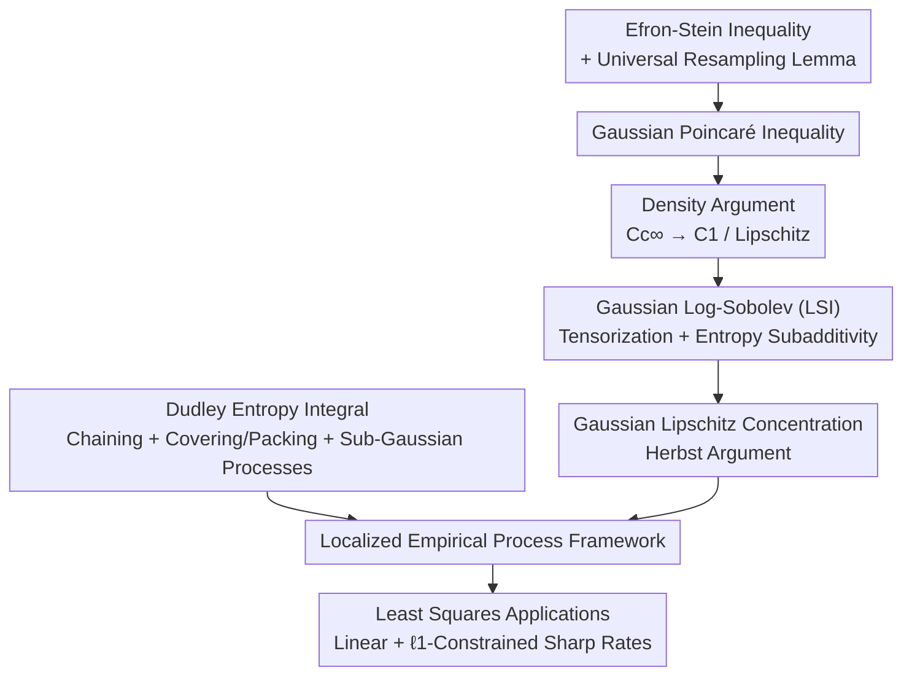

# AI4SLT: Empirical Processes in Lean 4 for Formal Statistical Learning Theory

**Conference**: ICML 2026  
**arXiv**: [2602.02285](https://arxiv.org/abs/2602.02285)  
**Code**: https://github.com/YuanheZ/lean-stat-learning-theory  
**Area**: Learning Theory / Formal Verification  
**Keywords**: Statistical Learning Theory, Lean 4, Empirical Processes, Concentration Inequalities, Human-AI Collaborative Formalization

## TL;DR
This work presents the first systematic formalization of "Empirical Process-based Statistical Learning Theory (SLT)" from scratch in Lean 4. It fills gaps in Mathlib by implementing Gaussian Lipschitz concentration, the Dudley entropy integral theorem, and sharp rates for least squares regression (including $\ell_1$ constraints). The project consists of approximately 30,000 lines of Lean code without `sorry` or `axiom`, completed through a human-AI collaborative paradigm where humans designed proof strategies and agents (Claude Code + Opus-4.5) executed tactical proofs.

## Background & Motivation
**Background**: Statistical Learning Theory has underpinned the development of machine learning over the past two decades (bias-variance tradeoff, regularization, cross-validation) and is currently being used to explain phenomena like double descent, benign overfitting, and single/multi-index models in deep networks and large models.

**Limitations of Prior Work**: As models become more complex, theoretical proofs grow longer and more convoluted, often relying on advanced mathematical tools or statistical physics intuition. This places immense pressure on "large-scale manual review," making it difficult to verify intermediate lemmas, track logical dependencies, or clarify which technique to apply at each step. Worse, the core components of SLT (concentration inequalities, covering numbers, etc.) lack **structured, machine-readable libraries**, resulting in nearly zero reusability.

**Key Challenge**: Interactive Theorem Provers (ITPs) like Lean 4 could simultaneously address "verifiability" and "reusability"—encoding proofs into formal languages provides machine-checkable correctness and a queryable library of results. However, SLT lacks the clean axiomatic foundations of number theory or algebra; it is interdisciplinary and **rooted in empirical process theory**. Specifically, the excess risk of a learning algorithm is controlled by the **supremum of an empirical process** indexed by a loss class. Controlling this supremum requires two interlocking components: **concentration inequalities** (connecting high-probability bounds to complexity measures) and **capacity control** (using complexity measures and metric entropy to characterize the effective size of local function classes). Each part involves measurability, integrability, and topological assumptions often glossed over in textbooks; furthermore, these tools were almost entirely absent in Lean 4.

**Goal**: Starting from foundational measure theory, probability, and analysis, build a full-stack toolkit for modern generalization analysis in Lean 4, covering key chapters from Wainwright’s *High-Dimensional Statistics* and Boucheron et al.’s *Concentration Inequalities*.

**Key Insight**: Rather than performing "mechanical translation," the authors use formalization to force the discovery of hidden assumptions in textbooks. Natural language proofs often suppress measurability/topological constraints, conflate almost-sure and pointwise properties, or compress multi-step arguments into single sentences. Formalization requires these gaps to be explicitly identified and resolved.

**Core Idea**: Use a "localized empirical process framework" as the backbone to formalize two technical lines (Gaussian concentration + Dudley entropy integral) bottom-up, culminating in least squares applications. Simultaneously, establish the entire engineering process as a reproducible **human-AI collaboration paradigm**.

## Method

### Overall Architecture
The project is structured as a "dependency graph" (Paper Figures 1/2): excess risk $R(\hat f)-R(f^\star)\lesssim \sup_{f\in\mathcal{F}}|(\hat{\mathbb{P}}-\mathbb{P})(\ell_f-\ell_{f^\star})|+(\text{confidence})$ is dominated by empirical process fluctuations. Controlling this requires "concentration" (red components, yielding the critical radius $\delta_\star$) and "capacity control/localization" (blue components, connecting local Gaussian complexity to covering numbers via metric entropy and Dudley chaining). This work builds the necessary Lean infrastructure from scratch and chains them into an end-to-end framework for least squares regression. The dependency relationships of the formalization modules are shown below:

### Key Designs

**1. End-to-End Toolkit for Gaussian Lipschitz Concentration: From Efron-Stein to the Herbst Argument**

Localization analysis requires **Gaussian Lipschitz concentration** rather than simple concentration under bounded assumptions (like McDiarmid). The proof is a chain of heterogeneous methods, each non-trivial. The authors built this into a reusable pipeline: ① **Efron-Stein Inequality** $\operatorname{Var}(Z)\le\sum_i\mathbb{E}[(Z-\mathbb{E}^{(i)}[Z])^2]$. The difficulty lies in allowing different distributions for each $X_i$; the authors formalized a **universal resampling lemma** (resampling a coordinate with an independent sample doesn't change the joint distribution), reused over 20 times in tower properties, Fubini swaps, and slice integrability. ② **Gaussian Poincaré Inequality**, derived from Efron-Stein infrastructure + Taylor expansion bounds + Rademacher sums weakly converging to Gaussians. ③ **Density Argument**: $C_c^\infty$ is dense in the Gaussian Sobolev space $\mathcal{W}^{1,2}$. Using Lipschitz mollification $f_\epsilon=f\ast\rho_\epsilon$, smooth functions approximate general Lipschitz functions while preserving the Lipschitz constant—a step often skipped in textbooks due to complexity. ④ **Gaussian Log-Sobolev Inequality (LSI)** $\operatorname{Ent}(f^2)\le 2\mathbb{E}[\|\nabla f\|_2^2]$, proven first for one dimension (Rademacher sums + CLT + Bernoulli LSI limit) and then tensorized via **subadditivity of entropy**. ⑤ Finally, the **Herbst Argument**: applying LSI to $e^{\lambda f_\epsilon/2}$ yields $\operatorname{Ent}(e^{\lambda f_\epsilon})\le\frac{\lambda^2 L^2}{2}\mathbb{E}[e^{\lambda f_\epsilon}]$, which is solved as a differential inequality (formalized as a Gronwall-type ratio bound) to bound the log-moment generating function $\log\mathbb{E}\exp(\lambda(f-\mathbb{E}f))\le\frac{\lambda^2}{2}L^2$, concluding with a Chernoff bound to obtain $\mathbb{P}(|f(\bm X)-\mathbb{E}f(\bm X)|\ge t)\le 2\exp(-t^2/2L^2)$. To the authors' knowledge, this is the **first complete formalization of the Gaussian analysis toolkit in any theorem prover**.

**2. Dudley Entropy Integral Theorem: Chaining Arguments and Reconciling Integral Forms**

The Dudley bound is the standard bridge from "covering numbers to complexity measures." The authors provide a complete version: for a sub-Gaussian process $\{X_t\}$ on a totally bounded set $s$ with diameter $\le D$, $\mathbb{E}[\sup_{t\in s}X_t]\le 12\sqrt{2}\,\sigma\int_0^D\sqrt{\log N(\varepsilon,s,d)}\,d\varepsilon$. Definitions were built for $\epsilon$-nets, covering numbers, metric entropy, and the entropy integral. The **chaining argument** involved constructing $\epsilon$-nets at binary scales $\varepsilon_k=D\cdot 2^{-k}$, expressing $X_u-X_{t_0}$ as a sum of increments obtained via successive projections $\pi_k$, and applying sub-Gaussian finite maximal bounds to each increment. Limits were taken twice: first via Fatou’s Lemma to extend from finite nets to countable dense sequences, then via path continuity to extend to the uncountable set $s$. An engineering challenge was Lean's **two integral systems**—non-negative improper integrals $\int^-$ (valued in $\mathbb{R}_{\ge0}^\infty$, convenient for Fubini) and real-valued interval integrals (convenient for limits and inequalities). The authors **canonically defined the entropy integral in ENNReal** but stated the final Dudley bound using a real-valued `entropyIntegral` for downstream user-friendliness.

**3. Localized Empirical Processes → Least Squares Framework: Validating "Covering Calculus"**

The authors unified these tools to derive sharp rates for least squares regression. For $y_i=f^*(\bm x_i)+\sigma w_i$, the goal is to control the prediction error $\|\hat f-f^*\|_n^2$. The key is **localization**: controlling the empirical process only on $\mathcal{F}(\delta)=\{f:d(f,f^\star)\le\delta\}$, where the effective size is measured by the local Gaussian complexity $\mathcal{G}_n(\mathcal{F}(\delta))$. The critical radius $\delta_\star$ is defined by the **critical inequality** $\mathcal{G}_n(\mathcal{F}(\delta))/\delta\le\delta/2\sigma$, and prediction error is bounded via Wainwright Thm 13.5. Solving for $\delta_\star$ requires using Dudley (Design 2) to upper bound $\mathcal{G}_n$ by the entropy integral. Two applications yielded sharp rates: **Linear Regression** ($n\ge d$), reducing covering numbers to $\ell_2$ ball covering $N(\epsilon,\mathcal{B}_2^\iota(R))\le(1+2R/\epsilon)^\iota$, yielding $\delta_\star=\mathcal{O}(\sqrt{r/n})$ where $r$ is the rank of the design matrix; and **High-dimensional $\ell_1$-constrained regression** (equivalent to Lasso, allowing $d>n$), using the Maurey argument to bound Gaussian covering of the $\ell_1$ hull, yielding the $\mathcal{O}(R\sqrt{\log d/n})$ rate. These examples establish a "covering calculus" standard for the formalization community.

**4. Human-AI Collaborative Formalization: Human Strategy, AI Tactics**

The project involved ~30,000 lines and ~500 hours of development using Claude Code (Opus-4.5). Humans analyzed Mathlib infrastructure and designed proof strategies, while the AI executed the plans and constructed formal proofs. To improve efficiency, the authors developed a **structured TASK.md** comprising four elements: ① Target Statement (precise Lean signature + natural language); ② Infrastructure Pointers (filenames and names of locally available lemmas); ③ Formalization-oriented Proof Plan (step-by-step tactics rather than pure informal math); ④ Hard Boundaries. This approach reduced the **first-trial failure rate from ~70% to approximately 15%**.

## Key Experimental Results

As a formalization project, results are measured by verified theorems and engineering scale.

### Formalization Contribution and Scale

| Module | Key Content | Prior Lean 4 Status |
| :--- | :--- | :--- |
| Gaussian Lipschitz Concentration | Full chain: Efron-Stein → Poincaré → Density → LSI → Concentration | Entirely blank (First implementation in any ITP) |
| Dudley Entropy Integral | Chaining for sub-Gaussian processes + Covering/Packing | First formalization |
| Least Squares Framework | Localized empirical processes + Linear / $\ell_1$ sharp rates | None |
| Engineering Scale | ~30,000 lines of Lean 4, zero `sorry`/`axiom` | — |

### Sharp Rates for Two Applications

| Setting | Covering Number Bound | Resulting Rate | Remarks |
| :--- | :--- | :--- | :--- |
| Linear Regression ($n\ge d$) | $N(\epsilon,\mathcal{B}_2^r(R))\le(1+2R/\epsilon)^r$ | $\|\hat f-f^*\|_n^2\lesssim\sigma^2 r/n$ | $r=\operatorname{rank}(\bm X)$, minimax optimal |
| $\ell_1$-constrained (can be $d>n$) | $N\le(2d+1)^{\lceil R^2/\epsilon^2\rceil}$ (Maurey) | $\mathcal{O}(R\sqrt{\log d/n})$ | Lasso equivalent, matching Raskutti et al. |

### Human-AI Collaboration Efficiency

| Configuration | First-trial Failure Rate |
| :--- | :--- |
| Unstructured instructions (no infrastructure pointers) | ~70% |
| Structured TASK.md (4 elements) | ~15% |

### Key Findings
- **vs. Sonoda et al. (2025)**: Previous work used Rademacher complexity for global generalization bounds (bounded tools like McDiarmid), resulting in looser rates. This work follows the **localized** path, utilizing substantially deeper mechanisms like Gaussian Lipschitz concentration and critical radius fixed points.
- **Exposure of Textbook Gaps**: Density arguments, integrability requirements for Dudley, and the reconciliation of different integral concepts (Bochner vs. Interval) were "hidden assumptions" resolved during formalization.
- **Quantifiable Paradigm**: Providing infrastructure pointers and tactical-level plans is the primary driver for boosting agent success rates.

## Highlights & Insights
- **"Universal Resampling Lemma" Investment**: Formalizing the idea that resampling one coordinate doesn't change the joint distribution became the "load-bearing wall" for the Gaussian toolkit, reused 20+ times.
- **Pragmatic Integration Design**: Defining the entropy integral in ENNReal for internal proofs (Fubini) while providing a Real-valued version for downstream statements balances internal convenience with external usability.
- **AI-Formalization Recipe**: The reduction in failure rate (70% → 15%) provides a reusable TASK.md template for future large-scale formalization projects.

## Limitations & Future Work
- **Scope is Classical SLT Core**: Focuses on Gaussian concentration, Dudley, and least squares; has not yet reached modern phenomena like double descent or benign overfitting.
- **Heavy Reliance on Human Strategy**: AI handles tactical execution, but strategy and decomposition still depend on human experts (approx. 500 supervised hours).
- **Application Scope**: Only verified for linear and $\ell_1$ regression; non-parametric, kernel, and neural network rates have not yet been implemented within this framework.

## Related Work & Insights
- **vs. Sonoda et al. (2025)**: They formalize global bounds; this work formalizes localized empirical processes, which are sharper and more general but significantly more complex to engineer.
- **vs. ITP in RL/Optimization (Zhang 2025; Li et al. 2024-2025)**: Those focus on specific domains; this work fills the prerequisite "empirical process" mainline for SLT.
- **vs. Number Theory/Algebra Formalization**: Unlike those fields, SLT requires explicit handling of measurability, integrability, and topological assumptions at every step.

## Rating
- Novelty: ⭐⭐⭐⭐⭐ First full-stack Lean 4 formalization of empirical process-based SLT.
- Experimental Thoroughness: ⭐⭐⭐⭐ 30k lines without `sorry` and sharp rates for two applications.
- Writing Quality: ⭐⭐⭐⭐⭐ Clear correspondence between natural language and Lean code.
- Value: ⭐⭐⭐⭐⭐ Provides a reusable library and human-AI collaborative "recipe" for verifying ML theory.

<!-- RELATED:START -->

- **Sonoda et al. (2025)**: Formalized global Rademacher complexity bounds.
- **Wainwright (2019)**: *High-Dimensional Statistics*, the primary mathematical reference for this formalization.
- **Bocheron et al. (2013)**: *Concentration Inequalities*, the reference for Gaussian LSI and Herbst arguments.

<!-- RELATED:END -->

## Related Papers

- [\[ICLR 2026\] A Statistical Theory of Overfitting for Imbalanced Classification](../../ICLR2026/learning_theory/a_statistical_theory_of_overfitting_for_imbalanced_classification.md)
- [\[ICML 2026\] Performative Learning Theory](performative_learning_theory.md)
- [\[ICML 2026\] Catastrophic Forgetting is Low-Rank: A Function-Space Theory for Continual Adaptation](catastrophic_forgetting_is_low-rank_a_function-space_theory_for_continual_adapta.md)
- [\[ICLR 2026\] A Statistical Learning Perspective on Semi-dual Adversarial Neural Optimal Transport Solvers](../../ICLR2026/learning_theory/a_statistical_learning_perspective_on_semi-dual_adversarial_neural_optimal_trans.md)
- [\[ICML 2026\] Towards Optimal Robustness in Learning-Augmented Paging](towards_optimal_robustness_in_learning-augmented_paging.md)

<!-- RELATED:END -->
