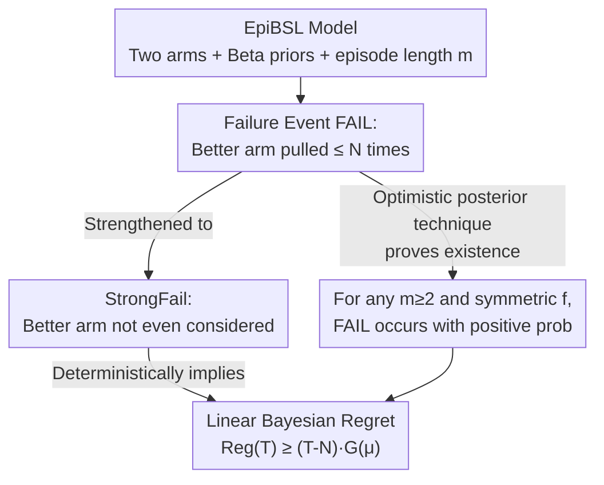

# Bandit Social Learning with Exploration Episodes

**Conference**: ICML2026  
**arXiv**: [2602.05835](https://arxiv.org/abs/2602.05835)  
**Code**: None (Purely theoretical)  
**Area**: Learning Theory / Multi-armed Bandits / Social Learning  
**Keywords**: Social Learning, Multi-armed Bandits, Greedy Algorithm, Exploration Failure, Bayesian Regret

## TL;DR
This paper investigates the social learning dynamics of bandits where "each selfish agent controls a short sequence of decisions (episode)." It proves that even if agents spontaneously explore within their own episodes, **exploration at the aggregate level still fails**. For any episode length $m \geq 2$ and any aggregate utility function $f$ (such as sum, max, or min), learning failure occurs with positive probability, leading to **linear growth** of Bayesian regret over time.

## Background & Motivation

**Background**: Learning on many online platforms follows "social learning dynamics"—a group of selfish users choose among options with unknown quality and provide feedback to the platform, which aggregates this information for subsequent users. This is essentially a "greedy" bandit algorithm ($\mathtt{Greedy}$) that **exploits without exploring**: each user seeks the arm with the highest current posterior mean, and no one is willing to risk trial-and-error for the benefit of future users.

**Limitations of Prior Work**: Greedy dynamics can get stuck. A classic counterexample involves two Bernoulli arms with 0-1 rewards: if a truly superior arm initially returns 0 and a suboptimal arm returns 1, the greedy approach permanently stays with the inferior arm. This type of "learning failure" is a **typical case** (occurring with positive probability) in $K$-armed bandits, rather than a worst-case scenario. Banihashem et al. (2023) and Slivkins et al. (2025) generalized this to settings with behavioral biases, structured rewards, and Bayesian priors.

**Key Challenge**: Almost all previous work assumes "each agent makes only one decision" (i.e., $m=1$, pure greedy). In reality, a single user often **makes several consecutive decisions**: testing multiple prompts for an AI to find the best one, completing a batch of similar tasks, or shopping repeatedly. In these cases, agents have an incentive to explore **for themselves** during their episode. Even if each person explores only slightly, one might expect that these efforts would aggregate over the long term to avoid learning failure.

**Goal**: To directly answer the question (Q): *Can learning failure be avoided when selfish agents each make several decisions?* An intuitively optimistic example: with deterministic rewards, two arms, $m=2$, and utility defined as the $\max$ of the two trials, the first agent will test both arms (since taking the max incurs no loss), providing complete information thereafter.

**Key Insight**: Contrary to optimistic intuition, the authors prove that **internal spontaneous exploration cannot rescue aggregate exploration**. For any **fixed** $m \geq 2$ and $f$ satisfying mild conditions (non-constant, non-decreasing in each coordinate, and symmetric), the failure event where "the superior arm is abandoned" occurs with positive probability, causing $\mathtt{BReg}(T)$ to grow linearly. The conclusion is that even if organic exploration exists, **externally driven exploration remains indispensable**.

## Method

### Overall Architecture

This is a **purely theoretical** paper. The "method" consists of the model formulation plus a chain of proofs that amplifies "local exploration failure" into "global linear regret." The logic follows this path: first, define a strictly characterized failure event $\mathtt{FAIL}_{c,N}$ (where the optimal arm is rarely pulled) and prove it occurs with positive probability for any instance. Then, strengthen it into $\mathtt{StrongFail}$ (where the optimal arm is not even "considered") and prove that strong failure **deterministically** implies linear regret. Finally, use a new analytical tool called "optimistic posterior" to generalize the existence of the failure probability to any $m \geq 2$ and general $f$.

**Model Setting ($\mathtt{EpiBSL}$)**: Two non-skip arms $i \in \{1, 2\}$ with means $\mu_i$ independently sampled from known priors $\mathrm{Beta}(\alpha_i, \beta_i)$; a third "skip arm" consistently returns 0. Time is partitioned into episodes of length $m$, each controlled by a new selfish agent. After observing the **full history** (all past arm pulls and rewards aggregated by the platform), the agent selects a Bayesian-optimal per-episode strategy $\pi_e$ to maximize its expected utility $\mathbb{E}[U(\pi_e) \mid \widetilde H_e]$. The agent's score for the episode is $f(\vec r_e)$, and the utility is $U_e = f(\vec r_e) - \text{total selection cost}$. Here, $f$ is non-decreasing, non-constant ($f(\vec 0) < f(\vec 1)$), and symmetric (for the main result), with paradigms being sum, max, or min.

**Regret Definition**: Based on the "optimal per-episode strategy value $U^*(\vec\mu)$ when $\vec\mu$ is known," the pseudo-regret after $T$ episodes is defined as:

$$\mathtt{Reg}(T \mid \vec\mu) := T \cdot U^*(\vec\mu) - \sum_{e \in [T]} V(\pi_e \mid \vec\mu), \qquad \mathtt{BReg}(T) := \mathbb{E}[\mathtt{Reg}(T \mid \vec\mu)].$$

Sublinear regret is the minimum requirement for a "useful bandit algorithm"; this paper proves that it cannot be achieved here.

### Key Designs

**1. EpiBSL Model: Operationalizing Social Learning with Costs, Skips, and Aggregation**

The challenge is to study whether "spontaneous exploration saves the day" using a model that allows "internal exploration" while avoiding trivialities like "exploring randomly because it costs nothing." The authors provide each agent $m$ consecutive decisions, where the score is a scalar mapping of the $m$ rewards via an **aggregation function** $f$. Specifically, $f=\text{sum}$ corresponds to "every trial counts," $f=\max$ corresponds to "select the best after multiple trials" (like picking the best AI prompt), and $f=\min$ corresponds to "no failures allowed" (like autonomous driving). A small **selection cost** $c_{\text{sel}}$ and a **skip arm** are added: the cost ensures that "pulling a low-reward arm is strictly worse than doing nothing," preventing agents from exploring aimlessly. The key to this design is that it makes "internal selfish exploration" an endogenous behavior (agents have incentives to trial arms for their own sake for $m \geq 2$), allowing for a clean test of question (Q). $m=1$ naturally degenerates back to pure greedy learning, which is known to fail.

**2. Three-Tiered Failure Events: From "Rarely Pulled" to "Never Considered" to "Linear Regret"**

Proving "linear regret" directly is difficult, so the authors construct a transitive chain. The weakest event, $\mathtt{FAIL}_{c,N}$ (Definition 3.1), requires: both arm means are within $(c, 1-c)$, Arm 2 (the superior arm) is at least $c$ better than Arm 1 ($\mu_2 \geq \mu_1 + c$), yet **Arm 2 is pulled at most $N$ times in total**. Since "rarely pulled" does not immediately imply linear regret, the authors introduce the stronger $\mathtt{StrongFail}_{c,N}$ (Definition 3.3): Arm 2 satisfies the reward gap, and it is **"considered" in at most $N$ episodes** ("considered" means selected with positive probability). Lemma 3.4 proves that if $\Pr[\mathtt{FAIL}_{c,N}] > 0$, then $\Pr[\mathtt{StrongFail}_{c,N'} \mid \mathtt{FAIL}_{c,N}] \geq 1/2$ (using Azuma-Hoeffding to bound the contradiction that enough "good" episodes would eventually pull Arm 2 more than $N$ times). Finally, Theorem 3.6 provides the crucial **deterministic** conclusion:

$$\mathtt{StrongFail}_{c,N} \implies \mathtt{Reg}(T) \geq (T - N) \cdot G(\vec\mu), \quad \forall T,$$

where $G(\vec\mu) = U^*(\vec\mu) - \sup_{\pi \in \Pi_{\mathtt{bad}}} V(\pi \mid \vec\mu)$ is the utility gap between using and not using the superior arm. Lemma 3.8 further proves that if $c_{\text{sel}} \leq c'/2m$, then $G(\vec\mu) \geq c'/2$ remains positive independently of time. Thus, if strong failure occurs with positive probability, $\mathtt{BReg}(T)$ is linear. More explicit lower bounds for $G(\vec\mu)$ are given for $f=\min$ or $\max$.

**3. Optimistic Posterior: Handling Rational Pulls of Posterior-Inferior Arms**

This is the core technical difference from the $m=1$ analysis. When $m=1$, one only needs to compare current posterior means to assert an arm won't be picked. For $m \geq 2$, a rational agent **might pick an arm with a poor current posterior** because a success early in the episode could significantly raise its posterior for subsequent rounds. Therefore, one cannot simply say an arm is "never picked." The authors instead reason using the **optimistic posterior**: the hypothetical posterior induced if the arm were to yield successes in all remaining trials of the episode. The central lemma proves that if Arm 2 is "strongly posterior-bad" (meaning it is currently poor and would remain poor even after $m-1$ successes), it creates a **bad-start condition** that forces the agent to avoid Arm 2 in the first round. Combined with the **arm1-stability** event (using stopping times and martingales to show Arm 1's posterior mean doesn't drop too much with constant probability), it ensures that if Arm 2's first few samples are 0, its optimistic posterior is permanently suppressed below Arm 1 and it is never pulled again. Longer episodes are handled via **induction on $m$**.

## Key Experimental Results

This is a theoretical paper without numerical experiments. The "results" are a series of theorems. The following table summarizes the core conclusions and conditions:

### Main Results (Failure Conclusions)

| Theorem | Episode Length $m$ | Aggregation $f$ | Cost Constraint | Conclusion |
| :--- | :--- | :--- | :--- | :--- |
| Thm 4.1 | Any $m \geq 2$ | Symmetric | $c_{\text{sel}} < c_{\max}$ | Event (P1) holds, $N_{\mathcal P} = 1 + \lfloor (m-1)\beta_2/\alpha_2 \rfloor$ |
| Thm 4.3 | $m = 2$ | Asymmetric | $c_{\text{sel}} < c_{\max}$ | Event (P1) holds |
| Thm 4.6 | (a) $m=2$ Symmetric / (b) $f=\max$ or $\min$ | — | **No upper bound** $c_{\max} = 1$ | Event (P1) holds |
| Cor 4.5 | $m=2$ or Symmetric $f$ | — | $c_{\text{sel}} < c_{\max}$ | Linear Regret $\mathtt{BReg}(T) \geq c_0(T - N_0)$ |

### Failure Probability Lower Bounds and Amplification

| Lemma/Theorem | Function | Key Quantity |
| :--- | :--- | :--- |
| Lemma 3.4 | $\mathtt{FAIL} \Rightarrow \mathtt{StrongFail}$ (Prob $\geq 1/2$) | Azuma-Hoeffding |
| Thm 3.6 | Strong Fail $\Rightarrow$ Linear Regret (**Deterministic**) | $\mathtt{Reg}(T) \geq (T - N)G(\vec\mu)$ |
| Lemma 3.8 | Utility gap is positive | $c_{\text{sel}} \leq c'/2m \Rightarrow G(\vec\mu) \geq c'/2$ |
| Thm 4.1 | Positive failure prob lower bound | $\Pr[\mathtt{FAIL}] \geq q_{\mathcal P}^m$ |

### Key Findings
- **Core Counter-intuition**: Relying on "multiple decisions per person" as a solution is incorrect. While the failure probability lower bound $q_{\mathcal P}^m$ decays exponentially with $m$, **any positive value implies linear regret**. Small $m$ (a few prompts or products) represents the most realistic scenario where this decay is negligible.
- **Robustness across models**: Failure occurs for sum, max, min, and any symmetric, non-decreasing, non-constant $f$. Asymmetric $f$ fails for $m=2$.
- **Role of cost as a boundary watershed**: For $f = \max/\min$, failure occurs even without cost upper bounds (Thm 4.6). However, the analysis breaks down if **there is no skip arm and $c_{\text{sel}}=0$**, where $f=\max$ can "succeed" because ties in marginal utility allow for random tie-breaking.
- **Generalizability**: Conclusions extend to $K > 2$ arms in instances where two arms are significantly better than the rest. "Learning success," if it exists, would only occur in regimes that exclude 2-arm cases.

## Highlights & Insights
- **Optimistic Posterior as a New Analytic Primitive**: Since $m \geq 2$ breaks the convenience of comparing only current posterior means, the "hypothetical posterior after future positive samples" characterizes when an agent **will never** select an arm. This is a vital mechanism for extending single-round failure proofs to multiple rounds.
- **Three-Tiered Failure + Deterministic Lower Bound**: By strengthening probabilistic "rare pulls" to "never considered" and then using a **deterministic** inequality (Thm 3.6), the authors avoid complex probabilistic regret bounds. This template of "constant probability bad event $\to$ deterministic linear loss" is highly reusable.
- **Discussion of $c_{\text{sel}}=0$**: This provides insight that the "success vs. failure" switch isn't the amount of exploration, but whether utility models like max/min create **ties** in boundary rewards that inject exploration via random tie-breaking.

## Limitations & Future Work
- **Stylized Model**: Limited to two Bernoulli arms, Beta conjugate priors, and fully observable history. The authors note conjugate priors are necessary for explicit updates; generalizing to arbitrary bounded rewards/priors is conjectured but not proven. Partially observable history is an open problem even for $m=1$.
- **Exponential Decay of Failure Prob with $m$**: $q_{\mathcal P}^m$ is very small for large $m$. How the true failure probability scales with $m$ is an open question; this paper only demonstrates it is "positive enough" to cause linear regret.
- **Partial Coverage of $K > 2$ and $c_{\text{sel}}=0$**: $K > 2$ requires specific reward gap conditions, and a full characterization of the cost-free/skip-free regime remains for future work.
- **Improvement Directions**: Relaxing full history to aggregate statistics and formally connecting these results with the incentivized exploration literature.

## Related Work & Insights
- **vs. Banihashem et al. (2023) ($m=1$ Greedy Failure)**: They handle single-round episodes using current posterior comparisons. This paper is a rigorous generalization; the difficulty lies in $m \geq 2$ where agents might rationally choose inferior arms temporarily. The conclusion remains: failure is typical and implies linear regret.
- **vs. Slivkins et al. (2025) (Greedy with Structure)**: They characterize when greedy fails/succeeds given arbitrary structures (including asymptotic success in contextual bandits). This paper focuses on unstructured 2-arm cases but introduces the "episode" dimension, proving internal exploration doesn't fix external failure.
- **vs. Incentivized Exploration (Kremer et al. 2014; Slivkins 2023)**: Those works **design interventions** to induce exploration. This paper **analyzes** the dynamics induced by selfish behavior, providing evidence of why external incentives remain a necessity.
- **vs. Strategic Experimentation (Bolton & Harris 1999)**: In those models, long-lived agents act in parallel and can free-ride, eventually learning the optimal arm. In this paper, agents are short-lived and act sequentially, leading to persistent failure.

## Rating
- Novelty: ⭐⭐⭐⭐⭐ Formulating whether spontaneous exploration "saves" social learning and providing a counter-intuitive negative answer with new tools like the optimistic posterior.
- Experimental Thoroughness: ⭐⭐⭐⭐ Purely theoretical, but covers sum/max/min, symmetric/asymmetric $f$, and various cost constraints comprehensively.
- Writing Quality: ⭐⭐⭐⭐⭐ Very clear progression of failure events and proof sketches; candid discussion of boundary cases.
- Value: ⭐⭐⭐⭐ Clear policy implications for platform design—organic exploration is insufficient; external exploration incentives are essential.

<!-- RELATED:START -->

## Related Papers

- [\[ICLR 2026\] Bandit Learning in Matching Markets Robust to Adversarial Corruptions](../../ICLR2026/learning_theory/bandit_learning_in_matching_markets_robust_to_adversarial_corruptions.md)
- [\[ICLR 2026\] Laplacian Kernelized Bandit](../../ICLR2026/learning_theory/laplacian_kernelized_bandit.md)
- [\[ICML 2026\] Cutting LLM Evaluation Costs with SySRs: A Bandit Algorithm that Provably Exploits Model Similarity](cutting_llm_evaluation_costs_with_sysrs_a_bandit_algorithm_that_provably_exploit.md)
- [\[NeurIPS 2025\] Infrequent Exploration in Linear Bandits](../../NeurIPS2025/learning_theory/infrequent_exploration_in_linear_bandits.md)
- [\[ICML 2025\] Learning-Augmented Algorithms for MTS with Bandit Access to Multiple Predictors](../../ICML2025/learning_theory/learning-augmented_algorithms_for_mts_with_bandit_access_to_multiple_predictors.md)

<!-- RELATED:END -->
