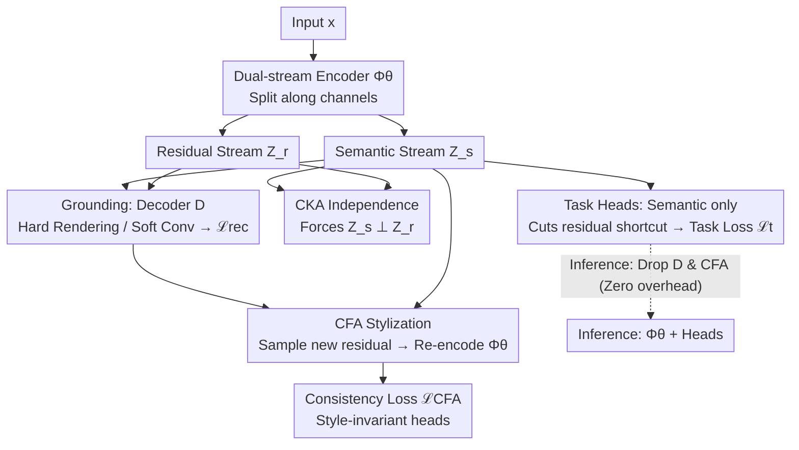

# CORE-MTL: Rethinking Gradient Balancing via Causal Orthogonal Representations

**Conference**: ICML 2026  
**arXiv**: [2606.02221](https://arxiv.org/abs/2606.02221)  
**Code**: https://github.com/Hope-Rita/CORE-MTL  
**Area**: Optimization / Multi-Task Learning / Causal Representation Learning  
**Keywords**: Multi-Task Learning, Gradient Conflict, Causal Disentanglement, OOD Generalization, Counterfactual Augmentation

## TL;DR
The authors reattribute the root cause of "negative transfer" in Multi-Task Learning (MTL) from "gradient conflict" to the "entanglement of semantics and noise in shared representations." They propose CORE-MTL: a dual-stream encoder splits representations into semantic $\hat{Z}_s$ and residual $\hat{Z}_r$, implementing "causal orthogonality" through CKA independence constraints, counterfactual style replacement, and inverse rendering reconstruction. Theoretically, it provides a tighter OOD upper bound than gradient balancing; experimentally, it outperforms ten baselines including PCGrad, GradNorm, STCH, and FairGrad on NYUv2/Cityscapes (ID) and GTA5→Cityscapes/Cityscapes-C (OOD) settings.

## Background & Motivation

**Background**: Mainstream MTL approaches are divided into two categories: the optimization group, which adjusts task weights or projects gradient directions during updates (GradNorm, PCGrad, MGDA, STCH, FairGrad), and the architectural group, which assigns different backbone modules to each task (MTAN). Both typically treat the shared representation as a black box, intervening only at the gradient or routing levels.

**Limitations of Prior Work**: Negative transfer remains prevalent, and performance drops sharply under Out-of-Distribution (OOD) conditions (distribution shifts, style perturbations, synth-to-real). The authors point out a deeper issue: shared representations encode "task-relevant invariant semantics" and "nuisance factors like style, lighting, or background" together. Downstream heads then exploit these nuisances as shortcuts during training.

**Key Challenge**: Gradient conflict is often a symptom rather than the cause of negative transfer. When nuisance factors are already encoded into the shared representation, projecting or reweighting gradients cannot prevent downstream predictions from relying on these spurious correlations—meaning optimization-based methods cannot alter the "representation geometry."

**Goal**: To prove from a causal perspective that optimization-based methods have an OOD error lower bound and to design a "representation-centric" framework that structurally separates semantic and residual streams, ensuring task heads only access the semantic stream.

**Key Insight**: Assume the input is generated by invariant semantic factors $Z_s$ and residual nuisance factors $Z_r$ via a mechanism $X=g(Z_s,Z_r)$, where distribution shift only changes the covariance of $Z_r$ ($\Sigma_r$), leaving $Z_s$ unchanged. Under a linear-Gaussian SCM, if the encoder representation mixes $Z_s$ and $Z_r$ by a rotation angle $\psi$, the OOD error has a lower bound of $c\sin^2(\psi)\|\Sigma_r^T-\Sigma_r^S\|_F$. No amount of gradient manipulation can eliminate this $\sin^2\psi$ term.

**Core Idea**: Instead of patching the gradient space, structurally split the representation into a semantic stream $\hat{Z}_s$ and a residual stream $\hat{Z}_r$, forcing heads to read only the semantic stream. Gradient orthogonality then emerges automatically as a "geometric byproduct" of disentanglement, without requiring post-hoc operations like PCGrad.

## Method

### Overall Architecture
The input $x$ enters a shared encoder $\Phi_\theta$, and the output is explicitly split into two streams: $(\hat{Z}_s,\hat{Z}_r)=\Phi_\theta(x)$. $K$ task heads $f_{\phi_t}$ read only the semantic stream $\hat{Z}_s$; the residual stream $\hat{Z}_r$ does not enter the heads. During training, three sets of constraints are applied: first, a CKA independence loss forces $\hat{Z}_s\perp\hat{Z}_r$; second, reconstruction grounding feeds the pair $(\hat{Z}_s,\hat{Z}_r)$ to a decoder $\mathcal{D}$ to recover $x$, providing physical/structural anchors for the "division of labor"; finally, Counterfactual Augmentation (CFA) reuses the decoder to sample $\tilde{Z}_r$ from the empirical residual distribution, combining it with the original $\hat{Z}_s$ to synthesize a "re-styled" input $\tilde{x}=\mathcal{D}(\hat{Z}_s,\tilde{Z}_r)$, which is re-encoded to force the head to be invariant to style perturbations. During inference, only the encoder and task heads are used; the decoder and counterfactual branches are discarded, resulting in zero additional overhead.

### Key Designs

**1. Dual-stream Encoding + Semantic-only Heads: Structurally cutting the "residual shortcut"**

Since optimization-based MTL cannot change representation geometry, this method intervenes directly: the shared encoder output is halved along the channel dimension, $(\hat{Z}_s,\hat{Z}_r)=\Phi_\theta(x)$. $\hat{Z}_s$ goes to task heads, while $\hat{Z}_r$ only goes to the decoder/CFA. This cuts the physical short-circuit where task losses are sensitive to residuals. To quantify this, the authors define a leakage coefficient $\lambda_{\text{leak}}=\sup\|g_s(z_s,z_r)-g_s(z_s,z_r')\|/\|z_r-z_r'\|$ and prove the OOD bound:

$$\mathcal{E}_T(h)-\mathcal{E}_S(h)\leq C_{\text{cap}}+\alpha\,\lambda_{\text{leak}}\,W_1(P_S(Z_r),P_T(Z_r)).$$

As $\lambda_{\text{leak}}\to 0$, the OOD gap decouples from the magnitude of residual shift—replacing the irreducible $\sin^2(\psi)$ bound of GradNorm/PCGrad.

**2. CKA Independence Constraint: Differentiable regularization for gradient orthogonality**

Architectural splitting ensures "information separability" but not "actual separation." Thus, linear CKA on mini-batches is used as a regularizer $\mathcal{L}_{\text{CKA}}=\text{CKA}(\mathbf{Z}_s,\mathbf{Z}_r)$ to minimize linear dependence. Under linear-Gaussian assumptions, the authors prove that reducing CKA is equivalent to minimizing the cross-term of the encoder Jacobian. A key byproduct is Proposition 2.5: $\mathbb{E}[\cos^2(g_{\text{task}},g_{\text{res}})]\leq c\cdot\text{CKA}(Z_s,Z_r)+\delta$. Task and residual gradients become nearly orthogonal at the final shared layer, eliminating conflict at the source without post-hoc gradient surgery.

**3. Reconstruction Grounding: Assigning roles to the streams**

CKA forces independence but doesn't specify what goes into which stream. Grounding provides physical anchors: the pair $(\hat{Z}_s,\hat{Z}_r)$ is fed to a decoder $\mathcal{D}$ to reconstruct $x$. Two versions are used: **Hard Grounding** implements the decoder as physics-based inverse rendering $\hat{x}\approx\mathcal{A}(\hat{Z}_r)\odot\mathcal{S}(\mathcal{N}(\hat{Z}_s),\mathbf{L}(\hat{Z}_r))$, making $\hat{Z}_s$ responsible for geometry (normals) and $\hat{Z}_r$ for photometry (albedo + lighting). **Soft Grounding** uses a general convolutional decoder + $L_1$ reconstruction when physical priors are absent, relying on the "heads only read $\hat{Z}_s$" bottleneck and CKA to push discriminative info and reconstruction residuals into the correct streams.

**4. Counterfactual Style Replacement (CFA): Training heads for style invariance**

CFA uses the decoder for a counterfactual intervention: sample a new nuisance vector $\tilde{Z}_r$ from the empirical distribution of the current batch, combine it with the original $\hat{Z}_s$, and synthesize a "same semantic, different style" image $\tilde{x}=\mathcal{D}(\hat{Z}_s,\tilde{Z}_r)$. Re-encoding this must yield the same task labels: $\mathcal{L}_{\text{CFA}}=\sum_t w_t\mathcal{L}_t(f_{\phi_t}([\Phi_\theta(\tilde{x})]_s),y_t)$ (with BN statistics frozen in the counterfactual branch). This directly penalizes spurious correlations between labels and nuisances.

### Loss & Training
Total objective: $\mathcal{L}_{\text{total}}=\sum_t w_t\mathcal{L}_t+\lambda_{\text{CKA}}\mathcal{L}_{\text{CKA}}+\lambda_{\text{CFA}}\mathcal{L}_{\text{CFA}}+\lambda_{\text{rec}}\mathcal{L}_{\text{rec}}$. Task weights $w_t$ can be fixed or dynamically adjusted via GradNorm. ResNet-50 is used as the backbone. BN statistics are frozen on the counterfactual path to strictly evaluate robustness.

## Key Experimental Results

### Main Results
In-Distribution results for NYUv2 (3 tasks) and Cityscapes (2 tasks):

| Method | NYUv2 mIoU↑ | NYUv2 Depth Abs↓ | NYUv2 Normal Mean↓ | Cityscapes mIoU↑ | Cityscapes Depth Rel↓ |
|------|------------|------------------|--------------------|------------------|----------------------|
| Single Task | 0.5192 | 0.5260 | 24.27 | 0.6869 | 47.96 |
| Equal Weighting | 0.5316 | 0.3911 | 24.29 | 0.6962 | 44.03 |
| PCGrad | 0.5222 | 0.3916 | 24.39 | 0.6998 | 44.56 |
| GradNorm | 0.5264 | 0.3896 | 24.39 | 0.7015 | 44.55 |
| STCH | 0.5377 | 0.3917 | 23.20 | 0.6952 | 42.84 |
| MTAN | 0.5401 | 0.3822 | 24.02 | 0.7023 | 45.57 |
| FairGrad | 0.5291 | 0.3944 | 23.07 | 0.6986 | 43.74 |
| RepMTL | 0.5492 | 0.3727 | 24.53 | 0.7079 | 44.32 |
| **CORE-MTL (Ours)** | **0.5693** | **0.3544** | **22.49** | **0.7229** | **39.61** |

OOD performance (GTA5→Cityscapes and Cityscapes-C): CORE-MTL achieves 0.5435 mIoU on the target domain (vs PCGrad's 0.5047). On Cityscapes-C, results (mIoU 0.6104 / Depth Rel 38.10) significantly outperform all baselines, validating the prediction that lowering leakage reduces the OOD gap.

### Ablation Study
Ablation on NYUv2 (adding components sequentially):

| Configuration | Seg mIoU↑ | Depth Abs↓ | Normal Mean↓ | Note |
|------|----------|-----------|--------------|------|
| Vanilla MTL | 0.5249 | 0.4418 | 25.62 | No dual-stream, standard sharing |
| + DS | 0.5352 | 0.3813 | 23.30 | Dual-stream only; reduces depth/normal error significantly |
| + DS + Grounding | 0.5424 | 0.3827 | 23.22 | Grounding improves segmentation |
| + DS + Grounding + CKA | — | — | — | Independence constraint refines roles |
| Full (+ CFA) | 0.5693 | 0.3544 | 22.49 | CFA provides the most significant robustness gain |

Scalability on CelebA ($K=10 \to 40$): CORE-MTL training time remains nearly constant (~300 s/epoch), while PCGrad increases linearly from 690 s to 2806 s.

### Key Findings
- **Gradient Orthogonality as a Structural Byproduct**: Task and reconstruction gradients exhibit near-zero cosine similarity and structured block patterns without explicit projection.
- **Robustness Gain**: Feature swap experiments show $\Delta Z_r/\Delta Z_s = 3.28$ under cross-domain settings, confirming the semantic stream "holds" while the residual stream absorbs style shifts.
- **Deterioration of Surgery Methods in OOD**: Gradient manipulation methods (PCGrad/FairGrad) often show larger source-target gaps than Equal Weighting, empirically supporting the Theorem 2.3 lower bound.

## Highlights & Insights
- **Revisiting Gradient Conflict via Representation Geometry**: Using a clean linear-Gaussian SCM to derive the irreducible $\sin^2(\psi)$ lower bound provides a much stronger theoretical justification than simply proposing a new module.
- **CKA as a Differentiable Proxy**: Bridging a geometric quantity ($\lambda_{\text{leak}}$) with a statistical one (CKA) makes "representation independence" a backpropagatable loss term, applicable to various disentanglement and OOD scenarios.
- **Zero-cost Counterfactuals**: CFA synthesizes $\tilde{x}$ from empirical distributions within the batch, avoiding dependence on external style datasets or complex stylization models.
- **Hard / Soft Grounding Duality**: Provides a standardized template for applying representation-centric frameworks across different domains, whether physical priors are strong or weak.

## Limitations & Future Work
- **Linear-Gaussian Assumption**: The assumption of $Z_s\perp Z_r$ and fixed rotation is strong. In reality, semantics and context are often coupled (e.g., pedestrians on crosswalks).
- **Decoder Dependency**: Hard grounding requires a physical forward model (inverse rendering). Adapting this "grounding" to modalities without pixel-level signals (e.g., NLP) remains a challenge.
- **Training Overhead**: While it does not scale linearly with $K$, the absolute training time is approximately 3× the baseline due to the decoder and counterfactual paths.

## Related Work & Insights
- **Vs Optimization-based (PCGrad/FairGrad)**: These methods work in gradient space; CORE-MTL argues they face an irreducible OOD bound and instead obtains gradient orthogonality for "free" via disentanglement.
- **Vs Architectural (MTAN)**: Instead of partitioning by task, CORE-MTL partitions by "semantic vs residual," aligning better with causal disentanglement paradigms.
- **Vs Representation-centric (RepMTL)**: CORE-MTL introduces structural causal model interpretation, counterfactual augmentation, and physical grounding, providing a more complete theoretical and mechanism-driven approach.

## Rating
- Novelty: ⭐⭐⭐⭐ Re-framing negative transfer through representation geometry; solid combination of theory and method.
- Experimental Thoroughness: ⭐⭐⭐⭐⭐ Comprehensive coverage of ID, OOD, scalability, and visualization across multiple datasets.
- Writing Quality: ⭐⭐⭐⭐ The "sandwich" argumentation (lower and upper bounds) is very clear.
- Value: ⭐⭐⭐⭐ Significant for the MTL community; the counterfactual trick and leakage analysis are broadly applicable to OOD generalization.

<!-- RELATED:START -->

## Related Papers

- [\[ICLR 2026\] Function Spaces Without Kernels: Learning Compact Hilbert Space Representations](../../ICLR2026/learning_theory/function_spaces_without_kernels_learning_compact_hilbert_space_representations.md)
- [\[ICML 2026\] MMD-Balls as Credal Sets: A PAC-Bayesian Framework for Epistemic Uncertainty in Test-Time Adaptation](mmd-balls_as_credal_sets_a_pac-bayesian_framework_for_epistemic_uncertainty_in_t.md)
- [\[ICML 2026\] Semi-Supervised Noise Adaptation: Transferring Knowledge from Noise Domain](semi-supervised_noise_adaptation_transferring_knowledge_from_noise_domain.md)
- [\[ICML 2026\] Towards Optimal Robustness in Learning-Augmented Paging](towards_optimal_robustness_in_learning-augmented_paging.md)
- [\[ICML 2026\] On the Learnability of Test-Time Adaptation: A Recovery Complexity Perspective](on_the_learnability_of_test-time_adaptation_a_recovery_complexity_perspective.md)

<!-- RELATED:END -->
