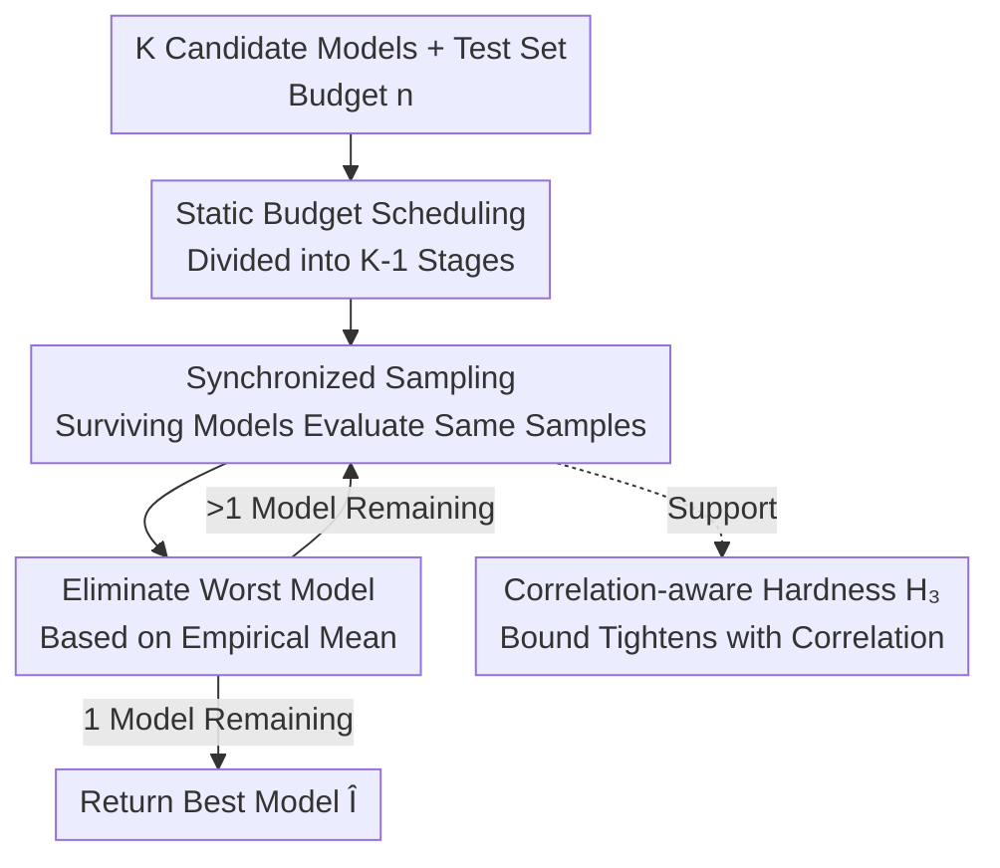

# Cutting LLM Evaluation Costs with SySRs: A Bandit Algorithm that Provably Exploits Model Similarity

**Conference**: ICML 2026  
**arXiv**: [2606.07726](https://arxiv.org/abs/2606.07726)  
**Code**: llm-bandits-sysrs (Paper annotation, full link to be confirmed)  
**Area**: Learning Theory / Multi-Armed Bandits / LLM Evaluation  
**Keywords**: Best-arm identification, Multi-armed bandits, Model similarity, LLM evaluation, Synchronized sampling

## TL;DR
To reduce evaluation budgets when "selecting the best model," the authors transform the classic Successive Rejects bandit algorithm into a "synchronized" version called SySRs. By evaluating all surviving models on the same batch of test samples in each stage, the algorithm exploits inter-model correlations similarly to paired testing. This results in a hyperparameter-free best-arm identification algorithm with an error bound that tightens as model correlation increases. On 15 standard benchmarks, it reliably selects the optimal model using $\le 35\%$ of model-sample pairs, outperforming existing methods.

## Background & Motivation

**Background**: The standard practice for evaluating large language models (LLMs) is to "run every model on every test sample." For practitioners who only want to select the single best model for deployment, this is highly wasteful—there is no need to estimate the score of a clearly inferior model to high precision. Zhou et al. (2025) proposed a clean perspective: treating models as "arms" of a bandit and accuracy on each query as "rewards." Thus, best-arm identification algorithms can be used to decide which model to evaluate next online, eliminating poor models early and concentrating the budget on a few top-tier models that are difficult to distinguish.

**Limitations of Prior Work**: Existing cost-reduction routes have significant drawbacks. (1) Using LLMs as judges to replace experts—saves on annotation but not inference, and reliability is poor as similar models may fail to recognize each other's errors. (2) Subset selection—picking a small batch of "informative" sub-tasks, but lacks theoretical guarantees, is not necessarily better than random sub-sampling, and requires extensive historical evaluation data on the benchmark, making it unusable for new benchmarks. (3) General best-arm identification (UCB-E, SR) has theoretical guarantees but fails to exploit the specific structure of LLM evaluation: performance across tasks is often highly correlated—most models get simple questions right and difficult ones wrong.

**Key Challenge**: Theoretically mature best-arm identification algorithms assume independent sampling of each arm, wasting the "free information" of model correlation. Methods attempting to use correlation (e.g., UCB-E-LRF by Zhou et al., using low-rank factorization to predict unobserved scores) lack theoretical guarantees and do not consistently outperform standard UCB-E experimentally. Literature on correlated-arm bandits is scarce, and the approach by Gupta et al. (2021) requires prior knowledge of the upper bound of correlation strength, which is unavailable in practice.

**Goal**: Design a best-arm identification algorithm that is hyperparameter-free, automatically exploits model correlation, and possesses an error bound that tightens with increasing correlation.

**Key Insight**: The authors focused on the classic Successive Rejects (SR) algorithm—it eliminates the worst arms stage by stage and features hyperparameter-free budget scheduling. A key observation is that SR is naturally suited for a "synchronized" transformation because it already evaluates in blocks by "stages." By evaluating all surviving models on the same batch of samples, the variance of the "difference between two models" can be reduced, similar to paired difference testing.

**Core Idea**: Replace the "independent sampling per arm" in SR with "evaluating all surviving models on the same batch of samples" per stage (synchronization). This uses paired comparisons to reduce the variance of score differences, thereby automatically gaining the correlation dividend without requiring prior knowledge of correlation strength.

## Method

### Overall Architecture
Problem formulation: Given $K$ candidate models $f_1,\dots,f_K$, a test set $\mathcal{X}=\{x_1,\dots,x_L\}$, and a fixed budget of $n$ evaluations, the goal is to find the model with the highest average performance $i^\star=\arg\max_i \mu_i$, where $\mu_i=\frac{1}{L}\sum_j \mathbb{E}[S_{ij}]$ and $S_{ij}\in[0,1]$ is the (possibly stochastic) score of model $j$ on sample $i$. The algorithm selects a model $i_t$ and a sample $j_t$ at each step, observes $S_{i_t j_t}$, and outputs a guess $\widehat I$ for the best arm after $n$ steps. The objective is to minimize the error probability $e_n=\mathbb{P}(\widehat I\neq i^\star)$.

SySRs follows the "static budget scheduling + stage-wise elimination of the worst" framework of SR but changes the sampling method from "independent random sampling for each arm" to "synchronized sampling of all surviving models on the same batch." Based on this, it uses a correlation-aware hardness measure $H_3$ to provide a tighter error bound.

### Key Designs

**1. Static Budget Scheduling: Hyperparameter-free partitioning of budget into K-1 increasing stages**

Algorithms like UCB-E require tuning an exploration hyperparameter $a$—if too small, there's no guarantee; if too large, the exponential term is insufficiently small. SySRs inherits the hyperparameter-free scheduling of SR: the budget $n$ is split into $K-1$ phases of unequal length. In stage $k$, each surviving model is evaluated a total of $n_k$ times, where:

$$n_k=\Big\lceil\frac{1}{\overline{\log}(K)}\frac{n-K}{K+1-k}\Big\rceil,\quad \overline{\log}(K)=\frac{1}{2}+\sum_{i=2}^{K}\frac{1}{i}$$

This schedule is carefully designed: as fewer models survive, the budget must be pushed toward the top models that are harder to distinguish, so the budget allocated per stage ($n_k-n_{k-1}$) increases while the total budget does not exceed $n$. Being hyperparameter-free means users do not need prior tuning, which is a prerequisite for "automatically adapting to correlation."

**2. Synchronized Sampling: Evaluating all surviving models on the same samples to reduce variance**

This is the only, yet most critical, modification of SySRs compared to classic SR. Classic SR draws samples independently and randomly for each arm, so when estimating the difference between two models, the randomness on both sides does not cancel out. SySRs draws a batch $\widetilde{\mathcal{J}}_k$ from unused samples in stage $k$ and ensures that **all $K+1-k$ surviving models are evaluated on this same batch**. It then eliminates the worst model based on the cumulative empirical mean $\widehat\mu_{i,n_k}=\frac{1}{n_k}\sum_{j\in\mathcal{J}_k}S_{ij}$. This is equivalent to replacing a "two-sample test" with a "paired difference test." When two models are positively correlated (both correct on easy tasks and wrong on hard ones), the variance of their difference $V_{\star,i}=\mathrm{Var}(S_{i^\star J})+\mathrm{Var}(S_{(i)J})-2\,\mathrm{Cov}(S_{i^\star J},S_{(i)J})$ is significantly reduced by the covariance term, leading to a lower probability of misidentifying the best arm. Synchronization also offers an engineering advantage: it naturally evaluates in sample blocks, which is better suited for the batch inference of LLMs than the per-step model switching of UCB.

**3. Correlation-aware Hardness H₃: Automatically tightening the error bound with model similarity**

To prove synchronization is effective, a hardness measure that incorporates correlation is required. The authors replaced the per-arm hardness $1/\Delta_i^2$ in the classic $H_2=\max_i \frac{i}{\Delta_i^2}$ with a correlation-aware version $H_{3,i}=\frac{2V_{\star,i}+\frac{2}{3}(1+\Delta_i)\Delta_i}{\Delta_i^2}$. Defining $H_3=\max_{i\geq 2} i\,H_{3,i}$, they obtained (Theorem 5.1):

$$e_n\leq\frac{K(K-1)}{2}\exp\left(-\frac{n-K}{\overline{\log}(K)\,H_3}\right)$$

The proof follows the SR analysis framework of Audibert et al. (2010), with the key replacement being the use of Bernstein's inequality (dependent on variance $V_{\star,i}$) instead of Hoeffding's inequality to bound the mean comparison error for each pair of arms. Intuitively, as $V_{\star,i}$ decreases, the bound becomes tighter. Synchronized sampling is precisely what drives down $V_{\star,i}$ by presenting the same samples to all models. This improvement is particularly decisive in the "hard regions" where the gap $\Delta_i$ is very small. The authors further decoupled the two sources of gain for $H_3$: **better analysis** (even standard SR can use a variance-based $H_3'$, which is already tighter than $H_2$ in some regions) + **better algorithm** (synchronization makes $H_3$ tighter based on correlation $\theta_i$, whereas $H_3'$ is unaffected by correlation). Empirically, across 15 datasets, $H_3 < H_3' < H_2$, proving both factors contribute.

### Loss & Training
This is a purely algorithmic/theoretical work with no training loss. It is worth noting the "fast rate" phenomenon in the two-arm extreme case: when rewards are uncorrelated ($\theta=0$), $H_3=\Theta(1/\Delta^2)$, reverting to classic hardness; when maximally correlated ($\theta=1$, indicating point-wise dominance where the suboptimal model is correct only when the optimal model is), $V_{\star,2}=\Delta-\Delta^2$, and hardness drops to $H_3=\Theta(1/\Delta)$. This resembles the interpolation from the slow rate $1/\varepsilon^2$ to the fast rate $1/\varepsilon$ brought by the Bernstein condition in statistical learning—the variance of the difference shrinks linearly with the gap.

## Key Experimental Results

### Main Results: Identification Accuracy (Average of 15 Benchmarks)

| Budget Share | US | SyUS | SR | UCB-E (a=1.0) | **SySRs** |
|--------------|-----|------|-----|---------------|-----------|
| 8%           | 30.2| 39.1 | 72.4| 80.9          | **83.5**  |
| 12%          | 36.7| 46.8 | 89.7| 86.8          | **95.1**  |
| 16%          | 42.0| 52.0 | 95.9| 89.9          | **98.5**  |
| 20%          | 45.3| 56.5 | 98.2| 95.3          | **99.6**  |
| 25%          | 50.5| 61.0 | 99.3| 97.5          | **99.9**  |
| 35%          | 58.0| 68.7 | 99.9| 98.3          | **100.0** |

SySRs is the highest at every budget level and is hyperparameter-free—whereas the UCB-E figures represent the results after selecting the optimal hyperparameter for each $x$ point. SySRs achieves 100% selection accuracy at 35% budget.

### Key Findings
- **Synchronization is the main driver**: Moving from SR to SySRs at low budget (8%) jumps identification accuracy from 72.4 to 83.5. Furthermore, SyUS consistently outperforms US, and SyUCB-E outperforms UCB-E, demonstrating that the synchronized mechanism provides stable gains across various algorithms.
- **Dual gains are essential**: The mean $H_3'/H_2$ is 0.61 (contribution from tighter analysis), and mean $H_3/H_3'$ is 0.56 (contribution from correlation). Multiplied, these show that $H_3$ reduces complexity to roughly one-third relative to $H_2$, with analysis and algorithm each accounting for half the gain.
- **Most robust in worst-case scenarios**: SySRs reliably selects the optimal model using at most 35% of model-sample pairs across all 15 benchmarks, while other methods require more data on at least one benchmark to reach the same level of reliability.
- **Outperforming tuned competitors without hyperparameters**: SySRs outperforms UCB-E even though the latter used optimized hyperparameters, highlighting that the convenience of avoiding tuning does not come at the expense of performance.

## Highlights & Insights
- **Paired testing intuition imported to Bandits**: Analogizing synchronized sampling to paired difference testing and using covariance to suppress variance is the soul of the work, and it naturally fits LLM batch inference.
- **Elegant fast-rate phenomenon**: Improving hardness from $\Theta(1/\Delta^2)$ to $\Theta(1/\Delta)$ in maximally correlated cases bridges the gap between "model similarity" and "fast rates."
- **Hyperparameter-free with correlation-tightened guarantees**: Compared to UCB-E-LRF (no guarantees, unstable) and earlier correlated-arm methods (requiring prior correlation strength), SySRs achieves both—no tuning, no priors, yet automatic correlation dividends.

## Limitations & Future Work
- **Target limited to Top-1 identification**: Focuses only on "picking the single best model" rather than full ranking or absolute score estimation.
- **Lower bound for sampling without replacement not yet closed**: The matching lower bound was proven in an i.i.d. (with replacement) setting.
- **Reliance on positive correlation**: Gains primarily stem from positive correlation between models; if models are independent or negatively correlated, $H_3$ reverts to the classic $H_2$.
- **Deterministic score assumption**: Experiments are based on greedy decoding; the performance on highly stochastic generative evaluations (high temperature) remains to be verified.

## Related Work & Insights
- **vs Successive Rejects (Audibert et al. 2010)**: Classic SR uses independent sampling and $H_2$ bounds. SySRs introduces synchronized sampling to derive the $H_3$ bound while inheriting the hyperparameter-free advantage.
- **vs UCB-E / UCB-E-LRF (Zhou et al. 2025)**: UCB-E requires tuning the exploration hyperparameter $a$, and LRF is unstable. SySRs is hyperparameter-free and consistently more accurate.
- **vs Correlated Bandits (Gupta et al. 2021)**: They treat correlation as known conditional expectation upper bounds; SySRs exploits correlation without any prior knowledge.

## Rating
- Novelty: ⭐⭐⭐⭐⭐ Connects paired testing, $H_3$ hardness, and fast rates.
- Experimental Thoroughness: ⭐⭐⭐⭐ 15 real benchmarks with 1000 repetitions.
- Writing Quality: ⭐⭐⭐⭐⭐ Logical progression from formulation to experiments.
- Value: ⭐⭐⭐⭐ Directly reduces LLM selection costs; hyperparameter-free and practical.

<!-- RELATED:START -->

## Related Papers

- [\[ICLR 2026\] An Efficient, Provably Optimal Algorithm for the 0-1 Loss Linear Classification Problem](../../ICLR2026/learning_theory/an_efficient_provably_optimal_algorithm_for_the_0-1_loss_linear_classification_p.md)
- [\[ICML 2026\] Enhancing Conformal Prediction via Class Similarity](enhancing_conformal_prediction_via_class_similarity.md)
- [\[ICML 2026\] Bandit Social Learning with Exploration Episodes](bandit_social_learning_with_exploration_episodes.md)
- [\[ICML 2025\] Provably Efficient Algorithm for Best Scoring Rule Identification in Online Principal-Agent Information Acquisition](../../ICML2025/learning_theory/provably_efficient_algorithm_for_best_scoring_rule_identification_in_online_prin.md)
- [\[ICML 2026\] When Sample Selection Bias Precipitates Model Collapse](when_sample_selection_bias_precipitates_model_collapse.md)

<!-- RELATED:END -->
