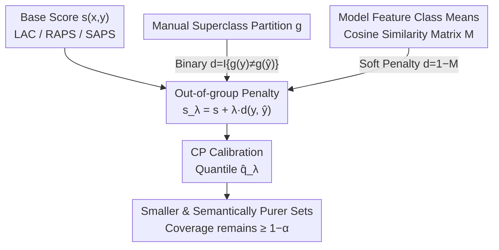

# Enhancing Conformal Prediction via Class Similarity

**Conference**: ICML2026  
**arXiv**: [2511.19359](https://arxiv.org/abs/2511.19359)  
**Code**: No public repository link provided in the paper  
**Area**: Learning Theory / Uncertainty Quantification / Conformal Prediction  
**Keywords**: Conformal Prediction, Prediction Set Size, Class Similarity, Coverage Guarantee, Neural Collapse

## TL;DR
This paper incorporates an "out-of-group penalty" into any arbitrary Conformal Prediction (CP) scoring function, penalizing candidate labels that belong to different semantic groups than the top-1 predicted class. It theoretically demonstrates that this penalty reduces the number of semantic groups in the prediction set while maintaining coverage and **unexpectedly shrinking the average prediction set size**. Furthermore, a model-adaptive variant is proposed that constructs the class similarity matrix directly from model features without requiring manual semantic partitions.

## Background & Motivation
**Background**: Conformal Prediction (CP) is a reliability framework for high-risk classification (e.g., medical diagnosis, autonomous driving). Instead of a single label, it outputs a candidate set $C(X)$ and provides a **marginal coverage guarantee** $P(Y\in C(X))\ge 1-\alpha$ under the assumption that calibration and test samples are exchangeable. The key metric for evaluating CP methods is the average prediction set size $\mathbb{E}[|C(X)|]$, referred to as efficiency.

**Limitations of Prior Work**: In many practical scenarios, classes naturally fall into semantic "superclasses" (e.g., diseases grouped by treatment, species by family). Users often prefer prediction sets to contain labels **from only a few groups**—confusing species within the same group (Sparrow A vs. Sparrow B) is far less severe than cross-group confusion (Sparrow vs. Hawk). However, existing CP methods only guarantee the inclusion of the true label and **disregard semantic consistency within the set**. Recent methods that explicitly introduce label structures (hierarchy/grouping) generally result in prediction sets that are **larger than the baseline**, sacrificing efficiency for structure.

**Key Challenge**: Semantic consistency (fewer groups) and efficiency (smaller sets) are perceived as a trade-off—improving semantic purity seems to require padding the set with more labels from the same group.

**Goal**: (1) Reduce the number of semantic groups in the prediction set without violating coverage or sacrificing efficiency; (2) Clarify whether exploiting structure is beneficial or detrimental to average set size; (3) Generalize the method to any dataset without manual semantic partitions.

**Key Insight**: All common CP methods **preserve softmax ordering** and invariably include the top-1 predicted class $\hat{y}(x)$ in the set. By adding an extra penalty to candidates "semantically distant" from $\hat{y}(x)$, cross-group labels can be excluded without altering the underlying coverage mechanism.

**Core Idea**: Add an out-of-group penalty $\lambda\,d(y,\hat{y}(x))$ to any scoring function $s(x,y)$, using a scalar $\lambda$ to simultaneously tighten both the "group count" and the "set size."

## Method

### Overall Architecture
The standard CP workflow involves: defining a scoring function $s(x,y)$ (higher scores indicate a worse match) $\rightarrow$ calculating the $\lceil(n+1)(1-\alpha)\rceil/n$ quantile $\hat{q}$ on the calibration set $\rightarrow$ outputting $C(x)=\{y:s(x,y)\le\hat{q}\}$ during testing. This paper does not replace any step but **augments the scoring function with a penalty term**, resulting in $s_\lambda(x,y)=s(x,y)+\lambda\,d(y,\hat{y}(x))$, which is then used in the standard CP pipeline. This modification is agnostic to the underlying scoring function (compatible with LAC/RAPS/SAPS), making it a "plug-and-play enhancer."

There are two ways to construct the penalty distance $d$, forming two branches: **Model-Agnostic (MA)** uses manual superclass partitions for a 0/1 binary penalty; **Model-Specific (MS)** uses the model's own features to construct soft similarities without manual partitioning. Both branches feed into the same CP calibration process to output smaller and semantically purer prediction sets.

### Key Designs

**1. Out-of-group Penalty: A "Cross-group Regularization" for Any Scoring Function**

To address the issue where "existing structured CP inflates the set size," the authors define a class-to-group mapping $g:[C]\to[G]$ and a binary distance $d(y,y'):=\mathbb{I}\{g(y)\neq g(y')\}$ (0 if in the same group, 1 otherwise), adding the penalty to any base score:

$$s_\lambda(x,y):=s(x,y)+\lambda\,d(y,\hat{y}(x)),\quad \lambda>0.$$

The meaning is: candidates $y$ in a different group from the top-1 prediction $\hat{y}(x)$ have their scores increased by $\lambda$, making them harder to enter the set. Since $s_\lambda$ remains a valid scoring function and does not break the exchangeability between calibration and test samples, the **coverage guarantee $P(Y\in C_\lambda(X))\ge 1-\alpha$ is directly inherited**. This is the key to "free" theoretical guarantees: the design does not touch the CP coverage mechanism, only the scores. Unlike hierarchical CP methods that redesign the coverage process, coverage here is guaranteed automatically.

**2. Triple Theoretical Guarantees: Constant Coverage, Non-increasing Groups, and the Counter-intuitive "Smaller Sets"**

The authors first prove a lemma for the controlled threshold $\hat{q}\le\hat{q}_\lambda\le\hat{q}+\lambda$, followed by the core Proposition 4.2: the penalty **can only remove and never add** cross-group labels ($C_\lambda(x)\cap Y_1(x)\subseteq C(x)\cap Y_1(x)$, where $Y_1(x)$ is the set of out-of-group classes). Thus, the corollary $\mathbb{E}[|G_\lambda(X)|]\le\mathbb{E}[|G(X)|]$ follows—the expected number of groups in the prediction set does not increase.

The truly unexpected result is Theorem 4.5: for small $\lambda$, the sign of the derivative of the average set size is:

$$\operatorname{sign}\!\Big(\tfrac{d}{d\lambda}\mathbb{E}[|C_\lambda(X)|]\Big|_{\lambda=0}\Big)=\operatorname{sign}\big(a\,p_1 n_0 - b\,p_0 n_1\big),$$

where $n_0, n_1$ are the average number of classes inside/outside the group, $p_0$ is the probability that the true label falls within the predicted group (group-level accuracy), $p_1=1-p_0$, and $a,b$ are density factors (with equal group sizes and uniform conditional labels, $a=b$). The authors argue that in practice, $p_1 n_0\ll p_0 n_1$ almost always holds: the number of classes within a group is far smaller than outside (in CIFAR-100 with 20 groups, $n_1/n_0=19$), and as long as top-1 accuracy exceeds 0.5, $p_0/p_1>1$. These factors combined make the derivative negative—**a small $\lambda$ not only reduces group count but also shrinks the average set size**. This explains a phenomenon previously unreached: as a post-processing method, it consistently beats standard LAC in efficiency. The theorem also identifies failure cases (extreme dominant groups + weak models), though none were encountered in benchmarks.

**3. Model-Specific Variant (MS-CS): Replacing Manual Partitions with Feature Space Means**

Theorem 4.5 reveals a deep insight: to shrink the set, semantic similarity in the "human sense" is not required; any grouping where $n_0$ is small, $n_1$ is large, and the error probability $p_1$ is low will suffice. Consequently, the authors propose the MS-CS variant: given a pre-trained classifier ($f(x)=Wh_\theta(x)+b$), a $C\times C$ similarity matrix is constructed using the relationships between **class means** in the deepest feature space. Specifically, class means $h_c=\frac{1}{n_c}\sum_{i}h_\theta(x_{c,i})$, global mean $h_G=\frac{1}{C}\sum_c h_c$, and similarity is the **cosine of centered class means**:

$$M_{c,c'}=\frac{\langle h_c-h_G,\,h_{c'}-h_G\rangle}{\|h_c-h_G\|\,\|h_{c'}-h_G\|}.$$

To avoid binarizing thresholds, the penalty is softened to $d_{MS}(y,y'):=1-M_{y,y'}$, giving $s_\lambda^{MS}(x,y)=s(x,y)+\lambda\,d_{MS}(y,\hat{y}(x))$. This choice is supported by the **neural collapse** phenomenon: in well-trained classifiers, same-class samples cluster toward the class mean in feature space, while class means maintain generalizable relative relationships. MS-CS does not require external semantic knowledge and thus generalizes to any dataset; the trade-off is that replacing binary penalties with continuous ones is not yet covered by the strict proof of Theorem 4.5 (left as an open problem).

### When to Use Which Variant

| Variant | Dependence | Application | Advantage |
|------|------|------|------|
| MA-CS (Model-Agnostic) | Known manual partitions | Robust group structures, black-box models | Stronger theoretical support, no training data access needed |
| MS-CS (Model-Specific) | Model features + training samples | Any dataset without manual partitions | Smaller sets, automatically aligns with model representations |

## Key Experimental Results

### Main Results (LAC Score, $\alpha=0.05$, ↓ is better)

| Dataset/Model | Metric | Standard | Clustered | AIR | MA-CS | MS-CS |
|-------------|------|----------|-----------|-----|-------|-------|
| CIFAR100, RN50 | Set Size | 3.68 | 3.70 | 6.80 | 3.17 | **2.92** |
| CIFAR100, RN50 | Superclasses | 2.27 | 2.28 | **1.36** | 1.85 | 1.83 |
| CIFAR100, RN34 | Set Size | 3.82 | 3.62 | 7.15 | 3.51 | **2.94** |
| Living-17, RN50 | Set Size | 1.77 | 1.69 | 5.80 | 1.71 | **1.70** |

### Key Findings
- **MS-CS is the only "win-win" method**: On CIFAR100-RN50, it reduces the median LAC set size from 3.68 to 2.92 (~-21%) while decreasing superclass count from 2.27 to 1.83. In contrast, while AIR reduces superclasses to 1.36, it inflates the set size to 6.80 (nearly double), confirming the trade-off limitation in existing structured methods.
- **Post-processing consistently beats standard LAC**: The authors emphasize that, to their knowledge, no previous post-processing method has consistently outperformed standard LAC in average set size; this paper achieves it, echoing the counter-intuitive conclusion of Theorem 4.5.
- **Universality across scoring functions**: Consistent improvements are observed across LAC, RAPS, and SAPS, indicating the penalty term is decoupled from the base scores and acts as a true plug-and-play enhancer (the contrast is even starker for RAPS, where AIR set size explodes to 9.75).

## Highlights & Insights
- **The "reduction in groups implies reduction in set" theorem**: Intuitively, adding a penalty should increase scores, loosen the threshold, and enlarge the set. However, Theorem 4.5 uses the inequality $p_1 n_0\ll p_0 n_1$ (which holds in almost all real benchmarks) to prove that small $\lambda$ actually shrinks the set—the most significant "Aha!" moment of the paper.
- **Decoupling "semantic similarity" into "statistically effective grouping"**: The theory reveals that human-defined semantics are not necessary for set reduction; only small $n_0$ and low $p_1$ are required. This step directly inspired the MS variant, a beautiful example of deriving a method from theoretical insights.
- **Transferable to any classifier with features**: Using centered class mean cosine + neural collapse for similarity can be transferred to any post-processing task requiring "inter-class relationships from the model's perspective" (e.g., re-ranking, rejection, group evaluation).

## Limitations & Future Work
- **Theorem 4.5 is a local result for $\lambda\to 0$**: Global guarantees are missing, although experiments show the effective range of $\lambda$ is not narrow.
- **Lack of theoretical coverage for the MS variant**: The proof of Theorem 4.5 has not been extended to continuous soft similarities, which the authors acknowledge as a technical challenge.
- **Failure cases are rare but exist**: In scenarios with extreme dominant groups and very weak models, the derivative becomes positive and the penalty increases set size. The paper addresses this empirically by noting its absence in benchmarks rather than providing an a priori criterion.
- **Dependence on top-1 prediction stability**: The penalty is anchored to $\hat{y}(x)$; if the top-1 prediction is unreliable, the group penalty may be applied in the wrong direction.

## Related Work & Insights
- **vs. Cluster/Group-Conditional CP (Vovk 2012, Ding 2023)**: These run CP separately within each group to improve group-conditional coverage at the cost of larger sets; this paper does the opposite, reducing both group count and set size.
- **vs. Hierarchical/Structured CP (Hengst 2025, Zhang 2025, Goren 2024)**: These control specificity in hierarchical predictions and require a known hierarchy, typically producing larger sets. This paper does not require hierarchy, and MS-CS doesn't even require manual partitions.
- **vs. Standard LAC (Sadinle 2019)**: LAC is the recognized baseline for minimal set size; this paper, as a post-processing enhancer, consistently compresses LAC sets further across multiple datasets—a feat previously unachieved by post-processing methods.

## Rating
- Novelty: ⭐⭐⭐⭐⭐ The counter-intuitive theorem + the theory-driven model-adaptive variant are highly original.
- Experimental Thoroughness: ⭐⭐⭐⭐ Covers four datasets, multiple models, and three major scoring functions. However, it focuses largely on image classification, lacking validation on other modalities.
- Writing Quality: ⭐⭐⭐⭐⭐ Progressive flow from intuitive pain points to theorems to methods, with honest disclosure of failure cases.
- Value: ⭐⭐⭐⭐⭐ Plug-and-play, non-breaking for coverage, and improves both semantic consistency and efficiency—high practical value.

<!-- RELATED:START -->

## Related Papers

- [\[ICLR 2026\] Adaptive Conformal Prediction via Mixture-of-Experts Gating Similarity](../../ICLR2026/learning_theory/adaptive_conformal_prediction_via_mixture-of-experts_gating_similarity.md)
- [\[ICLR 2026\] Distribution-informed Online Conformal Prediction](../../ICLR2026/learning_theory/distribution-informed_online_conformal_prediction.md)
- [\[ICLR 2026\] Conformal Prediction for Long-Tailed Classification](../../ICLR2026/learning_theory/conformal_prediction_for_long-tailed_classification.md)
- [\[ICLR 2026\] Singleton-Optimized Conformal Prediction](../../ICLR2026/learning_theory/singleton-optimized_conformal_prediction.md)
- [\[ICLR 2026\] Conformal Prediction with Corrupted Labels: Uncertain Imputation and Robust Re-weighting](../../ICLR2026/learning_theory/conformal_prediction_with_corrupted_labels_uncertain_imputation_and_robust_re-we.md)

<!-- RELATED:END -->
