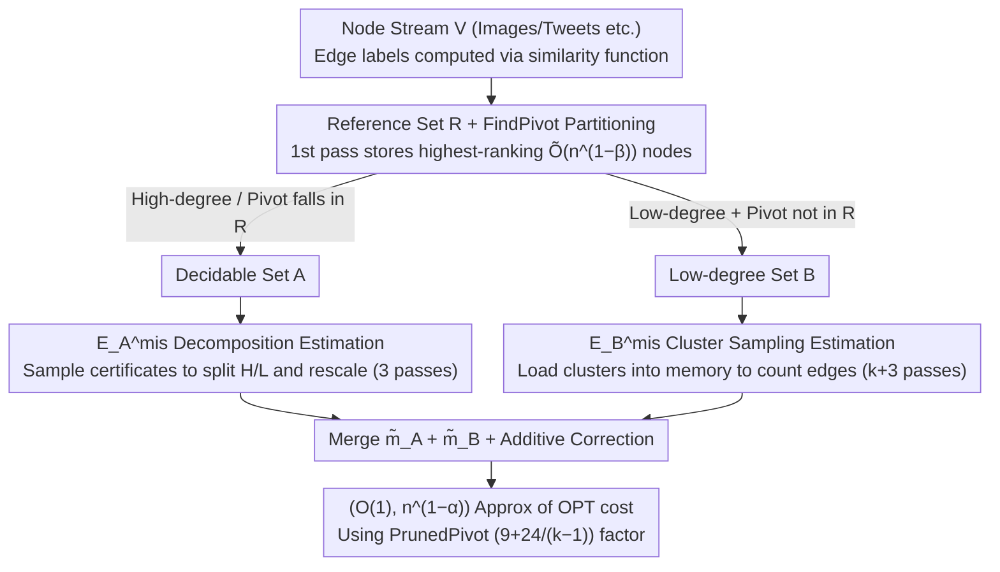

# Estimating Correlation Clustering Cost in Node-Arrival Stream

**Conference**: ICML 2026  
**arXiv**: [2605.07091](https://arxiv.org/abs/2605.07091)  
**Code**: None  
**Area**: Algorithmic Theory / Data Stream Algorithms / Graph Clustering  
**Keywords**: Correlation Clustering, Node-Arrival Stream, Sublinear Space, Pivot Algorithm, Reference Set Sampling

## TL;DR
This paper investigates the problem of approximating correlation clustering cost under the "node-arrival" streaming model. The authors propose the C4Approx algorithm, which utilizes **sublinear** space of $O(n^{(3+\alpha)/4}\log n)$ words and a constant number of passes to achieve an $(O(1), n^{1-\alpha})$-approximation. They also provide two matching lower bounds proving that multiple passes and additive error are both inevitable. On real-world datasets, the algorithm achieves performance comparable to the Pivot algorithm while storing only 2% of nodes.

## Background & Motivation

**Background**: Correlation clustering is a classic NP/APX-hard problem. Given a $\pm 1$ complete graph, the goal is to partition nodes into clusters to minimize the number of "disagreements" (positive edges across clusters + negative edges within clusters). Numerous $O(1)$-approximation algorithms exist, with the Pivot algorithm (a 3-approximation) being most representative. In big data scenarios, various edge-arrival streaming algorithms have been developed, but they typically require $O(n\,\text{polylog}\,n)$ space.

**Limitations of Prior Work**: Real-world data (images, tweets, vectors) naturally arrive as "node streams," where edge labels are computed on-demand via similarity functions—practically, no one explicitly stores $\binom{n}{2}$ edges. Under the node-arrival model, prior work is nearly nonexistent; the only related work by Assadi et al. provides an $(O(1),\delta n^2)$ approximation, where the additive term $\delta n^2$ is too loose.

**Key Challenge**: Outputting the actual clustering requires $\Omega(n)$ space (as the number of clusters can reach $n$). However, if the goal is only to estimate "clusterability" (i.e., the OPT cost), it might be possible to break the $n$ space barrier. In node-arrival streams, an edge can only be queried when both endpoints are simultaneously in memory, making it impossible even to enumerate all edges. This presents a fundamental challenge of restricted access.

**Goal**: To provide a cost approximation of the form $(O(1), n^{1-\alpha})$ using $o(n)$ space and $O(1)$ passes, while characterizing the necessity of both "multiple passes" and "additive error" in this model.

**Key Insight**: The core observation is that one does not need to find a pivot for every node. By maintaining a small reference set $R$ in memory—consisting of nodes ranked highest according to a random permutation $\pi$—the algorithm can directly determine pivots for most nodes (those with high degrees or whose pivots fall within $R$). The remaining few nodes (necessarily low-degree) can be estimated separately via sampling.

**Core Idea**: The combination of "reference set $R$ + high/low-degree decomposition" allows the total number of PrunedPivot mismatches $|E^{\text{mis}}|$ to be split into two independently estimable parts, thereby reducing space complexity from $O(n)$ to sublinear.

## Method

### Overall Architecture
C4Approx implements a 5-step pipeline.

First pass: Based on a random permutation $\pi$, nodes with the highest ranks $r=48k n^{1-\beta}\log n$ are stored in the reference set $R$ ($\beta=(1-\alpha)/4$).

Subsequently, two subroutines are executed in parallel: (i) Est-EA uses 3 passes to estimate $|E_A^{\text{mis}}|$ (mismatched pairs with at least one endpoint in $A$), and (ii) Est-EB uses $k+3$ passes to estimate $|E_B^{\text{mis}}|$ (both endpoints in $B$). Here, $A$ represents nodes whose pivots can be determined via $R$, and $B=V\setminus A$ represents the remaining low-degree nodes.

The final result returned is $(\tilde m_A+\tilde m_B + \frac{3}{8}\epsilon n^{1-\alpha})/(1-\epsilon/8)$, which, combined with the PrunedPivot $(9+\frac{24}{k-1})$-approximation from Theorem 2.1 (Dalirrooyfard et al.), yields an $(O(1),n^{1-\alpha})$-approximation of the OPT cost with probability at least $0.99$. The pipeline follows a split-and-merge structure: first building a reference set partition, then parallel estimation, and finally merging.

### Key Designs

**1. Reference Set $R$ + FindPivot Partitioning: A "Partial Oracle" for Pivot Determination with Sublinear Memory**
Directly storing pivot information for all nodes requires $\Omega(n)$ space. The core observation is that we only need a reference set $R$ of high-ranking nodes ($|R|=\tilde O(n^{1-\beta})$) to serve most nodes. FindPivot recursively searches for higher-ranking neighbors within $R$ (recursion budget $k$): if successful, either $\text{pivot}(u)\in R$ or $u$ is a singleton, assigning it to set $A$; if it timeouts and no neighbors are in $R$, it goes to $B$. Lemma 2.5 ensures that all nodes in a cluster belong to either $A$ or $B$, allowing independent estimation. Lemma 2.6 (proven via Chernoff bounds) guarantees that the first $k$ high-ranking neighbors of high-degree nodes fall into $R$ with high probability, so $R$ suffices for all high-degree nodes. The remaining set $B$ must consist of low-degree nodes ($\le n^\beta$), which can be handled by sampling.

**2. High/Low-Degree Decomposition for $E_A^{\text{mis}}$: Controlling Variance Explosion from Heavy-Tailed Degrees**
Estimating mismatched pairs with at least one endpoint in $A$ is equivalent to estimating the average degree of the mismatch subgraph $G_A^{\text{mis}}$. However, since the degree range is $\{0,\dots,n-1\}$, uniform sampling suffers from high variance. The authors sample a small set $S_1$ as "high-degree certificates" to partition $V$ into a high-degree set $H$ and a low-degree set $L$ based on whether $|N_A^{\text{mis}}(u)\cap S_1|$ is significant. Degrees in $H$ are estimated via rescale-by-sampling, while $L$ is directly sub-sampled. Lemma 2.8 provides a $(1\pm\epsilon,\pm\epsilon n^{1-\alpha})$-approximation using 3 passes and $O(\frac{1}{\epsilon^2}(n^{1-\beta}+n^{\alpha+\beta})\log n)$ space. This separation of "heavy-tailed" and "long-tailed" nodes is a classic variance reduction technique, here adapted to the node stream constraint where edges can only be queried for node pairs in memory.

**3. Cluster Sampling for $E_B^{\text{mis}}$: Exploiting Small Cluster Sizes to Limit Variance**
For set $B$, pivot determination cannot rely on $R$, but $B$ has a useful bound—all its clusters are "small" (degree upper bound $n^\beta$). Thus, one can sample entire clusters from $\mathcal{C}(B)$, load them into memory, and count intra/inter-cluster edges before rescaling. The actual pivot calculation utilizes a streaming implementation of PrunedPivot (Algorithm 2) requiring $k$ passes and $O(k)$ space. Lemma 2.9 provides the same approximation and confidence using $O(\frac{k}{\epsilon^2}n^{\alpha+3\beta}\log n)$ space and $k+3$ passes. Since the contribution of each sampled cluster is bounded by the cluster size, the variance is naturally controlled.

### Loss & Training
This is a pure combinatorial algorithm with no training involved. Key parameters are $k=37$, $\epsilon=1/10$, and $\beta=(1-\alpha)/4$, yielding the theoretical $(O(1),n^{1-\alpha})$ approximation in $O(n^{(3+\alpha)/4}\log n)$ space.

## Key Experimental Results

### Main Results
The authors compared C4Approx with Pivot, PrunedPivot, and the algorithm by Assadi et al. on various real-world datasets.

| Dataset / Setting | Memory Ratio | C4Approx cost | Pivot cost | Remarks |
|---|---|---|---|---|
| ImageNet-21K embedding + cosine threshold | 2% Nodes | Comparable to Pivot | 100% Node storage | Precision maintained at 100x compression |
| Sparse Graph (unbalanced cluster degrees) | 2% | Significantly better than Assadi et al. | — | Sparse graphs are a weakness for Assadi's algorithm |
| Averaged Multiple Runs | 2% | Low Variance | — | H/L decomposition effectively suppresses variance |

### Ablation Study

| Configuration | Performance | Description |
|---|---|---|
| C4Approx (full) | Close to Pivot | Both H/L decomposition and cluster sampling active |
| SimpleSampling Only | Additive error $\Theta(n^2/\sqrt q)$ | Confirms that naive sampling cannot reduce additive error to $o(n^{1.5})$ in $o(n)$ space |
| Without H/L Decomposition | High Variance | Verifies the criticality of Variance Reduction |
| Assadi et al. on Sparse Graphs | Unstable | Difficult to keep additive $\delta n^2$ small simultaneously |

### Key Findings
- In the node-arrival model, additive error is **inevitable** (Lower Bound 2: a $c$-approximation with zero additive error requires $\Omega(n)$ bits). Multiple passes are also **necessary** (Lower Bound 1: a one-pass $(c,d)$-approximation requires $\Omega(n)$ bits). This clearly characterizes the inherent complexity of the model.
- Storing only $\sim 2\%$ of nodes is sufficient to approach the Pivot algorithm's performance, demonstrating that sublinear memory with few passes is practical for node-arrival streams.
- Comparison with Assadi et al.: To reduce their additive $\delta n^2$ to $n^{0.1}$, one would need $\delta = n^{-1.9}$, which implies $\Omega(n^{9.5})$ space—making it completely impractical.

## Highlights & Insights
- **Model Innovation**: Viewing big data streams through node-arrival rather than edge-arrival is more realistic. This perspective was previously undervalued; the authors formalize it and provide the first algorithm with matching lower bounds.
- **Transferable Paradigm**: The "Reference Set + H/L Decomposition" framework could likely be applied to other streaming graph problems requiring on-demand edge queries (e.g., triangle counting, community detection, cut sparsifiers).
- **Theoretical + Experimental Loop**: Upper and lower bounds are paired, and experiments confirm that theoretically chosen constants (like $k=37$) are practical. It is a rare "plug-and-play" theoretical algorithm paper.

## Limitations & Future Work
- The $(O(1), n^{1-\alpha})$ additive error ceiling has little impact on **dense ground truths** ($|E^{\text{mis}}|\gg n^{1-\alpha}$), but in "nearly perfect" clustering scenarios (low cost), the additive term might overshadow the true value.
- The algorithm assumes a one-time random permutation $\pi$. If the stream is adversarial (e.g., malicious nodes arrive first), the i.i.d. assumption is violated; robustness in such cases remains for future work.
- Experiments focused on synthetic similarity graphs from embeddings + thresholds; evaluation in scenarios where the similarity oracle itself is expensive (e.g., LLM as a judge) has not yet been performed.

## Related Work & Insights
- **vs Pivot / PrunedPivot**: Inherits $O(1)$-approximation guarantees but migrates them to a **sublinear memory + node-arrival** constraint.
- **vs Assadi et al. 2023 (edge stream)**: Uses the same output form, but the additive term $n^{1-\alpha}$ is much tighter than $\delta n^2$. The lower bounds also characterize the model more precisely.
- **vs Dynamic Algorithms (Insert/Delete streams)**: Dynamic algorithms focus on update time and still require $\Omega(n)$ space; this work is complementary.

## Rating
- Novelty: ⭐⭐⭐⭐⭐ The first systematic sublinear algorithm for correlation clustering in node-arrival streams with matching lower bounds.
- Experimental Thoroughness: ⭐⭐⭐ Uses real data, but restricted to similarity graphs generated from embedding thresholds.
- Writing Quality: ⭐⭐⭐⭐ Rigorous theoretical derivation with clear Definition-Lemma-Theorem hierarchy.
- Value: ⭐⭐⭐⭐ Directly applicable to measuring "clusterability" in massive similarity graphs.

<!-- RELATED:START -->

## Related Papers

- [\[ICML 2025\] Sparse-Pivot: Dynamic Correlation Clustering for Node Insertions](../../ICML2025/learning_theory/sparse-pivot_dynamic_correlation_clustering_for_node_insertions.md)
- [\[ICML 2026\] Simple Algorithms for Bad Triangle Transversals with Applications to Correlation Clustering](simple_algorithms_for_bad_triangle_transversals_with_applications_to_correlation.md)
- [\[ICLR 2026\] Efficient Testing for Correlation Clustering: Improved Algorithms and Optimal Bounds](../../ICLR2026/learning_theory/efficient_testing_for_correlation_clustering_improved_algorithms_and_optimal_bou.md)
- [\[NeurIPS 2025\] Learning-Augmented Streaming Algorithms for Correlation Clustering](../../NeurIPS2025/learning_theory/learning-augmented_streaming_algorithms_for_correlation_clustering.md)
- [\[ICML 2026\] Is Spurious Correlation Removal Always Learnable?](is_spurious_correlation_removal_always_learnable.md)

<!-- RELATED:END -->
