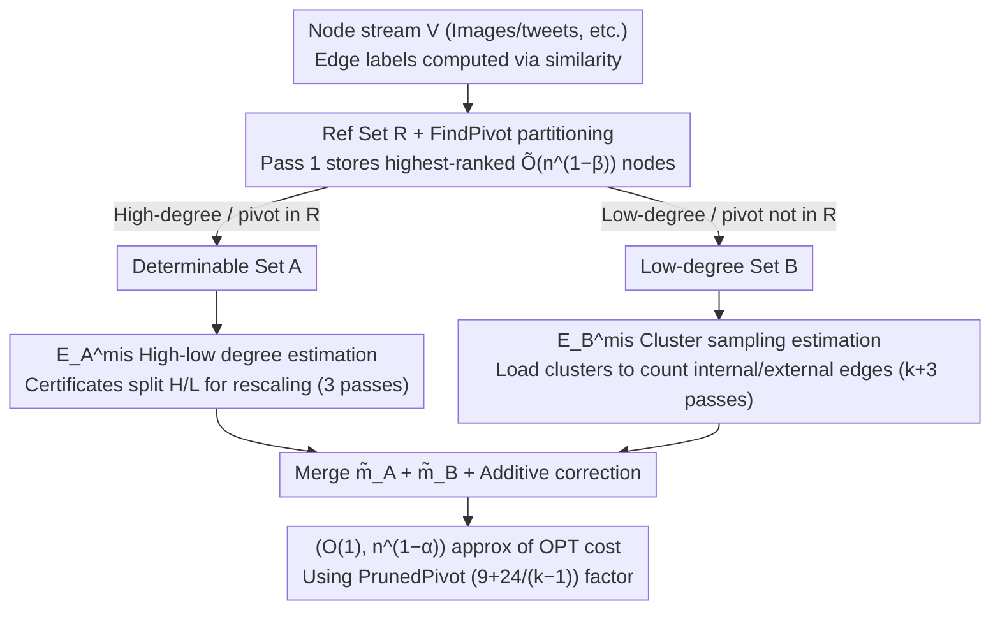

# Estimating Correlation Clustering Cost in Node-Arrival Stream

**Conference**: ICML 2026  
**arXiv**: [2605.07091](https://arxiv.org/abs/2605.07091)  
**Code**: None  
**Area**: Algorithmic Theory / Data Stream Algorithms / Graph Clustering  
**Keywords**: Correlation Clustering, Node-Arrival Stream, Sublinear Space, Pivot Algorithm, Reference Set Sampling

## TL;DR
This paper investigates the problem of approximating the cost of correlation clustering in the "node-arrival" data stream model. The authors propose the C4Approx algorithm, which achieves an $(O(1), n^{1-\alpha})$-approximation using $O(n^{(3+\alpha)/4}\log n)$ words of **sublinear** space and a constant number of passes. Two matching lower bounds are provided to demonstrate that both multiple passes and additive error are unavoidable. On real-world data, the algorithm achieves accuracy comparable to the Pivot algorithm while storing only 2% of the nodes.

## Background & Motivation

**Background**: Correlation clustering is a classic NP/APX-hard problem. Given a complete graph with $\pm 1$ edges, the goal is to partition nodes into clusters minimizing the number of "positive edges across clusters + negative edges within clusters" (mismatches). Frequent $O(1)$-approximation algorithms exist (e.g., the 3-approximation Pivot algorithm). In big data scenarios, edge-arrival stream algorithms have been developed, but they typically require $O(n\,\text{polylog}\,n)$ space.

**Limitations of Prior Work**: Real-world data (images, tweets, vectors) naturally arrives as a "node stream," where edge labels are computed on-demand via similarity functions—explicitly storing all $\binom{n}{2}$ edges is infeasible. For the node-arrival model, prior work is largely vacant; the only relevant work by Assadi et al. offers an $(O(1), \delta n^2)$ approximation, but the additive term $\delta n^2$ is too loose.

**Key Challenge**: Outputting a full clustering requires $\Omega(n)$ space (as the number of clusters can reach $n$). However, if the goal is only to estimate "clusterability" (OPT cost), it is potentially possible to use sublinear space. The fundamental challenge in node-arrival is that edges can only be queried when both endpoints are in memory, meaning one cannot even enumerate all edges.

**Goal**: Provide an $(O(1), n^{1-\alpha})$ cost approximation using $o(n)$ space and $O(1)$ passes, while characterizing the necessity of both "multiple passes" and "additive error" in this model.

**Key Insight**: It is not necessary to find a pivot for every node. By maintaining a reference set $R$ consisting of a small number of nodes ranked highest under a random permutation $\pi$, one can determine the pivot for most nodes (those with high degrees or whose pivots fall within $R$). The remaining few nodes (guaranteed to be low-degree) can be estimated separately via sampling.

**Core Idea**: The combination of "Reference Set $R$ + High-low Degree Decomposition" allows for the independent estimation of the two components of PrunedPivot mismatches $|E^{\text{mis}}|$, reducing space complexity from $O(n)$ to sublinear.

## Method

### Overall Architecture
C4Approx implements a 5-step pipeline.

Pass 1: Based on a random permutation $\pi$, store the top $r=48k n^{1-\beta}\log n$ nodes in a reference set $R$ ($\beta=(1-\alpha)/4$).

Subsequently, two subroutines are executed in parallel: (i) Est-EA estimates $|E_A^{\text{mis}}|$ (mismatches with at least one endpoint in $A$) in 3 passes, and (ii) Est-EB estimates $|E_B^{\text{mis}}|$ (both endpoints in $B$) in $k+3$ passes. Here, $A$ refers to nodes whose pivots can be determined via $R$, and $B=V\setminus A$ contains the remaining low-degree nodes.

Finally, the algorithm returns $(\tilde m_A+\tilde m_B + \frac{3}{8}\epsilon n^{1-\alpha})/(1-\epsilon/8)$. Combined with the $(9+\frac{24}{k-1})$-approximation of PrunedPivot (Theorem 2.1, Dalirrooyfard et al.), this yields an $(O(1),n^{1-\alpha})$-approximation of the OPT cost with probability at least $0.99$. The pipeline follows a branch-and-merge structure as shown below:

### Key Designs

**1. Reference Set $R$ + FindPivot Partitioning: A Sublinear Memory "Partial Oracle" for Pivot Determination**

Storing pivot information for all nodes requires $\Omega(n)$ space. The core observation is that not every node needs an explicit pivot. By storing a small reference set $R$ ($\|R\|=\tilde O(n^{1-\beta})$) of nodes with the highest rank in $\pi$, most nodes can be served. FindPivot recursively searches for higher-ranked neighbors within $R$ (budget $k$): if successful, $\text{pivot}(u)\in R$ or $u$ is a singleton, placing it in set $A$. If it times out or no neighbors are in $R$, it goes to $B$. Lemma 2.5 ensures that all nodes in a cluster reside entirely in either $A$ or $B$, allowing independent estimation. Lemma 2.6 (proven via Chernoff bounds) guarantees that the top $k$ neighbors of high-degree nodes likely fall in $R$. Thus, $B$ consists only of low-degree nodes ($\le n^\beta$), which are suitable for sampling.

**2. High-low Degree Decomposition for $E_A^{\text{mis}}$: Controlling Variance from Heavy-tailed Degrees**

Estimating mismatches with at least one endpoint in $A$ is equivalent to estimating the average degree of the mismatch subgraph $G_A^{\text{mis}}$. However, the degree range $\{0,\dots,n-1\}$ causes uniform sampling variance to explode. The authors sample a small set $S_1$ as "high-degree certificates" to split $V$ into high-degree set $H$ and low-degree set $L$ based on whether $\|N_A^{\text{mis}}(u)\cap S_1\|$ is significant. $H$ is estimated via rescale-by-sampling, and $L$ is directly sub-sampled. Lemma 2.8 provides a $(1\pm\epsilon,\pm\epsilon n^{1-\alpha})$-approximation using $O(\frac{1}{\epsilon^2}(n^{1-\beta}+n^{\alpha+\beta})\log n)$ space and 3 passes. This variance reduction technique is adapted here for the node-arrival constraint where edges can only be queried for node pairs present in memory.

**3. Cluster Sampling for $E_B^{\text{mis}}$: Trading "Cluster Size" for Controlled Variance**

While $B$ cannot rely on $R$ for mismatch determination, it possesses a useful bound: all its clusters are "small" (degree upper bound $n^\beta$). Thus, one can sample directly from the set of clusters $\mathcal{C}(B)$. Sampled clusters are loaded entirely into memory to count intra/inter-cluster edges and then rescaled. The actual pivot calculation utilizes a streaming implementation of PrunedPivot (Algorithm 2) with $k$ passes and $O(k)$ space. Lemma 2.9 provides the same approximation and confidence using $O(\frac{k}{\epsilon^2}n^{\alpha+3\beta}\log n)$ space and $k+3$ passes. Since the contribution of each sampled cluster is bounded by the small cluster size, the variance remains low.

### Loss & Training
The algorithm is purely combinatorial and requires no training. Key parameters: $k=37$, $\epsilon=1/10$, $\beta=(1-\alpha)/4$ yield the $(O(1),n^{1-\alpha})$ approximation and $O(n^{(3+\alpha)/4}\log n)$ space.

## Key Experimental Results

### Main Results
C4Approx was compared against Pivot, PrunedPivot, and the algorithm by Assadi et al. on various real-world datasets.

| Dataset / Setting | Memory Ratio | C4Approx Cost | Pivot Cost | Remarks |
|---|---|---|---|---|
| ImageNet-21K (cosine thresh) | 2% Nodes | Comparable | 100% Nodes | Precision maintained at 100× compression |
| Sparse Graphs (Uneven size) | 2% Nodes | Significantly better than Assadi | — | Assadi's algorithm struggles with sparsity |
| Average of multiple runs | 2% Nodes | Low variance | — | High-low decomposition suppresses variance |

### Ablation Study

| Configuration | Performance | Description |
|---|---|---|
| C4Approx (Full) | Near-Pivot | Both decomposition and cluster sampling included |
| SimpleSampling Only | Error $\Theta(n^2/\sqrt q)$ | Validates that naive sampling cannot reach $o(n^{1.5})$ additive error |
| No Decomposition | High Variance | Validates the criticality of Variance Reduction |
| Assadi et al. (Sparse) | Unstable | Difficult to keep additive $\delta n^2$ small |

### Key Findings
- In the node-arrival model, additive error is **inevitable** (Lower bound 2: $c$-approx with $d=0$ requires $\Omega(n)$ bits). Multiple passes are also **necessary** (Lower bound 1: one-pass $(c,d)$-approx requires $\Omega(n)$ bits). This defines the inherent difficulty of the model.
- Storing only $\sim 2\%$ of nodes allows performance close to Pivot, confirming that "sublinear memory + few passes" is practical for node-arrival.
- Comparison with Assadi et al.: Reducing their $\delta n^2$ error to $n^{0.1}$ would require space $\Omega(n^{9.5})$, which is infeasible.

## Highlights & Insights
- **Model Innovation**: Node-arrival, rather than edge-arrival, is a more realistic perspective for big data streams. This work formalizes this previously undervalued area and provides the first algorithm with matching lower bounds.
- **Transferable Paradigm**: The "Reference Set + High-low Decomposition" framework could be applied to other streaming graph problems requiring on-demand edge queries (e.g., triangle counting, community detection).
- **Theory-Experiment Loop**: Upper and lower bounds are paired, and experiments confirm that theoretical constants (e.g., $k=37$) are practical.

## Limitations & Future Work
- The $(O(1), n^{1-\alpha})$ additive error has little impact on **dense ground truth** ($|E^{\text{mis}}|\gg n^{1-\alpha}$), but in low-cost scenarios with near-perfect clusterability, the additive term may dominate.
- The algorithm depends on a fixed random permutation $\pi$. Robustness against adversarial streams (e.g., malicious node ordering) remains a task for future work.
- Experiments focused on synthetic similarity graphs (embedding + threshold); evaluations for expensive similarity oracles (e.g., LLM judges) have not yet been performed.

## Related Work & Insights
- **Vs. Pivot / PrunedPivot**: This work inherits their $O(1)$ guarantees but migrates them to a **sublinear memory + node-arrival** constraint.
- **Vs. Assadi et al. 2023 (Edge Stream)**: Uses a similar output form, but this work's additive term $n^{1-\alpha}$ is much tighter than $\delta n^2$. The lower bounds also offer a more precise characterization.
- **Vs. Dynamic Algorithms (Insert/Delete)**: Dynamic algorithms focus on update time and still require $\Omega(n)$ space; this work is complementary.

## Rating
- Novelty: ⭐⭐⭐⭐⭐ First systematic sublinear algorithm for node-arrival correlation clustering with matching lower bounds.
- Experimental Thoroughness: ⭐⭐⭐ Real-world data is used, but limited to embedding-based similarity graphs.
- Writing Quality: ⭐⭐⭐⭐ Rigorous theoretical derivation with a clear hierarchy of definitions and lemmas.
- Value: ⭐⭐⭐⭐ Directly applicable for measuring clusterability in large-scale similarity graphs.

<!-- RELATED:START -->

## Related Papers

- [\[ICML 2025\] Sparse-Pivot: Dynamic Correlation Clustering for Node Insertions](../../ICML2025/learning_theory/sparse-pivot_dynamic_correlation_clustering_for_node_insertions.md)
- [\[ICML 2026\] Simple Algorithms for Bad Triangle Transversals with Applications to Correlation Clustering](simple_algorithms_for_bad_triangle_transversals_with_applications_to_correlation.md)
- [\[NeurIPS 2025\] Learning-Augmented Streaming Algorithms for Correlation Clustering](../../NeurIPS2025/learning_theory/learning-augmented_streaming_algorithms_for_correlation_clustering.md)
- [\[NeurIPS 2025\] Improved Approximation Algorithms for Chromatic and Pseudometric-Weighted Correlation Clustering](../../NeurIPS2025/learning_theory/improved_approximation_algorithms_for_chromatic_and_pseudometric-weighted_correl.md)
- [\[ICML 2026\] MMD-Balls as Credal Sets: A PAC-Bayesian Framework for Epistemic Uncertainty in Test-Time Adaptation](mmd-balls_as_credal_sets_a_pac-bayesian_framework_for_epistemic_uncertainty_in_t.md)

<!-- RELATED:END -->
