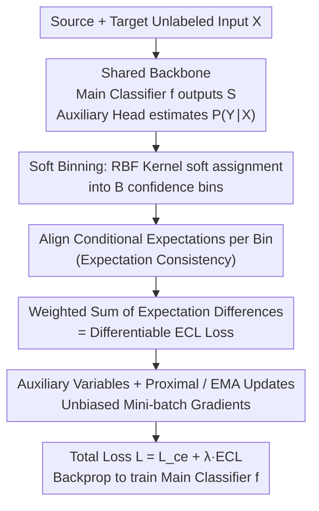

# Expectation Consistency Loss: Rethink Confidence Calibration under Covariate Shift

**Conference**: ICML2026  
**arXiv**: [2605.21552](https://arxiv.org/abs/2605.21552)  
**Code**: https://github.com/NeuroDong/ECL (Available)  
**Area**: AI Safety / Confidence Calibration / Covariate Shift  
**Keywords**: Confidence Calibration, Covariate Shift, Expectation Consistency, Unsupervised Domain Adaptation, Mini-batch Trainable  

## TL;DR
ECL demonstrates that full alignment of input distributions $P_s(X) = P_t(X)$ is not a necessary condition for calibration under covariate shift. Instead, it is sufficient that the "conditional expectation of $P(Y_k=1|X)$ on each confidence level set is consistent across domains." Based on this, it constructs ECL: a universal, differentiable loss with unbiased mini-batch gradients applicable to canonical, class-wise, and top-label calibration.

## Background & Motivation

**Background**: Modern classification models, particularly deep networks, suffer from overconfidence or underconfidence. Confidence calibration aims to ensure the predicted probability vector truly equals the actual long-run frequency of the event. Mainstream methods are categorized into training-time calibration (Soft-ECE, DECE, KDE) and post-processing calibration (temperature scaling, Dirichlet calibration, binomial calibration, etc.), which typically assume the source domain (calibration set) and target domain (test set) are IID.

**Limitations of Prior Work**: In real-world scenarios, the IID assumption is frequently violated. For example, medical models across different populations or recognition models across varied lighting conditions represent covariate shift ($P_s(X) \ne P_t(X)$ while $P(Y|X)$ remains invariant). Existing calibration methods under covariate shift (Weighted TS, FL+IW+Temp, TransCal, DRL) almost exclusively use importance weighting $w(x) = P_t(x)/P_s(x)$ to align distributions. This introduces two major issues: (1) if the density ratio is large or unbounded, weighting variance explodes and leads to instability; (2) they primarily handle only simple top-label calibration, with minimal support for class-wise and canonical calibration (the most rigorous joint multi-class calibration). PseudoCal synthesizes a pseudo-target domain using mixup, but its effectiveness depends heavily on the similarity between pseudo-data and the actual target domain.

**Key Challenge**: The authors identify that accuracy improvement and confidence calibration are distinct objectives. Accuracy requires "learning new knowledge" (re-aligning input distributions), whereas calibration only requires "accurately communicating uncertainty" (no new knowledge needed). Forcing alignment via IW to achieve calibration is solving an unnecessarily difficult problem, introducing instability. In other words, **global alignment of input distributions is a sufficient but not necessary condition**. The field has long treated it as necessary, wasting the statistical degrees of freedom inherent in calibration.

**Goal**: (1) Provide a "necessary and sufficient" condition for confidence calibration under covariate shift to replace overly strong distribution alignment assumptions; (2) Construct a calibration loss that does not depend on density ratios, is universal for canonical/class-wise/top-label calibration, is differentiable, and admits unbiased mini-batch estimation; (3) Analyze its sample complexity and provide a practical engineering training scheme.

**Key Insight**: Using the Law of Total Probability, the calibration condition $P_s(Y_k=1|S) = P_t(Y_k=1|S)$ shows that both sides represent the "expectation of the true posterior $P(Y_k=1|X)$ on the level set of confidence $S$." It is sufficient if these two conditional expectations are equal. This only requires the **averaged true posterior within each confidence bin to be cross-domain consistent**, which is a much weaker requirement than requiring the entire $X$ distribution to be identical.

**Core Idea**: The loss is constructed as the weighted Frobenius sum of "the difference between domain conditional expectations" across all bins. An auxiliary classification head estimates $P(Y|X)$ (learnable on the source domain since $P(Y|X)$ is invariant). A trainable version with unbiased mini-batch gradients is achieved via soft binning, auxiliary variables, and EMA proximal updates.

## Method

### Overall Architecture
The ECL pipeline trained as follows: Normal classification $f$ and an auxiliary head estimating $P(Y|X)$ (sharing the backbone) are trained on the source domain. Then, "Cross-Entropy + $\lambda \cdot$ ECL" is optimized jointly on unlabeled inputs from both domains. ECL utilizes only inputs $X$ and classifier outputs $S = f(X)$ from both domains without requiring target labels, thus performing **unsupervised domain adaptation**.

Mechanism: (1) Assign each sample to $B$ soft bins based on $S$ using an RBF kernel $\omega_{ij} = \exp(-\|S^{(i)} - a_j\|_2^2/\tau)$; (2) Estimate conditional expectations for source and target domains in each bin $j$ as $\hat{\mathbb{E}}_{d,j} = \sum_i \omega^d_{ij} p^{(i)} / (\sum_i \omega^d_{ij} + \varepsilon)$, where $p^{(i)} = P(Y|X_i)$ is provided by the auxiliary head; (3) Sum the weighted differences $\|\hat{\mathbb{E}}_{s,j} - \hat{\mathbb{E}}_{t,j}\|$ based on target domain bin frequency $w_j = n^t_j / \sum_r n^t_r$ to obtain the ECL loss. For mini-batch implementation, auxiliary variables and proximal/EMA updates are used to eliminate gradient bias caused by the "expectation before norm" structure.

### Key Designs

**1. Expectation Consistency Condition: Replacing "Global Input Distribution Alignment" with the "Necessary and Sufficient" Local Expectation Alignment.**

Prior IW-based methods implicitly pursue $P_s(X) = P_t(X)$, which is harder than calibration itself. Theorem 3.1 provides the actual requirement: $\forall k$, $P_s(Y_k=1|S) = P_t(Y_k=1|S)$ iff $\mathbb{E}_{X \sim P_s(X|S)}[P(Y_k=1|X)] = \mathbb{E}_{X \sim P_t(X|S)}[P(Y_k=1|X)]$, where $P(Y_k=1|X)$ is invariant under covariate shift. The proof expands $P_d(Y_k|S)$ as $\int P(Y_k|X) P_d(X|S)\,dX$. A binary counter-example ($P_s(X)$, $P_t(X)$ as Gaussians with means $\pm 0.5$, $S_1 = -0.25 X^2 + 1$, $P(Y_1|X) = -0.5|X| + 1$) demonstrates that calibration error can be zero even with significant distribution differences, breaking the intuition that $P(X)$ alignment is mandatory. This shifts calibration from "input space alignment" to "local expectation alignment on confidence level sets," which is statistically more efficient and extensible.

**2. Differentiable ECL Loss & Soft Binning: Transforming theoretical criteria into differentiable training loss across three calibration paradigms.**

The objective is $L_{ecl} = \mathbb{E}_{P_t(S)} \|\mathbb{E}_{P_s(X|S)} P(Y|X) - \mathbb{E}_{P_t(X|S)} P(Y|X)\|$. To maintain differentiability, soft binning is used with $B$ anchor points $a_j$ on the simplex $\Delta_{K-1}$. Weights are $\omega_{ij} = \exp(-\|S^{(i)}-a_j\|_2^2/\tau) / \sum_r \exp(-\|S^{(i)}-a_r\|_2^2/\tau)$. The bin expectations use $p^{(i)} = P(Y|X_i)$ from the auxiliary head. Unlike IW methods that work on marginal distributions, ECL easily generalizes to top-label, class-wise, and canonical calibration by simply replacing the confidence variable used in the soft assignment. Theorem 3.2 shows sample complexity is $\mathcal{O}(B/\varepsilon^2)$, comparable to standard ECE.

**3. Auxiliary Variables + Proximal Updates: Addressing gradient bias for unbiased mini-batch training.**

Applying the norm directly to mini-batch expectations introduces bias because $\|\cdot\|$ does not commute with $\mathbb{E}$. Theorem 3.3 presents an equivalent formulation: $L_{ecl}(\theta, u_j^s, u_j^t) = \sum_j w_j \|u_j^s - u_j^t\| + \sum_j \sum_{i \in D_s} \omega^s_{i,j} \|u_j^s - p^{(i)}(\theta)\|^2 + \sum_j \sum_{i \in D_t} \omega^t_{i,j} \|u_j^t - p^{(i)}(\theta)\|^2$. Introducing $u_j^s, u_j^t$ to track global expectations transforms the loss into a quadratic form over samples, enabling natural gradient decomposition. Algorithm 1 uses alternating proximal steps with shrink operators and EMA smoothing to update these variables, allowing stable end-to-end training.

### Loss & Training
The total objective is $L = L_{ce} + \lambda L_{ecl}$. An adaptive strategy $\lambda = \beta^\gamma$ is used where $\beta$ is computed as the ratio of average CE loss to ECL loss. During auxiliary head training for $P(Y|X)$, the backbone is frozen. A post-hoc Soft-ECE calibration can optionally be performed on the source domain.

## Key Experimental Results

### Main Results
ECE comparison for top-label calibration across three covariate shift datasets: Digit recognition (MNIST/USPS/SVHN), PACS, and ImageNet-Sketch using LeNet-5, ResNet20, DenseNet40, WRN, and ViT.

| Task (Target→Source) / Net | Uncal ECE | PseudoCal | DRL | ECL (Ours) | Oracle | $\Delta$ACC (%) |
|---|---|---|---|---|---|---|
| → MNIST / LeNet-5 | 27.3 | 9.08 | 22.3 | **8.52** | 0.30 | $-0.92$ |
| → MNIST / DenseNet40 | 23.4 | 9.72 | 14.8 | **9.15** | 1.40 | $+0.68$ |
| → USPS / DenseNet40 | 15.7 | 5.34 | 7.92 | **4.96** | 2.54 | $-0.76$ |
| → SVHN / LeNet-5 | 61.9 | 52.4 | 23.7 | **21.5** | 1.03 | $+1.65$ |
| → SVHN / ResNet20 | 68.2 | 48.2 | 40.1 | **36.8** | 0.50 | $+2.12$ |
| → SVHN / DenseNet40 | 80.8 | 64.7 | 42.0 | **38.4** | 0.86 | $-1.15$ |

### Ablation Study

| Configuration | ECE / Stability | Description |
|---|---|---|
| Full ECL (Aux Vars + Proximal + EMA) | Best, Stable | Algorithm 1 Complete version |
| Mini-Batch Non-Trainable ECL | Unstable, High Bias | No commutation of norm and expectation |
| ECL w/o Auxiliary Head | Degrades to alignment | Loses "level set expectation" geometry |
| $\lambda = \beta^\gamma, \gamma = 1.0$ | Best Trade-off | Small $\gamma$ under-calibrates, large $\gamma$ harms accuracy |

### Key Findings
- ECL significantly reduces ECE across canonical, class-wise, and top-label paradigms. It is the only method to consistently perform across covariate shift, multiple paradigms, unbounded ratios, and mini-batch training.
- As shift severity increases, ECL's advantages become more pronounced (e.g., →SVHN where ECE drops from 61.9% to 21.5%, outperforming PseudoCal's 52.4% significantly).
- $\Delta$ACC is often positive, suggesting that level set alignment positively influences classification boundaries rather than being a mere probability re-scaling.

## Highlights & Insights
- Decoupling Calibration and Accuracy: The clear conceptual separation between "learning knowledge" and "communicating uncertainty" provides a more targeted approach to OOD calibration.
- Counter-example & Strict Criteria: The Gaussian/quadratic counter-example is highly persuasive, showing that input distributions can differ entirely while calibration error remains zero, debunking the "must align $P(X)$" intuition.
- Handling Nonlinear Expectations: The technique of using auxiliary variables to solve the $\|\mathbb{E}[\cdot]\|$ gradient bias is a universal trick applicable to other losses involving aggregation before nonlinearity (e.g., IRM, adversarial calibration).

## Limitations & Future Work
- Covariate Shift Assumption: The method assumes $P(Y|X)$ is invariant. It may fail under label shift or concept drift where $P(Y|X)$ changes across domains.
- Auxiliary Head Quality: The ECL signal depends on the accuracy of the $P(Y|X)$ estimate.
- Hyperparameter Sensitivity: Soft binning introduces temperature $\tau$, anchor count $B$, and EMA coefficients that require standardized defaults.

## Related Work & Insights
- **vs. IW Methods (TransCal, DRL)**: IW methods fail when density ratios are large/unbounded; ECL bypasses this by focusing on local expectations.
- **vs. PseudoCal**: ECL uses actual unlabeled target data and the invariant posterior rather than synthetic mixup data.
- **vs. IID Losses (Soft-ECE, DECE)**: These fail under shift; ECL is designed specifically for shift while remaining mini-batch compatible.
- **vs. Post-processing (TS)**: ECL is a training-time method that handles complex class-wise and canonical calibration which TS cannot.

## Rating
- Novelty: ⭐⭐⭐⭐⭐ 
- Experimental Thoroughness: ⭐⭐⭐⭐☆ 
- Writing Quality: ⭐⭐⭐⭐⭐ 
- Value: ⭐⭐⭐⭐⭐ 

<!-- RELATED:START -->

## Related Papers

- [\[ICML 2026\] Matroid Algorithms Under Size-Sensitive Independence Oracles](matroid_algorithms_under_size-sensitive_independence_oracles.md)
- [\[ICML 2026\] Realizable Bayes-Consistency for General Metric Losses](realizable_bayes-consistency_for_general_metric_losses.md)
- [\[ICML 2026\] Provably Data-driven Multiple Hyper-parameter Tuning with Structured Loss Function](provably_data-driven_multiple_hyper-parameter_tuning_with_structured_loss_functi.md)
- [\[ICLR 2026\] An Efficient, Provably Optimal Algorithm for the 0-1 Loss Linear Classification Problem](../../ICLR2026/learning_theory/an_efficient_provably_optimal_algorithm_for_the_0-1_loss_linear_classification_p.md)
- [\[ICML 2025\] Near-Optimal Consistency-Robustness Trade-Offs for Learning-Augmented Online Knapsack Problems](../../ICML2025/learning_theory/near-optimal_consistency-robustness_trade-offs_for_learning-augmented_online_kna.md)

<!-- RELATED:END -->
