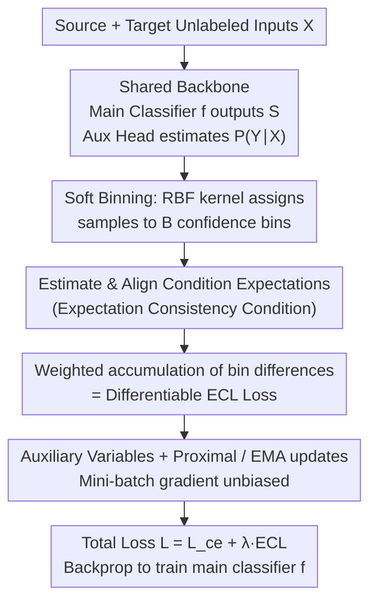

# Expectation Consistency Loss: Rethink Confidence Calibration under Covariate Shift

**Conference**: ICML2026  
**arXiv**: [2605.21552](https://arxiv.org/abs/2605.21552)  
**Code**: https://github.com/NeuroDong/ECL (Available)  
**Area**: AI Safety / Confidence Calibration / Covariate Shift  
**Keywords**: Confidence calibration, covariate shift, expectation consistency, unsupervised domain adaptation, mini-batch trainable  

## TL;DR
ECL demonstrates that full alignment of input distributions $P_s(X) = P_t(X)$ is not a necessary condition for calibration under covariate shift. Instead, it is sufficient that the "conditional expectation of $P(Y_k=1|X)$ on each confidence level set is consistent across domains." Based on this, the authors construct ECL, a differentiable loss with unbiased mini-batch gradients that is universal for canonical, class-wise, and top-label calibration.

## Background & Motivation

**Background**: Modern classification models, particularly deep networks, suffer from over- or under-confidence. Confidence calibration aims to ensure that the probability vectors predicted by the model truly reflect the actual frequency of occurrence. Mainstream methods are divided into two categories: training-time calibration (Soft-ECE, DECE, KDE) and post-hoc calibration (temperature scaling, Dirichlet calibration, binomial calibration, etc.). These methods typically assume that the source domain (calibration set) and the target domain (test set) are IID.

**Limitations of Prior Work**: In real-world scenarios, the IID assumption is frequently violated—such as medical models across different populations or recognition models across varying lighting conditions—which belongs to covariate shift where $P_s(X) \ne P_t(X)$ but $P(Y|X)$ remains invariant. Existing calibration methods under covariate shift (Weighted TS, FL+IW+Temp, TransCal, DRL) almost exclusively use importance weighting $w(x) = P_t(x)/P_s(x)$ to align distributions, which presents two major issues: (1) if the density ratio is large or unbounded, the weighting variance explodes, leading to instability; (2) they can only handle simple top-label calibration, with almost no support for class-wise and canonical calibration (the strictest multi-class joint calibration). PseudoCal uses mixup to synthesize a pseudo-target domain, but its effectiveness depends heavily on the similarity between pseudo-data and the real target domain.

**Key Challenge**: The authors astutely point out that accuracy improvement and confidence calibration are distinct tasks—the former requires "learning new knowledge" and thus must re-align input distributions, while the latter only requires "accurately communicating uncertainty" without needing additional knowledge. Forcing the application of alignment logic (IW) to calibration is equivalent to solving a much harder problem, naturally introducing extra instability. In other words, **global alignment of input distributions is a sufficient but not a necessary condition**. The industry has long treated it as necessary, wasting the statistical degrees of freedom inherent in calibration.

**Goal**: (1) Provide the "necessary and sufficient" conditions for confidence calibration under covariate shift to theoretically replace the overly strong distribution alignment assumption; (2) Construct a calibration loss that does not depend on density ratios, is universal for canonical/class-wise/top-label formats, is differentiable, and allows for unbiased mini-batch estimation; (3) Analyze its sample complexity and provide a practical engineering training scheme.

**Key Insight**: By expanding the calibration condition $P_s(Y_k=1|S) = P_t(Y_k=1|S)$ using the law of total probability, both sides can be expressed as the "expectation of the true posterior $P(Y_k=1|X)$ on the level set of confidence $S$." It is sufficient if these two conditional expectations are equal—this only requires that the **averaged true posterior within each confidence bin is consistent across domains**, which is far weaker than requiring identical $X$ distributions.

**Core Idea**: The weighted Frobenius sum of the "cross-domain conditional expectation difference" across all bins is used as the loss. An extra classification head is used to estimate $P(Y|X)$ (which can be learned on the source domain since $P(Y|X)$ is invariant under covariate shift). A trainable version with unbiased mini-batch gradients is achieved via soft binning, auxiliary variables, and EMA proximal updates.

## Method

### Overall Architecture
The ECL pipeline involves: normally training a classifier $f$ and an auxiliary head (shared backbone) to estimate $P(Y|X)$ on the source domain, then jointly optimizing "Cross-Entropy + $\lambda \cdot$ ECL" on unlabeled inputs from both domains. Since ECL only uses inputs $X$ and classifier outputs $S = f(X)$, it requires no target labels, making it **unsupervised domain adaptation**.

Three specific steps: (1) Map each sample into $B$ soft bins based on $S$ using an RBF kernel $\omega_{ij} = \exp(-\|S^{(i)} - a_j\|_2^2/\tau)$ for soft assignment; (2) Estimate the conditional expectations $\hat{\mathbb{E}}_{d,j} = \sum_i \omega^d_{ij} p^{(i)} / (\sum_i \omega^d_{ij} + \varepsilon)$ for both source and target domains within each bin $j$, where $p^{(i)} = P(Y|X_i)$ is provided by the auxiliary head; (3) Cumulatively sum $\|\hat{\mathbb{E}}_{s,j} - \hat{\mathbb{E}}_{t,j}\|$ weighted by target domain bin frequency $w_j = n^t_j / \sum_r n^t_r$ to obtain the ECL loss. When applied to mini-batches, auxiliary variables and proximal/EMA updates are used to eliminate the gradient bias caused by "expectation before norm," resulting in a version ready for end-to-end backpropagation.

### Key Designs

**1. Expectation Consistency Condition: Replacing the "global distribution alignment" assumption with the true necessary and sufficient condition of "cross-domain consistency of averaged true posteriors in each confidence bin."**

All previous importance weighting methods essentially pursue $P_s(X) = P_t(X)$ implicitly, which is a harder task than calibration itself. Theorem 3.1 provides the true necessary and sufficient condition: $\forall k$, $P_s(Y_k=1|S) = P_t(Y_k=1|S)$ if and only if $\mathbb{E}_{X \sim P_s(X|S)}[P(Y_k=1|X)] = \mathbb{E}_{X \sim P_t(X|S)}[P(Y_k=1|X)]$, where the definition of covariate shift ensures $P(Y_k=1|X)$ is domain-invariant. The proof involves expanding $P_d(Y_k|S)$ using the conditional expectation formula $\int P(Y_k|X) P_d(X|S)\,dX$. The paper also provides a concise binary counterexample ($P_s(X)$ and $P_t(X)$ are Gaussians with means $\pm 0.5$, $S_1 = -0.25 X^2 + 1$, $P(Y_1|X) = -0.5|X| + 1$): despite significant differences in covariate distributions, the conditional expectations are identical due to y-axis symmetry, resulting in zero calibration error—directly shattering the intuition that $P(X)$ must be aligned. This criterion shifts calibration from "input space alignment" to "local expectation alignment on confidence level sets," which is statistically more efficient and can be extended to top-label (replacing $S$ with $\hat{S}$) and class-wise (replacing with $S_k$) calibration.

**2. Differentiable ECL Loss and Soft Binning: Transforming the theory into an end-to-end backpropagatable loss while supporting three major calibration paradigms.**

The theoretical objective is $L_{ecl} = \mathbb{E}_{P_t(S)} \|\mathbb{E}_{P_s(X|S)} P(Y|X) - \mathbb{E}_{P_t(X|S)} P(Y|X)\|$, but hard binning is non-differentiable. This paper adopts soft binning: placing $B$ anchor points $a_j$ on the simplex $\Delta_{K-1}$ with soft weights $\omega_{ij} = \exp(-\|S^{(i)}-a_j\|_2^2/\tau) / \sum_r \exp(-\|S^{(i)}-a_r\|_2^2/\tau)$. The conditional expectation of each bin $\hat{\mathbb{E}}_{d,j}$ is weighted by $p^{(i)} = P(Y|X_i)$ from the auxiliary head. Final loss: $\hat{L}_{ecl} = \sum_j w_j \|\hat{\mathbb{E}}_{s,j} - \hat{\mathbb{E}}_{t,j}\|$. Using an auxiliary head for $P(Y|X)$ is feasible because $P(Y|X)$ is a domain invariant. Prior covariate shift calibration only covered top-label because they worked on marginal distributions via IW; ECL works on "conditional expectation alignment on level sets," so it can handle stricter canonical calibration simply by replacing the confidence variable used in soft assignment. Theorem 3.2 gives a sample complexity of $\mathcal{O}(B/\varepsilon^2)$, identical to ECE histogram binning, while weights $w_j$ explicitly constrain the influence of sparse bins.

**3. Auxiliary Variables + Proximal Updates: Explicitly parameterizing the domain expectations to ensure unbiased mini-batch gradients for ECL.**

Directly applying the loss to mini-batches introduces gradient bias because $\|\cdot\|$ and $\mathbb{E}$ do not commute—this is why training losses like Soft-ECE often fail in small batches. Theorem 3.3 provides an equivalent expression $L_{ecl}(\theta, u_j^s, u_j^t) = \sum_j w_j \|u_j^s - u_j^t\| + \sum_j \sum_{i \in D_s} \omega^s_{i,j} \|u_j^s - p^{(i)}(\theta)\|^2 + \sum_j \sum_{i \in D_t} \omega^t_{i,j} \|u_j^t - p^{(i)}(\theta)\|^2$, introducing auxiliary variables $u_j^s, u_j^t$ to track expectations across the full dataset. In this form, the loss becomes a quadratic form for each sample, allowing gradients to decompose naturally and ensuring unbiased mini-batch gradients. Algorithm 1 uses alternating proximal steps to update $u_j^s, u_j^t$ (with a shrink operator and thresholds $\tau_s = w_j/(2 n_{s,j})$, $\tau_t = w_j/(2 n_{t,j})$), smoothed by EMA $u_j \leftarrow (1-\alpha_{ema}) u_j + \alpha_{ema} \tilde{u}_j$ to suppress noise. This breakthrough enables calibration training within a modern SGD pipeline.

### Loss & Training
The total objective is $L = L_{ce} + \lambda L_{ecl}$. The weight $\lambda$ is set via an adaptive strategy $\lambda = \beta^\gamma$ where $\beta = (\sum_i L_{ce}^{(i)}) / (\sum_i L_{ecl}^{(i)})$ and $\gamma = 1$. The auxiliary head for $P(Y|X)$ is trained with a frozen backbone and can optionally be post-calibrated on the source domain using Soft-ECE.

## Key Experimental Results

### Main Results
Top-label ECE comparisons were conducted on three real-world covariate shift datasets: Digit recognition (MNIST/USPS/SVHN), PACS (4 domains), and ImageNet-Sketch. Architectures used include LeNet-5, ResNet20, DenseNet40, Wide-ResNet, and ViT.

| Task (Target→Source) / Network | Uncal ECE | PseudoCal | DRL | ECL (Ours) | Oracle | $\Delta$ACC (%) |
|---|---|---|---|---|---|---|
| → MNIST / LeNet-5 | 27.3 | 9.08 | 22.3 | **8.52** | 0.30 | $-0.92$ |
| → MNIST / DenseNet40 | 23.4 | 9.72 | 14.8 | **9.15** | 1.40 | $+0.68$ |
| → USPS / DenseNet40 | 15.7 | 5.34 | 7.92 | **4.96** | 2.54 | $-0.76$ |
| → SVHN / LeNet-5 | 61.9 | 52.4 | 23.7 | **21.5** | 1.03 | $+1.65$ |
| → SVHN / ResNet20 | 68.2 | 48.2 | 40.1 | **36.8** | 0.50 | $+2.12$ |
| → SVHN / DenseNet40 | 80.8 | 64.7 | 42.0 | **38.4** | 0.86 | $-1.15$ |

### Ablation Study

| Configuration | ECE / Stability | Description |
|---|---|---|
| Full ECL (Aux Variables + Proximal + EMA) | Best, Stable | Algorithm 1 full version |
| Mini-Batch Non-Trainable ECL (Direct Eq. 8) | Unstable, High Bias | Non-commutation of norm and expectation |
| ECL without auxiliary head for $P(Y|X)$ | Degenerates to distribution alignment | Loses "level set expectation" geometry |
| Loss weight $\lambda = \beta^\gamma, \gamma = 1.0$ | Best Trade-off | Small $\gamma$ under-calibrates, large $\gamma$ hurts accuracy |

### Key Findings
- ECL significantly reduces ECE across three calibration paradigms (canonical, class-wise, top-label). It is the only method that satisfies all four dimensions: covariate shift adaptation, support for three paradigms, handling unbounded density ratios, and mini-batch trainability.
- The more severe the shift, the more ECL shines: In the extreme "natural images vs. digits" shift (→ SVHN), ECL reduces LeNet-5 ECE from 61.9% to 21.5%, more than doubling the reduction of PseudoCal (52.4%), while IW methods fail due to density ratio explosion.
- $\Delta$ACC is mostly positive: Calibration often comes with small accuracy gains (e.g., +2.12% on SVHN/ResNet20), suggesting that level-set alignment positively influences classification boundaries rather than just performing simple probability scaling.

## Highlights & Insights
- **Reconceptualizing Accuracy vs. Calibration**: The authors clearly decouple these two often-confused goals, thereby lowering the statistical requirements for calibration—a clear conceptual contribution and a direction for OOD calibration research: "solve the right problem with weaker conditions."
- **Counterexample + Rigorous Criteria**: The simple Gaussian/quadratic counterexample (Fig. 1) is highly persuasive, demonstrating that zero calibration error can exist despite massive covariate differences, fundamentally breaking the intuition of mandatory $P(X)$ alignment.
- **Simplifying Non-linear Expectations**: Decomposing $\|\mathbb{E}[\cdot] - \mathbb{E}[\cdot]\|$ into $\|u^s - u^t\|$ plus quadratic penalties to break the bias of "norm over expectation" is a trick applicable to any loss involving intra-batch aggregation before a non-linear operation (e.g., ECE training, adversarial calibration, IRM).

## Limitations & Future Work
- **Ours**: Assumes $P(Y|X)$ is domain-invariant, which is the definition of covariate shift. It fails under label shift or concept drift where $P(Y|X)$ changes.
- **Independent Observation**: The quality of the auxiliary head's $P(Y|X)$ directly affects the ECL signal—if the source head is severely miscalibrated, it will bias the ECL target. Soft binning introduces several hyperparameters ($\tau, B, N_{prox}, \alpha_{ema}$) that require standardized defaults.
- **Future Directions**: Extending ECL to joint covariate and label shifts by introducing $P(Y)$ ratios; using Sinkhorn-like soft assignments for more stable gradients; and combining with distribution-free methods like conformal prediction for robust interval calibration.

## Related Work & Insights
- **vs TransCal / DRL / Weighted TS (IW methods)**: They rely on $w(x) = P_t(x)/P_s(x)$, which suffers from variance explosion in high-shift scenarios. ECL bypasses density ratios entirely.
- **vs PseudoCal (Hu et al., 2024)**: PseudoCal synthesizes pseudo-target domains via mixup; ECL directly uses real target domain unlabeled inputs + invariant $P(Y|X)$ estimation, which is theoretically more direct.
- **vs Soft-ECE/DECE/KDE**: These assume IID and degrade under shift; ECL is specifically designed for shifted scenarios while remaining mini-batch compatible.
- **vs Post-hoc TS / Guo et al.**: TS is an unsupervised single-parameter scaling that cannot handle class-wise calibration. ECL covers all paradigms and supports joint optimization during training.

## Rating
- Novelty: ⭐⭐⭐⭐⭐ The insight that "calibration requires expectation consistency rather than distribution consistency" is a major conceptual shift, backed by rigorous proof.
- Experimental Thoroughness: ⭐⭐⭐⭐☆ Three real-world datasets + simulations + multiple networks + three paradigms. Comparisons with the latest conformal methods would further strengthen it.
- Writing Quality: ⭐⭐⭐⭐⭐ The logic flow from theory to counterexample, loss construction, and engineering implementation is seamless.
- Value: ⭐⭐⭐⭐⭐ Provides a theoretically rigorous and practically deployable general baseline for calibration under covariate shift, highly relevant for safety-sensitive systems in non-IID scenarios.

<!-- RELATED:START -->

## Related Papers

- [\[ICML 2026\] The Data Manifold under the Microscope](the_data_manifold_under_the_microscope.md)
- [\[ICML 2026\] Realizable Bayes-Consistency for General Metric Losses](realizable_bayes-consistency_for_general_metric_losses.md)
- [\[ICML 2026\] Matroid Algorithms Under Size-Sensitive Independence Oracles](matroid_algorithms_under_size-sensitive_independence_oracles.md)
- [\[ICLR 2026\] Designing Rules to Pick a Rule: Aggregation by Consistency](../../ICLR2026/learning_theory/designing_rules_to_pick_a_rule_aggregation_by_consistency.md)
- [\[ICML 2026\] Provably Data-driven Multiple Hyper-parameter Tuning with Structured Loss Function](provably_data-driven_multiple_hyper-parameter_tuning_with_structured_loss_functi.md)

<!-- RELATED:END -->
