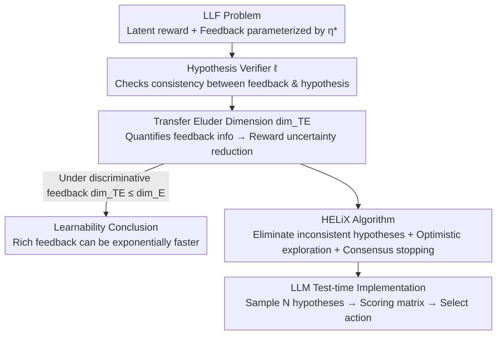

# Formalizing Learning from Language Feedback with Provable Guarantees

**Conference**: ICML 2026  
**arXiv**: [2506.10341](https://arxiv.org/abs/2506.10341)  
**Code**: TBD  
**Area**: Learning Theory / No-regret Learning / LLM Agents  
**Keywords**: Learning from Language Feedback, No-regret Algorithms, Transfer Eluder Dimension, Hypothesis Verifiers, Test-time Exploration

## TL;DR
This paper establishes the first formal framework for "Learning from Language Feedback" (LLF), a common but theoretically underspecified decision-making paradigm for LLM agents. Under a setting where rewards are latent, the authors provide sufficient assumptions for learnability, introduce "transfer eluder dimension" to characterize task difficulty, prove that rich language feedback can be exponentially faster than reward learning, and propose HELiX, a no-regret algorithm with provable guarantees (consistently outperforming CoT prompt baselines on Battleship and Minesweeper).

## Background & Motivation

**Background**: LLM agents increasingly learn from natural language feedback (critiques, instructions, explanations). For instance, feedback like "The summary is generally accurate but misses the protagonist's motivation" is much more informative than a single scalar reward—it simultaneously identifies "what was wrong" and "how to fix it." Empirically, language feedback significantly improves learning efficiency and is often cheaper than carefully designed reward functions.

**Limitations of Prior Work**: Despite impressive empirical results, this type of decision-making problem **has lacked a principled theoretical framework**. The complexity and ambiguity of natural language make it difficult to quantify exactly "how much information feedback carries." Consequently, it remains unclear: When is LLF feasible? Is it harder or easier than classic bandit problems with observable rewards? Even simple tasks can be unreliable when prompting LLMs repeatedly, yet theoretical explanations are missing.

**Key Challenge**: In LLF, rewards are **latent and unobserved** by the agent—the agent only sees language feedback. Without any link between feedback and rewards, minimizing regret from feedback alone is theoretically impossible. The core question is: Under what conditions, and with how much information in the language feedback, does learning remain feasible or even efficient despite "blindness" to rewards?

**Goal**: (1) Formalize LLF as a rigorous mathematical decision-making problem; (2) Provide sufficient assumptions for learnability under latent rewards; (3) Characterize LLF difficulty with a complexity measure showing that "feedback informativeness determines learning complexity"; (4) Design no-regret algorithms with theoretical guarantees.

**Key Insight**: The authors link LLF to the lineage of classic bandit/no-regret learning using a "hypothesis testing and elimination" perspective. The environment is parameterized by an unknown text "hypothesis" $\eta^*$, where both rewards and feedback are functions of $\eta^*$. The agent does not see rewards but uses a "hypothesis verifier" to judge whether candidate hypotheses are consistent with observed feedback, progressively eliminating inconsistent ones.

**Core Idea**: Introduce a **hypothesis verifier** to extract information from feedback and use **transfer eluder dimension** to quantify the effectiveness of this information in reducing reward uncertainty. It is proven that as long as feedback can discriminate between rewards, LLF is no harder than pure reward learning.

## Method

### Overall Architecture
The work provides both a theoretical framework and an algorithm, divided into three parts. First, **formalizing LLF and learnability measures**: LLF is modeled as a bandit-like protocol where at each step, the agent takes action $A_t \in \mathcal{A}$, observes feedback $O_t \in \mathcal{O} \sim f^*(A_t)$, and a latent reward $R_t = r^*(A_t)$ is generated but not revealed. The environment is parameterized by an unknown $\eta^*$, where the reward mapping $\eta \mapsto r_\eta$ is known, but the feedback mapping $\eta \mapsto f_\eta$ is unknown. Performance is measured by $\mathrm{Regret}(T) = \sum_t R^*_{\max} - \mathbb{E}_{\pi_t}[R_t]$. Second, **theoretical results**: Defining the hypothesis verifier and transfer eluder dimension $\dim_{TE}$, proving that more informative feedback reduces $\dim_{TE}$ exponentially. Third, **the HELiX algorithm**: A UCB-style no-regret algorithm that maintains a confidence set of hypotheses consistent with feedback, explores optimistically, and incorporates a consensus stopping criterion.

### Key Designs

**1. Hypothesis Verifier: Converting "Feedback Information" into an Actionable Learnability Interface**

Directly enumerating all possible natural language feedback is impractical. The authors require a weak definition that exposes only the information the agent can extract. A hypothesis verifier is a loss $\ell : \mathcal{A} \times \mathcal{O} \times \mathcal{H} \to [0, 1]$. Given an action $a$, feedback $o$, and candidate $\eta$, $\ell(a, o, \eta)$ measures consistency—if consistent, $\ell = 0$; otherwise, a penalty is applied. It is **intentionally distinguished from a reward model or correctness oracle**: it does not prove a hypothesis is true, but only judges if it has been "falsified by observations," similar to a unit test. For a coin flip with $\eta \in \{0, 0.1, 0.5\}$, defining $\ell(a, o, \eta) = \mathbb{1}[(a, o) \text{ has zero probability under } \eta]$ shows how rich feedback (e.g., "missed—too optimistic") allows $\ell$ to extract much more than 1 bit of information.

To ensure learnability, the authors assume **unbiased feedback** (Assumption 3): even if feedback is noisy, each hypothesis minimizes its expected verifier loss under its induced distribution, $\eta \in \arg\min_{\eta'} \mathbb{E}_{O \sim f_\eta(a)}[\ell(a, O, \eta')]$. Combined with known reward mappings (Assumption 1) and verifier access (Assumption 2), these support learnability.

**2. Transfer Eluder Dimension: Quantifying Feedback's Power to Reduce Reward Uncertainty**

Classic eluder dimension only considers reward function complexity. This work generalizes it to transfer eluder dimension $\dim_{TE}(\mathcal{H}, \ell, \epsilon)$. Action $a$ is $\epsilon$-transfer **independent** of $\{a_1, \dots, a_n\}$ if there exist two hypotheses with low verifier loss on history ($\sum_i (\mathbb{E}_{O \sim f_{\eta'}(a_i)}[\ell(a_i, O, \eta)] - \ell^{\min}_{\eta'}(a_i)) \le \epsilon^2$) but large difference in reward prediction ($|r_\eta(a) - r_{\eta'}(a)| > \epsilon$). $\dim_{TE}$ is the length of the longest such sequence. Intuitively, a smaller $\dim_{TE}$ means a single feedback provides more information about the unknown reward.

On an $L$-step mathematical reasoning example, the authors calculate $\dim_{TE}$ for four feedback types, demonstrating exponential reduction in complexity:

| Feedback Type | $\dim_{TE}$ |
|---------------|-------------|
| Reward (Correct/Incorrect) | $O(\|\mathbb{S}\|^L)$ |
| Explanation (Position of first error) | $O(\|\mathbb{S}\|L)$ |
| Hint (How to fix the first error) | $O(L)$ |
| Demonstration (Full correct steps) | $O(1)$ |

**3. Discriminative Feedback: Proof that LLF is no Harder than Reward Learning**

The authors define **discriminative feedback** (Definition 5): $|r_\eta(a) - r_{\eta'}(a)|^2 \le C_F \, \mathbb{E}_{o \sim f_\eta(a)}[\ell(a, o, \eta') - \ell^{\min}_\eta(a)]$. Proposition 1 proves that for discriminative LLF, $\dim_{TE} \le \dim_E$, meaning LLF is no harder than its pure reward counterpart. However, the framework intentionally allows for cases where feedback is not discriminative but still reveals the optimal action, capturing lower complexity that reward-only formulations miss.

**4. HELiX Algorithm: UCB-style No-regret Algorithm + Consensus Stopping**

HELiX (Hypothesis Elimination using Language-informed eXploration) maintains a confidence set $\mathcal{H}_t$, keeping hypotheses whose empirical verifier loss is near minimum. It then finds an optimistic optimal hypothesis to guide exploration. A **consensus stopping criterion** is included: if the minimax regret $\min_\pi \max_{\eta \in \bar{\mathcal{H}}} r_\eta(\pi_\eta) - r_\eta(\pi) = 0$, a consensus action exists that is optimal for all candidates, allowing the agent to exploit immediately without over-exploring.

Theoretical Guarantee (Theorem 1): Under the three assumptions, HELiX regret is bounded by $\tilde{O}(T^{3/4}(\log N(\mathcal{H}, \epsilon^\mathcal{H}_T, d_\mathcal{H}))^{1/4} \sqrt{\dim_{TE}})$.

For practical implementation, the authors use LLMs in three steps: (1) **Maintain consistency set** via sampling $N$ thought token streams; (2) **Minimax exploitation** using a scoring matrix $S_t \in [0, 1]^{N \times N}$ to find consensus actions; (3) **Optimistic exploration** to select actions when consensus is not reached.

## Key Experimental Results

### Main Results
Cumulative rewards on Battleship and Minesweeper (using Claude-3.5-Sonnet-v2):

| Agent | Mechanism | Performance |
|-------|-----------|-------------|
| CoT | Single hypothesis + action | Baseline, generally worst |
| HELiX (no exploit) | Optimistic exploration only | Better than CoT |
| **HELiX** | Exploration + Consensus Exploit | Consistently best |

### Ablation Study (Impact of Consensus Step)

| Configuration | Key Result | Note |
|---------------|------------|------|
| HELiX (Full) | Highest cumulative reward | Exploration + Consensus |
| w/o Exploit step| Trails behind full version | Exploration alone is insufficient |
| CoT Baseline | Lowest | Single-chain reasoning fails in info-gathering tasks |

### Key Findings
- In environments where **information gathering is critical** (e.g., Minesweeper), HELiX significantly out-performs CoT, proving LLM's inherent CoT is insufficient for strategic exploration.
- Ablations show **optimistic exploration alone is not enough**: the consensus stopping criterion is essential to reach optimality efficiently.
- HELiX remains robust even when CoT baselines fail on simple language tasks, providing evidence that "theory-guided algorithms > naive prompting."

## Highlights & Insights
- **Quantifying Language Feedback**: Transfer eluder dimension provides the first quantitative measure of feedback informativeness.
- **Hypothesis Verifier Design**: By focusing on falsification (like a unit test) rather than truth, the framework handles natural language ambiguity robustly while remaining compatible with classic bandit theory.
- **Theory-to-Practice**: HELiX provides a practical test-time strategy (sampling, scoring, consensus) that distinguishes itself from standard CoT by incorporating principled exploration.
- **Consensus Stopping**: This mechanism prevents over-exploration in non-discriminative cases where the optimal action is identified before the reward function is fully known.

## Limitations & Future Work
- Implementation relies on strong LLM assumptions: the ability to sample diverse hypotheses and score actions fairly across hypotheses.
- The $T^{3/4}$ regret rate is theoretically sound for the minimal assumptions used but slower than the classic $\sqrt{T}$ (which requires specific loss structures).
- The transfer eluder dimension is an analysis tool and cannot be estimated during runtime.
- Experiments were conducted on two tasks with a single LLM; broader validation is required.

## Related Work & Insights
- **vs. IGL (Interaction-Grounded Learning)**: LLF is more general; it captures scenarios where feedback reveals the optimal action without necessarily discriminating between all reward levels.
- **vs. Empirical LLM Agents (ReAct, Reflexion)**: These are largely heuristic. Ours provides a formal framework and regret bounds, explaining CoT as a greedy algorithm without exploration guarantees.
- **vs. Classic UCB/Bandit**: HELiX follows the optimism principle but operates without observing rewards, decoding information through the hypothesis verifier instead.

<!-- RELATED:START -->

<!-- RELATED:END -->

## Related Papers

- [\[ICML 2026\] Unraveling Syntax: Language Modeling and the Substructure of Grammars](unraveling_syntax_language_modeling_and_the_substructure_of_grammars.md)
- [\[ICLR 2026\] Lipschitz Bandits with Stochastic Delayed Feedback](../../ICLR2026/learning_theory/lipschitz_bandits_with_stochastic_delayed_feedback.md)
- [\[ICML 2026\] Revenue Guarantees of No-Swap-Regret Dynamics in First Price Auctions](revenue_guarantees_of_no-swap-regret_dynamics_in_first_price_auctions.md)
- [\[ICLR 2026\] Algorithmic Guarantees for Distilling Supervised and Offline RL Datasets](../../ICLR2026/learning_theory/algorithmic_guarantees_for_distilling_supervised_and_offline_rl_datasets.md)
- [\[ICLR 2026\] Scalable Random Wavelet Features: Efficient Non-Stationary Kernel Approximation with Convergence Guarantees](../../ICLR2026/learning_theory/scalable_random_wavelet_features_efficient_non-stationary_kernel_approximation_w.md)

<!-- RELATED:END -->
