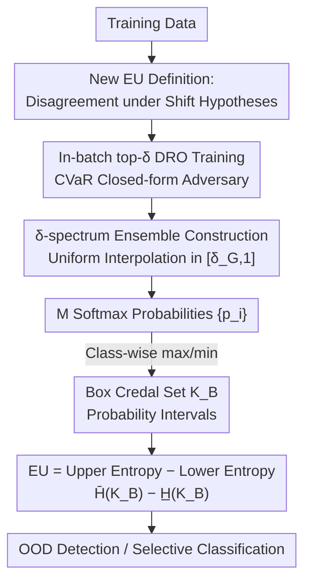

# Learning Credal Ensembles via Distributionally Robust Optimization

**Conference**: ICML2026  
**arXiv**: [2602.08470](https://arxiv.org/abs/2602.08470)  
**Code**: https://github.com/Kaizheng-WANG/Learning-Credal-Ensembles-via-Distributionally-Robust-Optimization  
**Area**: Learning Theory / Uncertainty Quantification  
**Keywords**: Epistemic Uncertainty, Credal Sets, Distributionally Robust Optimization, Deep Ensembles, OOD Detection

## TL;DR
CreDRO redefines "epistemic uncertainty" (EU) as **disagreement between models under different training-test distribution shift hypotheses**. Using Distributionally Robust Optimization (DRO), it assigns varying shift intensities to train ensemble members. Their softmax outputs are transformed into class probability intervals to form a box credal set for quantifying uncertainty, consistently outperforming existing credal methods in OOD detection and medical selective classification.

## Background & Motivation

**Background**: Reliable Uncertainty Quantification (UQ) is critical in safety-critical scenarios, requiring the separation of **Aleatoric Uncertainty (AU)** (inherent randomness in data) and **Epistemic Uncertainty (EU)** (lack of model knowledge about the true input-output relationship). While AU is typically handled by a single probability distribution (e.g., softmax), EU requires a "second-order" representation—uncertainty about the predictive distribution itself. **Credal sets** (convex sets of probability distributions) provide such a representation and have recently been used to improve EU quantification in deep learning.

**Limitations of Prior Work**: Current SOTA credal predictors (credal wrapper, credal ensembling, relative-likelihood, etc.) almost exclusively define EU as the **ensemble disagreement arising from random initialization**. However, this disagreement primarily reflects "optimization stochasticity"—the jitter from training with different random seeds on the same data—rather than more substantial sources of uncertainty (such as potential training/test distribution shifts). In other words, the EU they quantify is largely "optimization noise."

**Key Challenge**: EU should characterize "the model's ignorance of unknown distributions at deployment time." There is a mismatch between random initialization disagreement and genuine "ignorance of distribution shifts"—no amount of random seeds can simulate systemic differences between training and test distributions.

**Goal**: To identify an EU definition that reflects "substantial sources of uncertainty" and train ensembles accordingly, making the quantified EU more discriminative for downstream tasks like OOD detection and selective classification.

**Key Insight**: The authors start from Distributionally Robust Optimization (DRO). DRO assumes the test distribution lies within a neighborhood of the training distribution to minimize worst-case risk. If ensemble members are trained under **different degrees of relaxation of the i.i.d. assumption** (i.e., assuming different intensities of training-test shift), their disagreement naturally encodes "ignorance of distribution shifts."

**Core Idea**: EU is defined as "disagreement among models trained under varying distribution shift hypotheses." A set of members is trained using DRO, each corresponding to a different shift intensity. The resulting disagreement contains both training randomness and more informative distribution shift variance—this is **CreDRO**.

## Method

### Overall Architecture

CreDRO consists of training and inference phases. **Training**: Based on group DRO via Adversarial Reweighted Learning (ARL), the $i$-th member of the ensemble is assigned a distinct robustness level $\delta_i$ (generated by uniform interpolation of a global hyperparameter $\delta_G$). Each member trains only on its specific tier of "hardest samples" to simulate various levels of distribution shift, creating structured disagreement. **Inference**: Class-wise max/min of softmax probabilities are taken to obtain class probability intervals, forming a **box credal set** $\mathcal{K}_B$. The difference between **upper entropy and lower entropy** over this set is used as the EU estimate. The method requires no changes to network architecture or additional output neurons.

### Key Designs

**1. Redefining Epistemic Uncertainty: From "Random Init Disagreement" to "Disagreement under Shift Hypotheses"**

This is the foundation of the work. Existing credal methods treat EU as the jitter produced by different random seeds on the same data, reflecting only optimization randomness. CreDRO redefines EU as the **disagreement arising when the training-test i.i.d. assumption is relaxed to different degrees**. Intuitively, if one trains a set of models assuming different shift intensities, higher inconsistency on a specific input indicates greater "ignorance of distribution shift" for that input. This EU captures both training randomness and informative shift-driven disagreement, making it truer to the original intent of EU than pure random initialization.

**2. CVaR-based In-batch top-δ DRO Training: Learning Only on Hardest Samples**

To make a single model represent a specific "shift hypothesis," the authors use Adversarial Reweighted Learning (ARL) from the group DRO family: the learner minimizes while the adversary maximizes expected loss by weighting samples $w_n$. The uncertainty set $\mathbb{W}$ is instantiated as a **CVaR set** at level $\delta$:

$$\mathbb{W}=\Big\{\mathbf{w}\ge 0 \mid \textstyle\sum_{n=1}^N w_n=N,\ w_n\le\delta^{-1},\ \forall n\Big\}$$

Smaller $\delta$ implies a more conservative set ($\delta_1<\delta_2\Rightarrow\mathbb{W}(\delta_1)\supseteq\mathbb{W}(\delta_2)$). This inner maximization has a **closed-form solution**: the optimal adversary assigns the full weight $\delta^{-1}$ to the top-$\lfloor\delta N\rfloor$ samples with the highest losses. Thus, training is simplified to a primitive operation: **each batch backpropagates only using the top-$\delta$ proportion of samples with the highest loss**. These "hard-to-learn" samples often correspond to minority groups, effectively simulating potential domain shifts during training.

**3. δ-spectrum Ensemble Construction: Generating Structured Disagreement**

A single $\delta$ represents only one shift hypothesis. To cover "varying degrees of shift," CreDRO introduces a global hyperparameter $\delta_G\in[0.5,1)$ representing the worst-case divergence, then assigns the $i$-th member:

$$\delta_i=\frac{1-\delta_G}{M-1}\cdot(i-1)+\delta_G$$

This is a **uniform interpolation** over $[\delta_G, 1]$. Uniform interpolation is a natural choice without domain priors (all $\delta$ levels are deemed equally credible). $\delta_G$ is lower-bounded at 0.5; values too small make the most conservative member train on too few samples (e.g., if $\delta_G=0.3$ and batch=128, only 38 samples are used), leading to unstable gradients. As $\delta_G\to 1$, all samples participate, DRO loss degrades to ERM, and CreDRO reverts to a standard ensemble. Thus, the $\delta$-spectrum is the source of "random init disagreement + distribution shift disagreement."

**4. Box Credal Set + Entropy Difference for EU: Scalarizing Disagreement**

Given softmax probabilities $\{\boldsymbol{p}_i\}_{i=1}^M$, CreDRO computes class-wise upper/lower bounds $\overline{p}_k=\max_i p_{i,k}$ and $\underline{p}_k=\min_i p_{i,k}$ at inference time to form a **box credal set**:

$$\mathcal{K}_B=\Big\{\boldsymbol{p}\mid p_k\in[\underline{p}_k,\overline{p}_k]\ \forall k,\ \textstyle\sum_{k=1}^C p_k=1\Big\}$$

While one could use the convex hull $\mathcal{K}_C$, $\mathcal{K}_C\subseteq\mathcal{K}_B$, and $\mathcal{K}_B$ allows for more efficient EU calculation. EU is defined as the difference between the **upper and lower entropy** $\overline{H}(\mathcal{K}_B)-\underline{H}(\mathcal{K}_B)$, where upper/lower entropies are optimization problems solved under interval constraints (using SciPy with minimal overhead). Compared to CreDE, CreDRO: ① Does not double output neurons; ② Applies DRO directly to classical NNs without one-hot label restrictions; ③ Uses a **range** of $\delta$ values to ensure disagreement stems from shift hypotheses.

### Loss & Training
Standard Cross-Entropy (CE) or Focal Loss is used. Training follows Algorithm 1: for each member, samples in each batch are sorted by loss, and the top-$\delta_i$ proportion is used for backpropagation. Main experiments used ResNet18, $M=20$, $\delta_G=0.5$ fine-tuned on CIFAR10.

## Key Experimental Results

### Main Results
OOD detection serves as a proxy task for EU quality (CIFAR10 is ID; AUROC is calculated using EU as the score). Table below shows AUROC (%) for $M=20$ averaged over 3 runs:

| Method | SVHN | Places | CIFAR100 | FMNIST | ImageNet |
|------|------|------|------|------|------|
| DE (Deep Ensemble) | 94.8 | 90.0 | 90.6 | 92.9 | 88.9 |
| EN-DRO (DRO, non-credal) | 95.7 | 91.1 | 91.6 | 94.0 | 90.0 |
| CreWra | 95.7 | 91.6 | 91.6 | 95.2 | 89.0 |
| CreDE | 94.3 | 91.8 | 91.2 | 95.1 | 88.4 |
| CreBNN | 90.7 | 88.5 | 88.0 | 93.5 | 85.9 |
| **CreDRO** | **97.4** | **92.7** | **92.5** | **96.4** | **91.1** |

EN-DRO generally outperforms DE, suggesting DRO training itself is beneficial. CreDRO adds a credal representation on top of EN-DRO to further widen the gap, validating the synergy between "DRO shift disagreement" and "credal quantification."

### Ablation Study
The authors verified design choices from multiple perspectives:

| Analysis | Config | Key Result | Insight |
|------|------|------|------|
| Point Prediction (Table 2) | DE / **CreDRO** | Acc 0.9569 / **0.9637**; ECE 0.0051 / **0.0038** | CreDRO is more accurate and calibrated even using mean probs |
| Credal Construction (Table 5) | $\mathcal{K}_C$ / $\mathcal{K}_B$ | $\mathcal{K}_B$ wins (e.g., SVHN 96.0→96.6, M=5) | $\mathcal{K}_B$ amplifies OOD EU while ID EU remains stable |
| Hyperparameter $\delta_G$ (Table 4) | 0.5–0.9 | AUROC fluctuates <1 point | The $\delta$-spectrum offsets the subjectivity of a single $\delta_G$ |
| Label Noise (Table 6) | CreRAM / **CreDRO** | CreDRO stays optimal under 10%/20% noise | Top-loss selects structural hard samples, not random noise |
| Runtime (Table 3) | CreDRO vs CreDE | Train 6568 vs 6760s, Infer 1.89 vs 2.03s | Lighter than CreDE; UQ with $\mathcal{K}_B$ is much faster than convex hull |

### Key Findings
- **DRO Shift Disagreement > Random Init Disagreement**: CreDRO consistently outperforms credal methods relying on random seeds, indicating that the source of EU is more critical than the representation format.
- **Why $\mathcal{K}_B$ Beats $\mathcal{K}_C$**: OOD detection relies on the relative EU gap between ID and OOD. $\mathcal{K}_C\subseteq\mathcal{K}_B$ means $\mathcal{K}_B$ yields larger EU on OOD data without significantly increasing ID EU, thus widening the gap.
- **Robustness to Label Noise**: High losses from noisy labels are "erratic," whereas high losses from minority groups are "systemic." Top-loss sampling more stably selects the latter.

## Highlights & Insights
- **The "Aha" moment in redefining EU sources**: While most work focuses on credal set representation or aggregation, CreDRO steps back to ask where the disagreement should come from, replacing random initialization with distribution shift hypotheses.
- **Zero-cost DRO via CVaR**: The closed-form solution of the inner maximization transforms abstract DRO into simple in-batch sorting and sampling.
- **Self-consistent design**: Using a $\delta$-spectrum naturally merges "randomness + shift" uncertainties into one ensemble, and smoothly reverts to standard ensembles as $\delta_G\to 1$.
- **Architecture Agnostic**: No changes to network layers or doubling of output neurons makes it lighter and compatible with existing training paradigms.

## Limitations & Future Work
- **Training Overhead**: In-batch sorting by loss is slightly heavier than standard ensemble training (Table 3).
- **Subjective $\delta_G$**: Although robust, the lower bound of 0.5 and uniform interpolation are design choices. There is no mechanism yet to adaptively determine shift intensity from data.
- **Credal Entropy as an Open Problem**: Projecting a credal set back to a representative probability and strictly generalizing ECE to credal sets remain open challenges.
- **Evaluation Scope**: Experiments were primarily CIFAR10-based image classification. Performance in larger scales or different modalities is yet to be verified.

## Related Work & Insights
- **vs. Deep Ensembles (Lakshminarayanan 2017)**: DE approximates EU via random init disagreement. CreDRO replaces this with shift hypotheses, achieving higher AUROC and better calibration.
- **vs. CreDE (Wang 2024)**: The most related work. CreDE requires doubling output neurons, uses a fixed $\delta$, and is limited by one-hot labels. CreDRO avoids these constraints.
- **vs. Post-hoc Credal Methods**: Methods like CreWra map existing ensembles to credal sets post-training. CreDRO injects shift-driven disagreement directly into the training phase.
- **vs. Bayesian Neural Networks / EDL**: CreDRO avoids the scalability issues of BNNs and concerns regarding the faithfulness of EU representation in Evidential Deep Learning.

## Rating
- Novelty: ⭐⭐⭐⭐⭐ Redefining EU sources from random init to shift disagreement is a substantial conceptual innovation.
- Experimental Thoroughness: ⭐⭐⭐⭐ Extensive OOD benchmarks and multidimensional ablations, though focused on image classification.
- Writing Quality: ⭐⭐⭐⭐⭐ Clear progression from motivation to CVaR derivation and differentiation from CreDE.
- Value: ⭐⭐⭐⭐ Plug-and-play for safety-critical UQ with no architecture changes; high practical value for OOD/selective classification task.

<!-- RELATED:START -->

## Related Papers

- [\[ICLR 2026\] Noise Tolerance of Distributionally Robust Learning](../../ICLR2026/learning_theory/noise_tolerance_of_distributionally_robust_learning.md)
- [\[ICML 2026\] MMD-Balls as Credal Sets: A PAC-Bayesian Framework for Epistemic Uncertainty in Test-Time Adaptation](mmd-balls_as_credal_sets_a_pac-bayesian_framework_for_epistemic_uncertainty_in_t.md)
- [\[ICLR 2026\] Efficient Credal Prediction through Decalibration](../../ICLR2026/learning_theory/efficient_credal_prediction_through_decalibration.md)
- [\[ICLR 2026\] Stop Guessing: Choosing the Optimization-Consistent Uncertainty Measurement for Evidential Deep Learning](../../ICLR2026/learning_theory/stop_guessing_choosing_the_optimization-consistent_uncertainty_measurement_for_e.md)
- [\[ICML 2026\] On Regret Bounds of Thompson Sampling for Bayesian Optimization](on_regret_bounds_of_thompson_sampling_for_bayesian_optimization.md)

<!-- RELATED:END -->
## Related Papers

- [\[ICLR 2026\] Bandit Learning in Matching Markets Robust to Adversarial Corruptions](../../ICLR2026/learning_theory/bandit_learning_in_matching_markets_robust_to_adversarial_corruptions.md)
- [\[ICML 2026\] On Regret Bounds of Thompson Sampling for Bayesian Optimization](on_regret_bounds_of_thompson_sampling_for_bayesian_optimization.md)
- [\[ICLR 2026\] Efficient Credal Prediction through Decalibration](../../ICLR2026/learning_theory/efficient_credal_prediction_through_decalibration.md)
- [\[ICLR 2026\] Adversarially Pretrained Transformers May Be Universally Robust In-Context Learners](../../ICLR2026/learning_theory/adversarially_pretrained_transformers_may_be_universally_robust_in-context_learn.md)
- [\[ICML 2026\] MMD-Balls as Credal Sets: A PAC-Bayesian Framework for Epistemic Uncertainty in Test-Time Adaptation](mmd-balls_as_credal_sets_a_pac-bayesian_framework_for_epistemic_uncertainty_in_t.md)

<!-- RELATED:END -->
