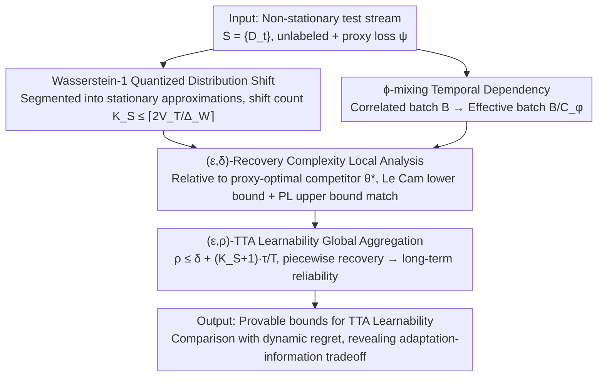

# On the Learnability of Test-Time Adaptation: A Recovery Complexity Perspective

**Conference**: ICML 2026  
**arXiv**: [2605.28057](https://arxiv.org/abs/2605.28057)  
**Code**: None  
**Area**: Learning Theory / Test-Time Adaptation / Non-stationary Online Learning  
**Keywords**: TTA Learnability, Recovery Complexity, Wasserstein Quantization, ϕ-mixing, Minimax Lower Bounds

## TL;DR
This paper establishes the first theoretical framework for Test-Time Adaptation (TTA) learnability by introducing $(\epsilon, \delta)$-Recovery Complexity to measure the time required to reduce excess risk to $\epsilon$ after a distribution shift. By extending local recovery to non-stationary test streams via $(\epsilon, \rho)$-TTA Learnability and deriving matching minimax upper/lower bounds, the work reveals the intrinsic "adaptation speed vs. information constraint" tradeoff in TTA.

## Background & Motivation

**Background**: TTA has achieved empirical success across vision, tabular, and NLP tasks (e.g., Tent, CoTTA, NOTE, ODS) by performing online model updates using only unlabeled test data guided by a proxy loss $\psi$. However, these methods often collapse under complex distribution shifts, prompting the community to reconsider the conditions under which TTA is reliable.

**Limitations of Prior Work**: Existing online learning theories (regret frameworks) characterize cumulative performance rather than instantaneous reliability questions like "how long does it take to recover after a shift?" Meanwhile, prior theoretical analyses of TTA (e.g., AdaNPC or ATTA) impose restrictive assumptions, such as memory-based architectures or the availability of active labeling, which do not hold for general unlabeled streams.

**Key Challenge**: The fundamental goal of TTA is to maintain acceptable instantaneous risk at every time step. Existing frameworks fail to characterize either post-shift recovery or the information constraints caused by the mismatch between the proxy loss and the true loss on unlabeled streams.

**Goal**: Construct a unified framework that simultaneously expresses (i) continuous and abrupt distribution shifts, (ii) temporal correlations, (iii) proxy-task mismatch, and (iv) post-shift recovery speed, while deriving matching minimax bounds under a stochastic proxy-gradient oracle.

**Key Insight**: Discretize the test stream into "piecewise stationary" approximations using Wasserstein-1 distance to analyze each segment as an independent recovery problem. Utilize ϕ-mixing coefficients to characterize temporal dependencies within batches and apply Le Cam’s two-point method for information-theoretic lower bounds.

**Core Idea**: Transform instantaneous reliability into an analyzable complexity measure called "recovery complexity" $\tau(\epsilon, \delta)$, and aggregate multi-segment recovery behaviors into a global $(\epsilon, \rho)$-TTA Learnability. This reduces the problem of TTA learnability to sample/batch complexity analysis in classical stochastic optimization.

## Method

### Overall Architecture
The theoretical framework consists of four interconnected components forming a "reduction pipeline": (1) Test stream formalization using Wasserstein-1 quantized distribution shifts and ϕ-mixing temporal dependencies; (2) Definition of a proxy-optimal competitor $\theta_t^\star \in \arg\min_{\theta\in\mathcal{N}_r(\theta_1)} \psi_t(\theta)$ and its true risk $R_t:=\ell_t(\theta_t^\star)$ as a baseline; (3) Local analysis of minimax bounds for $(\epsilon, \delta)$-recovery complexity after a single shift; (4) Global aggregation of recovery behaviors into $(\epsilon, \rho)$-TTA Learnability compared against dynamic regret. The input is a non-stationary stream $\mathcal{S}=\{D_t\}_{t=1}^{T}$, and the output is a provable bound regarding the parameter regimes (alignment $\alpha$, mismatch bias $\zeta$, batch size $B$, mixing constant $C_\phi$, shift magnitude $\Delta_W$) under which TTA is learnable.

### Key Designs

**1. Wasserstein-1 Quantization of Distribution Shifts: Approximating Non-stationary Trajectories**
To analyze continuous shifts and abrupt changes, the authors discretize the trajectory $\{\mathcal{P}_t\}$ into piecewise stationary approximations $\{\tilde{\mathcal{P}}_t\}$ using Wasserstein-1 distance, ensuring approximation error $\le \Delta_W/2$. A greedy algorithm maintains an anchor; if the $W_1$ distance of $\mathcal{P}_t$ from the anchor is $\le \Delta_W/2$, the anchor is kept; otherwise, a shift is declared and the anchor is reset. The total number of shifts is bounded by $\tilde{K}_S(T) \le \lceil 2V_T/\Delta_W\rceil$ (where $V_T$ is total variation). $W_1$ is chosen to unify covariate and label shifts on the joint space $\mathcal{X}\times\mathcal{Y}$ and support information-theoretic lower bounds.

**2. ϕ-mixing Dependency and Effective Batch Size: Compressing Temporal Correlation into $C_\phi$**
TTA test streams often contain non-i.i.d. samples (e.g., video frames). Authors use the ϕ-mixing coefficient to characterize this: assuming geometric decay $\phi(i)\le \varrho^i$, the variance of a correlated batch of size $B$ is equivalent to an i.i.d. batch of size $B_{\text{eff}} = B/C_\phi$, where 
$$C_\phi = 1 + \frac{4\varrho^{1/2}}{1-\varrho^{1/2}}.$$
This compresses complex stochastic process properties into a single scalar, allowing batch size and independence to be compared directly in the complexity bound.

**3. Minimax Bounds for $(\epsilon, \delta)$-Recovery Complexity: Characterizing Difficulty**
The authors define recovery complexity $\tau(\epsilon, \delta) := \inf\{t: \sup_{u\ge t}\mathbb{P}(\mathcal{E}_u > \epsilon) \le \delta\}$, representing how fast the excess risk $\mathcal{E}_t := \ell_t(\theta_t) - R_t$ drops below $\epsilon$ with probability $\ge 1-\delta$. Using Le Cam’s method, they prove any stochastic proxy-gradient oracle algorithm faces $\tau \ge \Omega\big(\frac{C_\phi}{B}\cdot\frac{1}{\alpha(\sqrt{\zeta+2\alpha\epsilon}+\sqrt{\zeta})^2}\big)$. A simplified TTA baseline achieves a matching upper bound under $L$-smooth and PL conditions. This reveals that mismatch $\zeta$ creates an "error floor," and $\tau$ scales with $1/\alpha^2$.

**4. $(\epsilon, \rho)$-TTA Learnability: Aggregating Local Recovery for Long-term Reliability**
$(\epsilon, \rho)$-TTA Learnability is defined as $\frac{1}{T}\sum_{t=1}^{T}\mathbb{P}\big(\ell_t(\theta_t)-R_t>\epsilon\big)\le\rho$, meaning the proportion of time steps where excess risk exceeds $\epsilon$ is at most $\rho$. Theorem 4.3 provides the local-to-global transition: if an algorithm has $(\epsilon', \delta)$-recovery complexity $\tau$ on each stationary segment, the stream is $(\epsilon, \rho)$-learnable with 
$$\rho\le\delta+\frac{(\tilde{K}_S(T)+1)\,\tau(\epsilon',\delta)}{T}.$$
This demonstrates that designing learnable TTA reduces to improving local recovery complexity.

### Loss & Training
The paper is theoretical and analyzes a TTA baseline using stochastic proxy-gradient descent on $\psi$ with step size $\eta$ within a local neighborhood $\mathcal{N}_r(\theta_1)$. Key assumptions include $(\alpha, \zeta)$-Alignment (Assumption 2.1), $L$-smoothness + PL condition + bounded gradient variance (Assumption 2.2), and Wasserstein quantization + ϕ-mixing (Assumptions 2.4/2.7).

## Key Experimental Results

### Main Results
The primary "experiment" is the theoretical comparison of the framework against existing tools regarding their expressiveness for TTA.

| Framework | Instantaneous Reliability | Unlabeled Proxy Mismatch | Non-stationary Stream Shape | Temporally Correlated Batch | Minimax Bounds |
| :--- | :--- | :--- | :--- | :--- | :--- |
| Static Online Regret | No | No | Fixed comparator only | Weak | No |
| Dynamic Regret | Partial | No | Arbitrary path variation | Weak | No |
| AdaNPC | No | Memory-based only | Covariate only | No | No |
| ATTA | Partial | Requires active labels | General | No | No |
| **Ours** | **Yes** | **$\alpha, \zeta$ explicit** | **$W_1$ Quantization** | **ϕ-mixing → $C_\phi$** | **Matching** |

### Ablation Study
The impact of shutting down various factors in the recovery complexity lower bound (from Remark 3.4–3.7):

| Configuration | Lower Bound Magnitude | Description |
| :--- | :--- | :--- |
| Full bound | $\Omega\big(\frac{C_\phi}{B\alpha}(\sqrt{\zeta+2\alpha\epsilon}+\sqrt{\zeta})^{-2}\big)$ | Full matching order lower bound |
| $\zeta=0$ | $\Omega(C_\phi/(B\alpha^2\epsilon))$ | Matches classical stochastic optimization orders |
| $\varrho=0$ ($C_\phi=1$) | $\Omega(1/(B\alpha^2\epsilon))$ | Temporal correlation term disappears |
| $\alpha \downarrow$ | $\tau \uparrow$ by $1/\alpha^2$ | Weaker proxy-task alignment slows recovery |
| $\Delta_W$ change | Fixed | Shift magnitude triggers but does not determine recovery difficulty |

### Key Findings
- Proxy mismatch $\zeta$ creates an error floor; recovery complexity does not reach zero even as $\epsilon \to 0$, explaining the unavoidable minimum risk in unlabeled TTA.
- Batch size $B$ and ϕ-mixing $C_\phi$ jointly dominate difficulty; increasing batch size cannot compensate for high temporal correlation if the effective batch $B/C_\phi$ remains small.
- Alignment strength $\alpha$ has a quadratic impact, implying high returns for designing proxy losses better aligned with task gradients.
- TTA Learnability is distinct from dynamic regret: the former requires recovery to a threshold $\epsilon$ per segment, while the latter measures cumulative performance.

## Highlights & Insights
- The use of Wasserstein-1 quantization to discretize non-stationary paths into piecewise stationary approximations is a powerful reduction technique applicable to other streaming learning scenarios like continual learning or online RL.
- Compressing temporal dependencies into a single scalar $C_\phi$ provides a quantifiable measure that can be directly compared with batch size and alignment.
- The $\zeta$-induced error floor provides a formal explanation for why self-training or pseudo-labeling TTA methods fail under high-noise or biased scenarios.

## Limitations & Future Work
- The analysis is restricted to a local neighborhood $\mathcal{N}_r(\theta_1)$, assuming PL and smoothness properties hold locally, which may not be true under extreme shifts.
- The upper bounds rely on a simplified stochastic gradient descent baseline; actual TTA methods using BN-only updates or teacher-student mechanisms still have a theoretic gap.
- Since this is a theoretical work, there is a lack of empirical validation on standard TTA benchmarks (e.g., CIFAR-C) to quantify these complexity factors.

## Related Work & Insights
- **Comparison with Dynamic Regret (Zhao et al., 2024)**: While dynamic regret looks at cumulative gap, this work focuses on per-segment recovery time, providing the conditions to convert learnability to regret.
- **Comparison with AdaNPC (Zhang et al., 2023)**: Unlike AdaNPC which is restricted to memory-based non-parametric classifiers, this work abstracts analysis to the algorithm-class level using energy oracles.
- **Comparison with ATTA (Gui et al., 2024)**: ATTA uses active labeling to simplify the problem to supervised online learning; this work focuses on the harder unlabeled setting where proxy mismatch $\zeta$ is the primary hurdle.

## Rating
- Novelty: ⭐⭐⭐⭐⭐ First theoretical framework for TTA learnability.
- Experimental Thoroughness: ⭐⭐ Purely theoretical; lacks empirical validation on TTA benchmarks.
- Writing Quality: ⭐⭐⭐⭐ Clear structure and flow, though notation-heavy.
- Value: ⭐⭐⭐⭐ Provides a formal language and targets for future proxy loss and reset strategy designs.

<!-- RELATED:START -->

## Related Papers

- [\[ICML 2026\] MMD-Balls as Credal Sets: A PAC-Bayesian Framework for Epistemic Uncertainty in Test-Time Adaptation](mmd-balls_as_credal_sets_a_pac-bayesian_framework_for_epistemic_uncertainty_in_t.md)
- [\[ICLR 2026\] Sample Complexity and Representation Ability of Test-time Scaling Paradigms](../../ICLR2026/learning_theory/sample_complexity_and_representation_ability_of_test-time_scaling_paradigms.md)
- [\[ICLR 2026\] Expressive Power of Implicit Models: Rich Equilibria and Test-Time Scaling](../../ICLR2026/learning_theory/expressive_power_of_implicit_models_rich_equilibria_and_test-time_scaling.md)
- [\[ICLR 2026\] Test-Time Verification via Optimal Transport: Coverage, ROC, & Sub-Optimality](../../ICLR2026/learning_theory/test-time_verification_via_optimal_transport_coverage_roc_sub-optimality.md)
- [\[ICML 2026\] Catastrophic Forgetting is Low-Rank: A Function-Space Theory for Continual Adaptation](catastrophic_forgetting_is_low-rank_a_function-space_theory_for_continual_adapta.md)

<!-- RELATED:END -->
## Related Papers

- [\[ICML 2026\] MMD-Balls as Credal Sets: A PAC-Bayesian Framework for Epistemic Uncertainty in Test-Time Adaptation](mmd-balls_as_credal_sets_a_pac-bayesian_framework_for_epistemic_uncertainty_in_t.md)
- [\[ICLR 2026\] Expressive Power of Implicit Models: Rich Equilibria and Test-Time Scaling](../../ICLR2026/learning_theory/expressive_power_of_implicit_models_rich_equilibria_and_test-time_scaling.md)
- [\[ICML 2026\] Semi-Supervised Noise Adaptation: Transferring Knowledge from Noise Domain](semi-supervised_noise_adaptation_transferring_knowledge_from_noise_domain.md)
- [\[ICML 2026\] Catastrophic Forgetting is Low-Rank: A Function-Space Theory for Continual Adaptation](catastrophic_forgetting_is_low-rank_a_function-space_theory_for_continual_adapta.md)
- [\[ICLR 2026\] A Statistical Learning Perspective on Semi-dual Adversarial Neural Optimal Transport Solvers](../../ICLR2026/learning_theory/a_statistical_learning_perspective_on_semi-dual_adversarial_neural_optimal_trans.md)

<!-- RELATED:END -->
